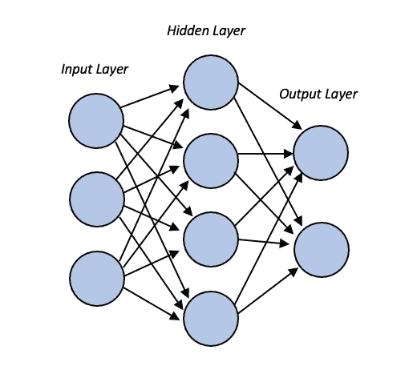
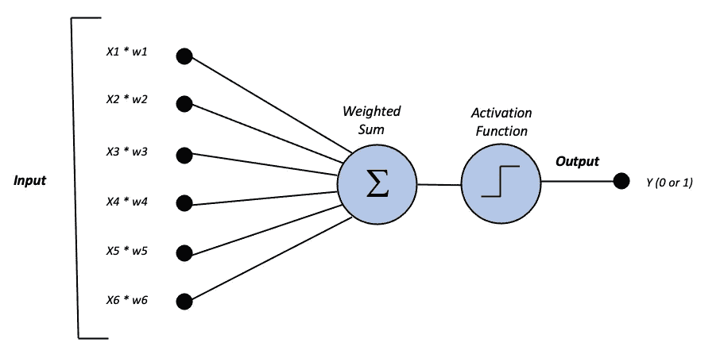
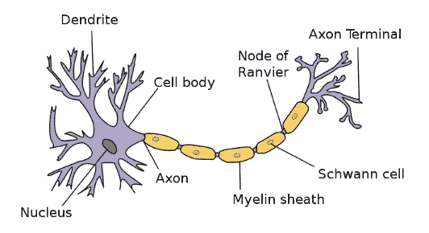
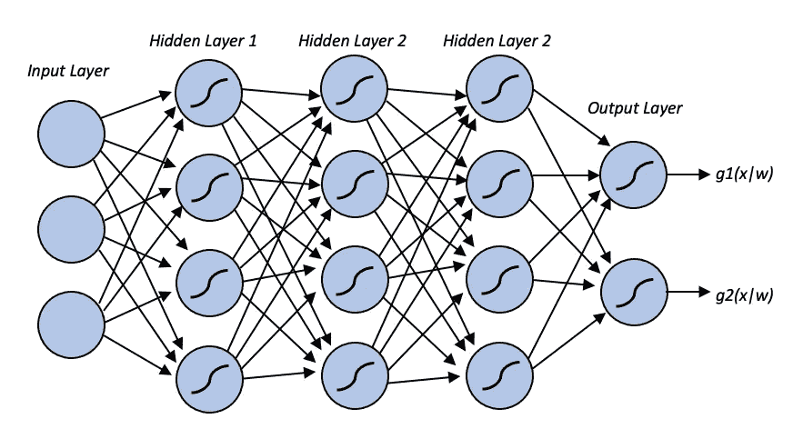
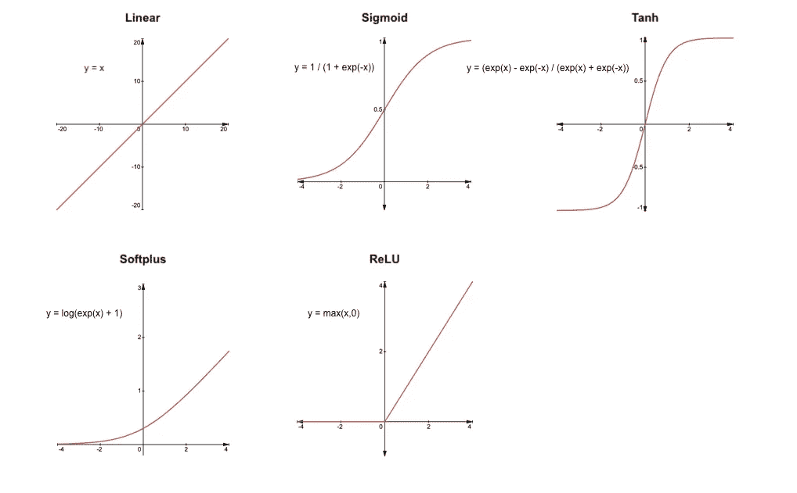
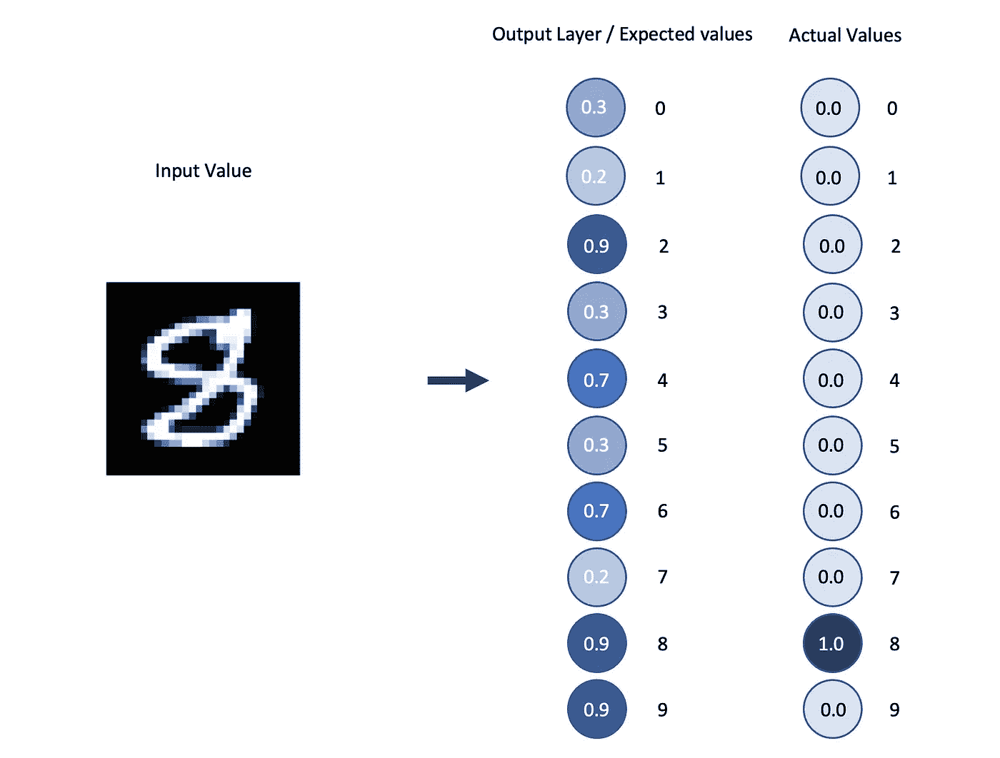
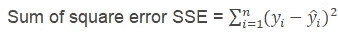
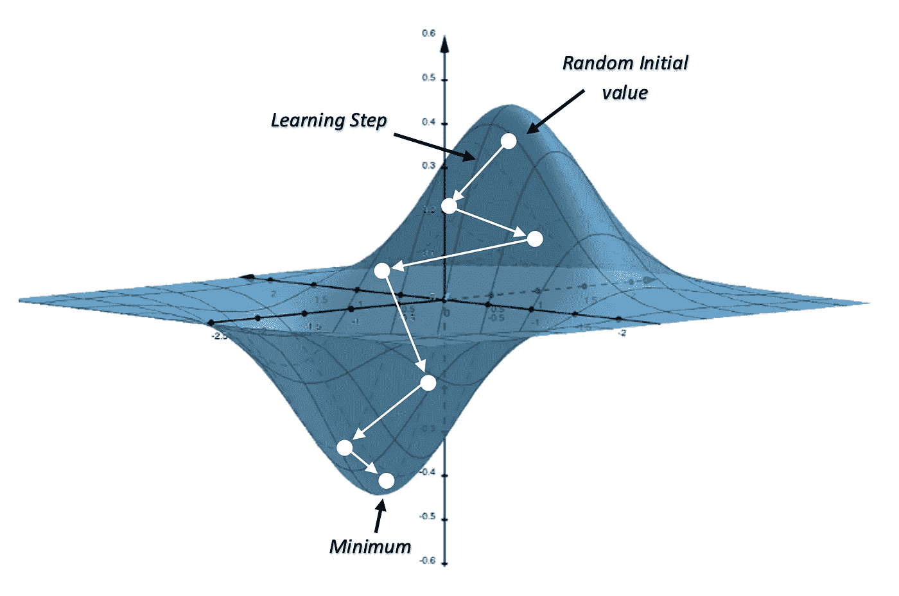
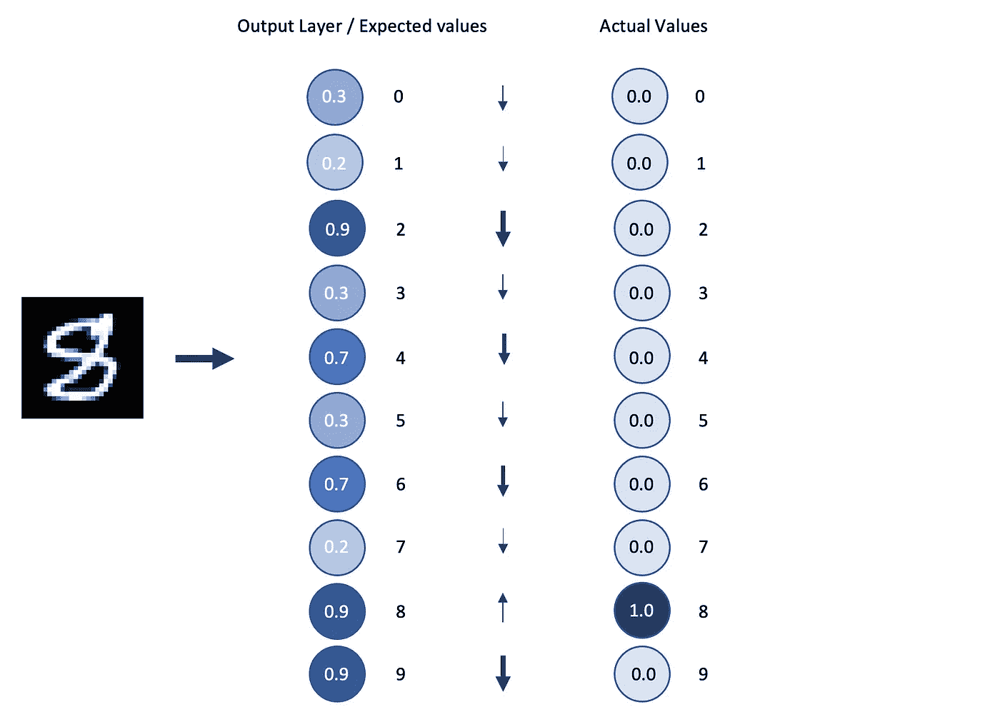
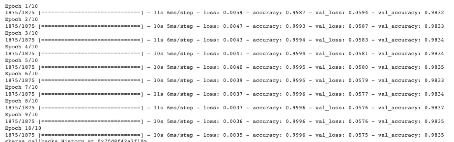

# 从头开始构建前馈神经网络

> 原文：<https://pub.towardsai.net/building-feedforward-neural-networks-from-scratch-c5a5cf23b97b?source=collection_archive---------2----------------------->

## 关于前馈神经网络(FFNNs)你需要知道的一切。从学习什么是感知机，到深度神经网络，到梯度下降和反向传播。

照片由[乌列尔资深大律师](https://unsplash.com/@urielsc26)在 [Unsplash](https://unsplash.com/) 上拍摄

本文将向您介绍什么是前馈神经网络。从基础开始，像什么是感知机，到达反向传播。

在文章的最后一部分，有一个关于如何使用 Tensorflow 在 Python 中构建 FFNN 的教程。

由于许多主题太大，无法在一篇文章中完全解释清楚，所以在许多段落的结尾有一个部分叫做“**推荐阅读**”，在那里你可以找到真正有帮助的文章来了解这些主题的更多信息。

*在开始阅读本文之前，我只想告诉你，如果你对深度学习、图像分析和计算机视觉感兴趣，我鼓励你看看我的另一篇文章:*

 [## 使用 Colab 中的自定义数据集训练 StyleGAN2-ADA

### 在本文中，我们将使用 TensorFlow 1.14 在 Google Colab 的自定义数据集上训练 NVIDIA 的 StyleGAN2-ADA

medium.com](https://medium.com/geekculture/train-stylegan2-ada-with-custom-datasets-in-colab-11accf22ef9b) 

# 目录

1.  神经网络
2.  前馈神经网络
3.  为什么要分层？
4.  价值函数
5.  梯度下降
6.  反向传播
7.  教程-构建前馈神经网络
8.  结论
9.  参考

# 1.神经网络

**神经网络**，也称为**人工神经网络(ANNs)** 或**模拟神经网络(SNNs)** ，是机器学习的子集，是深度学习算法的核心。它们的结构受到人类大脑中神经元的启发，以及它们通过相互发送电荷来工作的方式。

人工神经网络，图片由[作者](https://medium.com/@nicolotognoni)

它们由节点层组成:输入层、一个或多个隐藏层以及输出层。节点相互连接，对于每个连接，都有一个相关的权重。如果该节点的输出大于某个阈值，则该节点被激活，并且数据被传递到下一层。

感知器，图片作者[作者](https://medium.com/@nicolotognoni)

为了理解神经网络如何工作，我们首先必须了解一种叫做**感知器**的**人工神经元**(上图)。它由四部分组成:一个输入层、权重和偏差、净和以及激活函数。

*   **输入**、 *x1、x2、…* 被传递给**感知器**。输入和单输出都是二进制的。
*   **权重**、 *w1、w2、…、*表示网络中各个输入对输出的重要性。它们是由实数组成的。
*   输入 *x* 乘以其权重 *w.* ，然后**对所有值求和**，并将结果传递给 ***激活函数*** 。
*   激活功能根据确定的 ***阈值*** *确定输出值为 0 或 1。*

阶跃激活函数

感知器使用**阶跃激活函数**，当 *x < 0* 时为 0，如果 *x ≥ 0 则为 1。*

同样的事情也发生在我们大脑中的神经元上:**树突**从**突触**收集电荷，既有抑制性的，也有兴奋性的。一旦超过阈值，累积的电荷被释放(神经元放电)。

神经元由 Dhp1080， [CC BY-SA 3.0](http://creativecommons.org/licenses/by-sa/3.0/) ，attraverso 维基共享

# 2.前馈神经网络

**前馈神经网络(FFNNs)** 又称**多层感知器(MLPs)** 由一个输入层，一个输出层，以及中间的许多隐含层组成。这个想法是你通过许多非线性函数的组合来转换信号。

前馈神经网络，图片由[作者](https://medium.com/@nicolotognoni)

您可以选择许多激活函数，但最受欢迎的非线性函数是 **Sigmoid** 和 **ReLU** 。这里有一些在神经网络中常用的激活函数的例子:

激活功能，图片由[作者](https://medium.com/@nicolotognoni)

FFNNs 中的**输出层**由我们想要预测的类别一样多的神经元组成。

输出图层，图像由[作者](https://medium.com/@nicolotognoni)

如果我们想要预测手写数字，我们将有 10 个类别，每个类别对应一个数字(0，1，2，…，9)，输出层将表示系统认为一个图像对应于给定类别的程度，即概率。

# 3.为什么要分层？

为什么我们在神经网络中使用许多层？

某一层中每个神经元的**激活**对下一层中每个神经元的激活有影响，以此类推。
一些连接可能比其他连接更强，这表明一些神经元在网络中比其他神经元具有更强的****影响力**。这是反向传播的基础，我们稍后会看到。**

***分层将问题分解成小块。***

**如果我们要识别一个手写数字，问题将是**把**分成**更小的块**。**

*   **为了识别 8，我们首先要识别 8 的组成部分，例如，它由两个圆组成，一个在另一个的上面。
    但接下来的问题是:你首先如何识别一个圆？**
*   **要做到这一点，你可以，例如，说一个圆是由四个小边组成的。即使这样，我们也可以继续问自己，你是如何识别优势的？诸如此类…**

**我们可以认为**神经网络的每一层**都解决了这些问题中的每一个:**

*   **第一层识别小边缘，并将该信息传递给第二层。**
*   **第二个，给定这个信息，通过将小边加在一起识别两个圆。**
*   **然后，它将此信息传递给第三层，第三层识别两个圆圈，一个在另一个之上。**
*   **我们最终到达输出层，基于它从网络接收的信息，给出输入是 8 的高概率。**

**这是一个过于简化的过程，但它让你很好地理解一个真正的神经网络是如何工作的。**

**神经网络的分层结构允许它们将困难的问题分解成更小更容易的问题。**

# **4.价值函数**

**但是我们如何训练一个神经网络呢？**

**为了了解它是如何工作的，我们首先需要了解如何减少线性回归中的误差。**

****

**在线性回归中，为了优化函数并减少误差，我们使用*误差平方和*，即预测值和样本平均值之间的差值。**

**这与**损失函数**或**成本函数**的原理相同，后者的目标是评估我们的算法表现如何以及我们的模型好坏。**

*   ****损失函数**计算单个训练样本的误差。**
*   ****成本函数**计算所有示例的损失函数的平均值。**

**目标是减少实际值和预测值之间的误差，从而最小化成本函数。**

**有许多损失函数可供选择。最常见的有:**

*   **二元交叉熵**
*   **范畴交叉熵**
*   **均方误差**
*   **对数损失**

## **5.梯度下降**

**现在我们知道我们的模型有多坏或多好，但这本身并不是有用的信息。我们如何改进我们的模型？**

**为了做到这一点，我们希望采用我们的成本函数，并找到一个输入，使**最小化函数的输出**，即误差最小的点。我们希望找到使成本尽可能小的**权重** **和** **偏差**。**

**为此，在非线性函数的情况下，我们必须使用 ***梯度下降*** ，这是优化神经网络的最常见方法。它被用来寻找一个函数的最小值。**

****

**梯度下降 f(x，y) = x * exp( -(x + y))，图片由[作者](https://medium.com/@nicolotognoni)**

**梯度下降基于凸函数，表现如下:**

*   ****起点**为随机点**
*   **从这个起点开始，我们找到**导数**，曲线在给定点的斜率，以了解函数增加或减少的陡峭程度。我们预计，随着时间的推移，当我们接近一个最低点时，斜率会降低。**
*   ****梯度**告诉我们函数在哪个方向增加。因为我们想要达到一个最小值，所以我们想要沿着函数递减的方向或者梯度的相反方向前进。**
*   **为了计算下一个点的**，我们使用当前位置的梯度，然后乘以**学习率**，最后从当前位置减去得到的值。****

**这个过程可以写成:**

****

****a n+1** *=是我们攀登者的下一个位置* **a n** *=代表他当前的位置* **减(-)** *=表示梯度下降的最小化部分* **【ɣ***=是学习率* **∇f(a n)***=梯度项表示的方向***

**这个过程一直持续到在函数中找到最小值。**

**有三种类型的梯度下降算法:**

*   ****批量梯度下降:**它对训练集中每个点的误差进行求和，但只有在评估了所有训练样本后，模型才会更新。这个过程被称为训练时期。
    批量梯度下降需要将所有数据存储在内存中，这可能会导致大型数据集的处理时间较长。此外，虽然它产生稳定的误差梯度和收敛性，但它可能陷入局部最小值而找不到全局最小值。**
*   ****随机梯度下降:**这种类型的梯度为每个示例运行一个训练时期。然后，它一次更新一个示例的参数。
    这种梯度下降的优点是每次只需要存储一个训练样本，而不是所有的数据，所以不需要很多内存，过程可能会更快。
    然而，与前者相比，它可能导致计算效率的损失，并且连续更新可能导致有噪声的梯度。**
*   ****小批量梯度下降:**它结合了前两个概念。它将带有训练示例的数据集划分为不同的样本批量。然后，它对这些批处理中的每一个执行更新。**

*****推荐阅读:*** *如果你想了解更多关于梯度下降及其背后的数学，我强烈建议你阅读这篇文章:***

** [## 梯度下降算法——深度探索

### 梯度下降法为机器学习和深度学习技术奠定了基础。

towardsdatascience.com](https://towardsdatascience.com/gradient-descent-algorithm-a-deep-dive-cf04e8115f21)** 

# **6.反向传播**

****反向传播**是神经网络中最基本的构建模块，于 20 世纪 60 年代首次推出。**

**反向传播试图通过基于用梯度下降计算的**梯度**调整网络的**权重和偏差**来**最小化**成本函数。
告诉我们**成本函数对相应的权重和偏差有多敏感的是梯度的每个分量的**大小**。****

**开始时，网络还没有被训练，所以输出是随机的。为了做得更好，我们需要改变最后一层的激活来做更好的预测。
然而，我们不能直接改变激活，我们只能**改变权重和偏差**，所以我们必须调整它们以提高输出。
有助于了解我们希望对激活进行哪些调整，以做出更好的预测。**

**下面举一个**的例子**把事情说清楚。
如果我们想要识别手写数字(像 MNIST 数据库)，我们想要看到，对于一个确定的例子(像数字 8)，我们想要改变哪个**激活**以有效地将数字识别为 8。换句话说，当神经网络看到 8 时，我们希望模型输出层中为 8 的概率最高。**

**输出层(由 10 个神经元组成，每个类别一个:0，1，2，…，9)中的一些值必须增加，而其他值必须减少。
更重要的是每个神经元这些变化的**幅度**——每个神经元的输出(预测值)离它应该有的实际值有多远。**

****

**输出图层中预测值和实际值之间的差值，图片作者[作者](https://medium.com/@nicolotognoni)**

**让我们记住，每个神经元的激活值是前几层所有激活的加权和，加上一个偏差。**

**如果我们想增加激活，我们可以增加权重，改变前一层的激活，或者增加偏差，但我们只能改变权重和偏差。**

*****推荐阅读:*** *你现在应该对反向传播有了坚实的基础，但是如果你想进一步探索这个话题，我鼓励你阅读这篇文章:***

** [## 3Blue1Brown —反向传播演算

### 这里的硬性假设是，您已经阅读了前一部分，给出了反向传播的直观演示…

www.3blue1brown.com](https://www.3blue1brown.com/lessons/backpropagation-calculus)** 

# **7.构建前馈神经网络**

**现在让我们把迄今为止所学到的东西付诸实践。**

**在本教程中，我们将使用 TensorFlow 创建一个简单的 FFNN，其中包含一个输入层、一个隐藏层和一个输出层。**

**我们将使用手写数字的 **MNIST** 每个示例是与来自 10 个类别的标签相关联的 28x28 灰度图像。**

## **加载数据**

**第一步是**加载**数据。
由于 MNIST 是最流行的图像分类数据集之一，它已经在 Keras (TensorFlow)中，要加载它，我们可以直接使用 Keras API。**

## **模型**

**下一步是**创造**T21型号 FFNN。**

**我们将创建一个简单的 FFNN，由一个输入层、一个隐藏层和一个输出层组成。**

**首先要做的是创建一个大小为 28x28 (784)的 **Flatten** 图层，它对应于数据集中图像的宽度乘以高度。
这样做是为了在模型中表示图像的每个像素。**

**隐藏的**层是由 1000 个神经元组成的**密集的**层。****

**最后，**输出** **层**是另一个**密集**层，它需要与我们想要预测的数据集中的类别数大小相同，在 MNIST 数据集中是 10，每个数字(0，1，2，…，9)一个**

**为了创建模型，我们使用 Keras Sequential API。**

## **培养**

**最后一步是**编译**模型。
要做到这一点，我们需要选择一个优化器、一个损失函数和我们希望在训练期间显示的指标，以了解模型的行为。**

**作为**优化器**，我们将使用代表随机梯度下降的“SGD”。**

**我们将为**损失函数**使用稀疏分类交叉熵。**

**为了了解我们的模型表现如何，我们将在训练集和测试集上使用模型的**精确度**。**

**最后一步是使用**。拟合**方法开始训练模型。
在这一步中，您必须选择**训练集**和**验证集** **以及您希望模型运行的**时期**的数量。****

## **估价**

**从训练中，我们得到以下输出:**

****

**我们可以看到，在训练集和验证集上的**准确率**都非常高，大约在 99%和 98%左右。**

**即使模型只有三层，运行 10 个时期，生成的预测也是非常准确的。**

# **8.结论**

**在本文中，我们从基础开始:我们学习了什么是**神经网络**。我们了解了什么是**感知器**及其组件。**

**然后我们转向**前馈神经网络**及其激活函数。然后我们深入到**梯度下降**和**反向传播**。**

**在文章的最后一部分，我们**使用 python 从零开始构建了一个 FFNN**，并且我们使用 MNIST 数据集对它进行了训练。**

****如果你觉得这篇文章很有帮助，请查看我在 Medium** **和** [**上的简介，在 LinkedIn**](https://www.linkedin.com/in/nicolotognoni/) **上与我联系！****

# **9.参考**

**[1] [伊恩·古德菲勒](https://www.amazon.com/Ian-Goodfellow/e/B01MQGN8N0/ref=dp_byline_cont_book_1)、[约舒阿·本吉奥](https://www.amazon.com/Yoshua-Bengio/e/B00IWC47MU/ref=dp_byline_cont_book_2)和[亚伦·库维尔](https://www.amazon.com/Aaron-Courville/e/B01N8XGWRL/ref=dp_byline_cont_book_3)、[深度学习](https://www.amazon.com/Deep-Learning-Adaptive-Computation-Machine/dp/0262035618/ref=sr_1_1?crid=1I2VKDBGNWO3G&keywords=Deep+Learning+%28Adaptive+Computation+and+Machine+Learning+series%29&qid=1662811685&s=books&sprefix=deep+learning+adaptive+computation+and+machine+learning+series+%2Cstripbooks-intl-ship%2C323&sr=1-1) (2016)，麻省理工学院出版社**

**[2] Parul Pandey，[理解梯度下降背后的数学原理](https://towardsdatascience.com/understanding-the-mathematics-behind-gradient-descent-dde5dc9be06e)。(2019)，中**

**【3】IBM 云教育，[什么是梯度下降？](https://www.ibm.com/cloud/learn/gradient-descent#:~:text=Gradient%20descent%20is%20an%20optimization,each%20iteration%20of%20parameter%20updates.) (2020)，IBM**

**[4]格兰特·桑德森，[反向传播到底在做什么？](https://www.3blue1brown.com/lessons/backpropagation) (2017)，3 蓝 1 棕**