# 神经网络从零开始，详细介绍 Python 代码和数学——I

> 原文：<https://pub.towardsai.net/building-neural-networks-from-scratch-with-python-code-and-math-in-detail-i-536fae5d7bbf?source=collection_archive---------0----------------------->


来源: [Pixabay](https://pixabay.com/photos/neural-networks-brain-5321301/)

## [机器学习](https://towardsai.net/p/category/machine-learning)、[学者型](https://towardsai.net/p/category/scholarly)、[教程型](https://towardsai.net/p/category/tutorial)

## 从头开始构建神经网络。从它们背后的数学到用 Python 和 Google Colab 一步一步实现编码示例

**作者:** [普拉蒂克·舒克拉](https://www.linkedin.com/in/pratik-shukla28/)，[罗伯特·伊里翁多](https://mktg.best/vguzs)

最后更新于 2021 年 12 月 1 日

[](https://members.towardsai.net/) [## 加入我们吧↓ |面向人工智能成员|数据驱动的社区

### 加入人工智能，成为会员，你将不仅支持人工智能，但你将有机会…

members.towardsai.net](https://members.towardsai.net/) 

***注:*** *在我们的第二篇* [***神经网络教程***](https://towardsai.net/p/machine-learning/building-neural-networks-with-python-code-and-math-in-detail-ii-bbe8accbf3d1) *中，我们深入探究了使用神经网络的局限性和优势。我们展示了如何实现具有隐藏层的神经网络，以及这些如何导致我们的预测具有更高的准确率，以及在 Google Colab 上用 Python 实现的示例。*

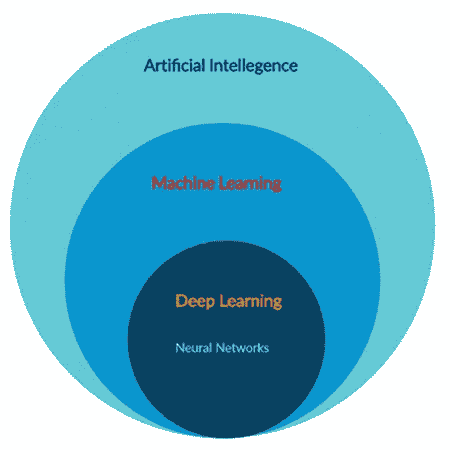

图 1:神经网络在人工智能、机器学习和深度学习中的位置。

# 什么是神经网络？

神经网络形成了深度学习的基础，这是 [**机器学习**](https://mld.ai/mldcmu) 的一个子领域，其中人脑的结构激发了算法。神经网络获取输入数据，训练自己识别数据中的模式，然后预测一组新的类似数据的输出。因此，神经网络可以被认为是深度学习的功能单元，它模仿人脑的行为来解决复杂的数据驱动问题。

当我们想到“**神经网络**”时，我们首先想到的是生物学，的确，神经网络是受我们大脑的启发。

> 📚查看我们对[最佳机器学习书籍](https://towardsai.net/p/machine-learning/best-machine-learning-books-free-and-paid-ml-book-recommendations-40c9ab30b0c)的编辑推荐。📚

让我们试着去理解它们:

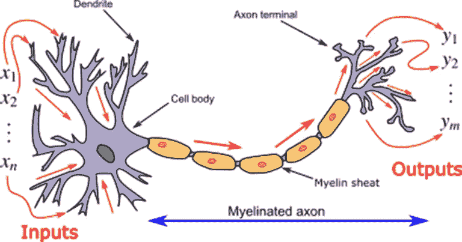

图 2:代表生物神经元的图像|来源:维基百科[ [1](https://en.wikipedia.org/wiki/Biological_neuron_model)

在机器学习中，神经元的树突称为输入，细胞核处理数据，并通过轴突转发计算的输出。在生物神经网络中，树突的宽度(厚度)定义了与其相关的权重。

## 索引:

1.  [什么是人工神经网络？](#3a44)
2.  [人工神经网络的应用](#a78a)
3.  [人工神经网络(ANN)的一般结构](#478a)
4.  [什么是感知器？](#3997)
5.  [感知器简单例子](#8c37)
6.  [Sigmoid 函数(神经网络的激活函数)](#efe7)
7.  [神经网络从零开始实现](#48c4)
8.  [什么是梯度下降？](#344b)
9.  [神经网络所用公式的推导](#cc41)
10.  [神经网络的 Python 实现](#0ea5)
11.  [我们为什么要加偏倚？](#0700)
12.  [案例研究:用 Python 开发的神经网络预测病毒收缩](#a748)

> 📚查看我们的教程[蒙特卡罗模拟](https://towardsai.net/p/machine-learning/monte-carlo-simulation-an-in-depth-tutorial-with-python-bcf6eb7856c8)和 Python 中的例子📚

# 1.什么是人工神经网络？

简而言之，人工神经网络代表相互连接的输入和输出单元，其中每个连接都有一个相关的权重。在学习阶段，网络通过调整这些权重进行学习，以便能够预测输入数据的正确类别。

例如:

我们遇到自己处于深度睡眠状态，突然我们的环境开始颤抖。紧接着，我们的大脑意识到这是一场地震。我们立刻想到对我们来说最有价值的东西:

*   我们深爱的人。
*   基本文件。
*   珠宝。
*   笔记本电脑。
*   一支铅笔。

现在我们只有几分钟的时间走出房子，我们只能挽救一些东西。在这种情况下，我们的首要任务是什么？

也许，我们是要先去救我们心爱的人，然后如果时间允许，我们可以想其他的事情。我们在这里做的是，给我们的贵重物品分配一个重量。在那一刻，每一个有价值的东西都是一个输入，优先级是我们赋予它的权重。

神经网络也是如此。我们给不同的值分配权重，并预测它们的输出。然而，在这种情况下，我们不知道每个输入的相关权重，因此我们制定了一个算法，通过处理大量输入数据来计算与它们相关的权重。

# 2.人工神经网络的应用:

## **a .数据分类:**

基于一组数据，我们训练好的神经网络预测它是狗还是猫？

## **b .异常检测:**

给出一个人的交易细节，就可以说这个交易是不是欺诈。

## **c .语音识别:**

我们可以训练我们的神经网络来识别语音模式。比如:Siri，Alexa，谷歌助手。

## **d .音频生成:**

给定作为音频文件的输入，它可以基于各种因素生成新的音乐，如流派、歌手等。

## **e .时间序列分析:**

训练有素的神经网络可以预测股价。

## **f .拼写检查:**

我们可以训练一个神经网络来检测拼错的拼写，也可以为单词提供类似的意思。例子:语法上

## **g .字符识别:**

训练有素的神经网络可以检测手写字符。

## **h .机器翻译:**

我们可以开发一种神经网络，将一种语言翻译成另一种语言。

## **一、图像处理:**

我们可以训练神经网络来处理图像，并从中提取信息。

# 3.人工神经网络(ANN)的一般结构:

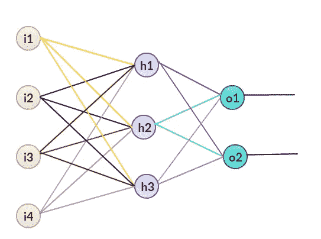

图 3:人工神经网络


图 4:具有 3 层的人工神经网络

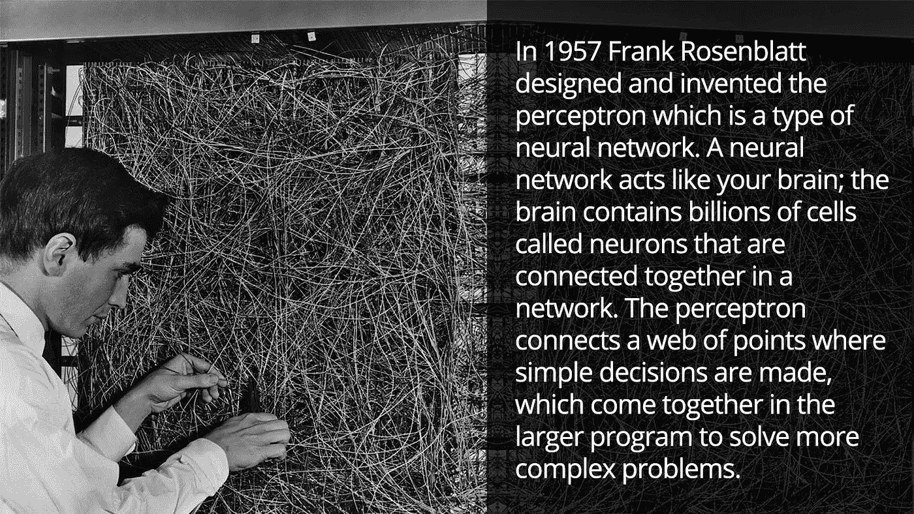

图 Frank Rosenblatt 的感知机|来源:[卡内基梅隆大学机器学习系](https://mld.ai/mldcmu)

# 4.什么是感知器？

感知器是一个没有任何隐藏层的神经网络。感知器只有一个输入层和一个输出层。

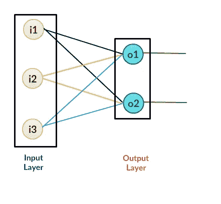

图 6:感知器

## 我们可以使用感知器。

感知器的用途在于许多情况下。虽然感知器主要用于简单的决策，但它们也可以在更大的计算机程序中一起解决更复杂的问题。

例如:

1.  如果某人是教职员工，则允许访问；如果某人是学生，则拒绝访问。
2.  只允许人类进入。
3.  逻辑门的实现 [2](https://en.wikipedia.org/wiki/Logic_gate) 。

## 实施神经网络的步骤包括:

神经网络分两步执行:

## **1。前馈:**

在前向神经网络中，我们有一组输入特征和一些随机权重。请注意，在这种情况下，我们采用随机权重，并使用反向传播进行优化。

## **2。反向传播:**

在反向传播期间，我们计算预测输出和目标输出之间的误差，然后使用算法(梯度下降)来更新权重值。

## **为什么我们需要反向传播？**

在设计神经网络时，首先，我们需要训练一个模型，并为每个输入分配特定的权重。这个权重决定了这个特征对我们的预测有多重要。权重越高，重要性越大。然而，最初，我们不知道这些输入所需的具体重量。所以我们要做的是，给我们的输入分配一些随机权重，然后我们的模型计算预测的误差。此后，我们更新我们的权重值并重新运行代码(反向传播)。在单独迭代之后，我们可以获得更低的误差值和更高的精度。

## 概述人工神经网络:

1.  接受输入
2.  添加偏差(如果需要)
3.  为输入要素分配随机权重
4.  运行代码进行培训。
5.  找出预测中的错误。
6.  通过梯度下降算法更新权重。
7.  用更新的重量重复训练阶段。
8.  做预测。

## 简单神经网络的流程图:

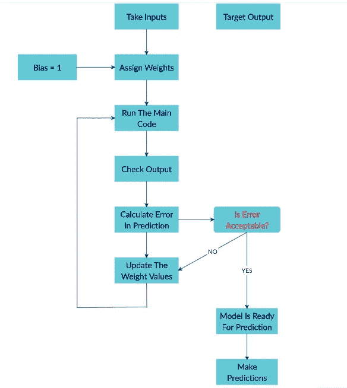

图 7:人工神经网络(ANN)基本流程图

## 神经网络的训练阶段:

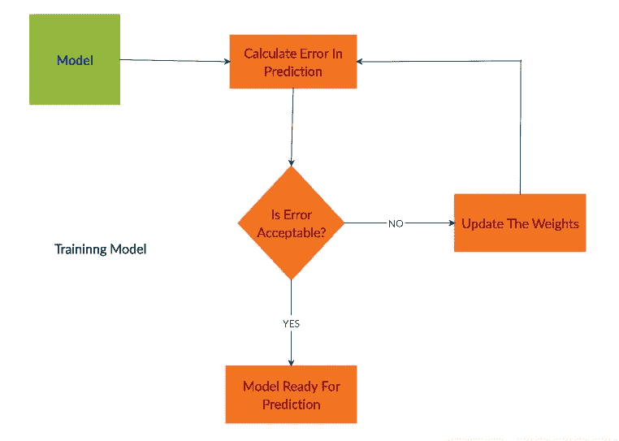

图 8:神经网络的训练阶段

# 5.感知器示例:

下面是一个简单的感知器模型，有四个输入和一个输出。

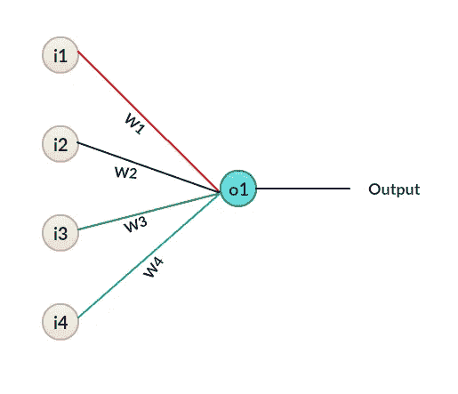

图 9:一个简单的感知机

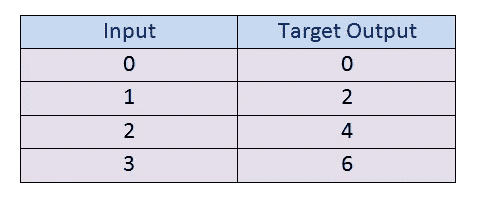

图 10:一组数据

这里我们有输入值和它们对应的目标输出值。所以我们要做的是，给输入分配一些权重，然后计算它们的预测输出值。

在本例中，我们将通过以下公式计算输出:


图 11:计算神经网络输出的公式

在这个例子中，为了简化计算，我们将偏差值设为 0。

**a.** 我们取 W = 3，检查预测输出。

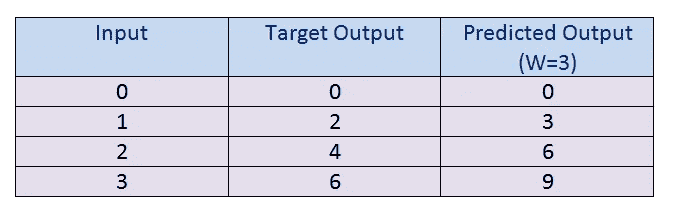

图 12:W = 3 时的输出

**b.** 在我们找到 W=3 的预测输出值后，我们将把它与我们的目标输出进行比较，通过这样做，我们可以找到预测模型中的误差。请记住，我们的目标是为我们的模型实现最小的误差和最大的准确性。

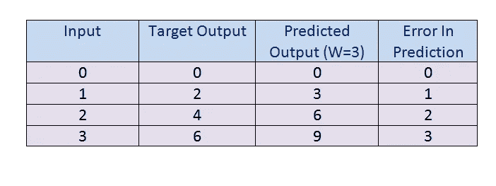

图 13:W = 3 时的误差

**c.** 注意，在上面的计算中，4 个预测中有 3 个有误差。因此，我们必须改变我们的权重参数值设置为低。现在我们有两个选择:

1.  增加重量
2.  减轻重量

首先，我们将增加权重的值，并检查它是否会导致更高的错误率或更低的错误率。这里我们将权重值增加 1，并将其更改为 W = 4。

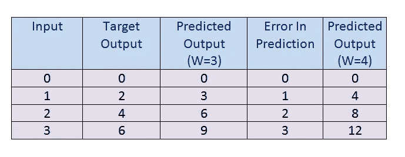

图 14:W = 4 时的输出

**d.** 从上图我们可以看到，就是预测的误差在增加。所以现在我们可以得出结论，增加权重值并不能帮助我们减少预测中的误差。

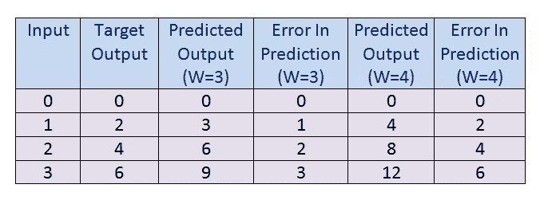

图 15:W = 4 时的误差

**e.** 在我们增加权重值失败后，我们将为其降低权重值。此外，通过这样做，我们可以看到它是否有帮助。

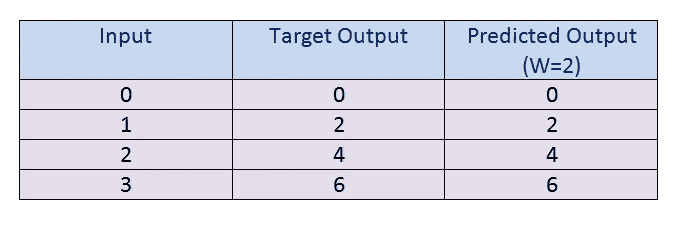

图 16:W = 2 时的输出

**f.** 计算预测中的误差。这里我们可以看到，我们已经达到了全球最低水平。

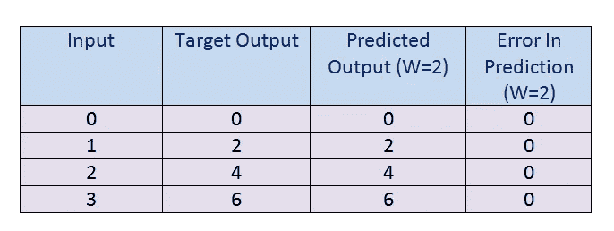

图 17:W = 2 时的误差

在图 17 中，我们可以看到预测没有错误。

现在我们在这里做的是:

1.  首先，我们有输入值和目标输出。
2.  然后我们初始化一些随机值为 W，然后我们继续。
3.  最后，我们计算了该权重值的预测误差。之后，我们更新了权重并预测了输出。经过几次反复试验，我们可以减少预测中的误差。

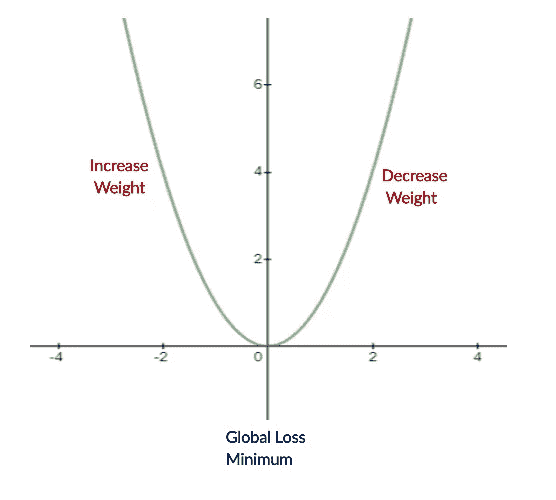

图 18:演示我们的功能

因此，我们试图得到重量值，使误差最小。我们需要弄清楚是否需要增加或减少权重值。一旦我们知道了，我们继续在那个方向更新权重值，直到误差变得最小。我们可能会达到这样一个点，如果权重发生进一步的更新，误差将会增加。这时候，我们需要停下来，那就是我们最终的重量值。

在现实生活的数据中，情况可能会更复杂一些。在上面的例子中，我们看到我们可以尝试不同的权重值，并手动获得最小误差。但是，在实际数据中，权重值通常是小数(非整数)。因此，我们将使用具有低学习率的梯度下降算法，以便我们可以尝试不同的权重值，并从我们的模型中获得最佳预测。

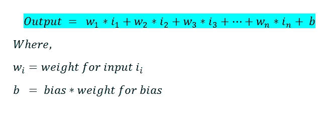

图 19:表示最终

# 6.Sigmoid 函数:

在我们的神经网络训练中，sigmoid 函数充当**激活函数。我们通常使用神经网络进行分类。在二元分类中，我们有两种类型。然而，正如我们所看到的，我们的输出值可以是我们使用的等式中的任何可能的数字。为了解决这个问题，我们使用一个 sigmoid 函数。现在为了分类，我们希望输出值为 0 或 1。所以为了得到 0 到 1 之间的值，我们使用 sigmoid 函数。sigmoid 函数在 0 和 1 之间转换我们的输出值。**

让我们来看看:

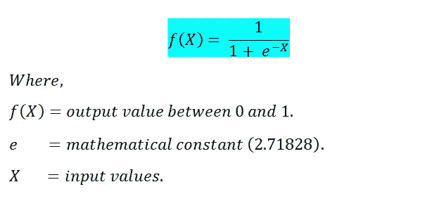

图 20: Sigmoid 函数

让我们用 Python 可视化我们的 sigmoid 函数:

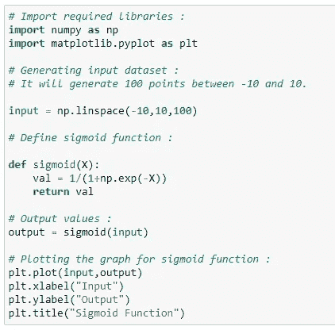

图 sigmoid 函数的 Python 代码

**输出:**

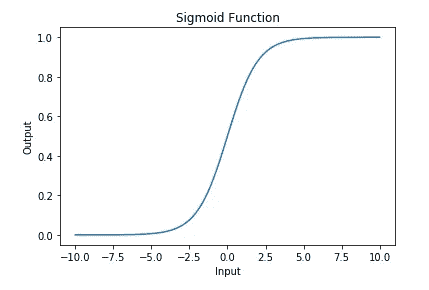

图 22: Sigmoid 函数图

**说明:**

在图 21 和 22 中，对于任何输入值，sigmoid 函数的值将始终介于 0 和 1 之间。请注意，对于负数，sigmoid 函数的输出≤0.5，或者我们可以说更接近于零，对于正数，输出将大于 0.5，或者我们可以说更接近于 1。

# 7.从头开始实现神经网络:

我们要做的是用感知器实现“或”逻辑门。请记住，这里我们不会使用任何隐藏层。

## 什么是逻辑或门？

直截了当地说，当其中一个输入为 1 时,“或”门的输出也将为 1。这意味着只有当两个输入都为 0 时，输出才为 0。

## 代表性:


图 23:或门

## or 门的真值表:

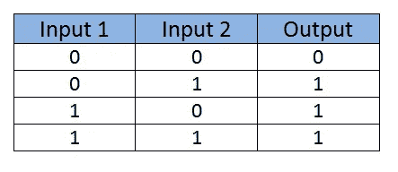

图 24:OR 门的真值表数据集

## 或门的感知器；

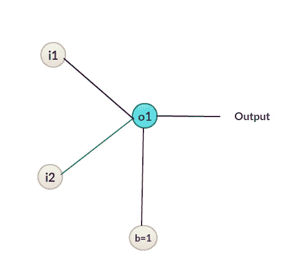

图 25:一个感知机

接下来，我们将为每个输入值分配一些权重并进行计算。

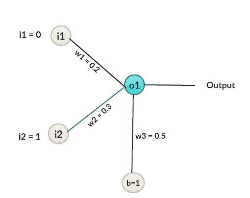

图 26: A 加权感知器

## 示例:(手动计算)

**a .计算 o1 的输入:**

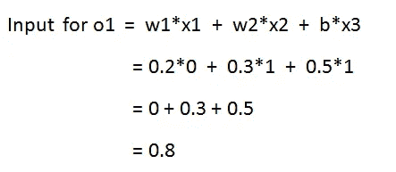

图 27:计算 o1 输入的公式

**b .计算输出值:**

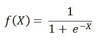

图 28:计算输出值的公式


图 29:结果输出值

注意，从我们的真值表中，我们可以看到我们想要的输出是 1，但是我们在这里得到的是 0.68997。现在我们需要计算误差，然后反向传播，然后更新权重值。

**c .误差计算:**

接下来，我们将使用均方差来计算误差:

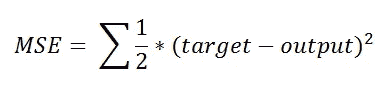

图 30:均方误差公式

求和符号(适马符号)意味着我们必须将所有输入集的误差相加。在这里，我们将看到它是如何只对一个输入集起作用的。

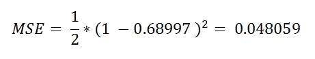

图 31:MSE 的结果

我们必须对所有剩余的输入进行同样的操作。既然我们已经发现了误差，我们必须更新权重的值以使误差最小。为了更新权重值，我们将使用梯度下降算法。

# 8.什么是梯度下降？

梯度下降是一种机器学习算法，它迭代地寻找其参数的最佳值。它考虑了用户定义的学习率和初始参数值。

工作:(迭代)

1.从初始值开始。

2.计算成本。

3.使用 Update 函数更新值。

4.返回成本函数的最小成本

## 我们为什么需要它？

一般来说，我们要做的是，找到给出参数最优值的公式。但是，在这个算法中，它是自己找值的！

> 很有趣，不是吗？


图 32；梯度下降算法的公式

我们将用这个算法来更新我们的权重。首先，我们需要求 f(X)的导数。

# 9.神经网络中所用公式的推导

接下来，我们想要找到的是特定的权重值如何影响误差。发现我们要应用链式法则。

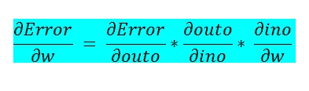

图 33:寻找导数

之后，我们要做的是找到这三个导数的值。

在下面的图片中，我们试图展示这些导数的导数，以展示梯度下降背后的数学原理。

**d .计算衍生品:**

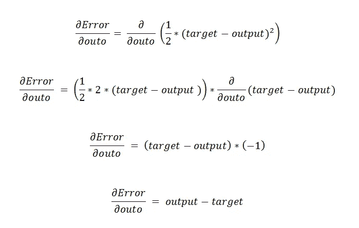

图 34:计算导数

在我们的案例中:

输出= 0.68997
目标= 1

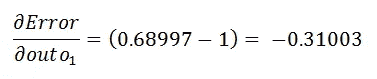

图 35:寻找一阶导数

**e .求导数的第二部分:**

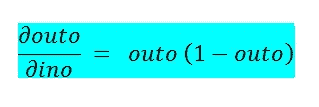

图 36:计算第二部分

要逐步理解它:

**outo 1 的 e.a .值:**

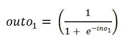

图 37:outo 1 的值

**e.b .求关于 ino1 的导数:**

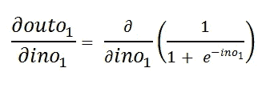

图 38:outo 1 相对于 ino1 的导数

**e.c .稍微简化一下，很容易找到导数:**

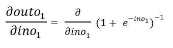

图 39:简化

**应用链式法则和幂法则:**

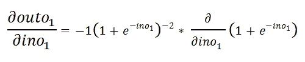

图 40:应用链式法则和幂法则

**e.e .应用求和规则:**

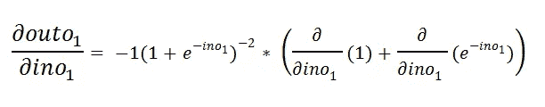

图 41:针对 ino1 对 outo1 应用求和规则

**e.f .常数的导数为零:**

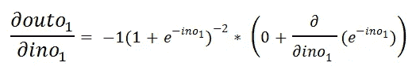

图 42:常数的导数为零

**例如应用指数法则和链式法则:**

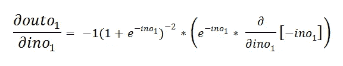

图 42:应用指数规则和链式规则

**e.h .稍微简化一下:**

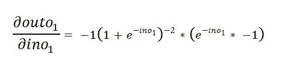

图 43:简化导数

**即将两个负号相乘:**

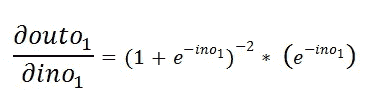

图 44:两个负数的乘法

**e.j .把负幂放在分母:**

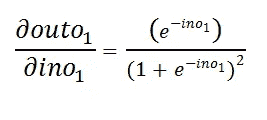

图 45:将负幂移动到分母

就是这样。然而，我们需要简化它，因为对于我们的机器学习算法来说，处理大量输入有点复杂。

**e.k .简化它:**

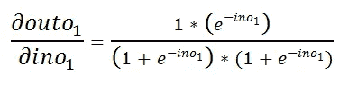

图 46:简化算法

**e.l .进一步简化:**

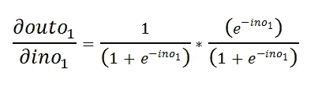

图 47:简化的第二步

**e.k .添加+1–1:**

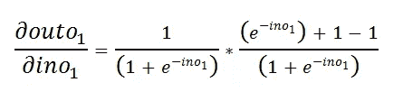

图 48:添加值

**e.l .分离零件:**

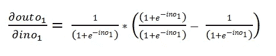

图 49:分离算法

**e.m .简化:**

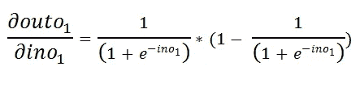

图 50:简化分离

**e.n .现在我们都从等式 1 知道了 outo1 的值:**


图 outo1 的值

由此我们可以推导出下面的最终导数

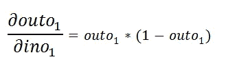

图 52:推导最终导数

**e.p .计算我们输入的值:**

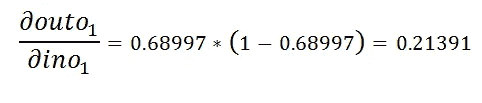

图 53:输出的最终计算

**f .寻找导数的第三部分:**

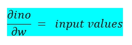

图 54:计算三阶导数的公式

**`**ino**`**的 f.a 值:****

**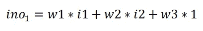**

**图 55:ino 的价值**

****f.b .寻找衍生工具:****

**除 w2 之外的所有其他值在这里都被认为是常数。**

****

**图 56:寻找导数**

****f.c .为我们的输入计算两个值:****

****

**图 57:计算输入的两个值**

****消防部门汇总:****

****

**图 58:整体计算**

**将它放入我们的主方程:**

****

**图 59:把它放在主方程上**

****f.f 我们可以计算:****

****

**图 60:第二重量的计算**

**注意这里的权重值增加了。我们可以用这种方法计算所有的值，但是正如我们所看到的，这将是一个漫长的过程。所以现在我们要用 Python 实现所有的步骤。**

## **人工实现神经网络的概要:**

****

**图 61:记住 ino =输入值*权重| outo =应用 sigmoid 函数后的输出值**

****a .感知器的输入:****

****

**图 62:感知器的输入值**

****b .将 sigmoid 函数应用于预测输出:****

****

**图 63:对预测输出应用 sigmoid 函数**

****c .计算误差:****

****

**图 64:计算误差**

****d .根据梯度下降公式改变权重值:****

****

**图 65:基于梯度下降改变权重值**

****e .计算导数:****

****

**图 66:计算导数**

****f .个别衍生产品:****

****

**图 67:一阶导数**

**来源:图片由作者创作。**

****

**图 68:二阶导数**

**来源:图片由作者创作。**

****

**图 69:三阶导数**

**然后，我们使用更新的权重值运行相同的代码。**

> **让我们编码:**

# **10.用 Python 实现神经网络；**

## ****10.1 导入所需库:****

**首先，我们要导入 Python 库。我们使用 NumPy 进行计算:**

****

**图 70:导入数字**

## ****10.2 分配输入值:****

**接下来，我们将获取我们想要训练神经网络的输入值。这里我们可以看到，我们采用了两个输入特征。在实际数据集中，输入要素的值通常很高。**

****

**图 71:分配输入值来训练我们的神经网络**

## ****10.3 目标产量:****

**对于输入特性，我们希望特定的输入特性有特定的输出。它被称为目标输出。我们将训练为我们的输入特征提供目标输出的模型。**

****

**图 72:定义目标输出**

## ****10.3 分配权重:****

**接下来，我们将为输入要素分配随机权重。请注意，我们的模型会将这些权重值修改为最佳值。此时，我们随机取这些值。这里我们有两个输入要素，所以我们要取两个权重值。**

****

**图 73:为我们的输入特征分配随机权重**

## ****10.4 添加偏差值并指定学习率:****

**现在，我们将添加偏差值。bias = 1 的值。然而，分配给它的权重最初是随机的，我们的模型将针对我们的目标输出优化它。**

**另一个参数叫做学习率(LR)。我们将使用梯度下降算法中的学习率来更新权重值。一般来说，我们保持尽可能低的学习率，这样我们就可以达到最小的错误率。**

****

**图 74:添加偏差值并分配学习率(LR)**

## ****10.5 应用 Sigmoid 函数:****

**一旦我们有了权重值和输入特征，我们将把它发送给预测输出的主函数。现在请注意，我们的输入要素和权重值可以是任何值，但是这里我们要对数据进行分类，因此我们需要 0 到 1 之间的输出。为此，我们要去一个 sigmoid 函数。**

****

**图 75:将 sigmoid 函数应用于我们的神经网络**

## ****10.6 sigmoid 函数的导数:****

**在梯度下降算法中，我们需要 sigmoid 函数的导数。**

****

**图 76:计算 sigmoid 函数的导数**

## ****10.7 预测输出和更新权重值的主要逻辑:****

**我们将逐步解释下面的代码。**

****

**图 77:点 10.1 到 10.7 的源代码**

## **它是如何工作的？**

**首先，上面的代码需要运行大约 10，000 次。请记住，如果我们只运行这段代码几次，那么我们可能会有更高的错误率。因此，简而言之，我们可以说我们将更新权重值 10，000 次，以达到可能的最佳值。**

**接下来，我们需要做的是将输入特征与相应的权重值相乘，我们要提供给感知器的值可以用矩阵的形式表示。**

**`in_o`代表`input_features`和`weight`的点积。请注意，第一个矩阵(输入要素)的大小为(4*2)，第二个矩阵(权重)的大小为(2*1)。乘法之后，结果矩阵的大小为(4*1)。**

****

**图 78:每个方框代表一个值**

**在上面的表示中，每个盒子代表一个值。**

**现在在我们的公式中，我们也有偏差值。我们用简单的矩阵表示来理解吧。**

****

**图 79:值的矩阵表示，带有额外的偏置值**

**接下来，我们将添加偏差值。矩阵中的加法运算很容易理解。这就是 sigmoid 函数的输入。之后，我们将对输入值应用 sigmoid 函数，这将给出介于 0 和 1 之间的预测输出值。**

**接下来，我们要计算预测的误差。为此，我们通常使用**均方误差(MSE)** ，但是为了计算的简单，这里我们只使用简单的误差函数。最后，我们将添加所有四个输入的误差。**

**我们的最终目标是最小化误差。为了最小化误差，我们可以更新我们的权重值。为了更新权重值，我们将使用梯度下降算法。**

**为了找到导数，我们需要梯度下降算法的一些导数的值。正如我们已经讨论过的，我们将找到 3 个单独的导数值，然后乘以它。**

**一阶导数是:**

****

**图 80:一阶导数**

**二阶导数是:**

****

**图 81:二阶导数**

**三阶导数是:**

****

**图 82:三阶导数**

**注意，我们可以很容易地找到前两个导数的值，因为它们不依赖于输入。接下来，我们将前两个导数的乘积值存储在`deriv`变量中。现在这些导数的值必须和权重的大小一样。权重的大小是(2*1)。**

**为了找到最终的导数，我们需要找到我们的`input_features` 的转置，然后我们将它乘以我们的`deriv`变量，它基本上是其他两个导数的乘积。**

**让我们来看看运算的矩阵表示。**

****

**图 83:操作的矩阵表示**

**在图 83 上，第一个矩阵是`input_features`的转置矩阵。第二个矩阵存储其他两个导数的乘积值。现在看到我们已经将这些值存储在一个名为`deriv_final`的矩阵中。请注意，`deriv_final`的大小是(2*1)，这与我们的权重矩阵的大小(2*1)相同。**

**之后，我们更新权重值，注意我们有了更新权重所需的所有值。我们将使用以下公式来更新权重值。**

****

**图 84:更新我们体重值的公式**

**最后，我们需要更新偏差值。如果我们记得这个图表，我们可能已经注意到偏差权重的值不依赖于输入。所以要单独更新。在这种情况下，我们需要`deriv`值，因为它不依赖于输入值。为了更新偏差值，我们通过 for 循环在每次迭代中更新每个输入的值。**

## ****10.8 检查重量和偏差的值:****

****

**图 85:注意我们的权重和值是如何从随机分配的值变化的**

**在图 85 中，注意我们的权重和偏差值已经从我们随机分配的值改变了。**

****10.9 预测值:****

**既然我们已经训练了我们的模型，我们可以开始根据它进行预测。**

****10.9.1 对(1，0)的预测:****

**目标值= 1**

****

**图 86:目标值= 1 时，预测输出约为 1**

**在图 86 中，我们可以看到预测输出非常接近 1。**

****10 . 9 . 2(1，1)的预测:****

**目标产量= 1**

****

**图 87:目标输出= 1 时，预测值接近 1**

**在图 87 中，我们可以看到预测输出非常接近 1。**

****10 . 9 . 3(0，0)的预测:****

**目标输出= 0**

****

**图 88:目标输出= 0 时，预测值接近 0**

**在图 88 中，我们可以看到预测输出非常接近 0。**

# **将所有这些放在一起:**

```
# Import required libraries:
import numpy as np# Define input features:
input_features = np.array([[0,0],[0,1],[1,0],[1,1]])
print (input_features.shape)
print (input_features)# Define target output:target_output = np.array([[0,1,1,1]])# Reshaping our target output into vector:
target_output = target_output.reshape(4,1)
print(target_output.shape)
print (target_output)# Define weights:
weights = np.array([[0.1],[0.2]])
print(weights.shape)
print (weights)# Bias weight:
bias = 0.3# Learning Rate:
lr = 0.05# Sigmoid function:
def sigmoid(x):
return 1/(1+np.exp(-x))# Derivative of sigmoid function:
def sigmoid_der(x):
return sigmoid(x)*(1-sigmoid(x))# Main logic for neural network:# Running our code 10000 times:for epoch in range(10000):
inputs = input_features#Feedforward input:
in_o = np.dot(inputs, weights) + bias #Feedforward output:
out_o = sigmoid(in_o) #Backpropogation#Calculating error
error = out_o - target_output#Going with the formula:
x = error.sum()
print(x)#Calculating derivative:
derror_douto = error
douto_dino = sigmoid_der(out_o)#Multiplying individual derivatives:
deriv = derror_douto * douto_dino #Multiplying with the 3rd individual derivative:
#Finding the transpose of input_features:
inputs = input_features.T
deriv_final = np.dot(inputs,deriv)#Updating the weights values:
weights -= lr * deriv_final #Updating the bias weight value:
for i in deriv:
 bias -= lr * i #Check the final values for weight and biasprint (weights)print (bias) #Taking inputs:
single_point = np.array([1,0]) #1st step:
result1 = np.dot(single_point, weights) + bias #2nd step:
result2 = sigmoid(result1) #Print final result
print(result2) #Taking inputs:
single_point = np.array([1,1]) #1st step:
result1 = np.dot(single_point, weights) + bias #2nd step:
result2 = sigmoid(result1) #Print final result
print(result2) #Taking inputs:
single_point = np.array([0,0]) #1st step:
result1 = np.dot(single_point, weights) + bias #2nd step:
result2 = sigmoid(result1) #Print final result
print(result2)
```

****在 Google Colab 上发布:****

**[](https://colab.research.google.com/drive/16PsMib3ejn_TmV7D339nm6qdik9tWs6P#scrollTo=TfbSw80eVNCS&line=6&uniqifier=1) [## 谷歌联合实验室

### 神经网络在 Python—https://towardsai.net/neural-networks-with-python 中的实现

colab.research.google.com](https://colab.research.google.com/drive/16PsMib3ejn_TmV7D339nm6qdik9tWs6P#scrollTo=TfbSw80eVNCS&line=6&uniqifier=1) 

# 为什么我们要加入偏见？

假设我们有输入值(0，0)，输入节点和权重的乘积之和总是为零。在这种情况下，无论我们如何训练我们的模型，输出将始终为零。为了解决这个问题并做出可靠的预测，我们使用了偏差项。简而言之，我们可以说，偏置项是构成一个健壮的神经网络所必需的。

因此，**bias 的值如何影响我们 sigmoid 函数的形状？**我们用一些例子来形象化一下。

为了改变 s 形曲线的陡度，我们可以相应地调整权重。

例如:


图 89: Python 代码类似于我们实现的没有偏差值的神经网络


图 90:我们神经网络的数据可视化

从输出中，我们可以很快注意到，对于负值，sigmoid 函数的输出将≤0.5。此外，对于正值，输出将大于 0.5。

从图中(红色曲线)，你可以看到，如果我们减少权重的值，它会减少陡度的值，如果我们增加权重的值(绿色曲线)，它会增加陡度的值。然而，对于所有三条曲线，如果输入为负，输出将始终≤0.5。对于正数，输出总是大于 0.5。

## **如果我们想改变这种模式呢？**

对于这种情况，我们使用偏差值。


图 91:


图 92:

从输出中，我们可以注意到，我们可以移动 x 轴上的曲线，这有助于我们改变上一个示例中显示的模式。

## **总结:**


图 93:模式变化的移位曲线阈值总结

在神经网络中:

*   我们可以将偏差视为激活的阈值。
*   偏差增加了模型的灵活性
*   偏差值允许我们向右或向左移动激活功能。
*   当输入全为零(0，0)时，偏置值最有用。

让我们试着用之前看到的同一个例子来理解它。然而，这里我们不打算添加偏差值。模型训练完成后，我们将尝试预测(0，0)的值。理想情况下，应该接近于零。现在让我们看看下面的例子。

# 没有偏置值的实现:

## **a .导入所需库:**


图 94:用 Python 导入 NumPy

## **b .输入特征:**


图 95:用 Python 定义我们的输入特征

## **c .目标产量:**


图 96:定义我们的目标输出，并将我们的目标输出整形为一个向量

## **d .定义输入权重:**


图 97:定义我们的输入权重

## **e .定义学习率:**


图 98:定义我们的神经网络的学习率

## **f .激活功能:**


图 99:定义我们的 sigmoid 函数

## **g . sigmoid 函数的导数:**


图 100:对我们的 sigmoid 函数进行求导

## **h .训练我们模型的主要逻辑:**

请注意，我们不会在任何地方使用偏差值。


图 101:注意我们不会在神经网络实现中使用偏见

## **一、预测:**

**(1，0)的预测:**

目标产量= 1


图 102:处理目标产量= 1 的近似预测

从预测的输出我们可以看到它接近 1。

**(0，0)的预测:**

目标输出= 0


图 103:处理目标产量= 0 的近似预测

这里我们可以看到它离 0 很远。所以我们可以说我们的模型没能预测到它。这就是添加偏差值的原因。

**(1，1)的内部控制预测:**

目标产量= 1


图 104:处理目标产量= 1 的近似预测

我们可以看到它接近 1。

# 将所有这些放在一起:

```
# Import required libraries :
import numpy as np# Define input features :
input_features = np.array([[0,0],[0,1],[1,0],[1,1]])
print (input_features.shape)
print (input_features)# Define target output :
target_output = np.array([[0,1,1,1]])# Reshaping our target output into vector :
target_output = target_output.reshape(4,1)
print(target_output.shape)
print (target_output)# Define weights :
weights = np.array([[0.1],[0.2]])
print(weights.shape)
print (weights)# Define learning rate :
lr = 0.05# Sigmoid function :
def sigmoid(x):
 return 1/(1+np.exp(-x))# Derivative of sigmoid function :
def sigmoid_der(x):
 return sigmoid(x)*(1-sigmoid(x))# Main logic for neural network :
# Running our code 10000 times :for epoch in range(10000):
 inputs = input_features#Feedforward input :
 pred_in = np.dot(inputs, weights)#Feedforward output :
 pred_out = sigmoid(pred_in)#Backpropogation 
 #Calculating error
 error = pred_out — target_output
 x = error.sum()

 #Going with the formula :
 print(x)

 #Calculating derivative :
 dcost_dpred = error
 dpred_dz = sigmoid_der(pred_out)

 #Multiplying individual derivatives :
 z_delta = dcost_dpred * dpred_dz#Multiplying with the 3rd individual derivative :
 inputs = input_features.T
 weights -= lr * np.dot(inputs, z_delta)

#Taking inputs :
single_point = np.array([1,0])#1st step :
result1 = np.dot(single_point, weights)#2nd step :
result2 = sigmoid(result1)#Print final result
print(result2)#Taking inputs :
single_point = np.array([0,0])#1st step :
result1 = np.dot(single_point, weights)#2nd step :
result2 = sigmoid(result1)#Print final result
print(result2)#Taking inputs :
single_point = np.array([1,1])#1st step :
result1 = np.dot(single_point, weights)#2nd step :
result2 = sigmoid(result1)#Print final result
print(result2)
``` 

****在 Google Colab 上发布:****

**[](https://colab.research.google.com/drive/16PsMib3ejn_TmV7D339nm6qdik9tWs6P#scrollTo=YrRCooGFcb0f&line=51&uniqifier=1) [## 谷歌联合实验室

### 神经网络在 Python 中的实现无偏向值—https://towardsai.net/neural-networks-with-python

colab.research.google.com](https://colab.research.google.com/drive/16PsMib3ejn_TmV7D339nm6qdik9tWs6P#scrollTo=YrRCooGFcb0f&line=51&uniqifier=1)** 

> **📚查看[机器学习算法的概述](https://towardsai.net/machine-learning-algorithms)，为初学者提供 Python 代码示例📚**

# **案例研究:用 Python 语言的神经网络预测病毒收缩**

****

**图 105:感知器**

## **数据集:**

****

**图 106:我们案例研究的数据集**

**对于这个例子，我们的目标是根据给定的输入特征预测一个人是否对病毒呈阳性。这里 1 代表“是”，0 代表“否”。**

> **让我们编码:**

## ****a .导入所需的库:****

****

**图 107:用 Python 导入 NumPy**

**来源:图片由作者创作。**

## ****b .输入特性:****

****

**图 108:定义我们的输入特征**

## ****c .目标输出:****

****

**图 108:定义我们的目标输出**

## ****d .定义权重:****

****

**图 109:定义我们的权重**

## ****e .偏差值和学习率:****

****

**图 110:定义我们的偏差值和学习率**

## ****乙状结肠功能:****

****

**图 111:应用 sigmoid 函数**

## ****g . sigmoid 函数的导数:****

****

**图 112:和以前一样，我们导出了 sigmoid 函数**

## ****h .培训模型的主要逻辑:****

****

**图 113:我们案例研究的训练模型的主要逻辑**

## ****一、预测:****

****例如，受检者呈病毒阳性。****

****

**图 114:预测受试者对病毒呈阳性的大致时间**

****i.b .受检者病毒检测呈阴性。****

****

**图 115:预测受试者对病毒呈阴性的大致时间**

****i.c .被检测者呈病毒阳性。****

****

**图 116:预测受试者对病毒呈阳性的大致时间**

## ****j .最终重量和偏差值:****

****

**图 117:检查我们的最终权重和偏差值**

**在本例中，我们可以注意到输入特征“嗅觉丧失”对输出的影响最大。如果这是真的，那么在大多数情况下，这个人的病毒检测呈阳性。我们也可以从重量值中得出这个结论。请记住，权重值越高，对输出的影响越大。输入特征“体重减轻”对输出没有太大影响，因此我们可以在对更大的数据集进行预测时将其排除。**

# **将所有这些放在一起:**

```
# Import required libraries :
import numpy as np# Define input features :
input_features = np.array([[1,0,0,1],[1,0,0,0],[0,0,1,1],
 [0,1,0,0],[1,1,0,0],[0,0,1,1],
 [0,0,0,1],[0,0,1,0]])
print (input_features.shape)
print (input_features)# Define target output :
target_output = np.array([[1,1,0,0,1,1,0,0]])# Reshaping our target output into vector :
target_output = target_output.reshape(8,1)
print(target_output.shape)
print (target_output)# Define weights :
weights = np.array([[0.1],[0.2],[0.3],[0.4]])
print(weights.shape)
print (weights)# Bias weight :
bias = 0.3# Learning Rate :
lr = 0.05# Sigmoid function :
def sigmoid(x):
 return 1/(1+np.exp(-x))# Derivative of sigmoid function :
def sigmoid_der(x):
 return sigmoid(x)*(1-sigmoid(x))# Main logic for neural network :
# Running our code 10000 times :for epoch in range(10000):
 inputs = input_features#Feedforward input :
 pred_in = np.dot(inputs, weights) + bias#Feedforward output :
 pred_out = sigmoid(pred_in)#Backpropogation 
 #Calculating error
 error = pred_out — target_output

 #Going with the formula :
 x = error.sum()
 print(x)

 #Calculating derivative :
 dcost_dpred = error
 dpred_dz = sigmoid_der(pred_out)

 #Multiplying individual derivatives :
 z_delta = dcost_dpred * dpred_dz#Multiplying with the 3rd individual derivative :
 inputs = input_features.T
 weights -= lr * np.dot(inputs, z_delta)#Updating the bias weight value :
 for i in z_delta:
  bias -= lr * i#Printing final weights: print (weights)
print (“\n\n”)
print (bias)#Taking inputs :
single_point = np.array([1,0,0,1])#1st step :
result1 = np.dot(single_point, weights) + bias#2nd step :
result2 = sigmoid(result1)#Print final result
print(result2)#Taking inputs :
single_point = np.array([0,0,1,0])#1st step :
result1 = np.dot(single_point, weights) + bias#2nd step :
result2 = sigmoid(result1)#Print final result
print(result2)#Taking inputs :
single_point = np.array([1,0,1,0])#1st step :
result1 = np.dot(single_point, weights) + bias#2nd step :
result2 = sigmoid(result1)#Print final result
print(result2)
```

**在 Google Colab 上发布:**

**[](https://colab.research.google.com/drive/16PsMib3ejn_TmV7D339nm6qdik9tWs6P#scrollTo=ES5UHf2ufWXc&line=8&uniqifier=1) [## 谷歌联合实验室

### 病毒检测预测神经网络—https://towardsai.net/neural-networks-with-python

colab.research.google.com](https://colab.research.google.com/drive/16PsMib3ejn_TmV7D339nm6qdik9tWs6P#scrollTo=ES5UHf2ufWXc&line=8&uniqifier=1)** 

**在上面的例子中，我们没有使用任何隐藏层进行计算。注意，在上面的例子中，我们的数据是线性可分的。例如:**

****

**图 118:显示可线性分离的输入值的数据集**

****

**图 119:线性可分数据的可视化**

**我们可以看到红线可以把黄点(值= 1)和绿点(值= 0)分开。**

## **感知器模型的局限性(没有隐藏层):**

**1.单层感知器无法对非线性可分离数据点进行分类。**

**2.涉及许多参数的复杂问题无法用单层感知器解决。**

**然而，在一些情况下，数据不是线性可分的。在这种情况下，我们的感知器模型(没有隐藏层)无法做出准确的预测。为了做出准确的预测，我们需要添加一个或多个隐藏层。
非线性可分数据的可视化表示:**

****

**图 120:非线性可分离数据的可视化表示**

**[](https://www.buymeacoffee.com/pratu)

给普拉蒂克买杯咖啡！** 

****免责声明:**本文表达的观点仅代表作者个人观点，不代表卡内基梅隆大学或其他(直接或间接)与作者相关的公司的观点。这些文章并不打算成为最终产品，而是当前思想的反映，同时也是讨论和改进的催化剂。**

**通过[向艾](https://towardsai.net/)发布**

# **推荐文章**

**一、[机器学习和数据科学最佳数据集](https://towardsai.net/p/machine-learning/best-datasets-for-machine-learning-and-data-science-d80e9f030279)
二。[艾薪资冲天](http://towardsai.net/ai-salaries)三世
。[什么是机器学习？](https://towardsai.net/p/machine-learning/what-is-machine-learning-ml-b58162f97ec7)
四世。[2020 年最佳机器学习硕士项目](https://towardsai.net/ml-masters)
五、[2020 年最佳机器学习博士项目](https://towardsai.net/ml-phd)
六、[最佳机器学习博客](https://towardsai.net/p/machine-learning/best-machine-learning-blogs-6730ea2df3bd)
七。[关键机器学习定义](https://towardsai.net/p/machine-learning/key-machine-learning-ml-definitions-43e837ec6add)
八。[用机器学习在 0.05 秒内破解验证码](https://towardsai.net/ml-captcha)
九。[机器学习 vs. AI 及其重要区别](https://towardsai.net/p/machine-learning/machine-learning-vs-ai-important-differences-between-them/robiriondo/3432/)
十.[确保成功开创机器学习事业(ML)](https://towardsai.net/p/machine-learning/moocs-vs-academia-ensuring-success-starting-in-a-machine-learning-ml-career-304b2e42315e)
XI。[机器学习算法初学者](https://towardsai.net/p/machine-learning/machine-learning-algorithms-for-beginners-with-python-code-examples-ml-19c6afd60daa)
十二。[神经网络从零开始详细用 Python 代码和数学](https://towardsai.net/neural-networks-with-python)
XIII。[用 Python 构建神经网络](https://towardsai.net/p/machine-learning/building-neural-networks-with-python-code-and-math-in-detail-ii-bbe8accbf3d1)
XIV。[神经网络的主要类型](https://towardsai.net/p/machine-learning/main-types-of-neural-networks-and-its-applications-tutorial-734480d7ec8e)
十五。[用 Python 编写的蒙特卡洛模拟教程](https://towardsai.net/p/machine-learning/monte-carlo-simulation-an-in-depth-tutorial-with-python-bcf6eb7856c8)
XVI。[Python 自然语言处理教程](https://towardsai.net/p/nlp/natural-language-processing-nlp-with-python-tutorial-for-beginners-1f54e610a1a0)**

# **引用**

**对于学术背景下的归属，请引用该工作为:**

```
Shukla, et al., “Neural Networks from Scratch with Python Code and Math in Detail — I”, Towards AI, 2020
```

# **BibTex 引文:**

```
@article{pratik_iriondo_2020, 
 title={Neural Networks from Scratch with Python Code and Math in Detail — I}, 
 url={[https://towardsai.net/neural-networks-with-python](https://towardsai.net/neural-networks-with-python)}, 
 journal={Towards AI}, 
 publisher={Towards AI Co.}, 
 author={Pratik, Shukla and Iriondo, 
 Roberto},  
 year={2020}, 
 month={Jun}
}
```

## **参考资料:**

**[1]生物神经元模型，维基百科，[https://en.wikipedia.org/wiki/Biological_neuron_model](https://en.wikipedia.org/wiki/Biological_neuron_model)**

**[2]逻辑门，维基百科，【https://en.wikipedia.org/wiki/Logic_gate **