# 用 Python 代码和数学详细构建神经网络— II

> 原文：<https://pub.towardsai.net/building-neural-networks-with-python-code-and-math-in-detail-ii-bbe8accbf3d1?source=collection_archive---------0----------------------->


来源: [Pixabay](https://pixabay.com/photos/neural-network-brain-neurons-brains-5350782/)

## [机器学习](https://towardsai.net/p/category/machine-learning)、[学者型](https://towardsai.net/p/category/scholarly)、[教程型](https://towardsai.net/p/category/tutorial)

## 我们关于[神经网络教程的第二部分从零开始](https://towardsai.net/p/machine-learning/building-neural-networks-from-scratch-with-python-code-and-math-in-detail-i-536fae5d7bbf)。从它们背后的数学到 Python 中一步一步的实现案例研究。在 Google Colab 上发布示例。

最后更新于 2021 年 1 月 7 日

**作者:**普拉蒂克·舒克拉，[罗伯特·伊里翁多](https://mktg.best/vguzs)

[](https://members.towardsai.net/) [## 加入我们吧↓ |面向人工智能成员|数据驱动的社区

### 加入人工智能，成为会员，你将不仅支持人工智能，但你将有机会…

members.towardsai.net](https://members.towardsai.net/) 

在我们的 [**神经网络教程**](https://towardsai.net/p/machine-learning/building-neural-networks-from-scratch-with-python-code-and-math-in-detail-i-536fae5d7bbf) 的第一部分中，我们解释了关于神经网络的基本概念，从它们背后的数学到用 Python 实现无任何隐藏层的神经网络。我们展示了即使在没有使用任何隐藏层的情况下，如何做出令人满意的预测。然而，单层神经网络有几个限制。

在本教程中，我们将深入探讨在 [**机器学习**](https://mld.ai/mldcmu) 中使用神经网络的局限性和优势。我们将展示如何实现具有隐藏层的神经网络，以及这些如何导致我们预测的更高准确率，以及在 Google Colab 上用 Python 实现的示例。

## 索引:

1.  [神经网络的局限性和优势](#67a1)
2.  [如何选择一个隐藏层中的几个神经元？](#8c06)
3.  [人工神经网络的一般结构。](#55f2)
4.  [用 Python 实现多层神经网络。](#8c76)
5.  [与单层神经网络的比较。](#6232)
6.  [用神经网络非线性分离数据。](#3393)
7.  [结论。](#edf5)

> 📚查看我们对[最佳机器学习书籍](https://towardsai.net/p/machine-learning/best-machine-learning-books-free-and-paid-ml-book-recommendations-40c9ab30b0c)的编辑推荐。📚

# 1.神经网络的局限性和优势

## 单层神经网络的局限性:

*   它们只能代表有限的一组功能。如果我们一直在训练一个使用复杂函数的模型(这是一般情况)，那么使用单层神经网络会导致我们的预测率准确性较低。
*   他们只能预测线性可分的数据。如果我们有非线性数据，那么训练我们的单层神经网络将导致我们预测率的准确性较低。
*   单层神经网络的决策边界必须在超平面中，这意味着如果我们的数据分布在 3 维中，那么我们的决策边界必须在 2 维中。

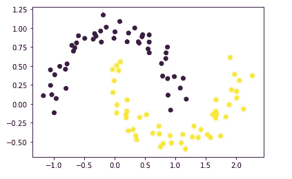

图 0:非线性可分离数据的示例。

为了克服这些限制，我们在神经网络中使用隐藏层。

## 单层神经网络的优点:

*   单层神经网络很容易建立。
*   与多层神经网络相比，单层神经网络需要较少的训练时间。
*   单层神经网络与统计模型有明确的联系。
*   单层神经网络的输出是输入的加权和。这意味着我们可以可行地解释单层神经网络的输出。

## 多层神经网络的优点:

*   他们通过考虑处理单元的层次来构建更广泛的网络。
*   它们可用于对非线性可分数据进行分类。
*   多层神经网络比单层神经网络更可靠。

# 2.如何选择一个隐藏层中的几个神经元？

有许多方法可以确定在隐藏层中使用的神经元的正确数量。我们将在这里看到其中的一些。

*   隐藏节点的数量应小于输入层中节点大小的两倍。

例如:如果我们有 2 个输入节点，那么我们的隐藏节点应该少于 4 个。

**a.** 2 个输入，4 个隐藏节点:

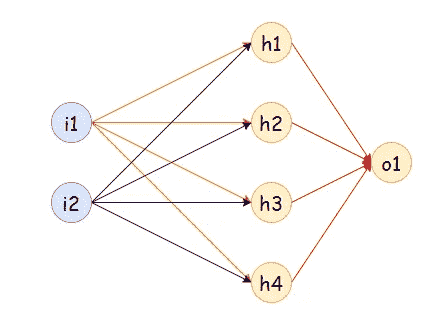

图 1:有 2 个输入和 4 个隐藏节点的神经网络。

**b.** 2 个输入，3 个隐藏节点:

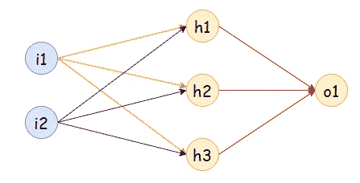

图 2:有 2 个输入和 3 个隐藏节点的神经网络。

**c.** 2 个输入，2 个隐藏节点:

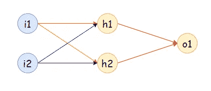

图 3:有 2 个输入和 2 个隐藏节点的神经网络。

**d.** 2 个输入，1 个隐藏节点:

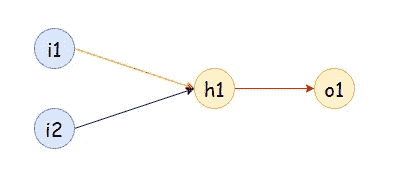

图 4:有 2 个输入和 1 个隐藏节点的神经网络。

*   隐藏节点的数量应该是输入节点大小的 2/3 加上输出节点的大小。

例如:如果我们有 2 个输入节点和 1 个输出节点，那么隐藏节点应该= floor(2*2/3 + 1) = 2

**a.** 2 个输入，2 个隐藏节点:


图 5:有 2 个输入和 2 个隐藏节点的神经网络。

*   隐藏节点的数量应该介于输入节点和输出节点的大小之间。

例如:如果我们有 3 个输入节点和 2 个输出节点，那么隐藏节点应该在 2 和 3 之间。

**a.** 3 个输入，2 个隐藏节点，2 个输出:

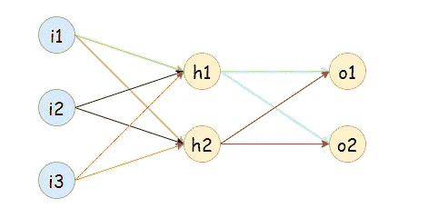

图 6:具有 3 个输入、2 个隐藏节点和 2 个输出的神经网络。

**b.** 3 个输入，3 个隐藏节点，2 个输出:

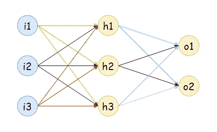

图 7:具有 3 个输入、3 个隐藏节点和 2 个输出的神经网络。

## 我们需要多少重量值？

1.  对于隐藏层:输入数*隐藏层节点数
2.  对于输出层:隐藏层节点数*输出数

# 3.人工神经网络(ANN)的一般结构:

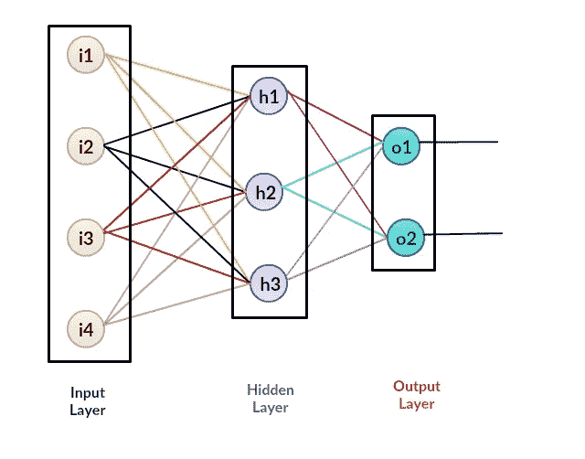

图 8:具有三层的人工神经网络的一般结构，输入层、隐藏层和输出层。

## 人工神经网络概述；

1.  听取意见。
2.  添加偏置(如果需要)。
3.  在隐藏层和输出层中分配随机权重。
4.  运行代码进行培训。
5.  找出预测中的错误。
6.  用梯度下降算法更新隐层和输出层的权值。
7.  用更新的重量重复训练阶段。
8.  做预测。

## 多层神经网络的执行；

在阅读了第一篇文章之后，我们看到那里只有 1 个执行阶段。在该阶段，我们找到更新的权重值，并重新运行代码以实现最小误差。不过，这里事情有点辣。多层神经网络的执行分两个阶段进行。在阶段 1 中，我们更新 weight_output 的值(输出层的权重值)，在阶段 2 中，我们更新 weight_hidden 的值(隐藏层的权重值)。阶段 1 类似于没有任何隐藏层的神经网络。

## 第一阶段的执行:

为了找到导数，我们将使用梯度下降算法来更新权重值。这里我们不打算推导那些函数的导数，我们已经在神经网络的第一部分中推导过了。在这个阶段，我们的目标是找到输出层的权重值。这里我们将计算与输出重量变化相关的误差变化。

我们首先定义一些将在这些衍生工具中使用的术语:

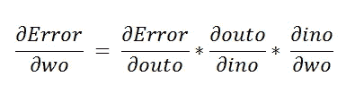

图 9:定义我们的衍生品。

**a .求一阶导数:**

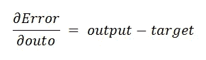

图 10:寻找一阶导数。

**b .求二阶导数:**

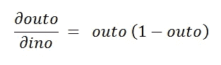

图 11:寻找二阶导数。

**c .求三阶导数:**

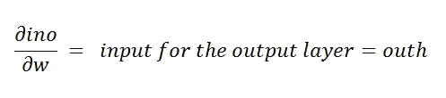

图 12:寻找三阶导数。

注意，我们已经在教程 的第一部分 [**中推导了这些导数。**](https://towardsai.net/p/machine-learning/building-neural-networks-from-scratch-with-python-code-and-math-in-detail-i-536fae5d7bbf)

# 第二阶段的执行:

在阶段 1 中，我们找到输出层的更新权重。在第二阶段，我们需要为隐藏层找到更新的权重。因此，找出隐藏权重的变化如何影响误差值的变化。

表示为:

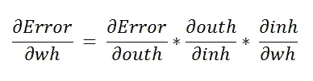

图 13:查找隐藏层的更新权重。

**a .求一阶导数:**

这里我们要用链式法则来求导数。


图 14:寻找一阶导数。

再次使用链式法则。

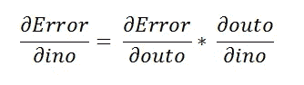

图 15:再次应用变更规则。

下面的步骤类似于我们在神经网络 的 [**教程的第一部分中所做的。**](https://towardsai.net/p/machine-learning/building-neural-networks-from-scratch-with-python-code-and-math-in-detail-i-536fae5d7bbf)

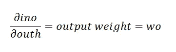

图 16:扩展一阶导数的结果，得到输出权重。

**b .求二阶导数:**

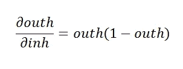

图 17:寻找二阶导数。

**c .求三阶导数:**

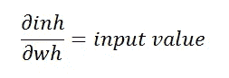

图 18:寻找三阶导数。

# 4.用 Python 实现多层神经网络

> 📚多层神经网络:具有隐藏层的神经网络📚有关更多定义，请查看我们在[机器学习术语](https://towardsai.net/machine-learning-definitions)中的文章。

下面我们将实现没有偏差值的“或”门。总之，在神经网络中添加隐藏层有助于我们在模型中实现更高的准确性。

# 代表性:

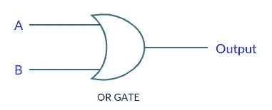

图 19:或门。

# 真值表:

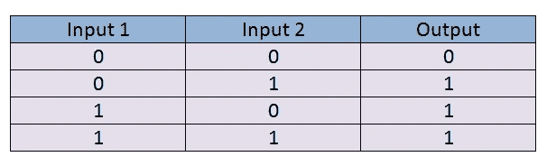

图 20:输入特性。

# 神经网络:

请注意，这里我们有 2 个输入要素和 1 个输出要素。在这个神经网络中，我们将使用 1 个具有 3 个节点的隐藏层。

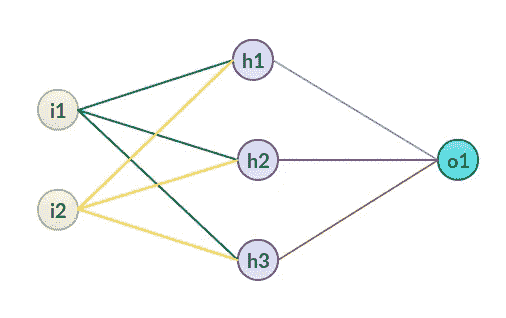

图 21:神经网络。

# 图形表示:


图 22:图中的输入，注意相同颜色的点有相同的输出。

# Python 中的实现:

下面，我们要用 Python 一步一步实现我们的带隐藏层的神经网络，我们来编码:

**a .导入所需的库:**

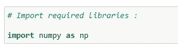

图 23:导入 NumPy。

**b .定义输入特征:**

接下来，我们获取想要训练神经网络的输入值。我们可以看到我们采用了两个输入特征。在有形数据集上，输入要素的价值通常很高。

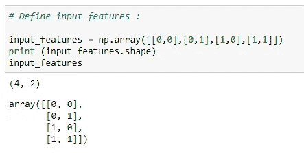

图 24:分配输入值来训练我们的神经网络。

**c .定义目标输出值:**

对于输入特性，我们希望特定的输入特性有特定的输出。它被称为目标输出。我们将训练为我们的输入特征提供目标输出的模型。

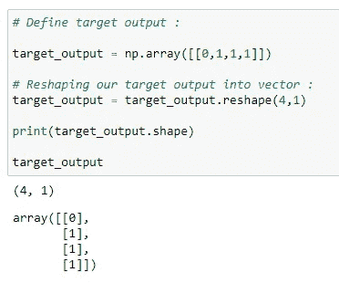

图 25:定义我们的目标输出，并将我们的目标输出重塑为一个向量

**d .分配随机权重:**

接下来，我们将为输入要素分配随机权重。请注意，我们的模型会将这些权重值修改为最佳值。此时，我们随机取这些值。这里我们有两层，所以我们必须分别为它们分配权重。

另一个变量是学习率。我们将在梯度下降算法中使用学习率(LR)来更新权重值。一般来说，我们将 LR 保持在尽可能低的水平，这样我们可以实现最小的错误率。

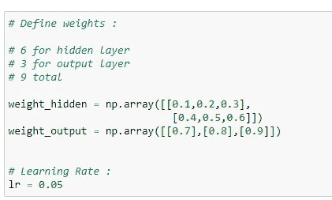

图 26:定义我们的神经网络的权重，以及我们的学习率(LR)

**乙状结肠功能:**

一旦我们有了权重值和输入特征，我们将把它发送给预测输出的主函数。请注意，我们的输入要素和权重值可以是任何值，但是这里我们希望对数据进行分类，因此我们需要 0 到 1 之间的输出。对于这样的输出，我们将使用 sigmoid 函数。

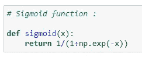

图 27:应用我们的 sigmoid 函数。

**f. Sigmoid 函数导数:**

在梯度下降算法中，我们需要 sigmoid 函数的导数。


图 28:对我们的 sigmoid 函数进行求导。

**g .预测输出和更新权重值的主要逻辑:**

我们将逐步理解下面的代码。

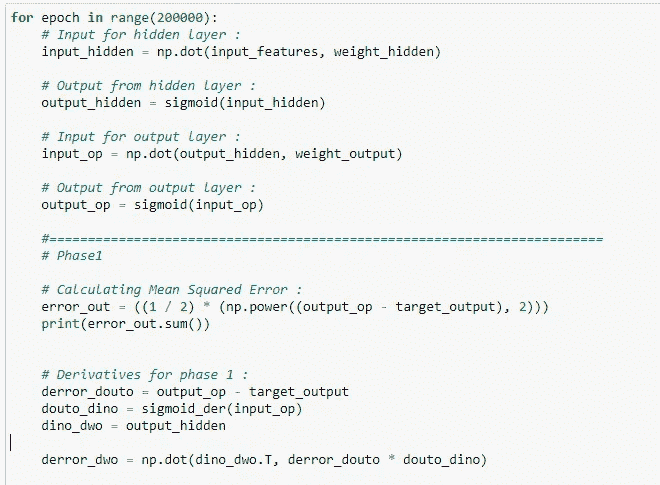

图 29:我们神经网络训练的第一阶段。

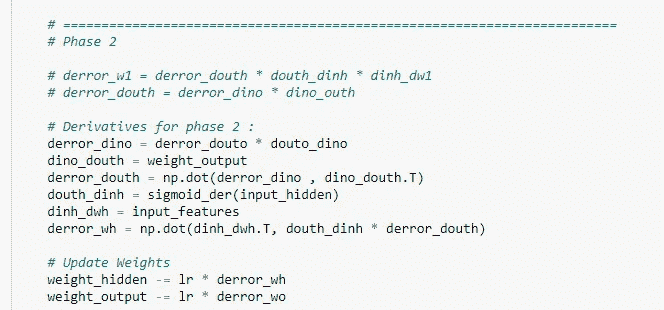

图 30:我们神经网络训练的第二阶段。

## 它是如何工作的？

**a.** 首先，我们运行上面的代码 200000 次。请记住，如果我们只运行这段代码几次，那么我们很可能会有更高的错误率。因此，我们将权重值更新 10，000 次，以达到可能的最佳值。

接下来，我们找到隐藏层的输入。由以下公式定义:

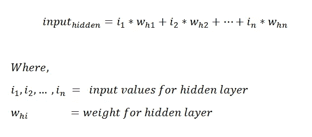

图 31:寻找神经网络隐藏层的输入。

我们也可以用矩阵来表示，以便更好地理解。

这里的第一个矩阵是大小为(4*2)的输入要素，第二个矩阵是大小为(2*3)的隐藏图层的权重值。因此得到的矩阵大小为(4*3)。

最终矩阵大小背后的直觉:

最终矩阵的行大小与第一个矩阵的行大小相同，最终矩阵的列大小与乘法(点积)中第二个矩阵的列大小相同。

在下面的表示中，每个框代表一个值。

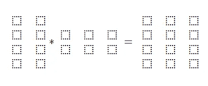

图 32:矩阵值表示。

**c.** 之后，我们有了隐藏层的输入，它将通过应用 sigmoid 函数来计算输出。下面是隐藏层的输出:


图 33:隐藏层的输出。

**d.** 接下来，我们将隐藏层的输出乘以输出层的权重:

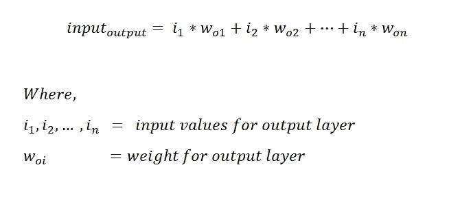

图 34:表示隐藏层输出的公式，带有输出层的权重。

第一个矩阵显示了隐藏层的输出，其大小为(4*3)。第二矩阵表示输出层的权重值，

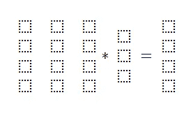

图 35:隐藏层的表示，以及我们的输出层。

之后，我们通过应用 sigmoid 函数来计算输出层的输出。也可以用如下矩阵形式表示。

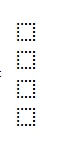

图 36:sigmoid 函数后我们层的输出。

**f.** 现在我们有了预测输出，我们找到了目标输出和预测输出之间的均方差。


图 37:找出我们的目标输出和我们的预测输出之间的平均值。

接下来，我们开始第一阶段的训练。在这一步中，我们将更新输出图层的权重值。我们需要找出输出权重对误差值的影响程度。为了更新权重，我们使用梯度下降算法。请注意，我们已经找到了将在培训阶段使用的导数。


图 38:更新我们输出层的权重值。

**g.a.** 一阶导数的矩阵表示。矩阵大小(4*1)。

`derror_douto = output_op -target_output`

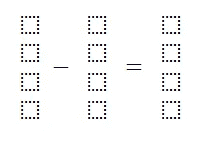

图 39:一阶导数矩阵表示。

**g.b.** 二阶导数的矩阵表示。矩阵大小(4*1)。

`dout_dino = sigmoid_der(input_op)`

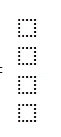

图 40:二阶导数矩阵表示。

**g.c.** 三阶导数的矩阵表示。矩阵大小(4*3)。

`dino_dwo = output_hidden`

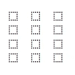

图 41:三阶导数矩阵表示。

**g.d.** 矩阵表示`dino_dwo`的转置。矩阵大小(3*4)。

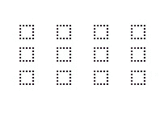

图 42:我们的变量 dino_dwo 的矩阵表示，细节见实现。

**g.e.** 现在，我们要找到输出权重的最终矩阵。关于这一步的详细解释，请查阅 [**我们之前的教程**](https://medium.com/towards-artificial-intelligence/building-neural-networks-from-scratch-with-python-code-and-math-in-detail-i-536fae5d7bbf#24ec) 。矩阵大小为(3*1)，与`output_weight`矩阵相同。

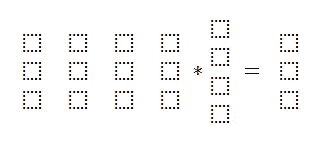

图 43:输出权重的最终矩阵。

因此，我们成功地找到了导数值。接下来，我们借助梯度下降算法相应地更新权重值。

尽管如此，我们还必须找到阶段 2 的导数。让我们首先找到它，然后我们将在最后更新两层的权重。

第二阶段。更新隐藏层中的权重。

因为我们已经讨论了我们是如何导出导数值的，我们将会看到每个导数值的矩阵表示，以便更好地理解它。我们的目标是找到隐藏层的权重矩阵，大小为(2*3)。

**h.a.** 一阶导数的矩阵表示。

`derror_dino = derror_douto * douto_dino`

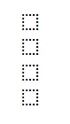

图 44:一阶导数的矩阵表示。

**h.b.** 二阶导数的矩阵表示。

`dino_douth = weight_output`

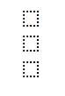

图 45:二阶导数的矩阵表示。

**h.c.** 三阶导数的矩阵表示。

`derror_douth = np.dot(derror_dino , dino_douth.T)`

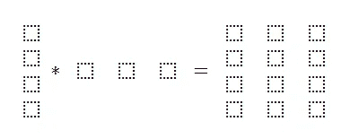

图 46:三阶导数的矩阵表示。

**h.d.** 四阶导数的矩阵表示。

`douth_dinh = sigmoid_der(input_hidden)`

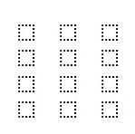

图 47:四阶导数的矩阵表示。

**h.e.** 五阶导数的矩阵表示。

`dinh_dwh = input_features`

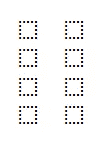

图 48:五阶导数的矩阵表示。

**h.f.** 六阶导数的矩阵表示。

`derror_dwh = np.dot(dinh_dwh.T, douth_dinh * derror_douth)`

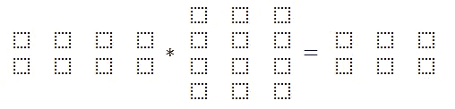

图 49:六阶导数的矩阵表示。

请注意，我们的目标是找到一个大小为(2*3)的隐藏权重矩阵。此外，我们成功地找到了它。

**h.g.** 更新重量值:

我们将使用梯度下降算法来更新这些值。它需要三个参数。

1.  原重量:我们已经有了。
2.  学习率(LR):我们将其赋值为 0.05。
3.  导数:在上一步中找到。

**梯度下降算法:**


图 50:梯度下降算法的公式

因为我们已经有了所有的参数值，所以这将是一个简单的操作。首先，我们更新输出层的权重值，然后更新隐藏层的权重值。

**一、最终重量值:**

下面，我们显示了两个图层的更新权重值-我们的预测基于这些值。

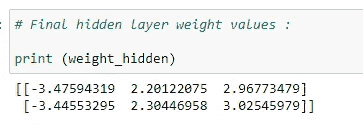

图 51:显示最终的隐藏层权重值。

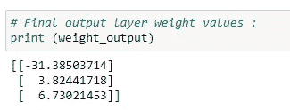

图 52:显示最终的输出层权重值。

**j .做预测:**

**j.a.** 预测为(1，1)。

目标产量= 1

解释:

首先，我们将获取想要预测输出的输入值。“结果 1”变量存储输入变量和隐藏层权重的点积值。我们通过应用 sigmoid 函数获得输出，结果存储在`result2`变量中。这就是输出图层的输入要素。我们通过将输入要素乘以输出图层权重来计算输出图层的输入。为了找到最终的输出值，我们取它的 sigmoid 值。

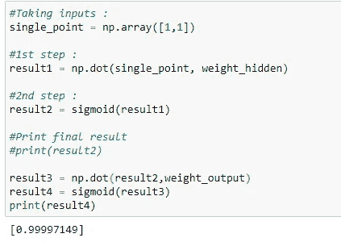

图 53:打印目标输出= 1 的结果。

请注意，预测的输出非常接近 1。所以我们成功地做出了准确的预测。

**j.b.** 预测为(0，0)。

目标输出= 0

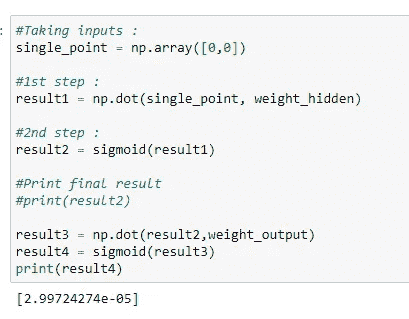

图 54:打印目标输出= 0 的结果。

请注意，预测的输出非常接近 0，这表明我们的模型的成功率。

**k .最终误差值:**

经过 200，000 次迭代后，我们得到了最终的误差值——误差越低，模型的精度越高。

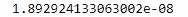

图 55:显示 200，000 次迭代后的最终误差值。

如上图，我们可以看到误差值是 0.0000000189。该值是经过 200，000 次迭代后预测的最终误差值。

## 将所有这些放在一起:

```
# Import required libraries :
import numpy as np# Define input features :
input_features = np.array([[0,0],[0,1],[1,0],[1,1]])
print (input_features.shape)
print (input_features)# Define target output :
target_output = np.array([[0,1,1,1]])# Reshaping our target output into vector :
target_output = target_output.reshape(4,1)
print(target_output.shape)
print (target_output)# Define weights :
# 6 for hidden layer
# 3 for output layer
# 9 totalweight_hidden = np.array([[0.1,0.2,0.3],
 [0.4,0.5,0.6]])
weight_output = np.array([[0.7],[0.8],[0.9]])# Learning Rate :
lr = 0.05# Sigmoid function :
def sigmoid(x):
 return 1/(1+np.exp(-x))# Derivative of sigmoid function :
def sigmoid_der(x):
 return sigmoid(x)*(1-sigmoid(x))for epoch in range(200000):
 # Input for hidden layer :
 input_hidden = np.dot(input_features, weight_hidden)

 # Output from hidden layer :
 output_hidden = sigmoid(input_hidden)

 # Input for output layer :
 input_op = np.dot(output_hidden, weight_output)

 # Output from output layer :
 output_op = sigmoid(input_op)#==========================================================
 # Phase1

 # Calculating Mean Squared Error :
 error_out = ((1 / 2) * (np.power((output_op — target_output), 2)))
 print(error_out.sum())

 # Derivatives for phase 1 :
 derror_douto = output_op — target_output
 douto_dino = sigmoid_der(input_op) 
 dino_dwo = output_hiddenderror_dwo = np.dot(dino_dwo.T, derror_douto * douto_dino)#===========================================================
 # Phase 2 
 # derror_w1 = derror_douth * douth_dinh * dinh_dw1
 # derror_douth = derror_dino * dino_outh

 # Derivatives for phase 2 :
 derror_dino = derror_douto * douto_dino
 dino_douth = weight_output
 derror_douth = np.dot(derror_dino , dino_douth.T)
 douth_dinh = sigmoid_der(input_hidden) 
 dinh_dwh = input_features
 derror_wh = np.dot(dinh_dwh.T, douth_dinh * derror_douth)# Update Weights
 weight_hidden -= lr * derror_wh
 weight_output -= lr * derror_dwo

# Final hidden layer weight values :
print (weight_hidden)# Final output layer weight values :
print (weight_output)# Predictions :#Taking inputs :
single_point = np.array([1,1])
#1st step :
result1 = np.dot(single_point, weight_hidden) 
#2nd step :
result2 = sigmoid(result1)
#3rd step :
result3 = np.dot(result2,weight_output)
#4th step :
result4 = sigmoid(result3)
print(result4)#=================================================
#Taking inputs :
single_point = np.array([0,0])
#1st step :
result1 = np.dot(single_point, weight_hidden) 
#2nd step :
result2 = sigmoid(result1)
#3rd step :
result3 = np.dot(result2,weight_output)
#4th step :
result4 = sigmoid(result3)
print(result4)#=====================================================
#Taking inputs :
single_point = np.array([1,0])
#1st step :
result1 = np.dot(single_point, weight_hidden) 
#2nd step :
result2 = sigmoid(result1)
#3rd step :
result3 = np.dot(result2,weight_output)
#4th step :
result4 = sigmoid(result3)
print(result4)
```

下面，请注意，我们在本例中使用的数据是线性可分的，这意味着通过一条线，我们可以对值为 1 的输出和值为 0 的输出进行分类。

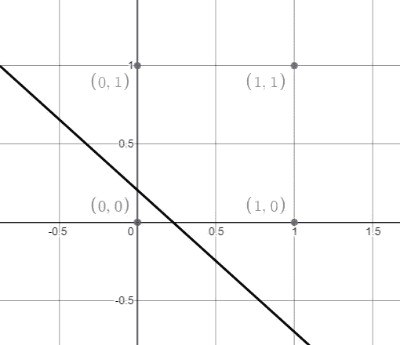

图 56:图表显示数据是线性可分的，允许用 1 值或 0 值对输出进行分类。

**在 Google Colab 上推出:**

[](https://colab.research.google.com/drive/1Q4hIQRkabKxZXQPgNaQzYYJocSPlSE-B?usp=sharing) [## 谷歌联合实验室

### 用 Python II 构建神经网络—https://towardsai.net/building-neural-nets-with-python

colab.research.google.com](https://colab.research.google.com/drive/1Q4hIQRkabKxZXQPgNaQzYYJocSPlSE-B?usp=sharing) 

# 5.与单层神经网络的比较

注意，我们在这里没有使用偏差值。现在让我们快速地看一下对于相同的输入特征和目标值没有隐藏层的神经网络。我们要做的是找出最终的错误率，并进行比较。由于我们在 [**之前的教程**](https://medium.com/towards-artificial-intelligence/building-neural-networks-from-scratch-with-python-code-and-math-in-detail-i-536fae5d7bbf#0ea5) 中已经实现了代码，为此，我们打算快速分析一下。[ [2](https://towardsai.net/neural-networks-with-python)

以下代码的最终错误值是:

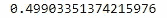

图 57:显示最终误差值。

正如我们可以看到的，与我们在使用隐藏层的神经网络实现中发现的错误相比，错误值太高了，这是在神经网络中使用隐藏层的主要原因之一。

```
# Import required libraries :
import numpy as np# Define input features :
input_features = np.array([[0,0],[0,1],[1,0],[1,1]])
print (input_features.shape)
print (input_features)# Define target output :
target_output = np.array([[0,1,1,1]])# Reshaping our target output into vector :
target_output = target_output.reshape(4,1)
print(target_output.shape)
print (target_output)# Define weights :
weights = np.array([[0.1],[0.2]])
print(weights.shape)
print (weights)# Define learning rate :
lr = 0.05# Sigmoid function :
def sigmoid(x):
    return 1/(1+np.exp(-x))# Derivative of sigmoid function :
def sigmoid_der(x):
    return sigmoid(x)*(1-sigmoid(x))# Main logic for neural network :
# Running our code 10000 times :for epoch in range(10000):
    inputs = input_features#Feedforward input :
    pred_in = np.dot(inputs, weights)#Feedforward output :
    pred_out = sigmoid(pred_in)#Backpropogation 
    #Calculating error
    error = pred_out - target_output
    x = error.sum()

    #Going with the formula :
    print(x)

    #Calculating derivative :
    dcost_dpred = error
    dpred_dz = sigmoid_der(pred_out)

    #Multiplying individual derivatives :
    z_delta = dcost_dpred * dpred_dz#Multiplying with the 3rd individual derivative :
    inputs = input_features.T
    weights -= lr * np.dot(inputs, z_delta)#Predictions :#Taking inputs :
single_point = np.array([1,0])
#1st step :
result1 = np.dot(single_point, weights) 
#2nd step :
result2 = sigmoid(result1)
#Print final result
print(result2)#====================================
#Taking inputs :
single_point = np.array([0,0])
#1st step :
result1 = np.dot(single_point, weights) 
#2nd step :
result2 = sigmoid(result1)
#Print final result
print(result2)#===================================
#Taking inputs :
single_point = np.array([1,1])
#1st step :
result1 = np.dot(single_point, weights) 
#2nd step :
result2 = sigmoid(result1)
#Print final result
print(result2)
```

**在 Google Colab 上发布:**

[](https://colab.research.google.com/drive/1Q4hIQRkabKxZXQPgNaQzYYJocSPlSE-B#scrollTo=dLelqmJaXNIw&line=59&uniqifier=1) [## 谷歌联合实验室

### 用 Python II 构建神经网络—https://towardsai.net/building-neural-nets-with-python

colab.research.google.com](https://colab.research.google.com/drive/1Q4hIQRkabKxZXQPgNaQzYYJocSPlSE-B#scrollTo=dLelqmJaXNIw&line=59&uniqifier=1) 

# 6.具有神经网络的非线性可分离数据

在这个例子中，我们要取一个不能被一条直线分开的数据集。如果我们试图用一行来分隔它，那么一个或多个输出可能会被错误分类，我们将会有非常高的误差。因此，我们使用隐藏层来解决这个问题。

# 输入表:


图 58:输入特性。

# 数据点的图形表示:

如下所示，我们在坐标平面上表示数据。请注意，我们有两个彩色点(黑色和红色)。如果我们试图画一条线，那么输出将会被错误分类。


图 59:带有输入点的坐标平面。

如图 59 所示，我们有 2 个输入和 1 个输出。在这个例子中，我们将使用 4 个隐藏感知器。红点的输出值为 0，黑点的输出值为 1。因此，我们不能简单地用一条直线对它们进行分类。

# 神经网络:


图 60:一个人工神经网络。

# Python 中的实现:

**答:导入所需的库:**


图 61:用 Python 导入 NumPy。

**b .定义输入特征:**


图 62:定义我们的输入特征。

**c .定义目标输出:**


图 63:定义我们的目标输出。

**d .分配随机权重值:**

在图 64 中，注意我们正在使用 NumPy 的随机库函数来生成随机值。

`numpy.random.rand(x,y)`:这里 x 是行数，y 是列数。它生成[0，1]范围内的输出值。这意味着包含 0，但 1 不包含在值生成中。


图 64:用 NumPy 的库 np.random.rand 生成随机值

**乙状结肠功能:**


图 65:定义我们的 sigmoid 函数

**f .用 sigmoid 函数求导数:**


图 66:寻找 sigmoid 函数的导数

**g .训练我们的神经网络:**


图 67:我们神经网络训练的第一阶段


图 68:我们神经网络训练的第二阶段

**h .隐藏层的权值:**


图 69:显示隐藏层中权重的最终值。

**一、输出层的权重值:**


图 70:显示我们输出层的最终权重值。

**j .最终误差值:**

在对我们的模型进行 200，000 次迭代训练后，我们最终获得了一个低误差值。


图 71:在 200，000 次迭代中训练的模型的低误差值

**k .根据训练好的模型进行预测:**

**又名**预测(0.5，2)的输出。


图 72:预测(0.5，2)的结果。

预测输出更接近于 1。

**k.b.** 预测(0，-1)的输出


图 73:预测(0，-1)的结果

预测的输出非常接近于 0。

**k.c.** 预测输出为(0，5)


图 74:预测(0，5)的结果。

预测产量接近 1。

**k.d.** 预测输出为(1，1.2)


图 75:预测(1，1.2)的结果。

预测产量接近 0。

基于输出值，我们的模型已经完成了预测值的高级工作。

我们可以按照图 76 所示的方式分离数据。请注意，这不是分离这些值的唯一可能的方法。


图 76:分离我们价值观的可能方式。

因此，总而言之，在我们的神经网络上使用隐藏层有助于我们在拥有非线性可分离数据时降低错误率。即使训练时间延长了，我们必须记住我们的目标是做出高精度的预测，这样就可以满足了。

## 将所有这些放在一起:

```
# Import required libraries :
import numpy as np# Define input features :
input_features = np.array([[0,0],[0,1],[1,0],[1,1]])
print (input_features.shape)
print (input_features)# Define target output :
target_output = np.array([[0,1,1,0]])# Reshaping our target output into vector :
target_output = target_output.reshape(4,1)
print(target_output.shape)
print (target_output)# Define weights :
# 8 for hidden layer
# 4 for output layer
# 12 total 
weight_hidden = np.random.rand(2,4)
weight_output = np.random.rand(4,1)# Learning Rate :
lr = 0.05# Sigmoid function :
def sigmoid(x):
 return 1/(1+np.exp(-x))# Derivative of sigmoid function :
def sigmoid_der(x):
 return sigmoid(x)*(1-sigmoid(x))# Main logic :
for epoch in range(200000):
 # Input for hidden layer :
 input_hidden = np.dot(input_features, weight_hidden)

 # Output from hidden layer :
 output_hidden = sigmoid(input_hidden)

 # Input for output layer :
 input_op = np.dot(output_hidden, weight_output)

 # Output from output layer :
 output_op = sigmoid(input_op)#========================================================================
 # Phase1

 # Calculating Mean Squared Error :
 error_out = ((1 / 2) * (np.power((output_op — target_output), 2)))
 print(error_out.sum())

 # Derivatives for phase 1 :
 derror_douto = output_op — target_output
 douto_dino = sigmoid_der(input_op) 
 dino_dwo = output_hiddenderror_dwo = np.dot(dino_dwo.T, derror_douto * douto_dino)# ========================================================================
 # Phase 2# derror_w1 = derror_douth * douth_dinh * dinh_dw1
 # derror_douth = derror_dino * dino_outh

 # Derivatives for phase 2 :
 derror_dino = derror_douto * douto_dino
 dino_douth = weight_output
 derror_douth = np.dot(derror_dino , dino_douth.T)
 douth_dinh = sigmoid_der(input_hidden) 
 dinh_dwh = input_features
 derror_dwh = np.dot(dinh_dwh.T, douth_dinh * derror_douth)# Update Weights
 weight_hidden -= lr * derror_dwh
 weight_output -= lr * derror_dwo

# Final values of weight in hidden layer :
print (weight_hidden)# Final values of weight in output layer :
print (weight_output)#Taking inputs :
single_point = np.array([0,-1])
#1st step :
result1 = np.dot(single_point, weight_hidden) 
#2nd step :
result2 = sigmoid(result1)
#3rd step :
result3 = np.dot(result2,weight_output)
#4th step :
result4 = sigmoid(result3)
print(result4)#Taking inputs :
single_point = np.array([0,5])
#1st step :
result1 = np.dot(single_point, weight_hidden) 
#2nd step :
result2 = sigmoid(result1)
#3rd step :
result3 = np.dot(result2,weight_output)
#4th step :
result4 = sigmoid(result3)
print(result4)#Taking inputs :
single_point = np.array([1,1.2])
#1st step :
result1 = np.dot(single_point, weight_hidden) 
#2nd step :
result2 = sigmoid(result1)
#3rd step :
result3 = np.dot(result2,weight_output)
#4th step :
result4 = sigmoid(result3)
print(result4)
```

**在 Google Colab 上发布:**

[](https://colab.research.google.com/drive/1Q4hIQRkabKxZXQPgNaQzYYJocSPlSE-B#scrollTo=nmFrl4yudnrB&line=49&uniqifier=1) [## 谷歌联合实验室

### 用 Python II 构建神经网络—https://towardsai.net/building-neural-nets-with-python

colab.research.google.com](https://colab.research.google.com/drive/1Q4hIQRkabKxZXQPgNaQzYYJocSPlSE-B#scrollTo=nmFrl4yudnrB&line=49&uniqifier=1) 

# 7.结论

*   神经网络可以从错误中学习，它们可以产生不限于提供给它们的输入的输出。
*   输入存储在其网络中，而不是数据库中。
*   这些网络可以从例子中学习，我们可以预测类似事件的结果。
*   在一个神经元失效的情况下，网络可以检测到故障并且仍然产生输出。
*   神经网络可以并行执行多项任务。

[](https://www.buymeacoffee.com/pratu)

给普拉蒂克买杯咖啡！

**免责声明:**本文表达的观点仅代表作者个人观点，不代表卡内基梅隆大学的观点，也不代表与作者有直接或间接关联的其他公司的观点。这些文章并不打算成为最终产品，而是当前思想的反映，同时也是讨论和改进的催化剂。

通过[向 AI](https://towardsai.net/) 发布

# 推荐文章

一、[机器学习和数据科学最佳数据集](https://towardsai.net/p/machine-learning/best-datasets-for-machine-learning-and-data-science-d80e9f030279)
二。[艾薪资冲天](http://towardsai.net/ai-salaries)三世
。[什么是机器学习？](https://towardsai.net/p/machine-learning/what-is-machine-learning-ml-b58162f97ec7)
四世。[2020 年最佳机器学习硕士项目](https://towardsai.net/ml-masters)
五、[2020 年最佳机器学习博士项目](https://towardsai.net/ml-phd)
六、[最佳机器学习博客](https://towardsai.net/p/machine-learning/best-machine-learning-blogs-6730ea2df3bd)
七。[关键机器学习定义](https://towardsai.net/p/machine-learning/key-machine-learning-ml-definitions-43e837ec6add)
八。[用机器学习在 0.05 秒内破解验证码](https://towardsai.net/ml-captcha)
九。[机器学习 vs. AI 及其重要区别](https://towardsai.net/p/machine-learning/machine-learning-vs-ai-important-differences-between-them/robiriondo/3432/)
十.[确保成功开创机器学习事业(ML)](https://towardsai.net/p/machine-learning/moocs-vs-academia-ensuring-success-starting-in-a-machine-learning-ml-career-304b2e42315e)
XI。[机器学习算法初学者](https://towardsai.net/p/machine-learning/machine-learning-algorithms-for-beginners-with-python-code-examples-ml-19c6afd60daa)
十二。[神经网络从零开始详细用 Python 代码和数学](https://towardsai.net/neural-networks-with-python)
XIII。[用 Python 构建神经网络](https://towardsai.net/p/machine-learning/building-neural-networks-with-python-code-and-math-in-detail-ii-bbe8accbf3d1)
XIV。[神经网络的主要类型](https://towardsai.net/p/machine-learning/main-types-of-neural-networks-and-its-applications-tutorial-734480d7ec8e)
十五。[用 Python 编写的蒙特卡洛模拟教程](https://towardsai.net/p/machine-learning/monte-carlo-simulation-an-in-depth-tutorial-with-python-bcf6eb7856c8)
XVI。[Python 自然语言处理教程](https://towardsai.net/p/nlp/natural-language-processing-nlp-with-python-tutorial-for-beginners-1f54e610a1a0)

# 引用

对于学术背景下的归属，请引用该工作为:

```
Shukla, et al., “Building Neural Networks with Python Code and Math in Detail — II”, Towards AI, 2020
```

# BibTex 引文:

```
@article{pratik_iriondo_2020, 
 title={Building Neural Networks with Python Code and Math in Detail — II}, 
 url={[https://towardsai.net/building-neural-nets-with-python](https://towardsai.net/building-neural-nets-with-python)}, 
 journal={Towards AI}, 
 publisher={Towards AI Co.}, 
 author={Pratik, Shukla and Iriondo, Roberto},  
 year={2020}, 
 month={Jun}
}
```

> 📚你是机器学习新手吗？查看[机器学习算法](https://towardsai.net/machine-learning-algorithms)的概述，为初学者提供 Python 代码示例📚

## 参考资料:

[1]统计堆栈交换，【https://stats.stackexchange.com 

[2]神经网络从无到有详细的 Python 代码和数学——我，普拉蒂克·舒克拉，罗伯特·伊里翁多，【https://towardsai.net/neural-networks-with-python 