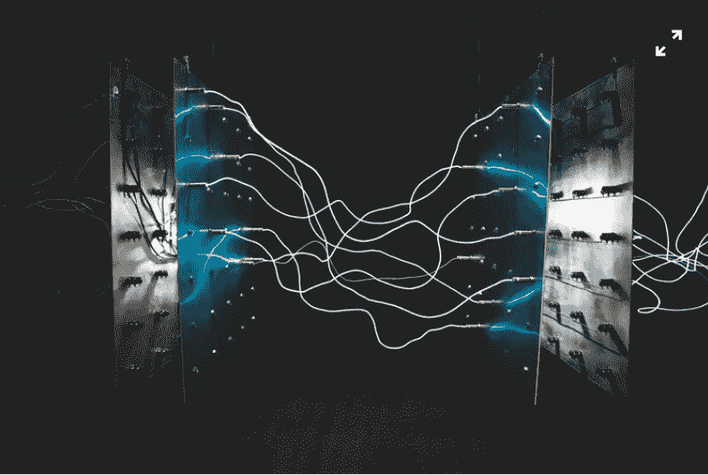
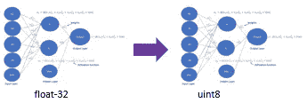
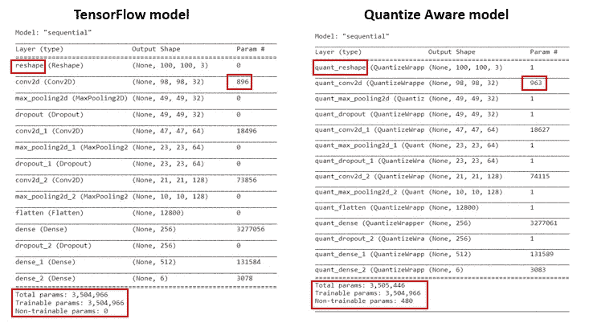
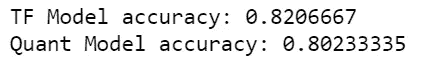
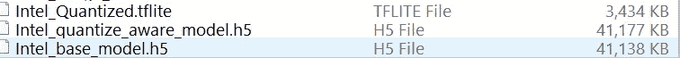
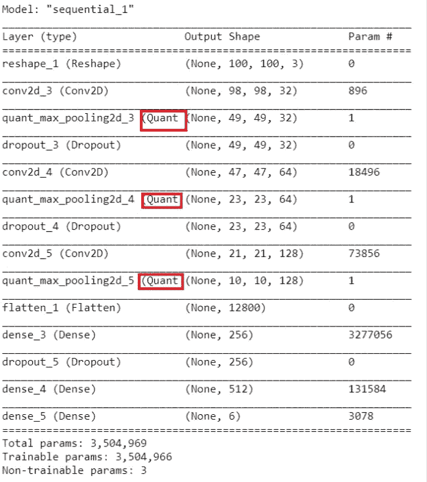

# 构建量化感知训练的深度学习模型

> 原文：<https://pub.towardsai.net/building-quantize-aware-trained-deep-learning-model-e056c44d9a52?source=collection_archive---------1----------------------->

## [深度学习](https://towardsai.net/p/category/machine-learning/deep-learning)

## 了解什么是量化，不同类型的量化，以及如何使用 Quantize Aware 培训构建 TFLite 模型。

***在这篇文章中，你将学习什么是量化，我们为什么需要量化，不同类型的量化，然后在 Tensorflow 中构建一个量化的感知训练深度学习模型。***



照片由[以色列宫](https://unsplash.com/@othentikisra?utm_source=unsplash&utm_medium=referral&utm_content=creditCopyText)在 [Unsplash](https://unsplash.com/s/photos/electronic?utm_source=unsplash&utm_medium=referral&utm_content=creditCopyText) 上拍摄

## 什么是量子化？

量化是将深度学习模型参数:权重、激活和偏差从较高的浮点精度转换为较低的位表示的过程。



从 float32 到 uint8 的量化权重、偏差和激活

## 为什么我们需要量子化？

> 量化有助于模型压缩和减少延迟。

模型大小可以压缩 4 倍。如果你的 TF core 深度学习模型大小是 40MB，可以减到 10MB *。*模型尺寸的减小使得模型重量更轻，这减少了计算量并需要更少的内存，从而减少了延迟。

量化模型

*   **占用更少的空间**
*   在带宽较低的网络上有更快的下载时间
*   模型占用**更少的内存，以获得**更快的推理****
*   **降低功耗**

> 量化模型减小了尺寸并改善了延迟，但是在精确度上有一点折衷

## 有哪些不同类型的量化？

目前可以对深度学习模型应用两种类型的量化。

*   **量化感知训练** : **量化感知训练应用于预训练模型，产生量化感知模型**。量化感知训练确保前向传递匹配训练和推理时间的精度。您可以为整个模型或仅部分模型生成量化感知。
*   **训练后量化:使用 TensorFlow Lite 格式**对已经训练好的 TensorFlow 模型进行量化。您可以应用**训练后动态范围量化、浮点 16 量化或全整数量化**。在训练后量化中，**权重在训练后被量化，**和**激活在推理时被动态量化。**

## 我们如何建立量化感知模型？

简而言之，我们将遵循这些步骤来构建一个量化感知训练模型。

1.  **创建深度学习模型**
2.  **训练模型**
3.  **保存深度学习模型**
4.  **为预训练模型创建量化感知模型**
5.  **将量化应用于量化感知模型**
6.  **将量化模型转换为 Tflite**
7.  **从量子化的 TfLite 模型中进行推论**

数据集是来自 Kaggle 的[英特尔图像分类](https://www.kaggle.com/puneet6060/intel-image-classification/version/2)

数据集有六类:**建筑、森林、冰川、山脉、海洋和街道**

## 创建深度学习模型

```
# setting the train, test and val directories
**train_dir = r'c:\data\Intel_Images\seg_train\seg_train'
test_dir = r'c:\data\Intel_Images\seg_pred'
val_dir = r'c:\data\Intel_Images\seg_test\seg_test'**#setting basic parameters to the mdeol
**IMG_WIDTH=100
IMG_HEIGHT=100
IMG_DIM = (IMG_HEIGHT, IMG_WIDTH)
input_shape = (IMG_HEIGHT, IMG_WIDTH ,3)
batch_size = 16
epochs = 25**# creating Image Data generator **image_gen_train = ImageDataGenerator(rescale=1./255,                                     zoom_range=0.3, rotation_range=25,                         shear_range=0.1,featurewise_std_normalization=False)**#Creating train data generator
**train_data_gen = image_gen_train.flow_from_directory(batch_size=batch_size,
directory=train_dir,shuffle=True,target_size=IMG_DIM,class_mode='sparse')**#Creating validation data generator
**image_gen_val = ImageDataGenerator(rescale=1./255)
val_data_gen = image_gen_val.flow_from_directory(batch_size=batch_size,  directory=val_dir,target_size=IMG_DIM,                                              class_mode='sparse')**# Define the model architecture.
**model = keras.Sequential([
  keras.layers.InputLayer(input_shape=(IMG_HEIGHT, IMG_WIDTH ,3)),
  keras.layers.Reshape(target_shape=(IMG_HEIGHT, IMG_WIDTH ,3)),
  keras.layers.Conv2D(filters=32, kernel_size=(3, 3), activation='relu'),
  keras.layers.MaxPooling2D(pool_size=(2, 2)),
  keras.layers.Dropout(0.3),
  keras.layers.Conv2D(filters=64, kernel_size=(3, 3), activation='relu'),
  keras.layers.MaxPooling2D(pool_size=(2, 2)),
  keras.layers.Dropout(0.3),
  keras.layers.Conv2D(filters=128, kernel_size=(3, 3), activation='relu'),
  keras.layers.MaxPooling2D(pool_size=(2, 2)),
  keras.layers.Flatten(),
  keras.layers.Dense(256, activation='relu'),
  keras.layers.Dropout(0.4),
  keras.layers.Dense(512, activation='relu'),
  keras.layers.Dense(6, activation='softmax')
])**
```

## 训练模型

一旦深度学习模型被创建，我们就编译它并在 100 个时期上训练模型。

```
#Compiling the model
**optimizer = optimizers.Adam(lr=0.0005)
model.compile(optimizer=optimizer,
              loss='sparse_categorical_crossentropy',
              metrics=['accuracy'])**# Training the model
**history = model.fit_generator(
    train_data_gen,
    steps_per_epoch=len(train_data_gen)/batch_size,
    epochs=100,
    validation_data=val_data_gen,
    validation_steps=len(val_data_gen)/batch_size
)**
```

## 拯救深度学习模型

将训练好的模型保存到 H5 文件。

```
**model.save('Intel_base_model.h5')**
```

## 为预训练模型创建量化感知模型

要创建 QAT 模型，请确保您已经安装了***tensor flow-model-optimization***库，如下所示。

`**pip install -q tensorflow-model-optimization**`

在下面的代码中，你会得到一个 8 位的量化，整个模型都会被量化。

```
**import tensorflow_model_optimization as tfmot****quantize_model = tfmot.quantization.keras.quantize_model**# q_aware stands for for quantization aware.
**q_aware_model = quantize_model(model)****optimizer = optimizers.Adam(lr=0.0001)**# `quantize_model` requires a recompile.
**q_aware_model.compile(optimizer=optimizer,              loss=tf.keras.losses.SparseCategoricalCrossentropy(from_logits=True),metrics=['accuracy'])****q_aware_model.summary()**
```

上面的模型是量子化感知的，但还没有量子化。

下图显示了张量流模型和量化感知模型之间的差异



张量流和量化感知张量流模型的区别

## 将量化应用到量化感知模型

```
**history = q_aware_model.fit_generator(
 train_data_gen,
 steps_per_epoch=len(train_data_gen)/batch_size,
 callbacks=[cp_callback],
 epochs=100,
 validation_data=val_data_gen,
 validation_steps=len(val_data_gen)/batch_size
)**
```

比较张量流基本模型和量化感知模型的精度，

```
**_, model_accuracy = model.evaluate_generator(val_data_gen)
_, qat_model_accuracy = q_aware_model.evaluate_generator(val_data_gen)
print('TF Model accuracy:', model_accuracy)
print('Quant Model accuracy:', qat_model_accuracy)**
```



你会看到量子化感知模型的精确度略有下降。

**保存量化感知模型**

```
**q_aware_model.save('Intel_quantize_aware_model.h5')**
```

## 将量化模型转换为 Tflite

**这一步将创建一个量化模型。量化的模型将具有 int8 权重，并且激活将是 uint8。**

```
**converter = tf.lite.TFLiteConverter.from_keras_model(q_aware_model)
converter.optimizations = [tf.lite.Optimize.DEFAULT]****quantized_tflite_model = converter.convert()****with open('Intel_QAT.tflite', 'wb') as f:
  f.write(quantized_tflite_model)**
```

您可以看到 TFlite 量化模型、量化感知模型和基本张量流模型之间的大小差异。



## 从量化的 TFLite 模型进行推断。

```
**class_names = list(train_data_gen.class_indices.keys())**
#Create the interpreter for the TfLite model
**interpreter = tf.lite.Interpreter(model_content=quantized_tflite_model)
interpreter.allocate_tensors()**#Create input and output tensors from the interpreter
**input_index = interpreter.get_input_details()[0]["index"]
output_index = interpreter.get_output_details()[0]["index"]**# Create the image data for prediction
**dataset_list = tf.data.Dataset.list_files(test_dir + '\\*')
for i in range(10):
    image = next(iter(dataset_list))
    image = tf.io.read_file(image)
    image = tf.io.decode_jpeg(image, channels=3)
    image = tf.image.resize(image, (100,100))
    image = tf.cast(image / 255., tf.float32)
    image = tf.expand_dims(image, 0)** #Set the tensor for image into input index **interpreter.set_tensor(input_index, image)**

    # Run inference.
   ** interpreter.invoke()**# find the prediction with highest probability.
    **output = interpreter.tensor(output_index)
    pred = np.argmax(output()[0])

    print(class_names[pred])**
```

***我可以只量化一个深度学习模型的几层吗？***

如果你想量化深度学习模型的几层，那么**尝试量化后面的层而不是第一层**，并且总是**避免量化关键层**。

**对深度学习模型的特定层进行量化**

1.  **创建基础模型**
2.  **加载预训练的砝码**
3.  **定义深度学习模型的哪些层需要量化**
4.  **使用*TF . keras . models . clone _ model()*量化具体的深度学习层**
5.  **使用 *quantize_apply()* 创建量化感知模型**

## 创建模型

```
# Define the model architecture.
**base_model = keras.Sequential([
  keras.layers.InputLayer(input_shape=(IMG_HEIGHT, IMG_WIDTH ,3)),
  keras.layers.Reshape(target_shape=(IMG_HEIGHT, IMG_WIDTH ,3)),
  keras.layers.Conv2D(filters=32, kernel_size=(3, 3), activation='relu'),
  keras.layers.MaxPooling2D(pool_size=(2, 2)),
  keras.layers.Dropout(0.3),
  keras.layers.Conv2D(filters=64, kernel_size=(3, 3), activation='relu'),
  keras.layers.MaxPooling2D(pool_size=(2, 2)),
  keras.layers.Dropout(0.3),
  keras.layers.Conv2D(filters=128, kernel_size=(3, 3), activation='relu'),
  keras.layers.MaxPooling2D(pool_size=(2, 2)),
  keras.layers.Flatten(),
  keras.layers.Dense(256, activation='relu'),
  keras.layers.Dropout(0.4),
  keras.layers.Dense(512, activation='relu'),
  keras.layers.Dense(6, activation='softmax')
])**
```

## 加载预先训练的重量

```
**base_model.load_weights('Intel_base.h5')**
```

## 定义要量化的深度学习层

```
# Create Helper function which uses `quantize_annotate_layer` to annotate the layers should be quantized.
**def apply_quantization_to_layer(layer):
  if isinstance(layer, tf.keras.layers.MaxPool2D):
    return tfmot.quantization.keras.quantize_annotate_layer(layer)
  return layer**
```

## 使用 tf.keras.models.clone_model()对特定深度学习层进行量化

```
# Use `tf.keras.models.clone_model` to apply #apply_quantization_to_layer` 
# to the layers of the model.
**annotated_model = tf.keras.models.clone_model(
    base_model,
    clone_function=apply_quantization_to_layer,
)**
```

使用***quantize _ apply()***创建量化感知模型

```
# Now that the layers are annotated,
# `quantize_apply` actually makes the model quantization aware.
**quant_aware_model = tfmot.quantization.keras.quantize_apply(annotated_model)
quant_aware_model.summary()**
```



## 结论:

*   深度学习模型的量化有助于减少模型的大小和延迟，这有助于将它们部署在边缘设备上。
*   量化感知训练模型为整个模型或仅部分模型生成量化感知。
*   将训练后量化应用于已经训练的模型。

## 参考资料:

[](https://www.tensorflow.org/model_optimization/guide/quantization/training_comprehensive_guide) [## 量化感知训练综合指南

### 1/1[= = = = = = = = = = = = = = = = = = = = = = = = = = =]—0s 1 ms/step—损耗:16.1181 —精度:0.0000e+00 警告:张量流:未解析…

www.tensorflow.org](https://www.tensorflow.org/model_optimization/guide/quantization/training_comprehensive_guide) 

[用于有效整数算术推理的神经网络的量化和训练](https://arxiv.org/pdf/1712.05877.pdf)