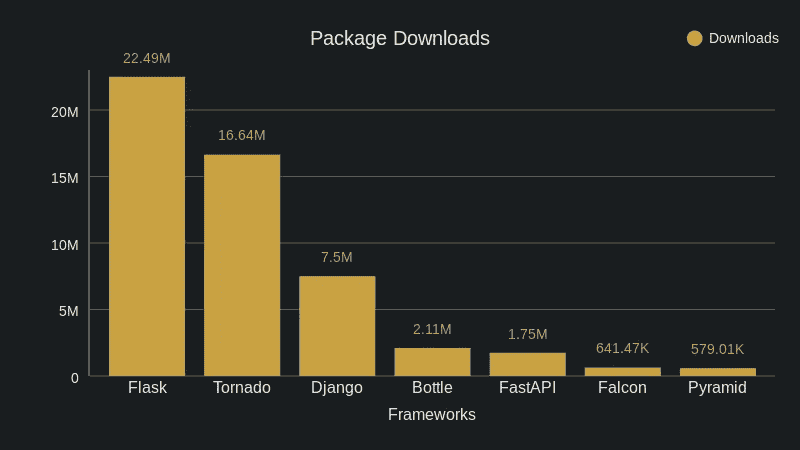
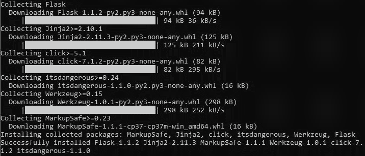
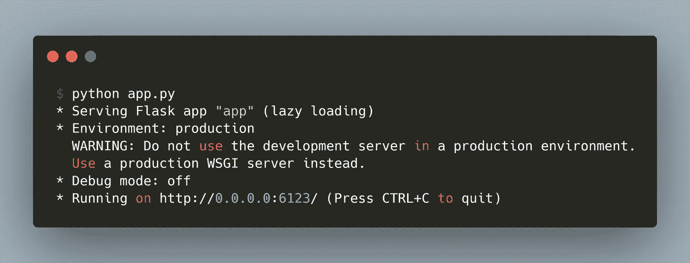

# 使用 Flask 构建 RESTful APIs

> 原文：<https://pub.towardsai.net/building-restful-apis-using-flask-8ba2716d361f?source=collection_archive---------3----------------------->

## [编程](https://towardsai.net/p/category/programming)

## Python 中的轻量级 Web 框架


[烧瓶](https://github.com/pallets/flask/blob/master/artwork/logo-full.svg)框架[框架](https://www.pexels.com/)

***什么是 API？***

> 应用程序编程接口(API)是允许两个应用程序进行通信的软件中介。

***什么是 web 框架，为什么有用？***

web 框架是一种软件框架，创建它是为了支持动态站点、web 服务和 web 应用程序的开发。web 框架是一个代码库，它通过提供构建可靠、可伸缩和可维护的 web 应用程序的基本模式，使 web 开发变得更快更容易。

***烧瓶:简介***

*Flask**是一个轻量级的 WSGI web 应用框架。它旨在快速轻松地开始使用，并能够扩展到复杂的应用程序。它最初是一个简单的包装器，围绕着 *Werkzeug* 和 *Jinja* ，现在已经成为最流行的 Python web 应用程序框架之一。*

**

*上个月的包下载数量。[来源](https://pypistats.org/)。*

****为什么是微框架？****

> *“微型”并不意味着您的整个 web 应用程序必须适合一个 Python 文件(尽管它确实可以)，也不意味着 Flask 缺乏功能。微框架中的“微”意味着 Flask 旨在保持核心简单但可扩展。*

*Flask 提供建议，但不强制任何依赖或项目布局。由开发人员来选择他们想要使用的工具和库。社区提供了许多扩展，使得添加新功能变得容易⁴.*

****为什么要用烧瓶？****

*   *易于设置*
*   *简约主义*
*   *灵活地添加更多功能的扩展*
*   *活跃社区*

*在本文中，我将演示如何设置、构建和运行一个简单的 Flask 应用程序。*

****包安装****

*通常建议在特定于项目的虚拟环境中安装软件包。*

```
*# command prompt
**pip** install Flask*
```

**

*安装烧瓶组件*

****JSON****

*JSON 是一种通用数据格式，具有最少数量的值类型:字符串、数字、布尔值、列表、对象和 null。尽管符号是 JavaScript 的一个子集，但是这些类型在所有通用编程语言中都有表示，这使得 JSON 成为跨越语言鸿沟传输数据的一个很好的选择⁵.*

```
*# JSON Example:
{
"id" : 1,
"name" : "john"
"age" : "25",
"activities" : ["cricket","football"],
"class" : [{"year":"2020","dept":"CSE"}]
}*
```

****打造烧瓶 App****

*我将使用 Flask 构建一个简单的应用程序，它将访问员工数据并返回输入中请求的信息。我们将使用 *JSON* 文件格式发送和接收数据。因为我将给出一个基于数据的演示，所以我也加载了*熊猫*包。*

1.  *导入所需的包*

```
***from** flask **import** Flask, request, jsonify 
**import** pandas as pd*
```

*该项目的目录结构如下*

```
*Demo/
| — emp_info.csv
| — emp_status.csv
| — app.py*
```

*2.创建应用程序实例*

```
*app = Flask(__name__)*
```

*3.使用`.route()`和`POST`、`GET`等公认的方法声明终点。默认情况下，它只监听`GET`方法。让我们为这个 API 启用`POST`方法。*

```
*@app.route(**"/get_emp_info"**, methods = [**'POST'**])*
```

*4.定义应用程序将执行的功能。基于输入数据从 CSV 文件中检索员工数据。*

```
*@app.route(**"/get_emp_info"**, methods = [**'POST'**])
**def** get_employee_record():
    input_data = json.loads(request.get_json())
    ids = input_data[**'**emp_ids**'**]
    status = input_data[**'**status**'**]
    emp_info = pd.read_csv(**'**emp_info.csv**'**)
    emp_status = pd.read_csv(**'**emp_status.csv**'**)
    emp_status = emp_status[(emp_status[**'**emp_no**'**].isin(ids)) &     (emp_status[**'**status**'**].isin(status))]
    emp_info = emp_info[emp_info[**'**emp_no**'**].isin(emp_status[**'**emp_no**'**])]
    emp_info = pd.merge(emp_info,emp_status,on=**'**emp_no**'**,how=**'**left**'**)
    out_data = emp_info.to_dict(orient=**'**records**'**)
    **return** jsonify(out_data)*
```

****jsonify****()*是 Flask 提供的一个 helper 方法，用来正确返回 *JSON* 数据。它返回一个设置了 application/json mimetype 的响应对象。*

*5.将 Python 应用程序设置为在本地开发服务器上运行。默认情况下，调试模式为*假*。为了在修改代码时重启服务，可以将调试模式设置为*真。**

```
***#** Setting port number and host i.e., localhost by default **if __name__** == **"__main__"**:
    app.run(**host**=**'**0.0.0.0**'**, **port**=6123)*
```

*Python Flask 应用程序*

*6.在本地服务器上运行 Python 程序*

```
*# command prompt
**python** app.py*
```

**

*运行 Python 应用程序*

****测试应用****

*使用*请求*包向开发的应用程序发送`POST`请求。*

```
*# command prompt - installing requests package
$ **pip** install requests# Python code to test **import** requests, json
# sample request
data = {"emp_ids":["1001","1002","1003"],"status":["active"]}
# Hitting the API with a POST request
ot = requests.post(url=**'http://localhost:6123/get_emp_info'**, json=json.dumps(data))
print(ot.json())# Response JSON 
[{
 'cmp': 'ABC',
 'emp_no': 1001,
 'name': 'Ben',
 'salary': 100000,
 'status': 'active'
}, {
 'cmp': 'MNC',
 'emp_no': 1002,
 'name': 'Jon',
 'salary': 200000,
 'status': 'active'
}]*
```

****汇总****

*我们在本文中涉及的概念:*

*   *API 和 Web 框架*
*   *烧瓶介绍*
*   *设置烧瓶环境*
*   *构建烧瓶 API*
*   *使用*请求*包测试带有请求的 Flask API*

*Flask 就像构建 RESTful APIs 的极简主义方法。*

> *总是简单产生奇妙。—阿米莉亚·巴尔*

****包装完毕****

*感谢所有走到这一步的人。我希望这篇文章对你有所帮助。请在评论中分享您的反馈/疑问。现在，是时候让您从头开始构建自己的 API 了。祝你好运！*

**如果你觉得这篇文章很有趣，并且对数据科学、数据工程或软件工程充满热情，点击* [*关注*](https://medium.com/@mahadeveaswar) *并随时在*[*LinkedIn*](https://www.linkedin.com/in/mahadeveaswar/)*上添加我。**

```
*REFERENCES:
1\. [https://www.goodfirms.co/glossary/web-framework/](https://www.goodfirms.co/glossary/web-framework/)
2\. [https://pypistats.org/](https://pypistats.org/)
3\. [https://flask.palletsprojects.com/](https://flask.palletsprojects.com/)
4\. [https://github.com/pallets/flask](https://github.com/pallets/flask)
5\. [https://www.infoworld.com/article/3222851/what-is-json-a-better-format-for-data-exchange.html](https://www.infoworld.com/article/3222851/what-is-json-a-better-format-for-data-exchange.html)*
```