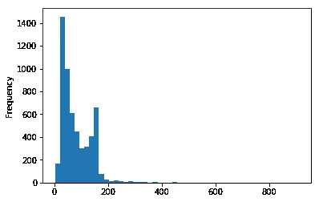
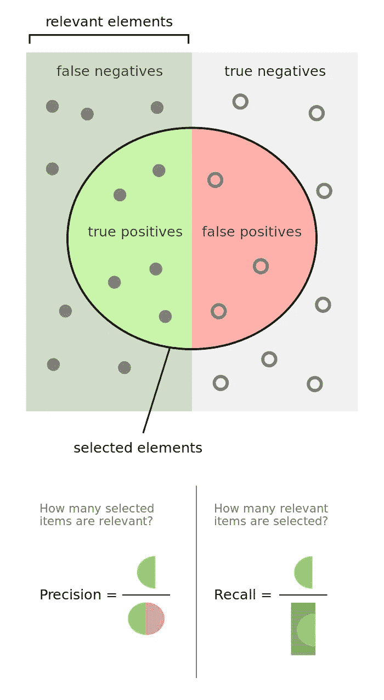

# 使用 Python 的 NTLK 包构建垃圾邮件检测器

> 原文：<https://pub.towardsai.net/building-spam-detector-using-pythons-ntlk-package-b118bbf2ed8e?source=collection_archive---------2----------------------->


## NTLK —自然语言工具包

在这一部分中，我们将从头到尾演示如何在 Python 3 中构建一个非常简单的文本分类器。

我们的目标是建立一个预测模型，确定一条短信是垃圾邮件还是火腿。

代码位置[https://github.com/BindhuVinodh/Spam-Detector](https://github.com/BindhuVinodh/Spam-Detector)

[](https://github.com/BindhuVinodh/Spam-Detector) [## /垃圾邮件检测器](https://github.com/BindhuVinodh/Spam-Detector) 

```
*# This Python 3 environment comes with many helpful analytics libraries installed*
*# It is defined by the kaggle/python docker image:* [*https://github.com/kaggle/docker-python*](https://github.com/kaggle/docker-python)
*# For example, here's several helpful packages to load in* import numpy as np *# linear algebra*
import pandas as pd *# data processing, CSV file I/O (e.g. pd.read_csv)**# Input data files are available in the "../input/" directory.*
*# For example, running this (by clicking run or pressing Shift+Enter) will list the files in the input directory*import os
print(os.listdir("../input"))*# Any results you write to the current directory are saved as output.*['SMSSpamCollection', 'readme']
```

# 获取数据

在[2]中:

```
message = [line.rstrip() for line **in** open('../input/SMSSpamCollection')]
print(len(message))5574
```

在[3]中:

```
for message_no,message **in** enumerate(message[:10]):
    print(message_no,message)
    print('**\n**')0 ham	Go until jurong point, crazy.. Available only in bugis n great world la e buffet... Cine there got amore wat... 1 ham	Ok lar... Joking wif u oni... 2 spam	Free entry in 2 a wkly comp to win FA Cup final tkts 21st May 2005\. Text FA to 87121 to receive entry question(std txt rate)T&C's apply 08452810075over18's 3 ham	U dun say so early hor... U c already then say... 4 ham	Nah I don't think he goes to usf, he lives around here though 5 spam	FreeMsg Hey there darling it's been 3 week's now and no word back! I'd like some fun you up for it still? Tb ok! XxX std chgs to send, £1.50 to rcv 6 ham	Even my brother is not like to speak with me. They treat me like aids patent. 7 ham	As per your request 'Melle Melle (Oru Minnaminunginte Nurungu Vettam)' has been set as your callertune for all Callers. Press *9 to copy your friends Callertune 8 spam	WINNER!! As a valued network customer you have been selected to receivea £900 prize reward! To claim call 09061701461\. Claim code KL341\. Valid 12 hours only. 9 spam	Had your mobile 11 months or more? U R entitled to Update to the latest colour mobiles with camera for Free! Call The Mobile Update Co FREE on 08002986030
```

在[4]中:

```
import pandas as pd
```

在[5]中:

```
message=pd.read_csv('../input/SMSSpamCollection',sep='**\t**',names=["labels","message"])
message.head()
```

Out[5]:

labelsmessage0hamGo 直到句容点，疯了..只有…1hamOk lar…开玩笑的 wif U oni…2 spam 免费参加 2 个星期的比赛赢得足总杯 fina…3 hamu don 说这么早 hor… U c 已经那么说了…4hamNah 我不认为他去 usf，他住在 aro…

# 探索性数据分析

在[6]中:

```
message.describe()
```

Out[6]:

labelsmessagecount 55725572 unique 25169topham 抱歉，我稍后再打电话给 482530

在[7]中:

```
message.groupby('labels').describe()
```

Out[7]:

message count uniquetopfreqlabelsham 48254516 对不起，我稍后再打电话 30 spam 747653 请打电话给我们的客户服务代表

随着我们继续分析，我们希望开始考虑我们将要使用的功能。这符合[特征工程](https://en.wikipedia.org/wiki/Feature_engineering)的总体思路。您对数据的领域了解越多，您就越有能力从数据中设计出更多功能。一般来说，特征工程是垃圾邮件检测的一个非常大的部分。我鼓励你仔细阅读这个话题！

让我们创建一个新列来检测短信有多长:

在[8]中:

```
message['length']=message['message'].apply(len)
message.head()
```

Out[8]:

labelsmessagelength0hamGo 直到句容点，疯了..只有…1111hamOk lar…开玩笑的 wif U oni…292 spam 免费参加每周两次的比赛赢得足总杯 fina…1553hamU dun 这么早说… U c 已经说了…494hamNah 我不认为他去 usf，他住在 aro…61

# 数据可视化

让我们想象一下！让我们做进口:

在[9]中:

```
import matplotlib.pyplot as plt
import seaborn as sns
%matplotlib inline
```

在[10]中:

```
message['length'].plot(bins=50,kind='hist')
```

Out[10]:

```
<matplotlib.axes._subplots.AxesSubplot at 0x7fdf3c7d92e8>
```



在[11]中:

```
message.length.describe()
```

Out[11]:

```
count    5572.000000
mean       80.489950
std        59.942907
min         2.000000
25%        36.000000
50%        62.000000
75%       122.000000
max       910.000000
Name: length, dtype: float64
```

哇哦。910 个字符，让我们使用掩码来查找此消息:

在[12]中:

```
message[message['length']==910]['message'].iloc[0]
```

Out[12]:

```
"For me the love should start with attraction.i should feel that I need her every time around me.she should be the first thing which comes in my thoughts.I would start the day and end it with her.she should be there every time I dream.love will be then when my every breath has her name.my life should happen around her.my life will be named to her.I would cry for her.will give all my happiness and take all her sorrows.I will be ready to fight with anyone for her.I will be in love when I will be doing the craziest things for her.love will be when I don't have to proove anyone that my girl is the most beautiful lady on the whole planet.I will always be singing praises for her.love will be when I start up making chicken curry and end up makiing sambar.life will be the most beautiful then.will get every morning and thank god for the day because she is with me.I would like to say a lot..will tell later.."
```

看起来我们有某种罗密欧发送短信！但是让我们把注意力放回到尝试看看消息长度是否是 ham 和 spam 之间的区别特征上

# 文本预处理

我们的数据的主要问题是它们都是文本格式(字符串)。到目前为止，我们所学的分类算法需要某种数字特征向量来执行分类任务。实际上有许多方法可以将语料库转换成矢量格式。最简单的是[单词袋](http://en.wikipedia.org/wiki/Bag-of-words_model)方法，文本中的每个唯一单词都用一个数字表示。

在这一节中，我们将把原始消息(字符序列)转换成向量(数字序列)。

作为第一步，让我们编写一个函数，将一条消息拆分成各个单词并返回一个列表。我们还将删除非常常见的单词，如“the”、“a”等..).为此，我们将利用 NLTK 库。它几乎是 Python 中处理文本的标准库，有很多有用的特性。这里我们只使用一些基本的。

让我们创建一个函数来处理消息列中的字符串，然后我们可以在 pandas 中使用 **apply()** 来处理数据帧中的所有文本。

首先去掉标点符号。我们可以利用 Python 内置的**字符串**库来快速获得所有可能的标点符号列表:

在[13]中:

```
import string
mess = 'sample message!...'
nopunc=[char for char **in** mess if char **not** **in** string.punctuation]
nopunc=''.join(nopunc)
print(nopunc)sample message
```

在[14]中:

```
from nltk.corpus import stopwords
stopwords.words('english')[0:10]
```

Out[14]:

```
['i', 'me', 'my', 'myself', 'we', 'our', 'ours', 'ourselves', 'you', "you're"]
```

在[15]中:

```
nopunc.split()
```

Out[15]:

```
['sample', 'message']
```

在[16]中:

```
clean_mess=[word for word **in** nopunc.split() if word.lower() **not** **in** stopwords.words('english')]
```

在[17]中:

```
clean_mess
```

Out[17]:

```
['sample', 'message']
```

现在，让我们将这两者放在一个函数中，稍后将其应用于我们的数据帧:

在[18]中:

```
def text_process(mess):
    nopunc =[char for char **in** mess if char **not** **in** string.punctuation]
    nopunc=''.join(nopunc)
    return [word for word **in** nopunc.split() if word.lower() **not** **in** stopwords.words('english')]
```

这是原始数据帧:

在[19]中:

```
message.head()
```

Out[19]:

labelsmessagelength0hamGo 直到句容点，疯了..只有…1111hamOk lar…开玩笑的 wif U oni…292 spam 免费参加每周两次的比赛赢得足总杯 fina…1553hamU dun 这么早说… U c 已经说了…494hamNah 我不认为他去 usf，他住在 aro…61

现在让我们“标记”这些消息。标记化只是用来描述将普通文本字符串转换成一系列标记(我们实际需要的单词)的过程的术语。

让我们来看看第列的输出示例:

**注意:**对于我们没有考虑到的或者不是 Unicode 编码的符号(比如英镑符号)，我们可能会得到一些警告或错误

在[20]中:

```
message['message'].head(5).apply(text_process)
```

Out[20]:

```
0    [Go, jurong, point, crazy, Available, bugis, n...
1                       [Ok, lar, Joking, wif, u, oni]
2    [Free, entry, 2, wkly, comp, win, FA, Cup, fin...
3        [U, dun, say, early, hor, U, c, already, say]
4    [Nah, dont, think, goes, usf, lives, around, t...
Name: message, dtype: object
```

在[21]中:

```
message.head()
```

Out[21]:

labelsmessagelength0hamGo 直到句容点，疯了..只有…1111hamOk lar…开玩笑的 wif U oni…292 spam 免费参加每周两次的比赛赢得足总杯 fina…1553hamU dun 这么早说… U c 已经说了…494hamNah 我不认为他去 usf，他住在 aro…61

# 持续正常化

有很多方法可以继续规范化这个文本。如[词干](https://en.wikipedia.org/wiki/Stemming)或通过[词性](http://www.nltk.org/book/ch05.html)区分。

NLTK 有许多内置工具和关于这些方法的大量文档。有时，由于许多人倾向于使用缩写或速记，它们对短信不太适用，例如:

```
'Nah dawg, IDK! Wut time u headin to da club?'
```

对抗

```
'No dog, I don't know! What time are you heading to the club?'
```

一些文本规范化方法在使用这种类型的速记时会遇到麻烦，所以我将让您通过 [NLTK 在线书籍](http://www.nltk.org/book/)来探索那些更高级的方法。

现在，我们将只关注使用我们所拥有的来将我们的单词列表转换成 SciKit-Learn 可以使用的实际向量。

# …向量化…

目前，我们有令牌列表形式的消息(也称为[引理](http://nlp.stanford.edu/IR-book/html/htmledition/stemming-and-lemmatization-1.html))，现在我们需要将这些消息中的每一条转换为 SciKit Learn 的算法模型可以处理的向量。

现在，我们将把每条消息转换成机器学习模型可以理解的向量，这些消息用上面的一系列记号(词条)表示。

我们将使用单词袋模型分三步完成:

1.  计算一个单词在每条消息中出现的次数(称为词频)
2.  对计数进行加权，以使频繁出现的令牌获得较低的权重(逆文档频率)
3.  将向量归一化为单位长度，以从原始文本长度中提取(L2 范数)

让我们开始第一步:

每个向量将具有与 SMS 语料库中的唯一单词一样多的维度。我们将首先使用 SciKit Learn 的**计数矢量器**。这个模型将把一组文本文档转换成一个令牌计数矩阵。

我们可以把它想象成一个二维矩阵。其中一维是整个词汇表(每个单词一行)，另一维是实际的文档，在本例中，每个文本消息一列。

例如:

消息 1 消息 2 …消息 N

**字 1 计数** 01…0 < /tr >

**字 2 计数** 00…0 < /tr >

**…** 12…0 < /tr >

**字数 N 计数**01…1</tr>/表>

由于有如此多的消息，我们可以预期该单词在该文档中的出现会有很多零计数。因此，SciKit Learn 将输出一个[稀疏矩阵](https://en.wikipedia.org/wiki/Sparse_matrix)。

在[22]中:

```
from sklearn.feature_extraction.text import CountVectorizer
```

让我们以一条短信为例，将它的字数统计作为一个向量，使用我们新的`bow_transformer`:

在[23]中:

```
bow_transformer = CountVectorizer(analyzer=text_process).fit(message['message'])
print(len(bow_transformer.vocabulary_))11425
```

在[24]中:

```
message4=message['message'][3]
print(message4)U dun say so early hor... U c already then say...
```

现在让我们看看它的矢量表示:

在[25]中:

```
bow4=bow_transformer.transform([message4])
print(bow4)
print(bow4.shape)(0, 4068)	2
  (0, 4629)	1
  (0, 5261)	1
  (0, 6204)	1
  (0, 6222)	1
  (0, 7186)	1
  (0, 9554)	2
(1, 11425)
```

这意味着在第 4 条消息中有 7 个唯一的单词(在删除了常用的停用词之后)。其中两个出现两次，其余的只出现一次。让我们继续检查并确认哪些出现了两次:

在[26]中:

```
print(bow_transformer.get_feature_names()[4073])
print(bow_transformer.get_feature_names()[9570])UIN
schedule
```

现在我们可以使用**。在我们的单词包(bow)转换对象上转换**,并转换消息的整个数据帧。让我们来看看整个 SMS 语料库的单词包是如何计算的，这是一个大型的稀疏矩阵:

在[27]中:

```
messages_bow = bow_transformer.transform(message['message'])
```

在[28]中:

```
print('Shape of Sparse Matrix: ',messages_bow.shape)
print('Amount of non-zero occurences:',messages_bow.nnz)Shape of Sparse Matrix:  (5572, 11425)
Amount of non-zero occurences: 50548
```

在[29]中:

```
sparsity =(100.0 * messages_bow.nnz/(messages_bow.shape[0]*messages_bow.shape[1]))
print('sparsity:**{}**'.format(round(sparsity)))sparsity:0
```

计数后，可以使用 scikit-learn 的`TfidfTransformer`通过 [TF-IDF](http://en.wikipedia.org/wiki/Tf%E2%80%93idf) 对术语进行加权和归一化。

# 那么什么是 TF-IDF 呢？

tf-idf 代表*词频-逆文档频率*，TF-IDF 权重是信息检索和文本挖掘中经常使用的一种权重。该权重是一种统计度量，用于评估一个单词对集合或语料库中的文档有多重要。重要性与单词在文档中出现的次数成比例增加，但是被单词在语料库中的频率抵消。tf-idf 加权方案的变体通常被搜索引擎用作给定用户查询时对文档相关性进行评分和排序的中心工具。

最简单的排名函数之一是通过对每个查询项的 tf-idf 求和来计算的；许多更复杂的排名函数是这个简单模型的变体。

通常，tf-idf 权重由两项组成:第一项计算归一化项频率(tf)，aka。单词在文档中出现的次数，除以该文档中的总单词数；第二项是逆文档频率(IDF ),计算为语料库中文档数量的对数除以特定术语出现的文档数量。

**TF:词频**，衡量一个词在文档中出现的频率。因为每个文档的长度不同，所以一个术语在长文档中出现的时间可能比短文档多得多。因此，术语频率通常除以文档长度(又名。文档中的术语总数)作为标准化的一种方式:

*TF(t) =(术语 t 在文档中出现的次数)/(文档中的总术语数)。*

**IDF:逆文档频率**，衡量一个术语的重要程度。在计算 TF 时，所有项都被认为是同等重要的。然而，众所周知，某些术语，如“是”、“的”和“那个”，可能会出现很多次，但并不重要。因此，我们需要通过计算以下各项来降低常用术语的权重，同时提高稀有术语的权重:

*IDF(t) = log_e(文档总数/其中包含术语 t 的文档数)。*

下面是一个简单的例子。

**示例:**

考虑包含 100 个单词的文档，其中单词 cat 出现了 3 次。

cat 的频率项(即 tf)则为(3 / 100) = 0.03。现在，假设我们有 1000 万个文档，其中 1000 个文档中出现了单词 cat。然后，逆文档频率(即 idf)计算为 log(10，000，000 / 1，000) = 4。因此，Tf-idf 重量是这些量的乘积:0.03 * 4 = 0.12。

让我们来看看如何在 SciKit Learn 中实现这一点:

在[30]中:

```
from sklearn.feature_extraction.text import TfidfTransformer
tfidf_transformer=TfidfTransformer().fit(messages_bow)
tfidf4 = tfidf_transformer.transform(bow4)
print(tfidf4)(0, 9554)	0.5385626262927564
  (0, 7186)	0.4389365653379857
  (0, 6222)	0.3187216892949149
  (0, 6204)	0.29953799723697416
  (0, 5261)	0.29729957405868723
  (0, 4629)	0.26619801906087187
  (0, 4068)	0.40832589933384067
```

我们将继续检查单词`"u"`和单词`"university"`的 IDF(逆文档频率)是多少？

在[31]中:

```
print(tfidf_transformer.idf_[bow_transformer.vocabulary_['u']])
print(tfidf_transformer.idf_[bow_transformer.vocabulary_['university']])3.2800524267409408
8.527076498901426
```

在[32]中:

```
messages_tfidf=tfidf_transformer.transform(messages_bow)
print(messages_tfidf.shape)(5572, 11425)
```

有许多方法可以对数据进行预处理和矢量化。这些步骤包括特征工程和建立“管道”。我鼓励您查阅 SciKit Learn 关于处理文本数据的文档，以及大量关于 NLP 主题的论文和书籍。

# 训练模型

通过将消息表示为向量，我们最终可以训练我们的垃圾邮件/垃圾邮件分类器。现在我们实际上可以使用几乎任何种类的分类算法。出于各种各样的原因，朴素贝叶斯分类算法是一个很好的选择。

在[33]中:

```
from sklearn.naive_bayes import MultinomialNB
spam_detect_model = MultinomialNB().fit(messages_tfidf,message['labels'])
```

在[34]中:

```
print('predicted:',spam_detect_model.predict(tfidf4)[0])
print('expected:',message.labels[3])predicted: ham
expected: ham
```

太棒了。我们已经开发了一个模型，可以尝试预测垃圾邮件与火腿分类！

# 第 6 部分:模型评估

现在，我们想确定我们的模型在整个数据集上的总体表现。让我们从获得所有预测开始:

在[35]中:

```
all_predictions = spam_detect_model.predict(messages_tfidf)
print(all_predictions)['ham' 'ham' 'spam' ... 'ham' 'ham' 'ham']
```

我们可以使用 SciKit Learn 的内置分类报告，它返回[精度、召回、](https://en.wikipedia.org/wiki/Precision_and_recall)、[f1-得分](https://en.wikipedia.org/wiki/F1_score)，以及一个支持列(表示有多少案例支持该分类)。有关这些指标和下图的更多详细信息，请查看链接:



在[36]中:

```
from sklearn.metrics import classification_report,confusion_matrix
print(classification_report(message['labels'],all_predictions))
print(confusion_matrix(message['labels'],all_predictions))precision    recall  f1-score   support ham       0.98      1.00      0.99      4825
       spam       1.00      0.85      0.92       747avg / total       0.98      0.98      0.98      5572[[4825    0]
 [ 115  632]]
```

评估模型性能有很多可能的标准。哪一个是最重要的取决于基于模型的决策的任务和业务效果？例如，将“垃圾邮件”误预测为“火腿”的成本，很可能比将“火腿”误预测为“垃圾邮件”要低得多。

在上面的“评估”中，我们评估了用于训练的相同数据的准确性。**你不应该在你训练的数据集上进行评估！**

这样的评估并没有告诉我们模型的真正预测能力。如果我们在训练过程中简单地记住每个例子，训练数据的准确率将会是 100%，即使我们不能对任何新消息进行分类。

一种适当的方式是将数据分成训练/测试集，其中模型在其模型拟合和参数调整期间只看到**训练数据**。从未以任何方式使用过**测试数据**。这是我们对测试数据的最终评估，代表了真实的预测性能。

# 列车测试分离

在[37]中:

```
from sklearn.model_selection import train_test_split
msg_train,msg_test,label_train,label_test = train_test_split(message['message'],message['labels'],test_size=0.2)
```

在[38]中:

```
print(len(msg_train),len(msg_test),len(label_train),len(label_test))4457 1115 4457 1115
```

测试大小是整个数据集的 20%(总共 5572 条消息中的 1115 条)，其余是训练(5572 条消息中的 4457 条)。注意默认的分割应该是 30/70。

# 创建数据管道

让我们再次运行我们的模型，然后根据测试集进行预测。我们将使用 SciKit Learn 的[管道](http://scikit-learn.org/stable/modules/pipeline.html)功能来存储工作流的管道。这将允许我们设置我们将对数据进行的所有转换，以供将来使用。让我们来看一个它是如何工作的例子:

在[39]中:

```
from sklearn.pipeline import Pipeline
pipeline = Pipeline([
   ( 'bow',CountVectorizer(analyzer=text_process)),
    ('tfidf',TfidfTransformer()),
    ('classifier',MultinomialNB()),
])
```

在[40]:

```
pipeline.fit(msg_train,label_train)
```

Out[40]:

```
Pipeline(memory=None,
     steps=[('bow', CountVectorizer(analyzer=<function text_process at 0x7fdf3393f510>,
        binary=False, decode_error='strict', dtype=<class 'numpy.int64'>,
        encoding='utf-8', input='content', lowercase=True, max_df=1.0,
        max_features=None, min_df=1, ngram_range=(1, 1), preprocessor=No...f=False, use_idf=True)), ('classifier', MultinomialNB(alpha=1.0, class_prior=None, fit_prior=True))])
```

在[41]中:

```
predictions = pipeline.predict(msg_test)
```

在[42]中:

```
print(classification_report(predictions,label_test))precision    recall  f1-score   support ham       1.00      0.96      0.98      1003
       spam       0.74      1.00      0.85       112avg / total       0.97      0.97      0.97      1115
```

测试大小是整个数据集的 20%(总共 5572 条消息中的 1115 条)，其余是训练(5572 条消息中的 4457 条)。注意默认的分割应该是 30/70。