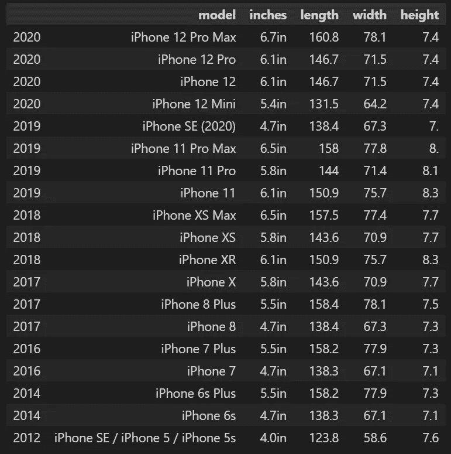
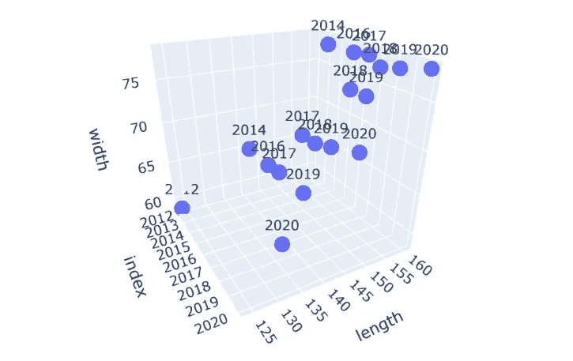

# 艾预测，到 3000 年底，iPhone 的宽度将超过 1 米

> 原文：<https://pub.towardsai.net/by-the-end-of-the-year-3000-iphone-width-will-exceed-1-meter-ai-predicts-2b212d97072d?source=collection_archive---------4----------------------->

## [数据科学](https://towardsai.net/p/category/data-science)

## 测试人工智能的预测能力。完整的代码可在我的回购[。](https://github.com/arditoibryan/Projects/blob/master/20211118_phone_size/phone_size_fun.ipynb)

> 加入我们在 discord 上的[免费编程社区，在 Python Kai 中结识其他程序员！](https://discord.com/invite/dG2D2zXeXB)

AI 是一个奇迹，毫无疑问。自从人们了解了它的预测能力，就一直在用它做好事。所以，事情是这样的，在这篇文章中我会假装很认真，而你会假装人工智能预测的任何事情都是未来可能发生的情况。

我们是如何做出如此激烈的预测的？正如我们所知，这将是 iPhone 的末日，进而是苹果的末日吗？最重要的是，我们如何创造一个专门预测某个日期型号的 iPhone 尺寸的人工智能？

## 收集数据

事实上，答案很简单。我们从收集所有可用 iPhone 型号的数据开始。最初，计划是对每家公司的不同型号进行比较，显示智能手机尺寸随时间的增长率。然而，数据收集被证明太有挑战性了，我不得不把自己限制在苹果产品上。


智能手机尺寸随时间的演变

如你所见，结果很有希望。由于路线的改变，从黑莓开始，手机开始变得更大而不是更小。如果是这样的话，现在我会写下对蚁人何时可以在 MCU 量子领域使用他的手机的估计。


iPhone 上的巨型蚁人，到目前为止一切看似合理

# 预处理数据

玩笑归玩笑(我怀疑讨论的内容会变得更严肃)，这些是 iPhone 5.0 这些年的尺寸。通过从网站上复制和粘贴字符串，这就是结果。

```
str1 = 'iPhone 12 Pro Max,6.7in,160.8 x 78.1 x 7.4 mm,iPhone 12 Pro,6.1in,146.7 x 71.5 x 7.4 mm,iPhone 12 ,6.1in,146.7 x 71.5 x 7.4 mm,iPhone 12 Mini ,5.4in,131.5 x 64.2 x 7.4 mm,iPhone SE (2020),4.7in, 138.4 x 67.3 x 7.3mm,iPhone 11 Pro Max,6.5in, 158 x 77.8 x 8.1mm,iPhone 11 Pro ,5.8in,144 x 71.4 x 8.1 mm,iPhone 11,6.1in, 150.9 x 75.7 x 8.3 mm,iPhone XS Max,6.5in,157.5 x 77.4 x 7.7 mm,iPhone XS,5.8in,143.6 x 70.9 x 7.7 mm,iPhone XR,6.1in,150.9 x 75.7 x 8.3 mm,iPhone X,5.8in,143.6 x 70.9 x 7.7 mm,iPhone 8 Plus,5.5in,158.4 x 78.1 x 7.5 mm,iPhone 8 ,4.7in,138.4 x 67.3 x 7.3 mm,iPhone 7 Plus,5.5in,158.2 x 77.9 x 7.3 mm,iPhone 7 ,4.7in,138.3 x 67.1 x 7.1 mm,iPhone 6s Plus ,5.5in,158.2 x 77.9 x 7.3 mm ,iPhone 6s,4.7in,138.3 x 67.1 x 7.1 mm,iPhone SE / iPhone 5 / iPhone 5s,4.0in,123.8 x 58.6 x 7.6 mm'
```

在处理数据之前，我们需要对其格式进行更改。通过使用下面的算法，我能够将数据分成一系列测量值。

```
the_list = str1.split(',')list_of_groups = zip(*(iter(the_list),) * 3)
t = list()
for a in list_of_groups:
    t.append(a)
tOutput:
[('iPhone 12 Pro Max', '6.7in', '160.8 x 78.1 x 7.4 mm'),
 ('iPhone 12 Pro', '6.1in', '146.7 x 71.5 x 7.4 mm'),
 ('iPhone 12\xa0', '6.1in', '146.7 x 71.5 x 7.4 mm'),
 ('iPhone 12 Mini\xa0', '5.4in', '131.5 x 64.2 x 7.4 mm'),
 ('iPhone SE (2020)', '4.7in', ' 138.4 x 67.3 x 7.3mm'),
 ('iPhone 11 Pro Max', '6.5in', ' 158 x 77.8 x 8.1mm'),
 ('iPhone 11 Pro\xa0', '5.8in', '144 x 71.4 x 8.1\xa0mm'),
 ('iPhone 11', '6.1in', '\xa0150.9 x 75.7 x 8.3 mm'),
 ('iPhone XS Max', '6.5in', '157.5 x 77.4 x 7.7 mm'),
 ('iPhone XS', '5.8in', '143.6 x 70.9 x 7.7 mm'),
 ('iPhone XR', '6.1in', '150.9 x 75.7 x 8.3 mm'),
 ('iPhone X', '5.8in', '143.6 x 70.9 x 7.7 mm'),
 ('iPhone 8 Plus', '5.5in', '158.4 x 78.1 x 7.5 mm'),
 ('iPhone 8\xa0', '4.7in', '138.4 x 67.3 x 7.3 mm'),
 ('iPhone 7 Plus', '5.5in', '158.2 x 77.9 x 7.3 mm'),
 ('iPhone 7\xa0', '4.7in', '138.3 x 67.1 x 7.1 mm'),
 ('iPhone 6s Plus\xa0', '5.5in', '158.2 x 77.9 x 7.3 mm\xa0'),
 ('iPhone 6s', '4.7in', '138.3 x 67.1 x 7.1 mm'),
 ('iPhone SE / iPhone 5 / iPhone 5s', '4.0in', '123.8 x 58.6 x 7.6 mm')]
```

## 将数据转换成熊猫数据帧

然而，为了建立回归模型，我需要将数据分成适当的特征。因为年份没有包含在原始数据中，所以我不得不自己搜索并添加到索引中。

```
import pandas as pddf = pd.DataFrame(t)
df.columns = ['model', 'inches', 'size']
df['size'] = df['size'].apply(lambda x : x.replace(' x ', '_')[:-3])
df = pd.concat([df, df['size'].str.split('_', expand=True)], axis=1).drop(['size'], axis=1)
df.columns = ['model', 'inches', 'length', 'width', 'height']
year = [2012, 2014, 2014, 2016, 2016, 2017, 2017, 2017, 2018, 2018, 2018, 2019, 2019, 2019, 2019, 2020, 2020, 2020, 2020]
year.reverse()
df.index = year
df
```

最后，这是最后的结果:



## 可视化趋势

数据由 3 个变量组成:时间、宽度和 iPhone 长度。我决定把它想象成 3D 绘图。



# 创建预测模型

进行这种预测的最佳方法是使用回归模型。我将使用年份作为特征，iPhone 尺寸作为标签，分别为 X 和 y。

```
import numpy as np
from sklearn.linear_model import LinearRegressionX, y = pd.DataFrame(df.index), df[['length', 'width']]
reg = LinearRegression().fit(X, y)
reg.score(X, y)
```

现在让我们对 2700 年做出预测:

```
reg.predict(np.array([[2700]]))Output:
array([[1013.11827778,  591.6195    ]])
```

iPhone 将达到 1013mm x 592mm，达到 1 米的门槛！杰出！