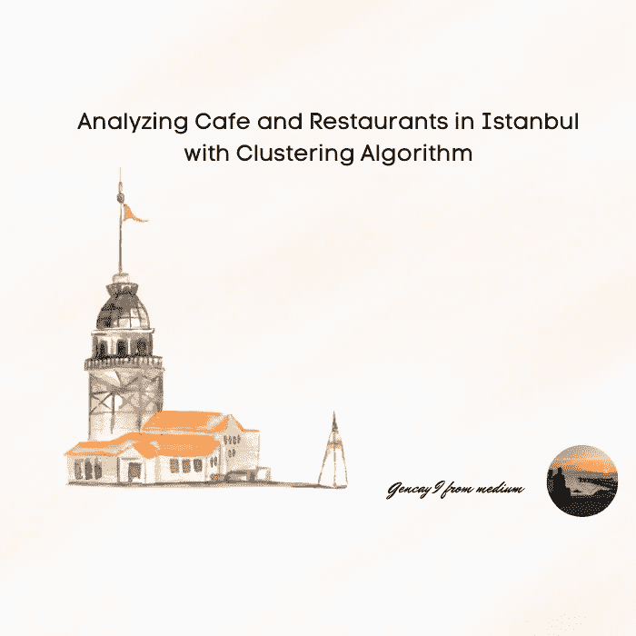
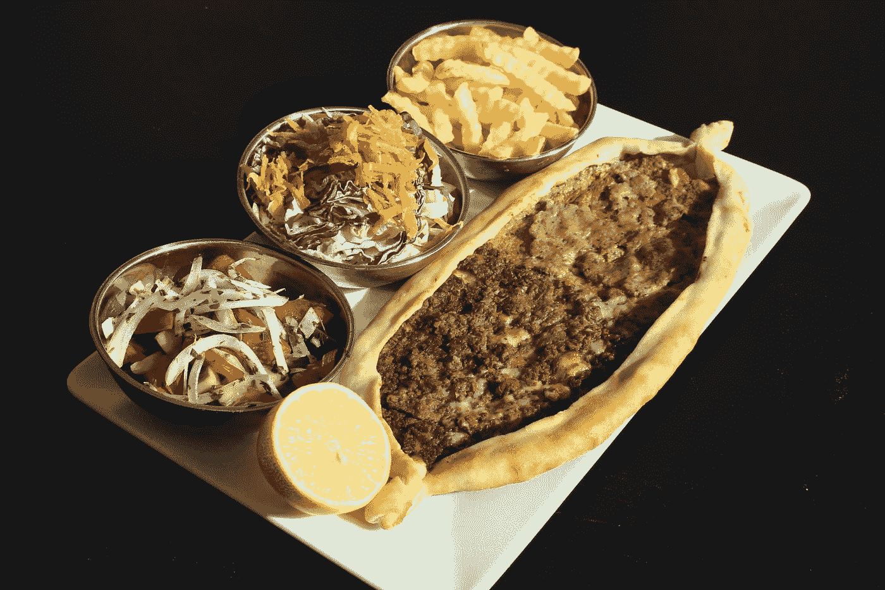
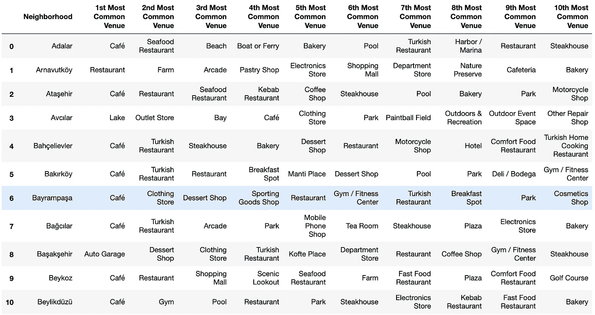
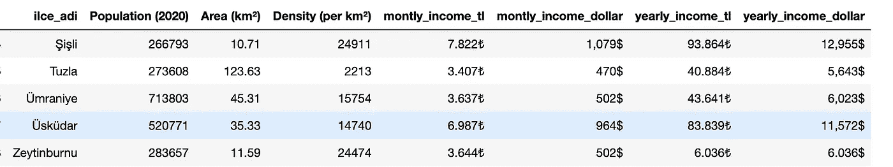
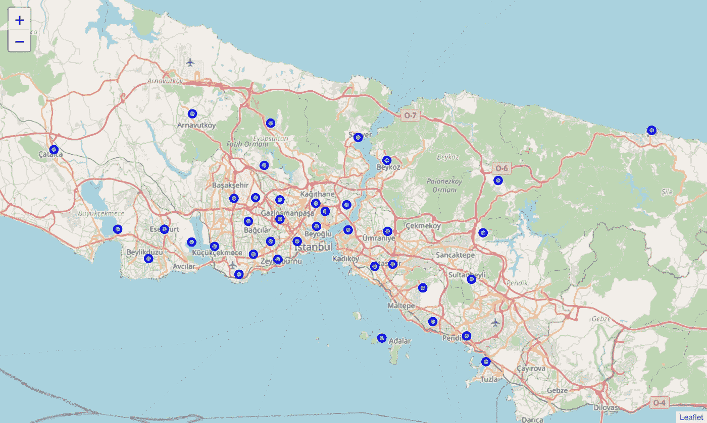
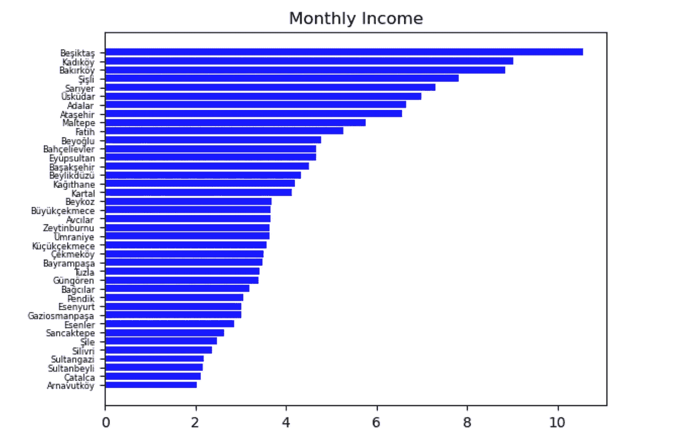
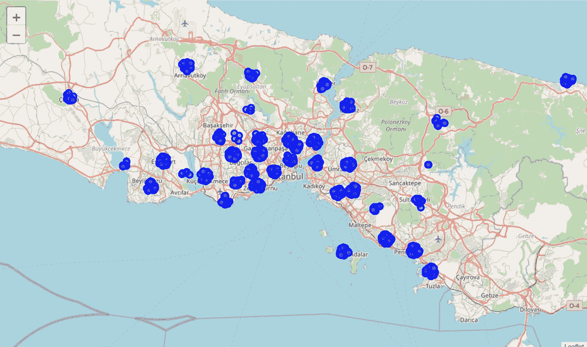
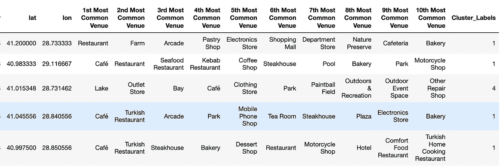
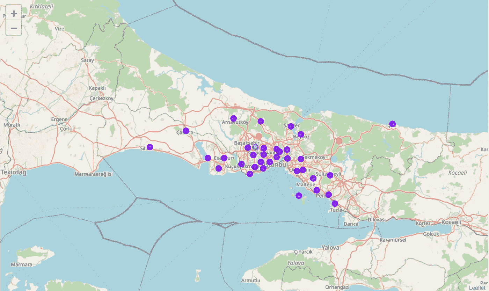
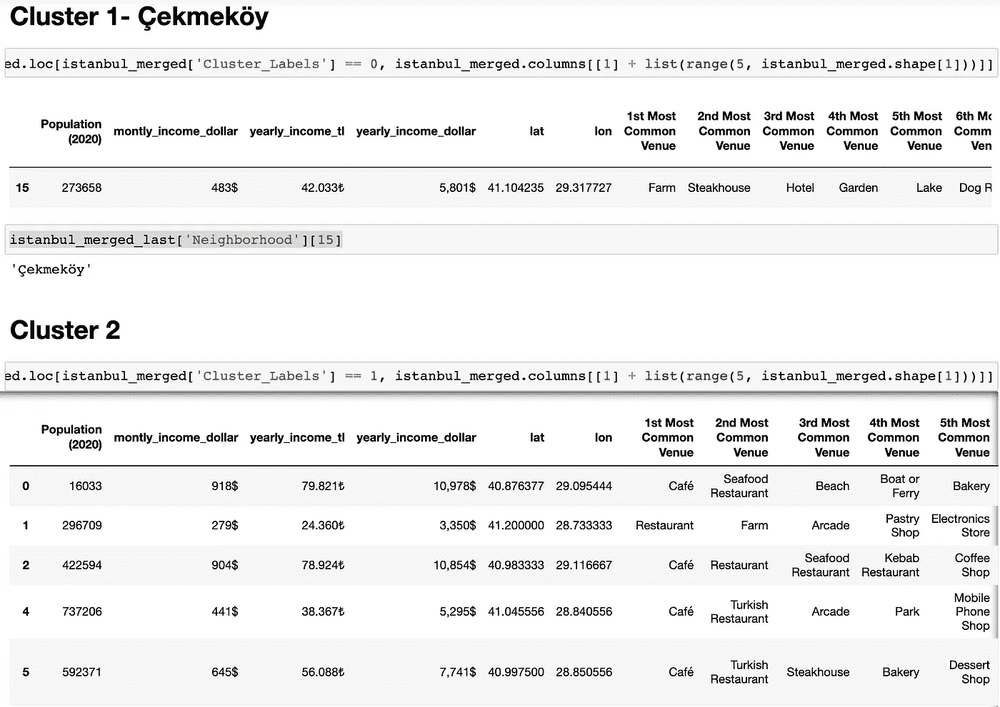

# 伊斯坦布尔的咖啡馆和餐馆管理及其经济背景

> 原文：<https://pub.towardsai.net/cafe-restaurant-management-in-istanbul-economical-background-f49e544415db?source=collection_archive---------2----------------------->

## 聚类算法



# **简介**

伊斯坦布尔是土耳其最大的城市，也是该国的经济、文化和历史中心。该市横跨博斯普鲁斯海峡，位于欧洲和亚洲之间，人口超过 1500 万，占土耳其人口的 19%。伊斯坦布尔是欧洲人口最多的城市，也是世界第十五大城市。

多年来，在大都市开咖啡馆一直是投资者最喜欢的投资工具。

同样，投资者大多选择了这个行业，但并非所有这些投资故事都有好结局。

```
Content Table· [Introduction](#f519)
 ∘ [Business Problem](#2293)
 ∘ [Interests](#224f)
· [Getting and Cleaning Data](#a2bc)
· [Exploratory Data Analysis](#ddcf)
· [Clustering](#a22b)
· [Conclusion](#8d10)
 ∘ [References](#0477)
```

## **商业问题**

> “特别是在疫情时期(2019 年至 2020 年至 2021 年)，由于经济原因，土耳其伊斯坦布尔 25%的咖啡馆已经关闭，”旅游餐厅投资者和美食企业协会主席卡亚·德米勒说。


照片由 [Charanjeet Dhiman](https://unsplash.com/@charanjeet_dhiman?utm_source=medium&utm_medium=referral) 在 [Unsplash](https://unsplash.com?utm_source=medium&utm_medium=referral) 上拍摄

尽管疫情效应是这一问题的主要原因，甚至在疫情之前，在一些邻居中，经常可以看到商店的所有者每年更换 4-5 次。

> Yemeksepeti 的销售总监 Korhan Erç in 说，在土耳其，每两家新开的餐馆中就有一家在第一年就关门了。



照片由 [mahsa shamshiri fard](https://unsplash.com/@tpmagency?utm_source=medium&utm_medium=referral) 在 [Unsplash](https://unsplash.com?utm_source=medium&utm_medium=referral) 上拍摄

Yemeksepeti 是一家在线食品配送公司，目前在土耳其和塞浦路斯的 70 个城市开展业务，拥有超过 35，000 家会员餐厅，1，800 万用户，520，000 日订单。

在我看来，特别是考虑到数据科学工具及其应用的发展，未来的投资者从数据科学家的角度观察咖啡馆和餐馆的数据将是有益的。

## **利益**

作为伊斯坦布尔的正式居民，我一直对咖啡馆和餐馆管理感兴趣。

首先，伊斯坦布尔的居民通常每周至少在咖啡馆聚会 1-2 次，这里有太多种类的餐馆和咖啡馆，如海鲜餐馆、面包店、土耳其餐馆、牛排馆等。


作者图片

作为一名数据科学家，我总是想知道，在哪个街区，什么样的咖啡馆或餐馆可以获得成功，它们根据街区的分布是什么。



作者图片

# **获取和清理数据**

邻域及其经度和纬度数据已经以 CSV 格式建立在 GitHub [2]上。

在维基百科[3]中可以找到一个地区及其经济方面的列表，如每月和每年的家庭收入，这些列表是从 HTML 刮到熊猫数据框架中的。

在合并两个数据集时遇到了几个问题，但这些问题已经得到了解决。

我遇到的太多问题之一是，在年收入和月收入栏中，两种货币(美元和土耳其里拉)被写在同一栏中，必须将它们分开。



作者图片

# 探索性数据分析

在挖掘和清理数据之后，伊斯坦布尔的邻域数据的可视化将被更好地观察。

我使用 leav 库来这样做。

有 39 个独立的社区存在。



作者图片

根据邻域可视化经济数据也很重要。



作者图片



作者图片

# **聚类**



作者图片



作者图片



作者图片

# 结论

因此，想要在伊斯坦布尔开咖啡馆或餐馆的投资者可以调查这些数据，以拓宽思路。

## **参考文献**

[*1。伊斯坦布尔-维基百科*](https://en.wikipedia.org/wiki/Istanbul)

[*2。伊斯坦布尔街区的经纬度*](https://gist.github.com/ismailbaskin/2492196)

[*3。伊斯坦布尔*区列表](https://en.wikipedia.org/wiki/List_of_districts_of_Istanbul)

[*4。korhan er in-Yemeksepeti*](https://www.haberturk.com/ekonomi/is-yasam/haber/1216417-acilan-her-iki-restorandan-biri-ilk-yil-kapaniyor)的销售总监

[*5。Kaya demi rer-旅游餐馆投资者和美食企业协会主席*](https://www.gunboyugazetesi.com.tr/yeme-icme-sektoru-onunu-goremiyor-4-isletmeden-1i-iflas-noktasinda-89817h.htm)

[*6。yemeksepeti-维基百科*](https://en.wikipedia.org/wiki/Yemeksepeti)