# 计算网络的反向传播

> 原文：<https://pub.towardsai.net/calculating-back-propagation-of-a-network-1febbcaa2b5d?source=collection_archive---------0----------------------->

## 在数学中推动反向传播算法| [朝向人工智能](https://pub.towardsai.net)

## 反向传播背后的数学初学者指南

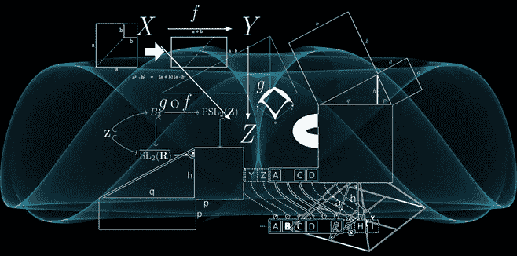

机器学习已经成为许多程序员和公司研究和利用的热门话题。尽管有各种各样的框架和工具来帮助开发你自己的网络，但它最终是一个黑匣子，我们在那里发送数据，它生成所需的输出；假设您尝试了各种网络架构。

然而，如果你和我一样，很想知道黑匣子里有什么；特别是反向传播以及它如何影响网络，我希望这篇文章能帮助你更好地理解它。

# **我们为什么需要这样做？**

在训练网络时，您可以不断改变变量，并执行前向传播，直到您获得所需的输出。但是这个过程会很耗时，除非你第一次运气好。另一种方法是使用反向传播来确定向最优解变化的方向和幅度。这个过程给了你一个解决问题的正确方法。所以为了得到一个清晰的画面，让我们看看下面的过程。

## **训练的一般流程**

1.  初始化网络中的权重。
2.  计算成本函数(又名损失函数)
3.  找到各层的梯度。
4.  这些计算出的梯度用于更新网络的权重。
5.  重复该过程，直到它满足结束标准。

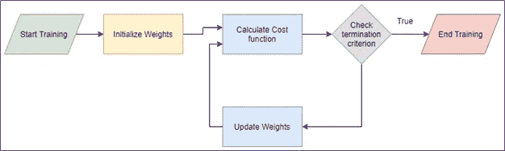

因此，梯度用于确定成本函数相对于特定变量的变化。这将用于使用如下函数更新权重:

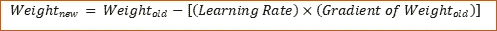

为了更深入地研究这个过程的第 3 步，让我们以一个简单的网络为例，它有一个隐藏节点和两个激活函数。

## **样本网络**

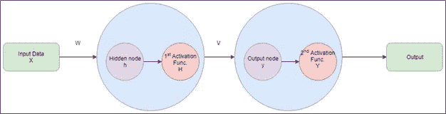

为了清楚起见，我现在描述一下每个变量指的是什么。

> w 是从输入到隐藏单元的权重
> 
> h 是隐藏单元的输出
> 
> h 是通过第一个激活函数后隐藏单元的输出
> 
> v 是从隐藏到输出单位的权重
> 
> y 是隐藏单元的计算输出
> 
> y 是通过第二激活功能后最终输出单元的输出

[注:通常，重量表示为 Wij，i & j 表示层数。这里，我给出了一个单独的变量名，以帮助理解清楚]

当训练网络时，成本函数被用作在更新权重之前确定网络表现如何的度量。因此，成本函数通常在网络末端计算。在这种情况下，它将是来自第二激活层的输出的函数。让我们指定，L 为成本函数。

为了简化，我将设置一些简单的功能描述。

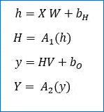

A1 和 A2 是一些激活功能。

从我们的网络中，我们总共可以识别 4 个梯度；即网络可以操纵的每个变量一个。它们是:

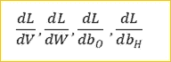

# **回答大问题。**

这是反向传播数学的起点。当我开始研究这个问题的时候，当我开始我的机器学习之旅的时候，我确实获得了很多可以学习的材料。但这让我比以前更困惑了。所以，我筛选出你需要理解的要点，相信我，你需要的只是基本的微积分知识来理解它。让我们从相对于 v 的梯度开始。

## 第一步:识别衍生品

从网络结构中，我们可以观察到变量经过两个计算阶段，即 y & Y。对于这种简单的网络，我建议将成本函数追溯到变量 v。

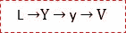

我们知道 Y 是函数 Y 输出的后续函数，Y 处理直接利用 V 进行计算的函数。因此，通过偏导数和链式法则方法，我们的第一梯度如下:

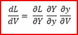

## 第二步:计算单个导数

现在，看看幂偏导数。

我们需要做的就是找到三个函数的三个不同的微分，然后把它们相乘。不用复杂的多元微分方程，我们可以用微分的基本知识来求解。

**衍生 1**

例如，让我们将成本函数 L 设置为多个函数的交叉熵损失:

第一个偏微分会是，

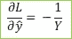

**衍生 2**

至于 y 相对于 V:

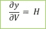

**导数 3**

由于我们还没有设置激活函数，我们假设 A2 是一个 SoftMax 函数。因此，新的等式将是:

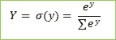

现在，你可以自己计算微分或者使用互联网，因为有许多数学家已经解决了这个问题。

因此，softmax 函数的[导数为:](https://ljvmiranda921.github.io/notebook/2017/08/13/softmax-and-the-negative-log-likelihood/)

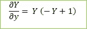

## 步骤 3:计算最终梯度

现在我们有了单独的导数，我们只需要乘以比就可以得到答案。

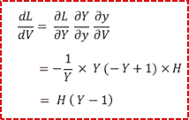

## 步骤 4:更新权重

更新权重的最后一步是:

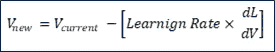

这是一个变量的结尾。

# **计算其他梯度**

用类似的方法，我们也可以计算输出节点的偏置梯度。

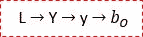

现在，输入和隐藏节点之间的权重，可以观察到它通过了权重 V，但和以前一样，我们只采用数学函数，这将有助于我们追溯。因此，对于相对于 W 的梯度，我们将得到:

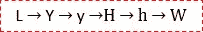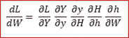

有了这个，我希望你有清晰的计算自己的梯度，如果你觉得有点冒险写自己的过滤器或网络。