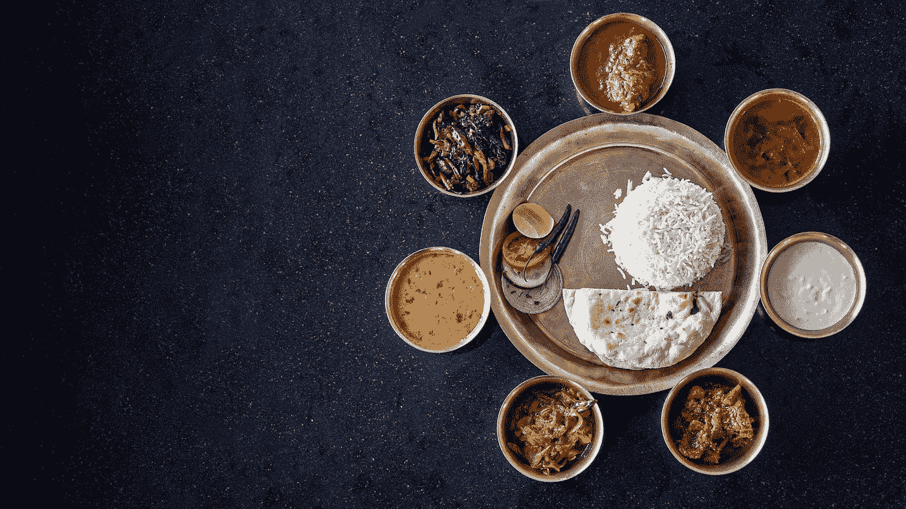
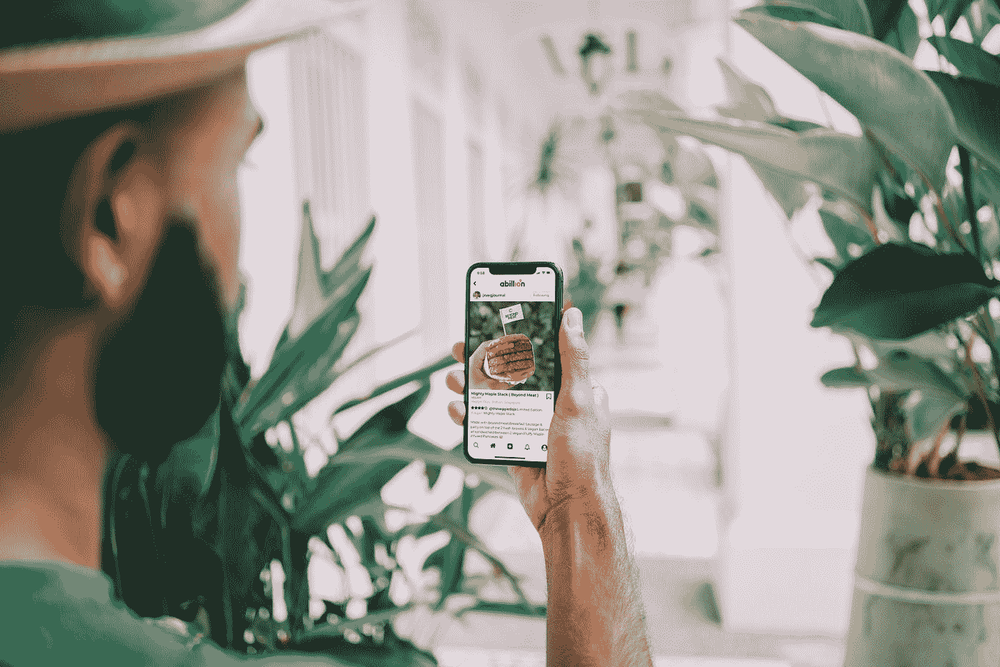
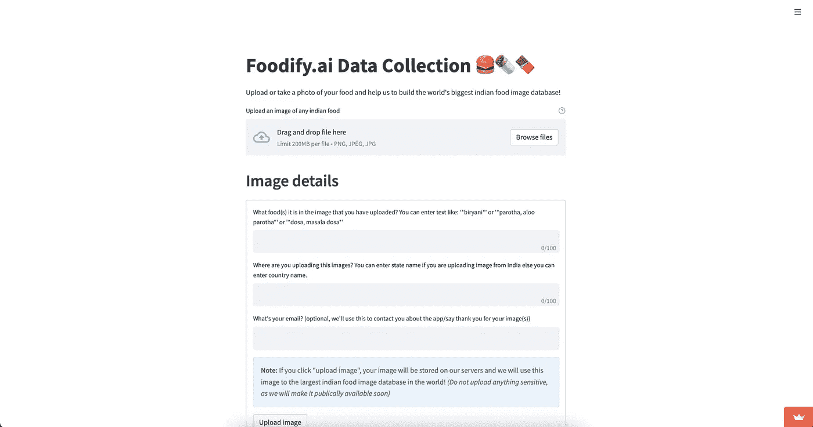
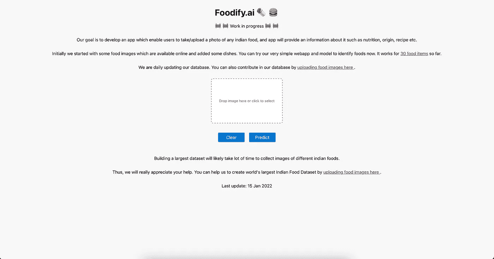

# 用计算机视觉计算营养事实— Foodify.ai

> 原文：<https://pub.towardsai.net/calculating-nutrition-facts-with-computer-vision-foodify-ai-f261a86a4d4c?source=collection_archive---------3----------------------->

## [计算机视觉](https://towardsai.net/p/category/computer-vision)

## 基于计算机视觉的印度食品检测和营养计算应用程序

由 [rajat sarki](https://unsplash.com/@rajat_sarki?utm_source=medium&utm_medium=referral) 在 [Unsplash](https://unsplash.com?utm_source=medium&utm_medium=referral) 上拍摄的照片

> 印度是世界上人口第二多的国家，近年来经济稳步增长，粮食生产实现了自给自足。—[https://www.wfp.org/countries/india](https://www.wfp.org/countries/india)

印度美食由当地各种传统美食组成。考虑到土壤、气候、文化、种族和职业的多样性，这些烹饪法有很大的不同，使用当地可获得的香料、草药、蔬菜和水果。大约 14 亿人离开了 36 个州和中央直辖区，带着独特的菜肴和遗产。

在这个时代，人们比以前更加注重健康。然而，缺乏关于食物的不同健康方面的知识。因此，我想到了 foodify . ai——一个基于深度学习的应用程序，它可以从图像中检测食物，并提供食物的信息，如蛋白质，维生素，卡路里，矿物质，碳水化合物等。

据我所知，深度学习社区的印度食物上下文中没有这样的应用程序或公共数据集可用。因此，为了填补这一研究空白，我开发了 Foodify.ai。这款应用的目标是:

1.  世界上最大的印度食物图像数据集(我将公开它)
2.  检测印度食物并提供营养信息的应用程序。

在 [Unsplash](https://unsplash.com?utm_source=medium&utm_medium=referral) 上 [abillion](https://unsplash.com/@abillion?utm_source=medium&utm_medium=referral) 拍摄的照片

# 应用阶段

**第一阶段:图像采集应用(✅)**

Foodify.ai 数据采集 App。[https://share . streamlit . io/durgeshsamariya/foodify . ai/main/data _ collector _ app . py](https://share.streamlit.io/durgeshsamariya/foodify.ai/main/data_collector_app.py)

开发任何机器学习或深度学习模型，最重要的是数据。首先，我从谷歌和微软必应上下载图片。然而，要创建世界上最大的数据集，这些图像是不够的。所以，我创建了一个从用户那里收集图片的网络应用。如果你想投稿，可以[在这里](https://share.streamlit.io/durgeshsamariya/foodify.ai/main/data_collector_app.py)上传图片。

**第二阶段:训练深度学习模型，开发原型应用**

目前，我已经用 30 种不同的食物训练了一个模型。您可以点击查看[工作申请。](https://foodify.ai/)

简单的工作应用。 [https://foodify.ai](https://foodify.ai)

**第三阶段:创建营养数据库**

在这里，我将通过搜索不同的营养数据库来创建一个营养数据库。到目前为止，我只知道美国农业部的营养数据库。不过，当我开始这一步时，我会搜索更多。

**第四阶段:开发手机 App**

为了开发一个移动应用程序，我必须整合我在第 1、2 和 3 阶段所做的一切。最终的移动应用程序将允许用户点击/上传任何印度食物的图像，该图像作为输入传递给我们的模型并返回食物类型。根据检测到的食物类型，我们的应用程序将在营养数据库中查找，并最终从我们的营养数据中返回与该食物相关的信息。

# 挑战

食品检测/分类的任务并不像看起来那么简单。在早期，我的主要目标是为我的研究创建世界上最大的印度食物数据集。最初，我定义了 [151 种食物类别](https://raw.githubusercontent.com/durgeshsamariya/foodify.ai/main/foods.txt)来创建我的模型。然而，很难区分一些项目，如馕、黄油馕、奶酪馕和大蒜馕。同样的，也很难识别 Dal，Dal Fry，Dal Tadka，或者让我们考虑 Paratha，Aloo Paratha，Gobi Paratha，Paneer Paratha。因此，我为 Naan，Dal，Parotha 和更多的人创建了一个单独的类别。在最终版本中，我打算返回与给定图像相关的所有可能选项。例如，如果用户上传了 dal 图像，那么 Foodify.ai 应用程序会从我们的营养数据库中返回所有 dal，如 Dal Tadka、Dal Fry、Dal Makhni 等。

另一个挑战是收集图像来创建一个庞大的数据集。为了解决这个问题，我创建了一个图片收集的网络应用程序，你可以在这里找到它。我还计划从 Instagram、Flicker、Pinterest 和其他社交媒体平台抓取每个类别的图片。

还有一个挑战，与训练深度学习模型有关。一次又一次地训练模型是一项计算量非常大且非常耗时的任务。这可以通过使用基于云的服务来解决。(已经在用 AWS)。

你可以在我的 [GitHub](https://github.com/durgeshsamariya/foodify.ai) 找到代码。

我非常感谢你在制作这个数据集方面的帮助。

**感谢阅读。**

## **关于我**

我是 [Durgesh Samariya](https://durgeshsamariya.github.io) ，澳大利亚费杜尼大学机器学习博士三年级学生。

## 在互联网上:

在 [LinkedIn](https://www.linkedin.com/in/durgeshsamariya/) 、 [Instagram](https://www.instagram.com/themlphdstudent/) 、 [Kaggle](https://www.kaggle.com/themlphdstudent) 、 [GitHub](https://github.com/themlphdstudent) 、 [Medium](https://pub.towardsai.net/@themlphdstudent) 上关注我。

如果你喜欢阅读这样的故事，并希望支持我的写作，考虑成为一名[灵媒成员](https://medium.com/@themlphdstudent/membership)。每月支付 5 美元，你就可以无限制地阅读媒体上的故事。如果你使用我的注册链接，我会收到一小笔佣金。

**已经是会员了**？订阅我发布时的通知。