# 机器学习的简单线性回归教程(ML)

> 原文：<https://pub.towardsai.net/calculating-simple-linear-regression-and-linear-best-fit-an-in-depth-tutorial-with-math-and-python-804a0cb23660?source=collection_archive---------1----------------------->

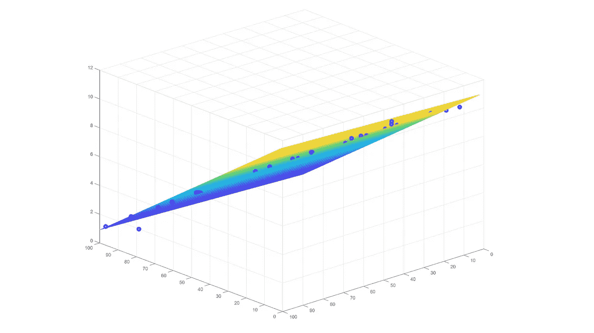

来源:图片由作者提供。

## [数据科学](https://towardsai.net/p/category/data-science)，[机器学习](https://towardsai.net/p/category/machine-learning)，[编辑](https://towardsai.net/p/category/editorial)，[编程](https://towardsai.net/p/category/programming)，[统计](https://towardsai.net/p/category/statistics)

## 通过 Python 和 math 中的代码示例，深入计算简单的线性回归和线性最佳拟合

**作者:** [普拉蒂克·舒克拉](https://www.linkedin.com/in/pratik-shukla28/)，[罗伯特·伊里翁多](https://mktg.best/vguzs)

最后更新，2021 年 1 月 8 日

 [## 加入我们吧↓ |面向人工智能成员|数据驱动的社区

### 加入人工智能，成为会员，你将不仅支持人工智能，但你将有机会…

members.towardsai.net](https://members.towardsai.net/) 

**本教程的代码可在**[**Github**](https://github.com/towardsai/tutorials/tree/master/simple_linear_regression_tutorial)**上获得，其完整实现也可在**[**Google Colab**](https://colab.research.google.com/drive/1WRdDbFFykiLv16-Vv-ghsregmfdbwtRX?usp=sharing)**上获得。**

## 目录:

1.  [什么是简单线性回归？](#bb0b)
2.  [计算线性最佳拟合](#9ae9)
3.  [寻找线性最佳拟合的方程](#f6e3)
4.  [简单线性回归公式的推导](#9a2b)
5.  [简单线性回归 Python 从头实现](#8b9a)
6.  [使用 Scikit-learn 的简单线性回归](#4924)

> 📚查看我们的[梯度下降](https://towardsai.net/p/data-science/gradient-descent-algorithm-for-machine-learning-python-tutorial-ml-9ded189ec556)教程。📚

# 什么是简单线性回归？

简单线性回归是一种统计方法，允许我们研究和总结两个连续数量变量之间的关系。简单线性回归用于 [**机器学习**](https://mld.ai/mldcmu) 模型、数学、统计建模、预测流行病等定量领域。

在这两个变量中，一个变量称为因变量，另一个变量称为自变量。我们的目标是根据自变量的值来预测因变量的值。简单的线性回归旨在找到 X(自变量)和 Y(因变量)之间的最佳关系。

有三种类型的关系。我们可以使用其函数预测输出变量的这种关系被称为**确定性关系**。在**随机关系**中，变量之间没有关系。在我们的统计世界里，它不太可能有确定性的关系。在统计学中，我们一般会有一个不那么完美的关系，那就是所谓的**统计关系**，它是确定性和随机性关系的混合体 [4](https://www.statisticshowto.com/deterministic/) 。

## 示例:

**1。确定性关系:**

a.直径= 2 *π*半径

b.华氏= 1.8 *摄氏+32 度

**2。统计关系:**

a.巧克力的数量与成本

b.收入与支出

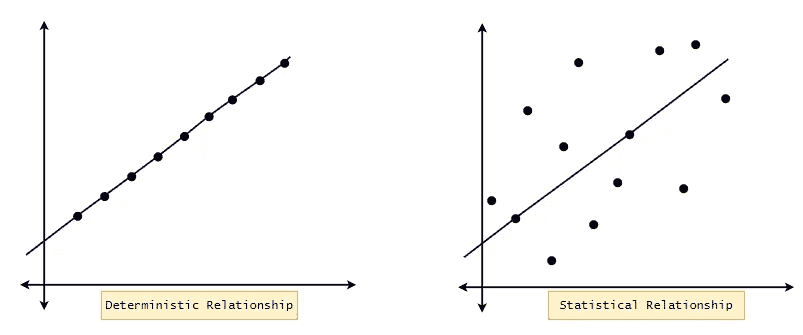

图 1:确定性关系与统计关系。

## 了解简单线性回归:

机器学习中最简单的回归模型是简单线性回归。首先，我们需要知道我们为什么要研究它。为了更好地理解它，我们为什么不从一些住在“比基尼底部”的朋友的故事开始(参考海绵宝宝)[ [3](https://en.wikipedia.org/wiki/SpongeBob_SquarePants) ]。

海绵宝宝、帕特里克、斯奎沃德和加里住在“比基尼海底！”。一天，Squidward 去找海绵宝宝，他们进行了这样的对话。我们去看看。

**Squidward:** “嘿，海绵宝宝，我听说你很聪明！”

**海绵宝宝:**“是，先生！这是毫无疑问的。”

**Squidward:** “是吗？”

**海绵宝宝:**“嗯……是的！”

Squidward: “事情是这样的。我想卖掉我的房子，因为我要搬到我在市中心的豪华新房子。但是我不知道我应该以什么价格卖掉我的房子！如果我把价格定得太高，那么没有人会买，如果我把价格定得太低，我可能会面临很大的财务损失！所以你得帮我找到最适合我房子的价格。但是，请记住，你只有一天时间！”

海绵宝宝一如既往地强调，但对找到解决办法持乐观态度。为了讨论这个问题，他去了他聪明的朋友帕特里克的家。帕特里克正在他的客厅里看电视，手里拿着一大碗爆米花，海绵宝宝向帕特里克描述了整个情况后:

**派屈克:**“那是小事一桩。跟我来！”

(他们决定去 Squidward 的小区，他的两个邻居最近卖掉了他们的房子。经过一番谨慎的调查，他们从斯奎沃德的新邻居那里获得了以下详细情况。现在帕特里克向海绵宝宝解释了整个计划。)

**Patrick:** 一旦我们有了 Squidward 附近前一套房子销售情况的基本数据，我想我们可以做一些逻辑推断来预测 Squidward 的房价。所以让我们得到一些数据。

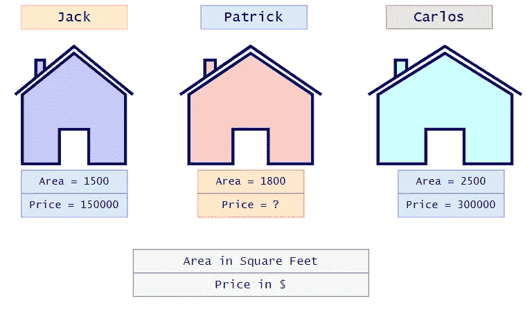

图 Squidward 所在小区的面积和房价。

根据收集的数据，Patrick 能够将数据绘制成散点图:

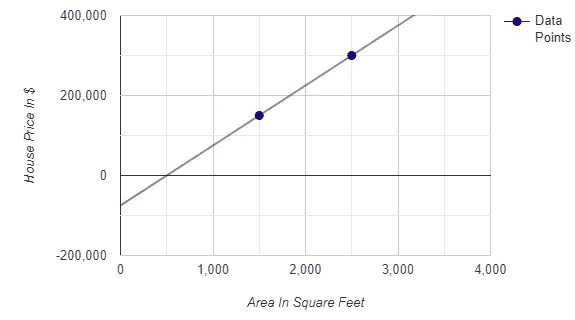

图 3:散点图上的面积与房价。

如果我们仔细观察上面的图表，我们可以注意到，我们可以用一条线连接我们的两个数据点，正如我们所知，每条线都有它的方程。从图 3 中，如果我们有房子的面积，我们可以很快得到房价。如果我们用一些公式来计算房价，那就简单多了。请注意，我们可以通过在图上画一条横线和一条竖线来得到房价，但是要概括一下，我们用的是线方程。首先，我们需要了解一些几何基础知识，并深入研究直线方程。

## 坐标几何基础:

1.  我们总是在坐标平面上从左向右看来命名这些点。
2.  从左往右看，我们得到的第一个点一定命名为(x1，y1)，第二个点会是(x2，y2)。
3.  水平线的斜率为 0。
4.  垂直线有一个“无限”的斜率。
5.  如果第二个点的 Y 坐标大于第一个点的 Y 坐标，则该线具有正(+)斜率。这条线的斜率为负。
6.  与 X 轴垂直距离相同的点具有相同的 Y 坐标。
7.  与 Y 轴垂直距离相同的点具有相同的 X 坐标。

现在让我们回到我们的图表。

我们都知道这条线的方程式:

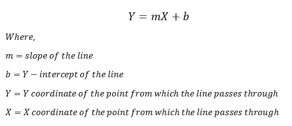

图 4:直线方程。

根据直线斜率的定义:

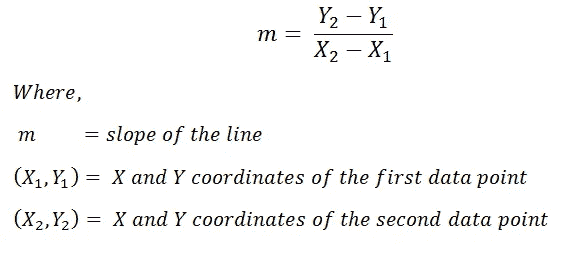

图 5:直线斜率方程。

从上面提到的规则，我们可以推断出，在我们的图表中:

(X1，Y1) = ( 1500，150000)

(X2，Y2) = (2500，300000)

接下来，我们可以很容易地找到这两点的斜率。

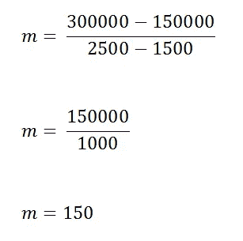

图 6:计算我们例子的斜率。

考虑到我们的例子，在我们的等式中，Y 代表房子的价格，X 代表房子的面积。

既然我们有了所有其他的值，我们可以计算斜率 b 的值。

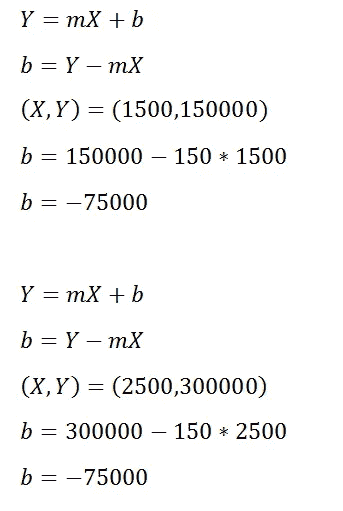

图 7:计算直线的 Y 截距。

请注意，我们可以使用任何点来计算斜率值。对于同一条直线，斜率的答案总是相同的。
接下来，由于我们有了所有的参数，我们可以将直线方程写成:

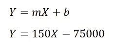

图 8:直线方程。

为了求出 Squidward 的房子的价格，我们需要在上式中代入 X=1800。

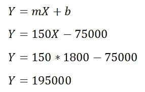

图 9:预测 Squidward 的房价。

现在，我们可以说 Squidward 应该以 195，000.00 美元的价格出售他的房子。那很容易。

请注意，我们只有两个数据点来快速绘制一条穿过它们的直线，并得到直线方程。在这种情况下，需要注意的关键点是，我们的预测将取决于两个数据点的值。如果我们改变两个可用数据点中任何一个的值，我们的预测很可能也会改变。为了解决这个问题，我们有了大量的数据集。真实世界的数据集可能包含数百万个数据点。

现在让我们回到我们的例子。当我们的数据集中有两个以上的数据点时(通常的情况)，我们不能画一条穿过所有点的直线，对吗？这就是为什么我们将使用最适合我们的数据集的线。这条线被称为最佳拟合线或回归线。通过使用这条线的方程，我们将对数据集进行预测。

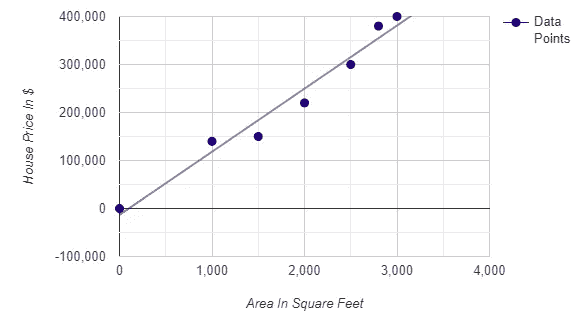

图 10:散点图上的面积与房价。

请注意，中心概念保持不变。我们会找到直线和插件 X 的值(自变量)的方程，从而找到 Y 的值(因变量)。我们需要找到数据集的最佳拟合线。

# 计算线性最佳拟合

正如我们在图 11 中看到的，我们不能画出一条穿过所有点的直线。所以我们能做的就是尽量减小误差。意思是我们找一根杠，然后找预测误差。既然这里有了实际值，就很容易找到预测的误差。我们的最终目标是找到误差最小的那条线。那条线被称为**线性最佳拟合**。

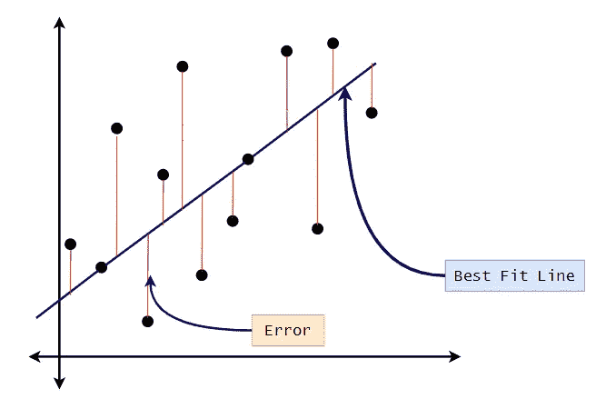

图 11:计算线性最佳拟合。

如上所述，我们的目标是为我们的数据集找到**线性最佳拟合**，或者换句话说，我们的目标应该是减少预测中的误差。现在的问题是，我们如何计算误差？测量散乱点和线之间距离的一种方法是找出它们的 Y 值之间的距离。

为了更好地理解它，让我们回到我们实际的房价预测例子。我们知道面积为 1800 平方英尺的房子实际售价为 22 万美元。如果我们根据直线方程预测房价，也就是 Y = 150X-75000，我们得到的房价是 19.5 万美元。现在我们可以看到有一个预测误差。

因此，我们可以使用误差平方和计算技术来找出每个数据点的预测误差。我们随机选择我们线路的参数，然后计算误差。之后，我们将再次调整参数，然后计算误差。

我们将重复这一过程，直到得到尽可能小的误差。这个过程是梯度下降算法的一部分，我们将在后面的教程中介绍。我们认为现在很清楚，我们将重新计算线的参数，直到我们得到最佳拟合线，或者我们在预测中得到最小误差。

## 1.正误差:

实际售价:22 万美元

预计售价:19.5 万美元

预测误差:220，000 美元–195，000 美元= 25，000 美元

## 2.负误差:

实际售价:16 万美元

预计售价:19.5 万美元

预测误差:160，000 美元-195，000 美元=-35，000 美元

正如我们所看到的，也有可能得到一个负的误差。为了说明负误差，我们平方误差。

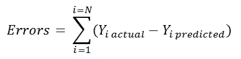

图 12:误差总和的公式。

考虑到负值，我们将平方误差。

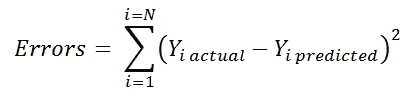

图 13:误差平方和的公式。

接下来，我们要找到误差最小的一条线的参数。一旦我们有了这些，我们就可以形成一个直线方程，并预测数据集的数据值。我们将在本教程的后面部分讨论这一部分。

## 回归线指南:

1.  当预测值有显著相关性时，使用回归线。
2.  保持在数据范围内，确保不要外推。例如，如果数据从 10 到 60，不要试图预测 500 的值。
3.  不要根据另一个群体的回归线对一个群体进行预测。

## 线性回归的用例:

1.  身高体重。
2.  饮酒量和血液酒精含量。
3.  肺活量和多年吸烟量。
4.  行驶速度和耗油量。

# 寻找线性最佳拟合的方程式

在我们深入探究简单线性回归公式的推导之前，我们将尝试在不使用任何公式的情况下找到最佳拟合线参数。考虑下表中的数据点 X 和 Y。下一个表 Y '是预测值，Y-Y '给出了预测误差。

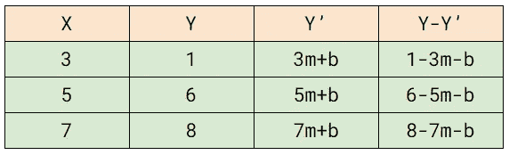

图 14:数据点。

接下来，我们将使用平方和方法来计算误差。因此，我们必须找到(Y-Y ')。请注意，在(Y—Y’)的每一行中，我们有三个术语。首先，我们将深入到公式中去寻找有三项的平方。

图 15 :( a+b+c)的展开。

在我们的例子中，每一行的(Y-Y’)值将是:

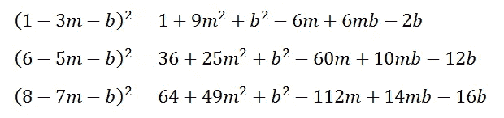

图 16:扩展我们的术语。

接下来，请注意，我们需要将误差平方和公式中的所有平方项相加。

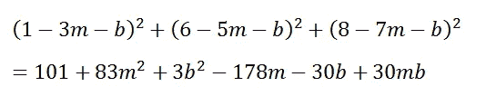

图 17:添加扩展的术语。

接下来，我们的目标是确定斜率(m)和 y 截距(b)的值。为了找出这些值，我们将使用二次多项式中顶点的公式。

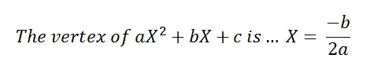

图 18:二次多项式的顶点。

接下来，我们需要重新排列我们的中心方程，使其成为二次多项式形式。正如我们所知，如果我们有两个线性方程，我们可以很快解决他们，并获得所需的值。因此，我们的最终目标将是找到两个线性方程并求解它们。

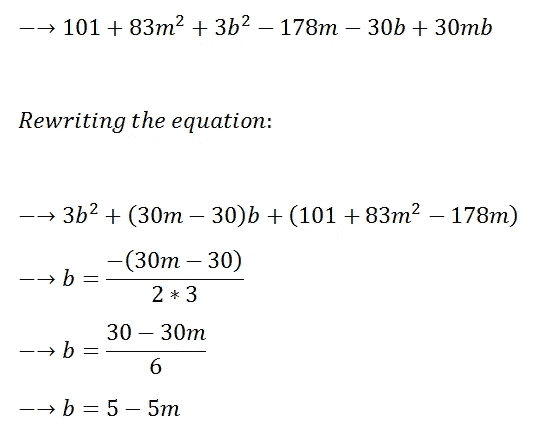

图 19:寻找线性方程。

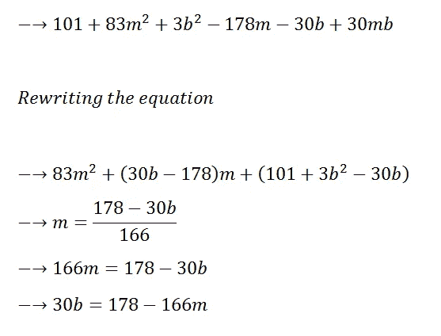

图 20:寻找线性方程。

现在我们有了两个方程，我们可以求解它们来找到斜率和截距值。

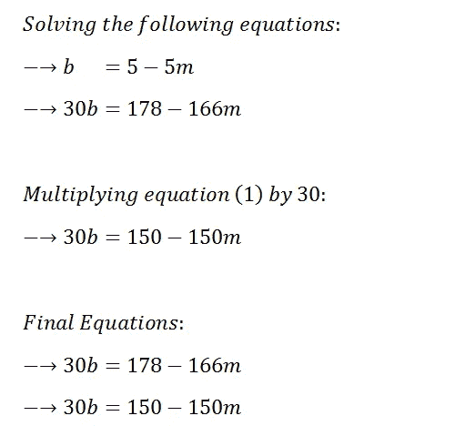

图 32:求解两个线性方程。

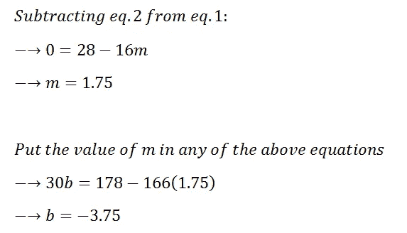

图 33:两个线性方程的解。

现在我们有了最佳拟合线所需的所有值。因此，我们可以将最佳拟合线写成:

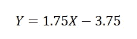

图 34:直线方程。

我们也可以用最佳拟合线将数据绘制在散点图上。

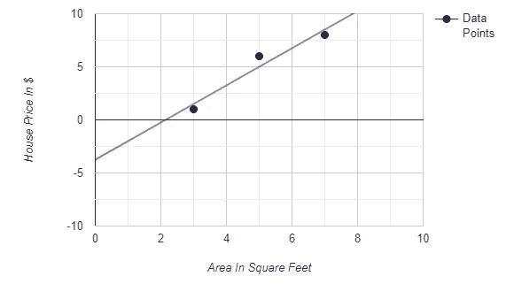

图 35:散点图上的面积与房价。

这就是我们如何找到特定数据集的最佳拟合线。我们可以注意到，对于更大的数据集，这个任务可能会很麻烦。作为解决方案，我们将使用一个公式来给出所需的参数值。

然而，我们不会深究这个公式。相反，我们将首先了解该公式是如何导出的，然后我们将在 Python 的代码示例中使用它来理解其背后的数学原理。

总之，简单线性回归是一种技术，在这种技术中，我们找到一条最适合我们数据集的直线，一旦我们有了这条直线，我们就可以使用直线方程及其最佳参数，根据自变量的值来预测因变量的值。

# 简单线性回归公式的推导:

1.  我们总共有 n 个数据点(X，Y)，范围从 i=1 到 i=n。

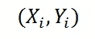

图 36:我们的数据点。

2.我们将线性最佳拟合定义为:

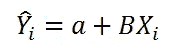

图 37:线性最佳拟合。

3.我们可以将误差函数写成如下:

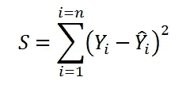

图 38:误差平方和。

4.我们可以将等式 2 的值代入等式 3:

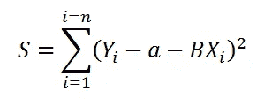

图 39:简化误差平方和。

接下来，我们的最终目标是找到最佳拟合线。为了找到最佳拟合线，误差函数 S 应该最小。为了使我们的误差函数 S 最小，我们必须找到关于 a 和 b，S 的一阶导数等于 0 的地方。

## 寻找 a(截距):

1.  求 S 关于 a 的偏导数:

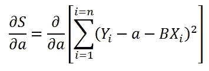

图 40:S 关于 a 的偏导数。

2.简化计算:

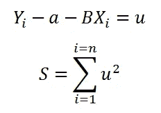

图 41:简化计算。

3.使用偏导的链式法则:

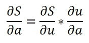

图 42:偏导数的链式法则。

4.寻找偏导数:

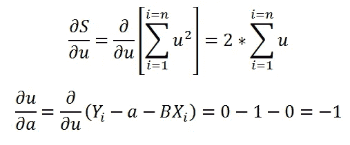

图 43:寻找偏导数。

5.综合起来看:

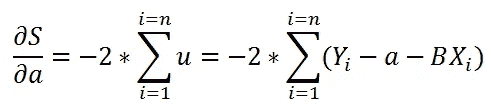

图 44:将它们合并在一起。

6.为了找到极值，我们取导数=0:

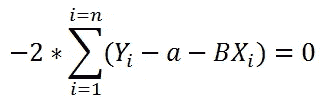

图 45:求导= 0。

7.简化:

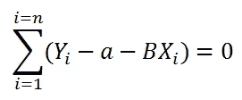

图 46:简化等式。

8.进一步简化:

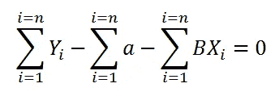

图 47:简化等式。

9.求 a 的和:

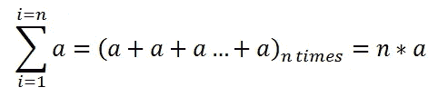

图 48:求 a 的和。

10.代入主方程中的值:

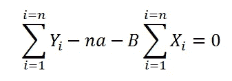

图 49:把它放回到主方程中。

11.简化等式:

图 50:简化等式。

12.进一步简化方程:

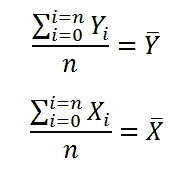

图 51:简化等式。

13.简化 a 值的方程式:

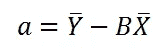

图 52:a 的值。

## 结果 B(斜率):

1.  求 S 关于 B 的偏导数:

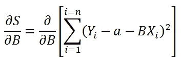

图 53:求 S 关于 b 的偏导数。

求 S 关于 B 的偏导数

2.简化计算:

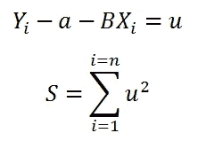

图 54:简化等式。

3.使用偏导的链式法则:

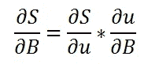

图 55:偏导数的链式法则。

4.寻找偏导数:

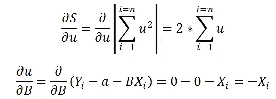

图 56:寻找偏导数。

5.综合起来看:

图 57:将计算值放在一起。

6.分发 Xi:

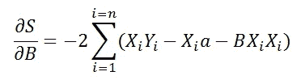

图 58:分配 Xi 的价值。

7.为了找到极值，我们取导数=0:

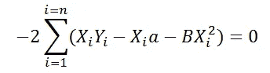

图 59:求导= 0。

8.简化:

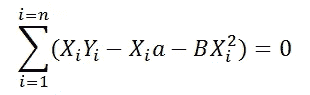

图 60:简化等式。

9.代入等式中的 a 值:

图 61:替换等式中的值。

10.进一步简化:

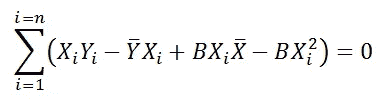

图 62:简化等式。

11.分割总和:

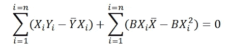

图 63:拆分术语。

12.简化:

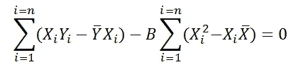

图 64:简化等式。

13.从上面的等式中找到 B:

图 65:b 的值。

16.进一步简化方程:

图 66:b 的值。

## 找到一个(截距)的一般形式:

1.  获取 a 的值:

图 67:简化等式。

2.简化公式:

图 68:a 的简化值。

## 简单的线性回归公式:

图 69:简单线性回归公式总结。

# 从头开始简单的线性回归 Python 实现:

在下面用于简单线性回归的 Python 代码中，我们不会使用 Python 库来为回归线寻找最优参数；相反，我们将使用前面导出的公式来为数据集找到回归(最佳拟合)线。

1.  导入所需的库:

图 70:导入所需的库。

2.阅读 CSV 文件:

图 71:读取 CSV 文件。

3.获取数据集中的列列表:

图 72:我们的数据集的列。

4.检查空值:

图 73:检查空值。

5.选择构建模型的列:

图 74:感兴趣的列。

6.在散点图上绘制数据:

图 75:在散点图上绘制数据。

7.将数据分为训练和测试数据集:

图 76:将数据分成一个测试/训练数据集。

8.计算线性最佳拟合系数的主函数:

以下代码中使用的公式是:

图 77:斜率和截距公式。

图 78:计算斜率和截距的主函数。

9.使用虚拟数据检查功能的工作情况:

图 79:用样本数据检查工作函数。

10.用回归线绘制虚拟数据:

图 80:在我们的散点图上绘制数据。

11.寻找实际数据集的系数:

图 81:求斜率和截距。

12.用实际数据绘制回归线:

图 82:在我们的散点图上绘制数据。

13.定义预测函数:

图 83:定义我们的预测函数。

14.基于预测函数预测值:

图 84:根据预测函数预测值。

15.预测整个数据集的值:

图 85:预测整个数据集的值。

16.用回归线绘制测试数据:

图 86:用回归线在散点图上绘制测试数据。

17.用回归线绘制训练数据:

图 87:用回归线绘制训练数据。

18.用回归线绘制完整数据:

图 88:用回归线在散点图上绘制数据。

19.为实际值和预测值创建数据框:

图 89:实际值与预测值。

19.绘制实际值和预测值的条形图:

图 90:实际值与预测值的条形图。

20.剩余平方和:

图 91:误差计算功能。

21.计算误差:

图 92:计算误差。

这就是我们如何用 Python 从头开始执行简单的线性回归。尽管 Python 库可以执行所有这些计算而无需深入研究，但了解这些库如何执行这样的数学计算总是一种好的做法。

接下来，我们将使用 Python 中的 Scikit-learn 库来查找同一数据集上的线性最佳拟合回归线。在下面的代码中，我们将看到一种使用 Scikit-learn 计算简单线性回归的简单方法。

# 使用 Scikit-learn 的简单线性回归:

1.  导入所需的库:

图 93:为我们的 Scikit 实现导入所需的库。

2.阅读 CSV 文件:

图 94:读取 CSV 文件。

3.回归模型的特征选择:

图 95:特性选择。

4.在散点图上绘制数据点:

图 96:在散点图上绘制数据点。

5.将数据分为测试和训练数据集:

图 97:将我们的数据分为测试和训练。

6.训练模型:

图 98:训练我们的模型。

7.预测完整数据集的值:

图 99:预测值。

8.训练数据的预测值:

图 100:预测我们的训练数据集的值。

9.测试数据的预测值:

图 101:预测我们的测试数据集的值。

10.绘制完整数据的回归线:

图 102:用回归线在散点图上绘制数据。

11.用训练数据绘制回归线:

图 103:用回归线在散点图上绘制训练数据。

12.用测试数据绘制回归线；

图 104:用回归线在散点图上绘制测试数据。

13.为实际数据点和预测数据点创建数据框架:

图 105:实际值和预测值的数据框。

14.绘制实际值和预测值的条形图:

图 106:绘制实际值与预测值的条形图。

15.预测中的计算误差:

图 107:计算预测误差。

这里我们可以看到，即使我们使用 Scikit-learn 库，我们也得到了相同的输出。因此，我们可以肯定，我们进行的所有计算和我们理解的推导都是精确的。

请注意，还有其他方法来计算预测误差，我们将在未来的教程中介绍这些方法。

这就是本教程的全部内容。我们希望你喜欢它，并从中学习到新的东西。如果您有任何反馈，请给我们留下评论或直接发送电子邮件。感谢您的阅读！

给普拉蒂克买杯咖啡！

**免责声明:**本文仅代表作者个人观点，不代表卡耐基梅隆大学的观点。这些文章并不打算成为最终产品，而是当前思想的反映，同时也是讨论和改进的催化剂。

通过[向艾](https://towardsai.net/)发布

# 资源:

[Google colab 实现](https://colab.research.google.com/drive/1WRdDbFFykiLv16-Vv-ghsregmfdbwtRX?usp=sharing)。

[Github 库](https://github.com/towardsai/tutorials/tree/master/simple_linear_regression_tutorial)。

# 参考资料:

[1]什么是简单线性回归，宾夕法尼亚州立大学，[https://online.stat.psu.edu/stat462/node/91/](https://online.stat.psu.edu/stat462/node/91/)

[2]scikit-学习，入门，[https://scikit-learn.org/](https://scikit-learn.org/)

[3]维基百科，https://en.wikipedia.org/wiki/SpongeBob_SquarePants[海绵宝宝](https://en.wikipedia.org/wiki/SpongeBob_SquarePants)

[4]决定论:定义和例子，统计学如何，[https://www.statisticshowto.com/deterministic/](https://www.statisticshowto.com/deterministic/)