# Tableau 中的计算:Tableau 桌面专家认证之路

> 原文：<https://pub.towardsai.net/calculations-in-tableau-a-road-to-tableau-desktop-specialist-certification-6c2bcc3ab5d3?source=collection_archive---------0----------------------->

## Tableau，数据分析，商业智能，数据科学

## 第 11 章:使用免费 Udemy 转储进行 Tableau 计算的综合指南。

欢迎来到第十一章，在这一章中，我们将学习 [Tableau](https://medium.com/u/fcbe60d0bf8b?source=post_page-----6c2bcc3ab5d3--------------------------------) 中的计算。

> 如果你想浏览其他章节，请访问: [**画面:这是什么？为什么它是最好的？；Tableau 桌面专家认证之路。**](https://dakshtrehan.medium.com/tableau-what-it-is-1e2cdff35440)

> 如果您想直接访问 Tableau 桌面专家笔记，请在此处访问它们→[https://dakshtrehan . comment . site/Tableau-Notes-c 13 fceda 97 b 94 BDA 940 edbf 6751 cf 30](https://dakshtrehan.notion.site/Tableau-Notes-c13fceda97b94bda940edbf6751cf303)
> 
> 使用链接访问免费 Tableau 认证转储(有效期至 2022 年 7 月 6 日):
> 
> [https://www . udemy . com/course/tableau-desktop-specialist-certification-dumps-2022/？coupon code = e3f 08189 fa 4 bafae 72 BC](https://www.udemy.com/course/tableau-desktop-specialist-certification-dumps-2022/?couponCode=E3F08189FA4BAFAE72BC)

# 目录

*   **为什么要用计算？**
*   **计算类型**
*   **编辑&删除计算**
*   **本主题的认证问题示例**

# 为什么要使用计算？

当我们想要添加从数据集中的一般字段派生的自定义字段时，会使用计算。简单来说，当我们希望我们的数据回答一些间接的问题时，就会使用计算。

假设我们的数据库包含两行:姓名和年龄。我们可以让我们的数据来回答一些间接的问题，如如果这个人超过 18 岁，提到“有资格投票”。这就是计算的工作方式，它们被用来回答一些间接的问题。

**当我们创建一个新的计算字段时，我们正在我们的数据集中创建一个新字段。计算字段的类型取决于我们计算中使用的字段类型**，也就是说，如果我们在维度上创建计算字段，新字段将代表一个维度，测量也是如此。

**定义如何对计算进行分组的维度称为分区字段。**

**进行表格计算的维度称为寻址字段。**

计算可能有所帮助的一些情况是:

1.  转换字段的数据类型。
2.  分类数据。
3.  过滤结果。
4.  汇总数据。
5.  计算比率。
6.  为可视化创建新数据。

计算也称为公式，包括以下部分或全部内容:

1.  菲尔茨
2.  功能
3.  经营者
4.  因素
5.  评论

## 创建计算字段

要创建计算字段，请转到“数据”窗格，单击下拉菜单，然后选择“创建计算字段”。

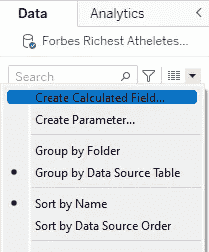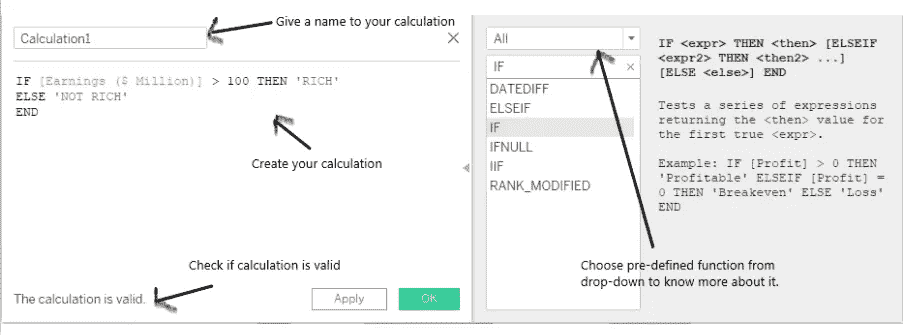

根据使用的数据类型，计算将被分类为维度或度量。

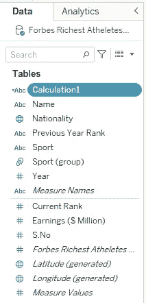

# 计算类型

Tableau 中可以使用三种类型的计算:

## 基本计算

基本计算允许用户在数据源详细级别或可视化详细级别上转换数据。

例如，拆分字符串(数据源详细级别)、聚合列(可视化详细级别)

## 细节层次(LOD)计算

LOD 计算的工作原理与基本计算相同，即基于数据源细节级别或可视化细节级别，但更加精确。

有三种类型的 LOD 计算:

*   包括(更精细的级别)
*   排除(较低粒度级别)
*   固定(独立级别)

LOD 计算不是 Tableau 桌面专家认证的一部分，所以我们不会深入研究它。

## 表格计算

表计算仅对可视化中的字段有效。他们不考虑在可视化中被过滤掉的任何其他领域。

这些计算可以帮助创建排名，显示运行总数，总数的百分比，百分位数，移动平均等。

创建表计算有两种方法:

**来自分析**

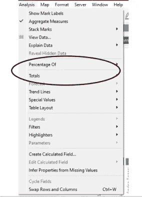

**从列/排货架**

在行和列搁板上添加一些尺寸和度量。右键单击度量，然后选择“快速表计算”或“添加表计算”。

Tableau 支持的总表计算有:

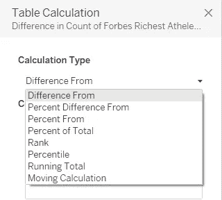

表计算的范围可以是:

**表(跨)**

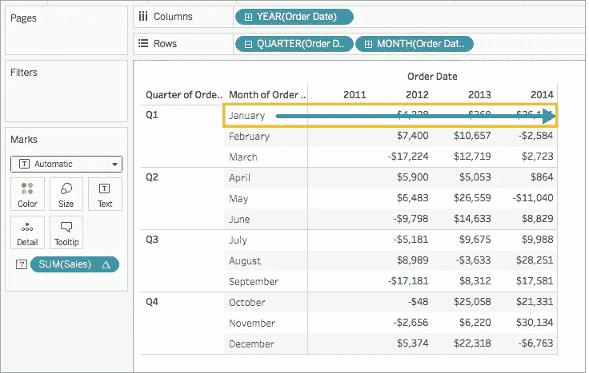

来源:Tableau 文件

**表(下)**

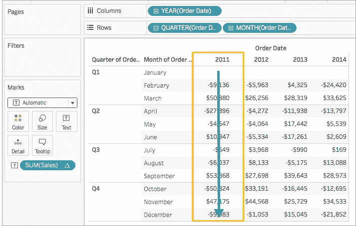

来源:Tableau 文件

**表格(横向然后向下)**

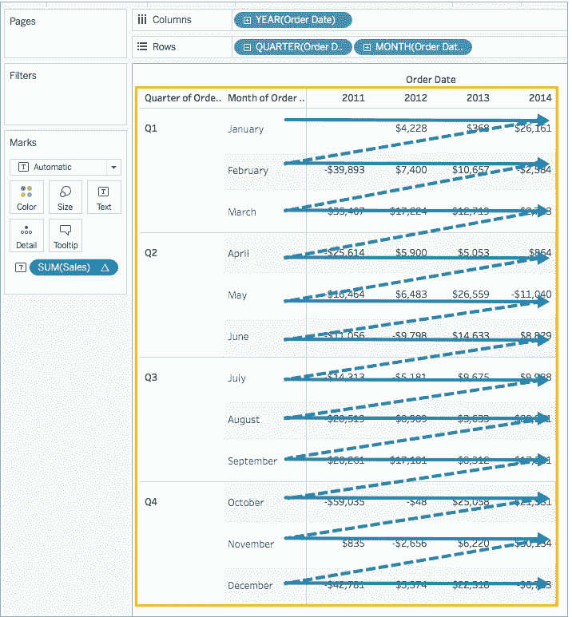

来源:Tableau 文件

**表格(向下然后横跨)**

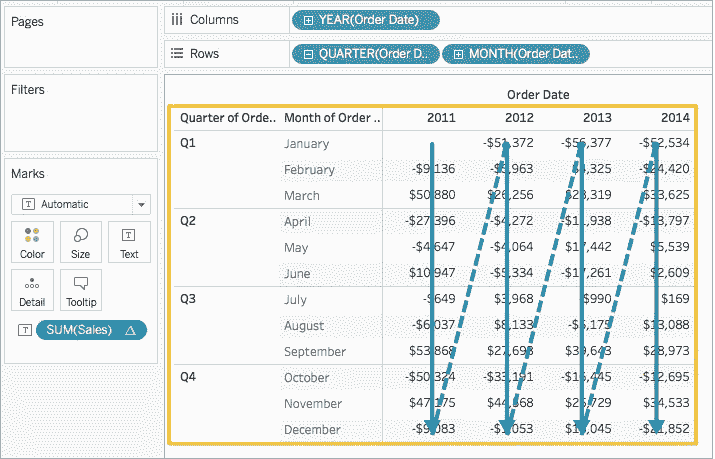

来源:Tableau 文件

**窗格(向下)**

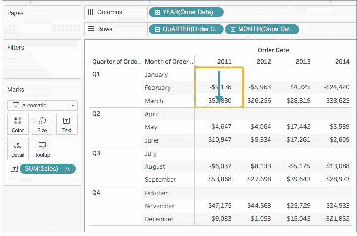

来源:Tableau 文件

**窗格(横向然后向下)**

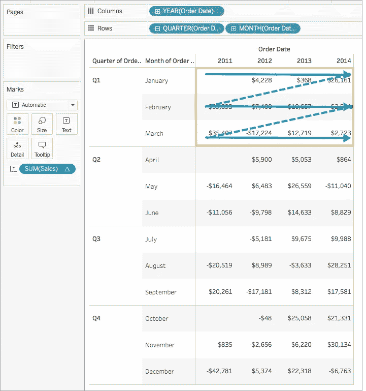

来源:Tableau 文件

**窗格(向下然后横跨)**

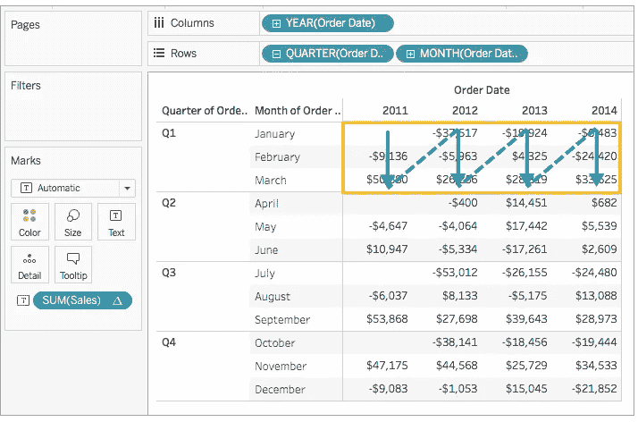

来源:Tableau 文件

**单元格**

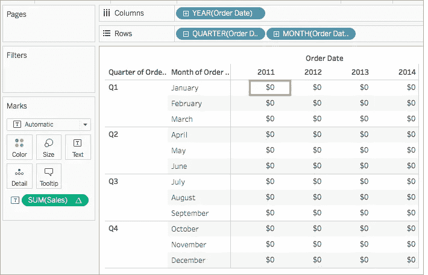

来源:Tableau 文件

# 编辑和删除表格计算

要编辑计算，只需右键单击并选择“编辑”。

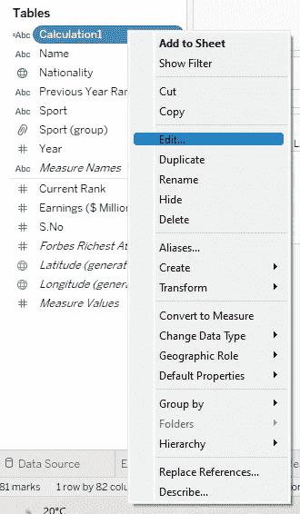

要删除计算，请右键单击视图中的度量(计算应用于其上)，然后选择“清除表计算”。

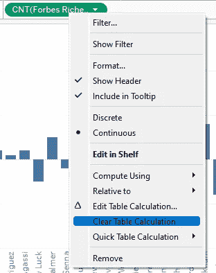

# **本主题的认证问题示例**

**哪个函数可以返回给定数字的绝对值？**

a.地板
b .天花板
c .圆形
d. Abs

**解决方案** : Abs

**哪个不是有效的表格计算？** a .与
的差异 b .排名
c .百分位数
d .合计的差异

**解:**差额合计

**average 函数把空值当成零？** a .真
b .假

**解:**假

**总计可以通过以下方式进行？【选择 2】** a .分析窗格
b .工作表菜单
c .分析菜单
d .在视图中右击。

**解决方案:**分析窗格，分析菜单

**百分位在汇总和计算中都有？** a .真
b .假

**解:**真

> 使用链接访问免费 Tableau 认证转储(有效期至 2022 年 7 月 6 日):
> 
> [https://www . udemy . com/course/tableau-desktop-specialist-certification-dumps-2022/？coupon code = e3f 08189 fa 4 bafae 72 BC](https://www.udemy.com/course/tableau-desktop-specialist-certification-dumps-2022/?couponCode=E3F08189FA4BAFAE72BC)

# 参考资料:

[1] [Tableau 帮助| Tableau 软件](https://www.tableau.com/support/help)

[2] [个人笔记](https://dakshtrehan.notion.site/Tableau-Notes-c13fceda97b94bda940edbf6751cf303)

[3] [Tableau 桌面专家考试(新模式— 2021) — Apisero](https://apisero.com/tableau-desktop-specialist-exam-new-pattern-2021/)

# 感谢阅读！

请随意鼓掌，这样我就知道这篇文章对你有多有帮助，并在你的社交网络上分享它，这对我会很有帮助。

如果你喜欢这篇文章，想了解更多关于**机器学习，数据科学，Python，BI。请考虑订阅我的时事通讯:**

> [达克什·特雷汉的简讯](https://mailchi.mp/b535943b5fff/daksh-trehan-weekly-newsletter)。

在网上找到我:【www.dakshtrehan.com】T42

在 LinkedIn 与我联系:[www.linkedin.com/in/dakshtrehan](http://www.linkedin.com/in/dakshtrehan)

阅读我的科技博客:[www.dakshtrehan.medium.com](http://www.dakshtrehan.medium.com/)

在 Instagram 跟我联系:[www.instagram.com/_daksh_trehan_](http://www.instagram.com/_daksh_trehan_)

# 想了解更多？

[YouTube 是如何利用 AI 推荐视频的？](/how-is-youtube-using-ai-to-recommend-videos-38a142c2d06d)
[利用深度学习检测新冠肺炎](https://towardsdatascience.com/detecting-covid-19-using-deep-learning-262956b6f981)
[逃不掉的 AI 算法:抖音](https://towardsdatascience.com/the-inescapable-ai-algorithm-tiktok-ad4c6fd981b8)
[GPT-3 向一个 5 岁的孩子解释。](/gpt-3-explained-to-a-5-year-old-1f3cb9fa030b)
[Tinder+AI:一场完美的牵线搭桥？](https://medium.com/towards-artificial-intelligence/tinder-ai-a-perfect-matchmaking-b0a7b916e271)
[一个内部人士的使用机器学习卡通化指南](https://medium.com/towards-artificial-intelligence/an-insiders-guide-to-cartoonization-using-machine-learning-ce3648adfe8)
[谷歌是如何做出“哼哼来搜索？”](/how-google-made-hum-to-search-865f224b70d0)
[一行神奇的代码执行 EDA！](/one-line-magical-code-to-perform-eda-f83a731fbc35)
[给我 5 分钟，我给你深度假！](/give-me-5-minutes-ill-give-you-a-deepfake-ce83a645b0f9)

> *欢呼*