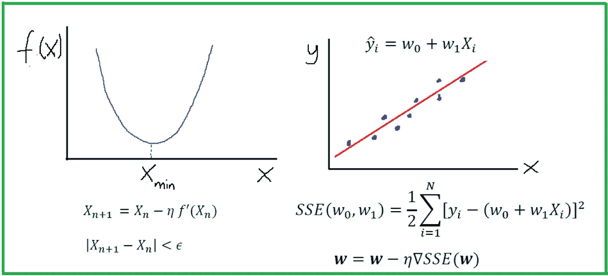
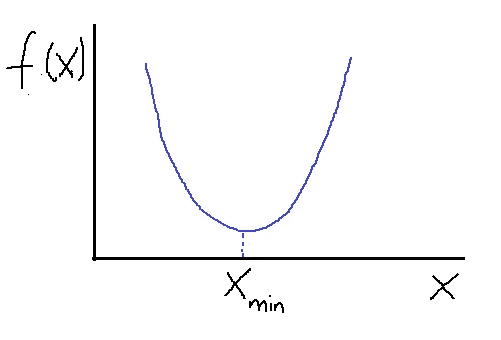
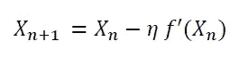
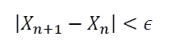
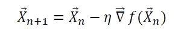
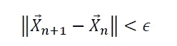
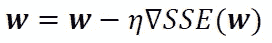

# 机器学习中的微积分

> 原文：<https://pub.towardsai.net/calculus-in-machine-learning-2e7cddafa21f?source=collection_archive---------3----------------------->



Benjamin O. Tayo 的图片

## [机器学习](https://towardsai.net/p/category/machine-learning)，[数学](https://towardsai.net/p/category/mathematics)

## 每个机器学习模型的背后都有一个高度依赖微积分的优化算法

# 一.导言

机器学习算法(如分类、聚类或回归)使用训练数据集来确定权重因子，这些权重因子可应用于未知数据以实现预测目的。*每一个机器学习模型背后都是一个严重依赖微积分的优化算法*。在本文中，我们将讨论一种这样的优化算法，即梯度下降近似(GDA ),我们将展示如何使用它来构建一个简单的回归估计量。

# 二。使用梯度下降算法的优化

## II.1 衍生产品和梯度

在一维情况下，我们可以利用导数找到函数的最大值和最小值。让我们考虑一个简单的二次函数 *f(x)* 如下所示。



**使用梯度下降算法求简单函数的最小值。Benjamin O. Tayo 拍摄的图片**

假设我们想求函数 *f(x)* 的最小值。使用带有一些初始猜测的梯度下降法， *X* 根据以下等式进行更新:



其中常数*η*是一个小的正常数，称为学习率。请注意以下几点:

*   ***当 X_n > X_min，f’(X_n)>0 时:这确保 X_n+1 小于 X _ n。因此，我们在向左的方向上采取步骤以达到最小值。***
*   ***当 X_n < X_min，f’(X_n)<0 时:这确保 X_n+1 大于 X _ n。因此，我们正朝着正确的方向前进，以达到 X_min。***

上述观察表明，不管初始猜测是什么，梯度下降算法总是会找到最小值。到达 *X_min* 需要多少优化步骤取决于最初的猜测有多好。有时，如果初始猜测或学习率没有仔细选择，算法可能会完全错过最小值。这通常被称为“**过冲**”。通常，可以通过添加收敛标准来确保收敛，例如:



其中*ε*是一个小正数。

在更高维度中，也可以使用梯度下降算法来优化(最小化)几个变量的函数。在这种情况下，我们使用渐变来更新矢量 X 的*:*

**

*如同在一维中一样，可以通过添加收敛标准来确保收敛，例如:*

**

## *II.2 案例研究:构建简单的回归估计器*

*在这一小节中，我们将描述如何构建一个简单的 python 估算器来使用梯度下降法执行线性回归。假设我们有一个包含单个特征( *X* )和结果( *y* )的一维数据集，假设数据集中有 N 个观测值:*

**

*拟合数据的线性模型如下所示:*

**

*其中 *w0* 和 *w1* 是算法在训练过程中学习的权重。*

## *II.3 梯度下降算法*

*如果我们假设模型中的误差是独立的且呈正态分布，则似然函数如下所示:*

**

*为了最大化似然函数，我们最小化相对于 *w0* 和 *w1* 的误差平方和( *SSE* ):*

**

***目标函数**或我们的 **SSE 函数**通常使用梯度下降近似(GDA)算法最小化。在 GDA 方法中，权重根据以下程序进行更新:*

**

*即在与梯度相反的方向上。这里，*η*是被称为学习率的小的正常数。该等式可以用分量形式写成:*

**

## *II.4 Python 实现*

```
*import pandas as pd
import numpy as np
import matplotlib.pyplot as plt
class GradientDescent(object):
    """Gradient descent optimizer.
    Parameters
    ------------
    eta : float
        Learning rate (between 0.0 and 1.0)
    n_iter : int
        Passes over the training dataset.

    Attributes
    -----------
    w_ : 1d-array
        Weights after fitting.
    errors_ : list
        Error in every epoch.
    """    def __init__(self, eta=0.01, n_iter=10):
        self.eta = eta
        self.n_iter = n_iter

    def fit(self, X, y):
        """Fit the data.

        Parameters
        ----------
        X : {array-like}, shape = [n_points]
        Independent variable or predictor.
        y : array-like, shape = [n_points]
        Outcome of prediction.
        Returns
        -------
        self : object
        """
        self.w_ = np.zeros(2)
        self.errors_ = []

        for i in range(self.n_iter):
            errors = 0
            for j in range(X.shape[0]):
                self.w_[1:] += self.eta*X[j]*(y[j] - self.w_[0] -                     self.w_[1]*X[j])
                self.w_[0] += self.eta*(y[j] - self.w_[0] - self.w_[1]*X[j])
                errors += 0.5*(y[j] - self.w_[0] - self.w_[1]*X[j])**2
            self.errors_.append(errors)
        return self def predict(self, X):
        """Return predicted y values"""
        return self.w_[0] + self.w_[1]*X*
```

## *二. 5 基本回归模型的应用*

***a)创建数据集***

```
*np.random.seed(1)
X=np.linspace(0,1,10)
y = 2*X + 1
y = y + np.random.normal(0,0.05,X.shape[0])*
```

***b)拟合和预测***

```
*gda = GradientDescent(eta=0.1, n_iter=100)
gda.fit(X,y)
y_hat=gda.predict(X)*
```

***c)绘图输出***

```
*plt.figure()
plt.scatter(X,y, marker='x',c='r',alpha=0.5,label='data')
plt.plot(X,y_hat, marker='s',c='b',alpha=0.5,label='fit')
plt.xlabel('x')
plt.ylabel('y')
plt.legend()*
```

**

*Benjamin O. Tayo 拍摄的图片*

***d)计算 R 平方值***

```
*R_sq = 1-((y_hat - y)**2).sum()/((y-np.mean(y))**2).sum()
R_sq
0.991281901588877*
```

# ***三世。总结和结论***

*总之，我们已经展示了如何使用 GDA 算法在 Python 中构建和实现一个简单的线性回归估计器。每一个机器学习模型的背后都是一个严重依赖微积分的优化算法。如果你想看看 GDA 算法在一个真实的机器学习分类算法中是如何使用的，请看下面的 [Github 资源库](https://github.com/bot13956/LogisticRegression_gradient_descent)。*

# *其他数据科学/机器学习资源*

*[数据科学需要多少数学？](https://medium.com/towards-artificial-intelligence/how-much-math-do-i-need-in-data-science-d05d83f8cb19)*

*[数据科学课程](https://medium.com/towards-artificial-intelligence/data-science-curriculum-bf3bb6805576)*

*[进入数据科学的 5 个最佳学位](https://towardsdatascience.com/5-best-degrees-for-getting-into-data-science-c3eb067883b1)*

*[数据科学的理论基础——我应该关心还是仅仅关注实践技能？](https://towardsdatascience.com/theoretical-foundations-of-data-science-should-i-care-or-simply-focus-on-hands-on-skills-c53fb0caba66)*

*[机器学习项目规划](https://towardsdatascience.com/machine-learning-project-planning-71bdb3a44349)*

*[如何组织你的数据科学项目](https://towardsdatascience.com/how-to-organize-your-data-science-project-dd6599cf000a)*

*[大型数据科学项目的生产力工具](https://medium.com/towards-artificial-intelligence/productivity-tools-for-large-scale-data-science-projects-64810dfbb971)*

*[数据科学作品集比简历更有价值](https://towardsdatascience.com/a-data-science-portfolio-is-more-valuable-than-a-resume-2d031d6ce518)*

****如有疑问，请发邮件给我***:benjaminobi@gmail.com*