# 校园招聘:EDA 和分类—第一部分

> 原文：<https://pub.towardsai.net/campus-recruitment-eda-and-classification-part-1-ca07945f3e47?source=collection_archive---------2----------------------->

## [数据科学](https://towardsai.net/p/category/data-science)

## 数据科学 100 天的第 13 天和第 14 天


照片由[免费使用声音](https://unsplash.com/@freetousesoundscom?utm_source=medium&utm_medium=referral)在 [Unsplash](https://unsplash.com?utm_source=medium&utm_medium=referral)

欢迎回到我的 100 天数据科学挑战之旅。在第 13 天和第 14 天，我在 [Kaggle](https://www.kaggle.com/benroshan/factors-affecting-campus-placement) 上的校园招聘数据集上工作。

你可以在这里阅读我以前的故事:

[](https://towardsdatascience.com/analysing-and-visualising-the-country-wise-population-from-1955-to-2020-with-pandas-matplotlib-70b3614eed6b) [## 用熊猫分析和可视化 1955 年至 2020 年的乡村人口

### 100 天数据科学的第 1、2、3 天。

towardsdatascience.com](https://towardsdatascience.com/analysing-and-visualising-the-country-wise-population-from-1955-to-2020-with-pandas-matplotlib-70b3614eed6b) [](https://towardsdatascience.com/box-office-revenue-analysis-and-visualization-ce5b81a636d7) [## 票房收入分析和可视化

### 数据科学 100 天的第 4 天和第 5 天

towardsdatascience.com](https://towardsdatascience.com/box-office-revenue-analysis-and-visualization-ce5b81a636d7) [](https://towardsdatascience.com/world-population-from-1955-to-2020-bar-chart-race-166ff307c48e) [## 从 1955 年到 2020 年的世界人口条形图竞赛

### 数据科学 100 天的第 6 天

towardsdatascience.com](https://towardsdatascience.com/world-population-from-1955-to-2020-bar-chart-race-166ff307c48e) [](https://medium.com/python-in-plain-english/data-analysis-and-visualization-using-pandas-matplotlib-and-seaborn-5bc27e8d00c3) [## 使用 Pandas、Matplotlib 和 Seaborn 进行数据分析和可视化

### 数据科学 100 天的第 7 天和第 8 天(印度人民院选举的印度候选人名单)

medium.com](https://medium.com/python-in-plain-english/data-analysis-and-visualization-using-pandas-matplotlib-and-seaborn-5bc27e8d00c3) 

这个项目将分为两部分。在这一部分，我将讨论以下主题。

## 内容:

*   介绍
*   加载和浏览数据
*   探索特征和与目标类的关系

# 1.介绍

> 校园安置或校园招聘是在大学或其他教育机构内进行的一项计划，为即将完成学业的学生提供工作。— [维基百科](https://en.wikipedia.org/wiki/Campus_placement)

## **问题陈述:**

XYZ 大学希望建立一个机器学习模型来知道学生是否会被录取。以便他们能够提供特别的关注并帮助他们找到工作。给定的数据集可以被视为分类或回归问题。在这个项目中，我将处理这个分类问题，任务是找到一个候选人是否会被安置。这是一个二元分类问题。

# **2。加载和浏览数据**

## **2.1 加载所需的库并将数据读入 Python 数据帧**

```
import numpy as np
import pandas as pd

*# data visualization*
import matplotlib.pyplot as plt
import seaborn as sns

*# setting colors for all graphs*
colors = ['#e79c2a','#d54062', '#ebdc87', '#ffa36c']
sns.set_palette(sns.color_palette(colors))
```

现在是在 Python 数据框架中加载数据集的时候了。在此之前，您必须将数据集下载到您的系统中。你可以从[这里](https://www.kaggle.com/benroshan/factors-affecting-campus-placement)下载数据。现在让我们加载数据。

```
data = pd.read_csv("./Placement_Data_Full_Class.csv")
```

## 2.2 **数据大小和结构**

让我们看看样品。

```
data.head()
```

**数据中的特征。**

```
print('='*50)
print("Columns in data")
print('='*50)
print(data.columns.values) #Output==================================================
Columns in data
==================================================
['sl_no' 'gender' 'ssc_p' 'ssc_b' 'hsc_p' 'hsc_b' 'hsc_s' 'degree_p'
 'degree_t' 'workex' 'etest_p' 'specialisation' 'mba_p' 'status' 'salary']
```

**关于数据集:**

*   **sl_no** :序列号
*   **性别**:候选人性别→男性= 'M '(或)女性= 'F '
*   **ssc_p** : SSC(第 10)百分比
*   **ssc_b** : SSC 教育委员会→中央(或)其他
*   **hsc_p** : HSC(第 12)百分比
*   **hsc_b** : HSC 教育委员会→中央(或)其他
*   **HSC _ s**:HSC 专业化
*   **度数 _p** :度数百分比
*   **学位 _t** :毕业(学位类型)下，学位教育领域
*   工作经验→是(或)否
*   etest_p :就业能力测试百分比(学院进行)
*   专业化:毕业后(MBA)——专业化
*   mba_p : MBA 百分比
*   **状态**:放置状态→放置(或)未放置
*   **薪资**:企业提供给应聘者的薪资

```
print('='*20)
print("Data shape")
print('='*20)
print(data.shape)#Output
====================
Data shape
====================
(215, 15)
```

我们的数据集中只有 215 个样本。希望这足够训练模特了。

```
print('='*50)
print("**\n**Describe data**\n**")
print('='*50) 
print(data.describe())# Output
==================================================
Describe data
==================================================
            sl_no       ssc_p       hsc_p    degree_p     etest_p       mba_p  \
count  215.000000  215.000000  215.000000  215.000000  215.000000  215.000000   
mean   108.000000   67.303395   66.333163   66.370186   72.100558   62.278186   
std     62.209324   10.827205   10.897509    7.358743   13.275956    5.833385   
min      1.000000   40.890000   37.000000   50.000000   50.000000   51.210000   
25%     54.500000   60.600000   60.900000   61.000000   60.000000   57.945000   
50%    108.000000   67.000000   65.000000   66.000000   71.000000   62.000000   
75%    161.500000   75.700000   73.000000   72.000000   83.500000   66.255000   
max    215.000000   89.400000   97.700000   91.000000   98.000000   77.890000   

              salary  
count     148.000000  
mean   288655.405405  
std     93457.452420  
min    200000.000000  
25%    240000.000000  
50%    265000.000000  
75%    300000.000000  
max    940000.000000
```

我们可以看到唯一的薪水有缺失值，我们稍后会检查原因。

```
print('='*50)
print("**\n**Data Information**\n**")
print('='*50) 
print(data.info())# Output
==================================================
Data Information
==================================================<class 'pandas.core.frame.DataFrame'>
RangeIndex: 215 entries, 0 to 214
Data columns (total 15 columns):
 #   Column          Non-Null Count  Dtype  
---  ------          --------------  -----  
 0   sl_no           215 non-null    int64  
 1   gender          215 non-null    object 
 2   ssc_p           215 non-null    float64
 3   ssc_b           215 non-null    object 
 4   hsc_p           215 non-null    float64
 5   hsc_b           215 non-null    object 
 6   hsc_s           215 non-null    object 
 7   degree_p        215 non-null    float64
 8   degree_t        215 non-null    object 
 9   workex          215 non-null    object 
 10  etest_p         215 non-null    float64
 11  specialisation  215 non-null    object 
 12  mba_p           215 non-null    float64
 13  status          215 non-null    object 
 14  salary          148 non-null    float64
dtypes: float64(6), int64(1), object(8)
memory usage: 25.3+ KB
None
```

很明显，我们在训练模型或 EDA 中不需要 sl_no。因此，我将删除 sl_no 列。其余的我会保持原样。执行 EDA 后，如果需要，我会放弃其他人。

```
data = data.drop(['sl_no'], axis=1)
```

# **3。探索重要特性**

## 3.1 **类变量；状态**

```
sns.countplot('status', data=data)
```

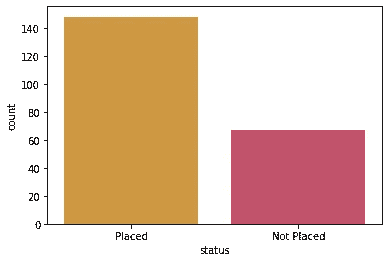

**3.2 性别**

让我们来看看性别对位置是否有影响。

*   在 215 名候选人中，139 名是男性，76 名是女性。

```
data['gender'].value_counts()# Output
M    139
F     76
Name: gender, dtype: int64
```

数据集中有 139 名男性和 76 名女性候选人。

```
sns.countplot(x='gender', hue='status', data=data)
```

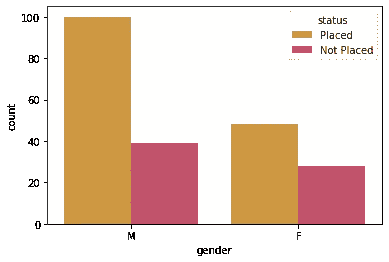

与女性相比，男性获得职位的机会更高。

**3.3 SSC 百分比**

```
sns.distplot(data['ssc_p'], kde=False)
plt.title('Distribution of SSC Percentage')
plt.xlabel('SSC %')
```

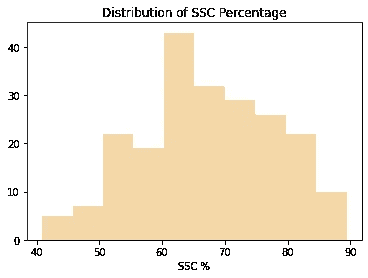

```
sns.catplot(y='ssc_p', x='status', data=data)
plt.xlabel('Employment Status')
plt.ylabel('SSC %')
```

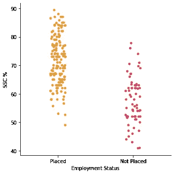

被安置的学生在 SSC 中的比例更高。

## 3.4 **SSC 板**

```
data['ssc_b'].value_counts()#Output
Central    116
Others      99
Name: ssc_b, dtype: int64
```

共有 116 名学生在中央委员会进行了 SSC，其余的候选人在其他委员会进行了 SSC。

```
sns.countplot(x='ssc_b', hue='status', data=data)
```

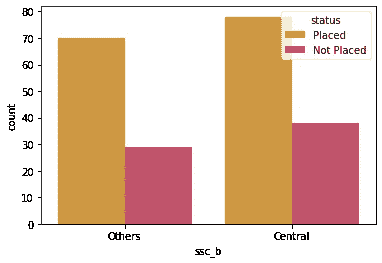

从上面的分析中，我可以说，在招聘候选人时，SSC 董事会对招聘人员来说并不重要。所以我不打算在训练模型时使用这个特性。

## **3.5 HSC 百分比**

```
sns.distplot(data['hsc_p'], kde=False)
plt.title('Distribution of SSC Percentage')
plt.xlabel('HSC %')
```

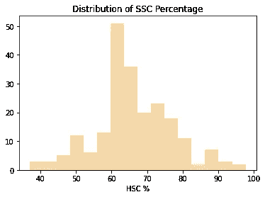

```
sns.catplot(y='hsc_p', x='status', data=data)
plt.xlabel('Employment Status')
plt.ylabel('HSC %')
```

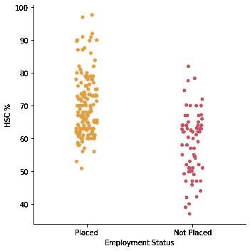

HSC 百分比是重要的特征。因为所有被安置的学生都有较高的百分比。

## 3.6 **HSC 板**

```
data['hsc_b'].value_counts()# Output
Others     131
Central     84
Name: hsc_b, dtype: int64
```

共有 84 名学生在中央委员会参加了 HSC 考试，其余的考生委员会成员是其他人。

```
sns.countplot(x='hsc_b', hue='status', data=data)
```

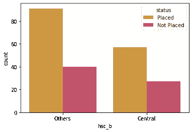

和 SSC 板一样，HSC 板也不重要。因此，我不打算在训练模型时使用这个特性。

## **3.7 HSC 专业化**

```
data['hsc_s'].value_counts()#Output
Commerce    113
Science      91
Arts         11
Name: hsc_s, dtype: int64
```

大多数候选人已经完成了他们的商业 HSC。

```
sns.countplot(x='hsc_s', hue='status', data=data)
```

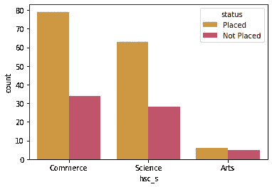

## **3.8。度数百分比**

```
sns.distplot(data['degree_p'], kde=False)
plt.title('Distribution of Degree Percentage')
plt.xlabel('Degree %')
```

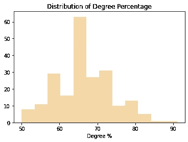

```
sns.catplot(y='degree_p', x='status', data=data)
plt.xlabel('Employment Status')
plt.ylabel('Degree %')
```

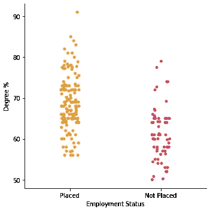

像 SSC 和 HSC 的百分比一样，学位百分比也是获得职位的重要因素。

## 3.9。学位类型

```
data['degree_t'].value_counts()#Output
Comm&Mgmt    145
Sci&Tech      59
Others        11
Name: degree_t, dtype: int64
```

商业和管理学位在大多数候选人中很普遍。而科技以 59 名候选人位居第二，其他学位的学生人数非常少——只有 11 人。

```
sns.countplot(x='degree_t', hue='status', data=data)
```

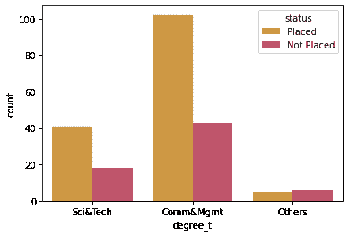

## **3.10。工作经历**

```
data['workex'].value_counts()#Output
No     141
Yes     74
Name: workex, dtype: int64
```

在 215 名候选人中，只有 74 名候选人有工作经验。

```
sns.countplot(x='workex', hue='status', data=data)
```

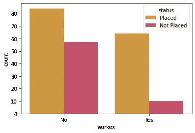

很明显，有工作经验的候选人获得职位的机会更大。

## **3.11。就业测试百分比**

```
sns.distplot(data['etest_p'], kde=False)
plt.title('Distribution of MBA Percentage')
plt.xlabel('Employment Test %')
```

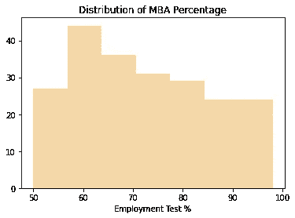

```
sns.catplot(y='etest_p', x='status', data=data)
plt.xlabel('Employment Status')
plt.ylabel('Employment Test %')
```

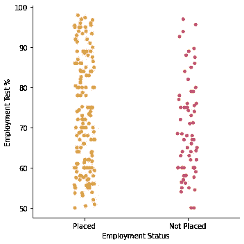

对我来说，就业测试对求职者的就业状况没有太大的影响。

## **3.12。MBA 专业化**

```
data['specialisation'].value_counts()#Output
Mkt&Fin    120
Mkt&HR      95
Name: specialisation, dtype: int64
```

大多数候选人来自 Mkt&Fin 专业，120 人，而 Mkt&HR 只有不到 100 名候选人。

```
sns.countplot(x='specialisation', hue='status', data=data)
plt.xlabel('MBA Specialization')
```

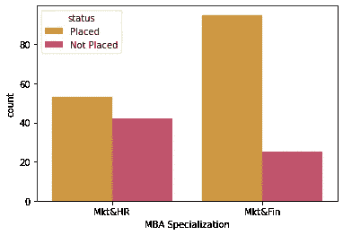

## **3.13。MBA 比例**

```
sns.distplot(data['mba_p'], kde=False)
plt.title('Distribution of MBA Percentage')
plt.xlabel('MBA %')
```

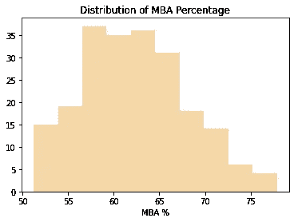

```
sns.catplot(y='mba_p', x='status', data=data)
plt.xlabel('Employment Status')
plt.ylabel('MBA %')
```

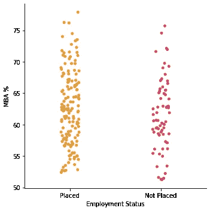

## **3.14。最重要的因素；薪资**

```
sns.distplot(data['salary'], kde=False)
plt.title('Distribution of Salary')
plt.xlabel('Salary')
```

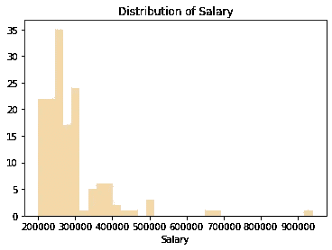

```
sns.catplot(y='salary', x='status', data=data)
plt.xlabel('Employment Status')
plt.ylabel('Salary')
```

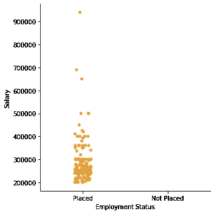

很明显，我们没有未被录用的候选人的工资细节。仅薪金特征就足以对候选人的安置状态进行分类(如果薪金> 0，则安置，否则不安置)。然而，如果我们只想使用一个工资特征，那么我们不需要机器学习，只需要看我们就可以做到。因此，在执行分类模型训练时，我将删除这个专栏。

## **3.15。特征之间的相关性**

```
sns.pairplot(data=data[['ssc_p','hsc_p','degree_p', 'etest_p','mba_p','salary', 'status']], hue="status", diag_kind='hist')
```

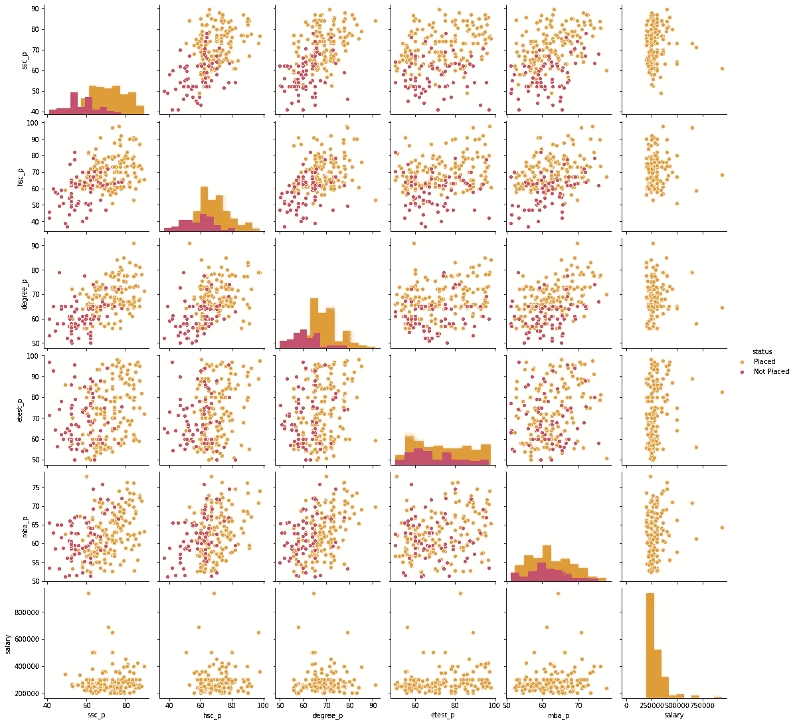

今天到此为止。在下一部分中，我将介绍

*   特征映射和生成
*   模型预测法

# 最后的话

我希望这篇文章对你有帮助。我尝试用数据科学来回答几个问题。还有很多问题要问。现在，明天我将转向另一个数据集。所有数据分析和可视化的代码都可以在这个 [GitHub 库](https://github.com/themlphdstudent/100DaysofDataScience)或者 [Kaggle 内核](https://www.kaggle.com/themlphdstudent/campus-recruitment-eda-classification)中找到。

**感谢阅读。**

我感谢任何反馈。

# 100 天的数据科学进步

[](https://towardsdatascience.com/analysing-and-visualising-the-country-wise-population-from-1955-to-2020-with-pandas-matplotlib-70b3614eed6b) [## 用熊猫分析和可视化 1955 年至 2020 年的乡村人口

### 100 天数据科学的第 1、2、3 天。

towardsdatascience.com](https://towardsdatascience.com/analysing-and-visualising-the-country-wise-population-from-1955-to-2020-with-pandas-matplotlib-70b3614eed6b) [](https://towardsdatascience.com/box-office-revenue-analysis-and-visualization-ce5b81a636d7) [## 票房收入分析和可视化

### 数据科学 100 天的第 4 天和第 5 天

towardsdatascience.com](https://towardsdatascience.com/box-office-revenue-analysis-and-visualization-ce5b81a636d7) [](https://towardsdatascience.com/world-population-from-1955-to-2020-bar-chart-race-166ff307c48e) [## 从 1955 年到 2020 年的世界人口条形图竞赛

### 数据科学 100 天的第 6 天

towardsdatascience.com](https://towardsdatascience.com/world-population-from-1955-to-2020-bar-chart-race-166ff307c48e) [](https://medium.com/python-in-plain-english/data-analysis-and-visualization-using-pandas-matplotlib-and-seaborn-5bc27e8d00c3) [## 使用 Pandas、Matplotlib 和 Seaborn 进行数据分析和可视化

### 数据科学 100 天的第 7 天和第 8 天(印度人民院选举的印度候选人名单)

medium.com](https://medium.com/python-in-plain-english/data-analysis-and-visualization-using-pandas-matplotlib-and-seaborn-5bc27e8d00c3) 

## 关于我

我是 [Durgesh Samariya](https://durgeshsamariya.github.io) ，澳大利亚费杜尼大学机器学习博士三年级学生。

## 在互联网上:

在 [LinkedIn](https://www.linkedin.com/in/durgeshsamariya/) 、 [Instagram](https://www.instagram.com/themlphdstudent/) 、 [Kaggle](https://www.kaggle.com/themlphdstudent) 、 [GitHub](https://github.com/themlphdstudent) 、 [Medium](https://pub.towardsai.net/@themlphdstudent) 上关注我。

如果你喜欢阅读这样的故事，并希望支持我的写作，考虑成为一名[灵媒成员](https://medium.com/@themlphdstudent/membership)。每月支付 5 美元，你就可以无限制地阅读媒体上的故事。如果你使用我的注册链接，我会收到一小笔佣金。

**已经是会员了**？[订阅](https://medium.com/subscribe/@themlphdstudent)在我发布时得到通知。