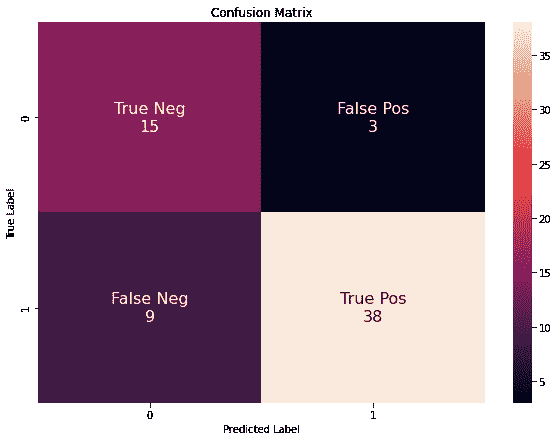

# 校园招聘:EDA 与分类——第二部分

> 原文：<https://pub.towardsai.net/campus-recruitment-eda-and-classification-part-2-ff8bdc634e7?source=collection_archive---------3----------------------->

## [数据科学](https://towardsai.net/p/category/data-science)

## 数据科学 100 天中的第 15 天


照片由[晨酿](https://unsplash.com/@morningbrew?utm_source=medium&utm_medium=referral)在 [Unsplash](https://unsplash.com?utm_source=medium&utm_medium=referral) 拍摄

欢迎回到我的 100 天数据科学挑战之旅。在第 15 天，我在 [Kaggle](https://www.kaggle.com/benroshan/factors-affecting-campus-placement) 上的校园招聘数据集上工作。

你可以在这里阅读我之前的部分:

[](https://medium.com/towards-artificial-intelligence/campus-recruitment-eda-and-classification-part-1-ca07945f3e47) [## 校园招聘:EDA 和分类—第一部分

### 数据科学 100 天的第 13 天和第 14 天

medium.com](https://medium.com/towards-artificial-intelligence/campus-recruitment-eda-and-classification-part-1-ca07945f3e47) 

在第二部分，我将讨论以下主题:

## 内容

*   特征映射和附加特征生成
*   预测模型

# 概述

在最后一部分，我已经将问题陈述定义为“XYZ 大学想要建立一个机器学习模型来知道一个学生是否会被安排。这样他们可以提供特别的关注，帮助他们找到工作，给定的数据集可以被视为一个分类或回归问题。在这个项目中，我将处理这个分类问题，任务是找到一个候选人是否会被安置。这是一个二元分类问题。”— [校园招聘:EDA 与分类—第一部分](https://medium.com/towards-artificial-intelligence/campus-recruitment-eda-and-classification-part-1-ca07945f3e47)。

数据集有 15 个特征，但我们发现其中很少是我们的分析所不需要的。所以我要放弃他们。

所以让我们从去掉不需要的特性开始。

# 特征映射和生成

正如上一节所提到的，让我们删除所有不需要的列。

*   SSC 板
*   HSC 板
*   HSC 专业化
*   学位类型
*   薪水

```
data.drop(['ssc_b','hsc_b', 'hsc_s', 'degree_t', 'salary'], axis=1, inplace=True)
```

如前一部分所述，我们的数据具有一些类别值，例如，性别特征分别具有男性和女性的 M 值和 F 值。

让我们将分类特征映射到数字特征。

分类特征是:

*   **性别**:性别特征有男性和女性价值。我将为男性映射 0，为女性映射 1。
*   **工作经验**:工作经验特性有“是”和“否”两个值。我将 0 映射为否，1 映射为是。
*   **状态**:状态特性未放置和已放置值。同样，对于这些特征，我将 0 映射为未放置值，1 映射为已放置值。
*   **专门化**:专门化特征有两个值 Mkt & HR 和 Mkt & Fin。我将把 0 映射到 Mkt & HR，把 1 映射到 Mkt & Fin。

```
data["gender"] = data.gender.map({"M":0,"F":1})
data["workex"] = data.workex.map({"No":0, "Yes":1})
data["status"] = data.status.map({"Not Placed":0, "Placed":1})
data["specialisation"] = data.specialisation.map({"Mkt&HR":0, "Mkt&Fin":1})
```

让我们检查所有列。

```
data.columns# OutputIndex(['gender', 'ssc_p', 'hsc_p', 'degree_p', 'workex', 'etest_p',
       'specialisation', 'mba_p', 'status'],
      dtype='object')
```

看看我们的最终数据。

```
data.head()
```

现在让我们添加一些额外的功能。

# **附加特征生成**

让我们添加一些新功能。

*   HSC 和 SSC 百分比
*   学位和 HSC 百分比
*   学位和 SSC 百分比
*   工商管理硕士和学位百分比
*   工商管理硕士和就业测试百分比比率

```
# Function to create additional features
def new_features(df):
    df['hsc_to_ssc'] = df['hsc_p'] / df['ssc_p']
    df['degree_to_hsc'] = df['degree_p'] / df['hsc_p']
    df['degree_to_ssc'] = df['degree_p'] / df['ssc_p']
    df['mba_to_degree'] = df['mba_p'] / df['degree_p']
    df['mba_to_etest'] = df['mba_p'] / df['etest_p']

    return dfdata = new_features(data)
```

# 模型预测法

现在，我们的数据已经准备好了，可以准备模型来预测解决方案。有大量的预测算法可供尝试。在这个项目中，我将使用分类算法-K-最近邻、决策树、SVM、随机森林和高斯朴素贝叶斯。

首先，我们需要导入所有需要的库。

```
*# machine learning*
from sklearn.svm import SVC
from sklearn.ensemble import RandomForestClassifier
from sklearn.neighbors import KNeighborsClassifier
from sklearn.naive_bayes import GaussianNB
from sklearn.tree import DecisionTreeClassifier
from sklearn.model_selection import train_test_split
from sklearn.metrics import confusion_matrix, classification_report
from sklearn import preprocessing
```

现在，让我们将数据集分为训练数据和测试数据。

```
*# Separating Features and Target*
X = data.copy().drop('status', axis=1)
y = data['status']*# scale each features*
X_scaled = preprocessing.scale(X)*#Train Test Split*
X_train, X_test, Y_train, Y_test = train_test_split(X_scaled, y, test_size=0.3)
X_train.shape, Y_train.shape, X_test.shape# Output
((150, 13), (150,), (65, 13))
```

# **KNN 分类**

```
*# k-nearest neighbor*
knn = KNeighborsClassifier(n_neighbors = 3)
knn.fit(X_train, Y_train)
knn_Y_pred = knn.predict(X_test)
knn_accuracy = knn.score(X_test, Y_test)
knn_accuracy# Output
0.8769230769230769
```

让我们创建一个混淆矩阵热图

```
*# creating confusion matrix heatmap*

conf_mat = confusion_matrix(Y_test, knn_Y_pred)
fig = plt.figure(figsize=(10,7))
group_names = ['True Neg','False Pos','False Neg','True Pos']
group_counts = ["**{0:0.0f}**".format(value) for value **in**
                conf_mat.flatten()]
labels = [f"**{**v1**}\n{**v2**}**" for v1, v2 **in** zip(group_names,group_counts)]
labels = np.asarray(labels).reshape(2,2)
sns.heatmap(conf_mat, annot=labels, annot_kws={"size": 16}, fmt='')
plt.title("Confusion Matrix")
plt.xlabel("Predicted Label")
plt.ylabel("True Label")
plt.show()
```


```
*# getting precision, recall and f1-score via classification report*

print(classification_report(Y_test, knn_Y_pred))# Output precision  recall  f1-score   support

           0       0.75      0.83      0.79        18
           1       0.93      0.89      0.91        47

    accuracy                           0.88        65
   macro avg       0.84      0.86      0.85        65
weighted avg       0.88      0.88      0.88        65
```

# **决策树分类**

```
*# Decision Tree*

decision_tree = DecisionTreeClassifier()
decision_tree.fit(X_train, Y_train)
decision_tree_Y_pred = decision_tree.predict(X_test)
decision_tree_accuracy = decision_tree.score(X_test, Y_test)
decision_tree_accuracy# Output0.8615384615384616
```

让我们创建一个混淆矩阵热图。

```
*# creating confusion matrix heatmap*

conf_mat = confusion_matrix(Y_test, decision_tree_Y_pred)
fig = plt.figure(figsize=(10,7))
group_names = ['True Neg','False Pos','False Neg','True Pos']
group_counts = ["**{0:0.0f}**".format(value) for value **in**
                conf_mat.flatten()]
labels = [f"**{**v1**}\n{**v2**}**" for v1, v2 **in** zip(group_names,group_counts)]
labels = np.asarray(labels).reshape(2,2)
sns.heatmap(conf_mat, annot=labels, annot_kws={"size": 16}, fmt='')
plt.title("Confusion Matrix")
plt.xlabel("Predicted Label")
plt.ylabel("True Label")
plt.show()
```


```
*# getting precision, recall and f1-score via classification report*

print(classification_report(Y_test, decision_tree_Y_pred)) precision    recall  f1-score   support

           0       0.70      0.89      0.78        18
           1       0.95      0.85      0.90        47

    accuracy                           0.86        65
   macro avg       0.82      0.87      0.84        65
weighted avg       0.88      0.86      0.87        65
```

# **支持向量机**

```
*# Support Vector Machine*
svc = SVC()
svc.fit(X_train, Y_train)
svm_Y_pred = svc.predict(X_test)
svc_accuracy = svc.score(X_test, Y_test)
svc_accuracy# Output
0.8615384615384616
```

让我们创建一个混淆矩阵热图。

```
*# creating confusion matrix heatmap*

conf_mat = confusion_matrix(Y_test, svm_Y_pred)
fig = plt.figure(figsize=(10,7))
group_names = ['True Neg','False Pos','False Neg','True Pos']
group_counts = ["**{0:0.0f}**".format(value) for value **in**
                conf_mat.flatten()]
labels = [f"**{**v1**}\n{**v2**}**" for v1, v2 **in** zip(group_names,group_counts)]
labels = np.asarray(labels).reshape(2,2)
sns.heatmap(conf_mat, annot=labels, annot_kws={"size": 16}, fmt='')
plt.title("Confusion Matrix")
plt.xlabel("Predicted Label")
plt.ylabel("True Label")
plt.show()
```


```
*# getting precision, recall and f1-score via classification report*

print(classification_report(Y_test, svm_Y_pred))precision    recall  f1-score   support

           0       0.70      0.89      0.78        18
           1       0.95      0.85      0.90        47

    accuracy                           0.86        65
   macro avg       0.82      0.87      0.84        65
weighted avg       0.88      0.86      0.87        65
```

# **随机森林**

```
*# Random Forest*

random_forest = RandomForestClassifier(n_estimators=1000)
random_forest.fit(X_train, Y_train)
random_forest_Y_pred = random_forest.predict(X_test)
random_forest.score(X_train, Y_train)
random_forest_accuracy = random_forest.score(X_test, Y_test)
random_forest_accuracy# Output
0.8461538461538461
```

让我们创建混淆矩阵热图。


```
*# getting precision, recall and f1-score via classification report*

print(classification_report(Y_test, random_forest_Y_pred))# Outputprecision    recall  f1-score   support

           0       0.68      0.83      0.75        18
           1       0.93      0.85      0.89        47

    accuracy                           0.85        65
   macro avg       0.81      0.84      0.82        65
weighted avg       0.86      0.85      0.85        65
```

# **高斯朴素贝叶斯**

```
*# Gaussian Naive Bayes*gaussian = GaussianNB()
gaussian.fit(X_train, Y_train)
gaussian_Y_pred = gaussian.predict(X_test)
gaussian_accuracy = gaussian.score(X_test, Y_test)
gaussian_accuracy# Output
0.8153846153846154
```

让我们创建一个混淆矩阵热图。

```
*# creating confusion matrix heatmap*

conf_mat = confusion_matrix(Y_test, gaussian_Y_pred)
fig = plt.figure(figsize=(10,7))
group_names = ['True Neg','False Pos','False Neg','True Pos']
group_counts = ["**{0:0.0f}**".format(value) for value **in**
                conf_mat.flatten()]
labels = [f"**{**v1**}\n{**v2**}**" for v1, v2 **in** zip(group_names,group_counts)]
labels = np.asarray(labels).reshape(2,2)
sns.heatmap(conf_mat, annot=labels, annot_kws={"size": 16}, fmt='')
plt.title("Confusion Matrix")
plt.xlabel("Predicted Label")
plt.ylabel("True Label")
plt.show()
```



```
*# getting precision, recall and f1-score via classification report*

print(classification_report(Y_test, gaussian_Y_pred))# Output precision    recall  f1-score   support

           0       0.62      0.83      0.71        18
           1       0.93      0.81      0.86        47

    accuracy                           0.82        65
   macro avg       0.78      0.82      0.79        65
weighted avg       0.84      0.82      0.82        65
```

我们来比较一下各个模型的精度。

# **最佳表现车型**

```
models = pd.DataFrame({
    'Model': ['Support Vector Machines', 'KNN', 'Decision Tree','Random Forest', 'Gaussian Naive Bayes'],
    'Score': [svc_accuracy, knn_accuracy, decision_tree_accuracy, random_forest_accuracy, gaussian_accuracy]})
models.sort_values(by='Score', ascending=False)
```

KNN 是性能最好的算法，准确率为 87.69%。

# 最后的话

我希望这篇文章对你有帮助。我尝试用数据科学来回答几个问题。还有很多问题要问。现在，明天我将转向另一个数据集。所有数据分析和可视化的代码都可以在这个 [GitHub 库](https://github.com/themlphdstudent/100DaysofDataScience)或者 [Kaggle 内核](https://www.kaggle.com/themlphdstudent/campus-recruitment-eda-classification)中找到。

**感谢阅读。**

我感谢任何反馈。

# 100 天的数据科学进步

[](https://towardsdatascience.com/analysing-and-visualising-the-country-wise-population-from-1955-to-2020-with-pandas-matplotlib-70b3614eed6b) [## 用熊猫分析和可视化 1955 年至 2020 年的乡村人口

### 100 天数据科学的第 1、2、3 天。

towardsdatascience.com](https://towardsdatascience.com/analysing-and-visualising-the-country-wise-population-from-1955-to-2020-with-pandas-matplotlib-70b3614eed6b) [](https://towardsdatascience.com/box-office-revenue-analysis-and-visualization-ce5b81a636d7) [## 票房收入分析和可视化

### 数据科学 100 天的第 4 天和第 5 天

towardsdatascience.com](https://towardsdatascience.com/box-office-revenue-analysis-and-visualization-ce5b81a636d7) [](https://towardsdatascience.com/world-population-from-1955-to-2020-bar-chart-race-166ff307c48e) [## 从 1955 年到 2020 年的世界人口条形图竞赛

### 数据科学 100 天的第 6 天

towardsdatascience.com](https://towardsdatascience.com/world-population-from-1955-to-2020-bar-chart-race-166ff307c48e) [](https://medium.com/python-in-plain-english/data-analysis-and-visualization-using-pandas-matplotlib-and-seaborn-5bc27e8d00c3) [## 使用 Pandas、Matplotlib 和 Seaborn 进行数据分析和可视化

### 数据科学 100 天的第 7 天和第 8 天(印度人民院选举的印度候选人名单)

medium.com](https://medium.com/python-in-plain-english/data-analysis-and-visualization-using-pandas-matplotlib-and-seaborn-5bc27e8d00c3) [](https://medium.com/towards-artificial-intelligence/campus-recruitment-eda-and-classification-part-1-ca07945f3e47) [## 校园招聘:EDA 和分类—第一部分

### 数据科学 100 天的第 13 天和第 14 天

medium.com](https://medium.com/towards-artificial-intelligence/campus-recruitment-eda-and-classification-part-1-ca07945f3e47) 

如果你喜欢我的工作并想支持我，我会非常感谢你在我的社交媒体频道上关注我:

*   支持我的最好方式就是在 [**中**](https://towardsdatascience.com/@themlphdstudent) 上关注我。
*   订阅我的新 [**YouTube 频道**](https://www.youtube.com/c/themlphdstudent) 。
*   在我的 [**邮箱列表**](http://eepurl.com/hampwT) 报名。