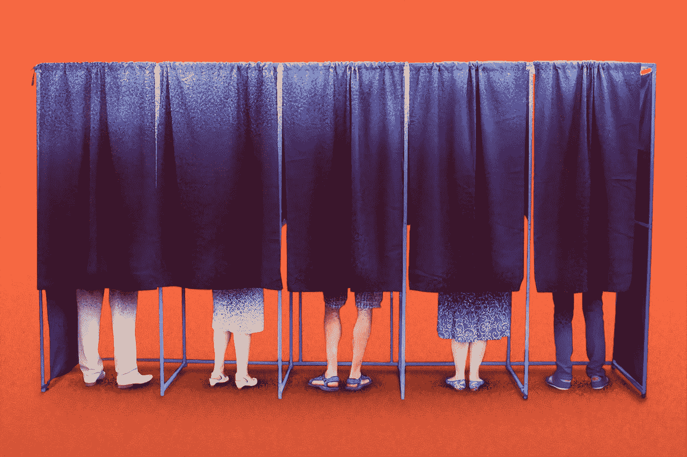
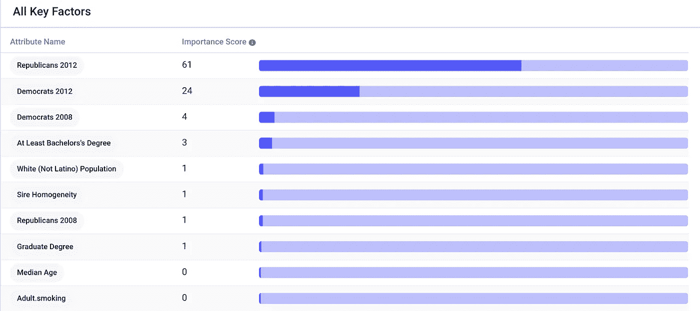
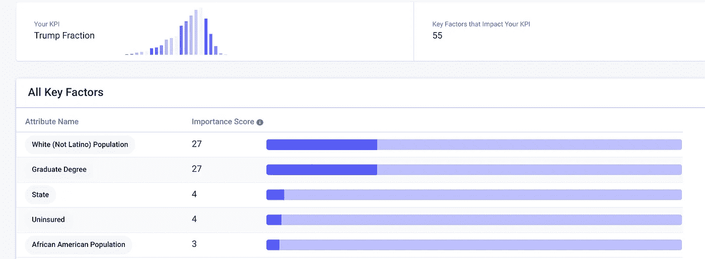
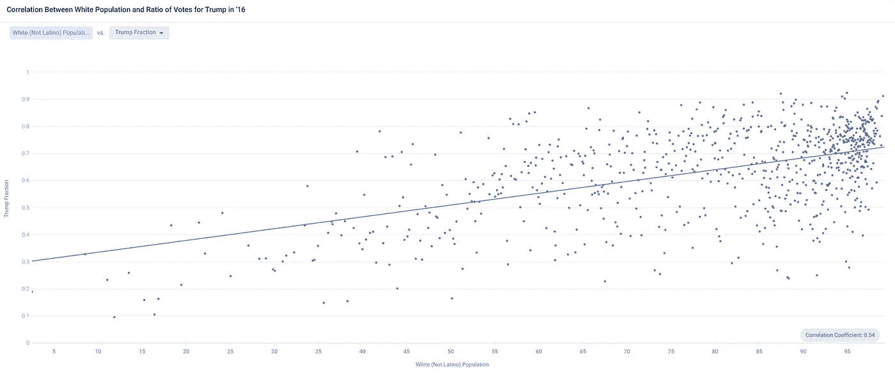
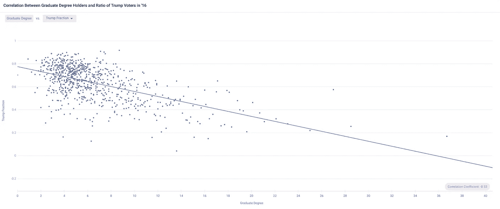

# AI 能否预测 2020 大选？

> 原文：<https://pub.towardsai.net/can-ai-predict-the-2020-election-f48cdce1d7b7?source=collection_archive---------1----------------------->

## [人工智能](https://towardsai.net/p/category/artificial-intelligence)、[未来](https://towardsai.net/p/category/future)、[观点](https://towardsai.net/p/category/opinion)

## 从过去的选举数据中发现洞见。

照片由[晨酿](https://unsplash.com/@morningbrew?utm_source=medium&utm_medium=referral)在 [Unsplash](https://unsplash.com?utm_source=medium&utm_medium=referral) 上拍摄

2020 年美国总统大选的结果正变得越来越不可预测。11 月前会有疫苗吗？有多少人会([能够](https://medium.com/analytics-vidhya/thousands-of-usps-boxes-were-quietly-removed-455bde9807e8))投票？野火、骚乱和冠状病毒会如何改变人们的投票行为？甚至连有多少个摇摆州都没有定论——6 个、 [10 个](https://www.rte.ie/brainstorm/2020/0903/1162977-us-presidential-election-2020-swing-states/)、 [11 个](https://www.irishtimes.com/news/world/us/us-election-the-polls-the-issues-the-swing-states-1.4351522)，或许还有 12 个或更多？

有许多自以为是的论点，但几乎没有一种严谨的方法来分析前所未有的时事将如何影响投票习惯。然而，我们*可以*分析过去的选举，以衡量各种因素对总统选举的影响，并洞察 2020 年可能的结果。

# 数据

我们将使用 Nvidia 的数据科学家在 Kaggle 上分享的数据集。

每一行数据代表一个美国县-有 3，143 个县-包括候选人在以前的选举中获得的票数，以及 100 多个其他属性，包括种族，教育，收入，贫困，人口，年龄，健康，天气等数据。

# 洞察力

正如我在一篇关于[可解释人工智能](https://medium.com/towards-artificial-intelligence/opening-the-black-box-with-explainable-ai-hands-on-d9446fe0978f)的文章中探索的那样，我们可以使用相关性、重要性分数和数据可视化来寻找预测性见解，或者在这种情况下，找出无数属性如何影响 2016 年选举。

我将数据上传到无代码预测洞察工具 [Apteo](https://www.nytimes.com/interactive/2020/us/elections/election-states-biden-trump.html) ，并选择“特朗普分数”作为 KPI 进行分析(简单来说就是 2016 年特朗普选民在特朗普和克林顿选民之和中所占的分数)。

两个最大的因素是在过去的选举中有多少人投了蓝票和红票。第三个最重要的因素是 2008 年有多少人投票给蓝色，而第七个最重要的因素是 2008 年有多少人投票给红色。过去的选举结果加在一起有大约 80%的预测力来解释特朗普的投票比例。

人们倾向于向同一个方向投票，这意味着 2016 年的重演，但我们真的对其他属性感兴趣。在我们的模型中，是否有其他因素被过去的投票习惯所掩盖？

为了找到答案，我简单地删除了描述过去投票数字的列，并重新运行了预测洞察模型。

现在，我们可以看到白人人口的规模和研究生学位持有者的数量对特朗普的选票比例影响最大。这两个因素能够解释我们 54%的 KPI。

如果我们绘制一个县的白人人口百分比与特朗普选民百分比的图表，我们可以看到有某种程度上很强的正相关性(r =0.54)。更简单地说，一个白人县与更多特朗普选民相关。

此外，如果我们绘制一个县拥有研究生学位人口的百分比与特朗普选民的百分比，我们可以看到存在某种程度上很强的负相关性(r =-0.53)。更简单地说，受教育程度越高的县，特朗普选民就越少。

# 对 2020 年的影响

人口统计和教育似乎是投票方向的最大预测因素(除了过去的投票习惯)。考虑到这一点，让我们看看人口统计和教育在过去四年中是如何变化的。

皮尤研究中心广泛分析了[不断变化的人口统计](https://www.pewsocialtrends.org/essay/an-early-look-at-the-2020-electorate/)，发现西班牙裔选民大幅增长，而白人选民相对(百分比)下降，这两个指标对川普来说都不太好。此外，2020 年约三分之一的合格选民将是非白人——创历史新高。

统计数据显示，2019 年拥有大学学位的美国人比 2016 年多了约 3%。

最终，这一数据表明特朗普将输掉选举，但这有很多限制，也许最大的限制是选民众所周知的不可预测，正如 2016 年所证明的那样。算法很难捕捉到选民的行为，但我们的模型可以通过添加其他数据来改进，特别是投票和情绪数据。