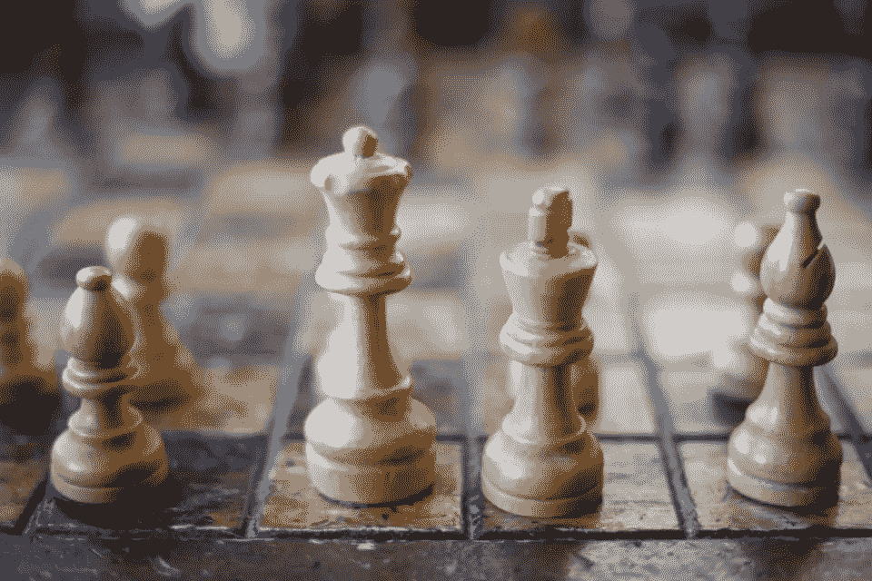
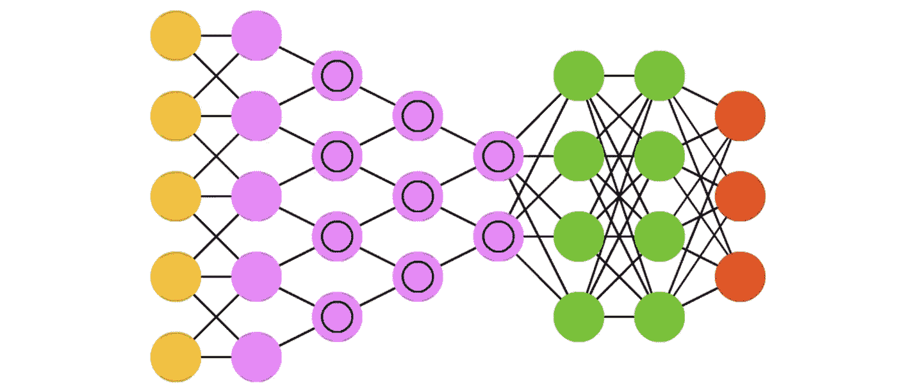
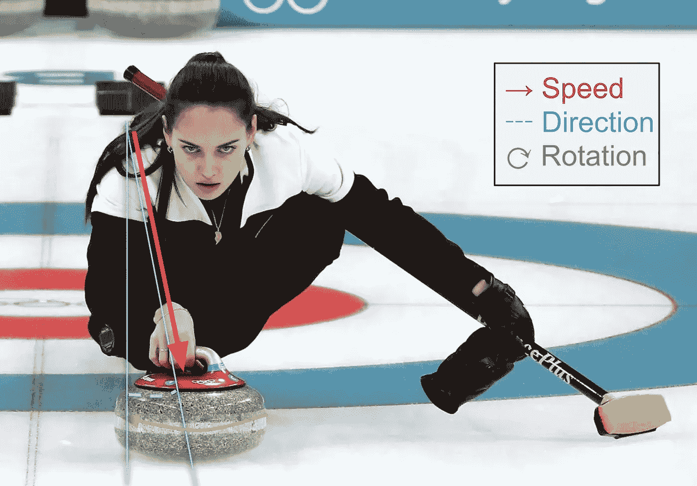
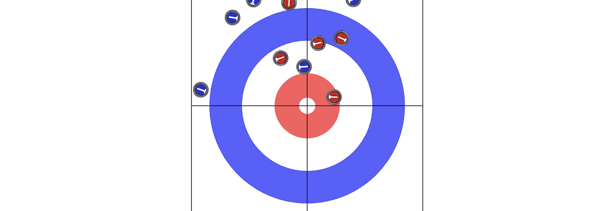
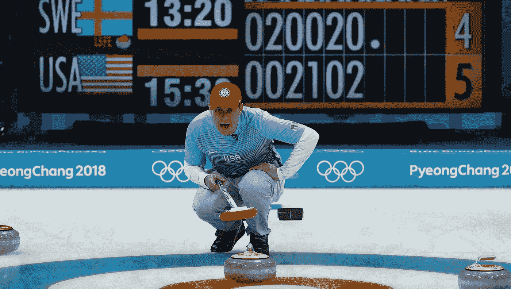
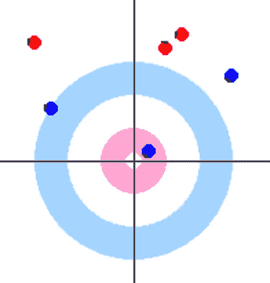

# AlphaZero 应用于一个模拟游戏。

> 原文：<https://pub.towardsai.net/can-alphazero-play-curling-1f02ef58ea61?source=collection_archive---------1----------------------->

## 人工智能，机器学习

## 象棋很难。“冰上”国际象棋要难得多。

AlphaZero 所应用的大多数回合制游戏都有一个共同的特点——它们都是在一块棋盘上玩的，棋盘上有分散的棋子位置。对于围棋、国际象棋、日本象棋和其他许多游戏来说都是如此。

来源:克里斯汀·哈德威克的免费图片

具有离散空间的板可以容易地表示为小图像。棋盘可以放入 8 像素乘 8 像素大小的图像中。作为对比，上面的库存照片是 960 像素乘以 640 像素。卷积神经网络(CNN)是专门设计来进行图像分析的。它比完全连接的人工神经网络(ANN)学习得更快，因为一些神经元连接被先验地移除了*。大多数棋盘可以很容易地用图像来表示。棋盘上的每个棋子都有其独特的值或“颜色”，每个像素对应棋盘上的一个方格。为了表示围棋，只需要 3 个颜色值来表示白、黑和空。*

**

*来源:**卷积神经网络。** [**神经网络动物园**](https://www.asimovinstitute.org/neural-network-zoo/)**[FJODOR VAN VEEN](https://www.asimovinstitute.org/author/fjodorvanveen/)***

***回合制棋盘游戏还有另一个共性:看着棋盘上的棋子，你几乎就能知道下一步该怎么走。这意味着你不需要任何关于游戏的历史数据，或者任何元数据来继续玩游戏。例外的规则有“[三次重复](https://en.wikipedia.org/wiki/Threefold_repetition#:~:text=In%20chess%2C%20the%20threefold%20repetition,need%20to%20occur%20in%20succession.)”或国际象棋中的阉割。AlphaZero 通过将每个规则的附加层作为训练输入来添加这些数据。这意味着你的 2D 形象会扩大一倍或更多。***

# ***冰壶的动作空间***

***动作空间是指在给定时间内可以采取的动作总数。前面提到的棋盘游戏的动作空间是离散的，并且被很好地定义。围棋从 361 个选择开始，而象棋从[开始只有 20 个](https://en.wikipedia.org/wiki/Chess_opening#Classification_of_chess_openings)。***

***冰壶的动作空间是无限的。每次投掷(推石头)有 3 个变量，每个变量都是连续的。***

******

***投掷过程中石头的变量。原始图片来自 Getty Images***

1.  ***石头的初始速度(卷发器松开后)。***
2.  ***投掷方向/偏离中心的角度。***
3.  ***石头的角速度。***

***上述三个参数中的每一个都是连续空间，具有最小和最大值的一些界限。探索无限的行动空间将是一个挑战。在 AlphaZero 的最初设计中，动作空间是离散的，导航是通过蒙特卡罗树搜索来完成的。当反向传播一个动作的成功和失败时，拥有离散的动作对于学习步骤也是至关重要的。遗憾的是，创建离散的动作会丢失它们之间的动作。最初我不想这么做，因为由于游戏的混乱性质，冰壶动作空间的 Lipschitz 常数可能非常高(理论上是无穷大)。我不情愿地采用了这种转换方法:***

*   ***速度分为 16 种可能的值。3 个后卫，8 个平局和 5 个外带的常见重量要求。***
*   ***角度—变成 13 度。发球线上每英尺一个(是的，非常粗糙)***
*   ***角速度转换成每秒 1 弧度的二进制选择。***

***这仍然产生了 400 多个动作。相当多，但不是无限的，但仍然比一个职业选手能做的更粗糙。我接受这样一组粗略的值的原因是我的计算能力有限，这仍然比新手玩家好，如果这个概念证明有希望，我可以随时改进。***

# ***状态矢量空间***

***他们说冰壶是一种英寸的游戏。事实上，这是一场你最好的激光所能测量的游戏。只需观察这块岩石滑动 **120 英尺**并停在与另一块岩石同样的**距离**处。跳到第 6 分钟，看他们如何测量。***

***将冰上岩石信息转换成像素化图像(如 CNN 所要求的)会严重破坏玩游戏所必需的数据。试图将一个具有连续状态空间的博弈表示为“棋盘”会破坏信息。如果有人想对此进行论证，我会说，在最坏的情况下，允许的分辨率必须是十分之一英寸。在一个典型的冰壶冰原中，“盒子”(可玩区域)是 15 英尺×27 英尺。这将产生分辨率为 1800 × 3240 的板。在信息方面，这比一个 8×8 的棋盘大 90，000 倍。这在计算上是不可行的；至少用我的资源是不行的。对于较低的分辨率，人们可以“模糊”数据，但会遇到“重叠”石头的问题。***

***为了解决这个问题，我修改了卷曲数据的表示。我没有将数据视为图像，而是将其组织为石头坐标表:***

******

***[curling.gg](http://curling.gg)***

***此外，还包括其他数据，用于指示石头是已经扔出还是尚未扔出，以及它是仍在冰上还是被移出游戏(撞到墙、走到房子后面或违反 5 块石头规则)。这种数据布局不再是图像，可以像浮点一样精确。在上面的例子中，为了更好的阅读，我已经截断了数字。为了在这种格式上训练 AlphaZero，我修改了 CNN 的原始模型，使之成为一个完全连接的 [ANN](https://en.wikipedia.org/wiki/Artificial_neural_network) 。***

# ***决策树的深度***

***在各种棋盘游戏中，还有一点需要注意，那就是一个游戏可以进行的最大回合数。Game Go 没有“撤销”的概念，所以保证游戏结束前最多有 19 × 19 = 361 个回合。如果没有 50 步规则，国际象棋理论上是无限的(棋子可以回到原来的位置)。因此，在国际象棋中，理论上一局棋的最大走法数是 [5899](https://chess.stackexchange.com/a/4119) 。***

***冰壶每端的圈数非常有限:正好 16 圈，不多也不少。这将使决策树变小，除非动作空间是无限的。***

***另一个挑战是，仅仅观察冰上石头的位置绝对不足以做出下一步行动的最佳决定。当务之急是要知道终点内的“回合数”——意味着已经扔了多少颗石头。实际上，知道当前正在播放的是哪一个*结尾*以及总比分是多少也是很重要的。这三个值中的任何一个的变化都能够并且确实产生最佳行动的不同选择。对于这个项目，我已经决定集中精力赢得一个结束，而不是整个游戏。***

# ***冰壶得分的复杂性***

***在像围棋这样的游戏中，可以玩多个游戏，并且可以保持*胜*的分数。单次获胜可以包括吃掉整块棋盘，也可以只赢一枚棋子。不管怎样，这都算一次胜利。所以，如果我跟你打，输了 100 分，然后我们再打一次，我赢了 1 分——我们打成平手。***

***冰壶就不是这样了。一场冰壶比赛有多个终点。每端可赢或输 8 分。最终得分是所有得分的总和。***

***这对于卷发器来说是非常重要的一部分:模拟只运行比赛的单端。实际上，这完全没有意义。有一个简单的，边界线保证的方式，赢得一个结束。然而，在冰壶游戏中，游戏的分数是在多个回合中累积的**，回合顺序取决于谁在前一回合获胜。这意味着从策略上来说，得分 1 通常比得分 0 差，而得分 0 又比得分 2 差。然而“偷”1 分(当另一个队有优势时得到它)是一件伟大的事情，但真正让你受益的只有 1 分。*****

******

***你可以看到每个人都在回避 1 分。你看到的美国是一个“偷”，所以这是一件好事。盖蒂图片社。***

***如果不对 AlphaZero 算法进行重大修改，我无法让它工作(模型永远不会收敛)。所以得分“权重”保持线性。此外，关注得分是一种策略，而不是规则，因此应该由 AlphaZero 在没有人工输入的情况下得出结论。***

***不过，我确实对 AlphaZero 的评分算法做了一个值得注意的改动。当比较一个新模型和以前的模型时，获胜者是由分数的总和决定的(就像在真正的冰壶比赛中一样)，而不是由获胜的总数决定的。这意味着**每端得分 2 分或更多的模型将赢得**对获得保证 1 分的模型。***

# ***模拟和计算***

***我用 python 写了一个冰壶模拟器，使用了 [Pymunk](http://www.pymunk.org/en/latest/) 物理库和一个 UI 层，使用了 p [ygame](https://www.pygame.org/) 。为了获得 20 秒的拉伸时间，表面摩擦系数被设定为 0.02，这是从自然法则推导出来的。释放时的角速度设定为静态的 1 rad/s(这在 20 秒内产生大约 3.2 整转)。由于一阶导数高斯函数是宝石速度&角速度的函数，实际卷曲力是手动添加的。增加的力导致大约 5 英尺。“拉伸”重量和大约 1 英尺的卷曲。用于“控制”重量。这与非冠军俱乐部质量冰一致。***

******

***pygame 可视化的[阿尔法零冰壶](https://github.com/mikhail/alpha-zero-curling)***

***对于 AlphaZero，我从一个针对一般问题的开源 python 项目[开始。我修改了它，以尊重冰壶评分规则，并允许使用 ANN 代替 CNN 的浮点精度。我的修改也是开源的，可以在 GitHub 上获得。](https://github.com/suragnair/alpha-zero-general)***

***没有模拟扫的概念。***

## ***贮藏***

***在给定离散动作空间的情况下，在冰壶模拟中有用的一个 CS 策略是缓存一些结果的能力。缓存在像国际象棋或围棋这样的游戏中没有用，因为重复的情况不太可能出现。对于冰壶，我想到了一种方法来缓存一些常见的状态。我没有创建一个缓存，而是创建了 16 个独立的 [LFU](https://pypi.org/project/memoization/) 缓存集。这些贮藏是根据游戏中的石头数量来使用的。这意味着石头 15 和 16 上的高度混乱的情况不会驱逐石头 1 和 2 上的高度频繁的情况。这种缓存将现有的状态+动作映射到下一个状态。***

***此外，缓存以规范形式存储，因此红色玩家的模拟可以用于蓝色玩家的缓存。***

# ***学习到目前为止***

***由于我无法使用强大的计算农场，我无法将培训提高到有竞争力的水平。然而，即使只有几次迭代，它也知道越靠近目标的中心越好。***

***阿尔法零号 10 秒后开始盘旋。通过 [curling.gg](http://curling.gg) 可视化。***

***你会注意到这类似于第一次玩游戏。只是在房子里放一些石头(贪婪的方法)和其他的石头是没有意义的。没有学过警卫或外卖的概念。***

***我正在继续训练这个系统，希望能发现一个不为今天的人们所用的策略。***

***在 4-rock 规则期间，一个常见的模式是非锤子的第一个岩石被放置为中心后卫。随着新的 5 块石头规则，许多人仍然这样做，但在房子里放置第一块石头而不是守卫变得越来越普遍。我很好奇阿尔法零会得出什么方法最有可能赢。***

***铁锤帮的策略是制造护角，保持中心开放。专家的动作包括丽莎·威格尔著名的勾手投篮，将一名中锋分成两名后卫。我很好奇阿尔法零是否会采取这种策略。***

***我有点担心的是，这种模拟发现的任何东西都不会被人类复制，因为这种模拟没有错误。***

# ***其他考虑***

## ***训练速度***

***当前的实现有一个计算瓶颈，它不是神经网络学习部分。实际的物理模拟要慢几个数量级，而且几乎没有受益于并行化。如果我可以并行执行多个 MCTS，那么我就可以更快地训练这个网络，并获得更好的结果。***

## ***“附近”的行动***

***MCTS 不考虑“附近”的行动。对行动的微小改变可以带来进步。一旦选择了一个动作，我会考虑执行一个“最小化”的动作，其中会考虑浮点值。一些方法，如鲍威尔或 Levenberg-Marquardt 最小化将有所帮助。训练部分将保持不变，因此学习的反向传播将到原始动作，而不是最小化的动作。一篇有趣的论文“[执行不确定的连续动作空间中的蒙特卡罗树搜索](https://www.ijcai.org/Proceedings/16/Papers/104.pdf)”谈到了使用一个核平均出已知节点来估计一个节点。如果我们不必执行反向传播，这将产生对下一步要采取的行动的有用见解。***

***该模型还应该包含哪些其他功能？有什么办法可以加快速度吗？我还应该考虑什么？下面给我留些评论吧！***