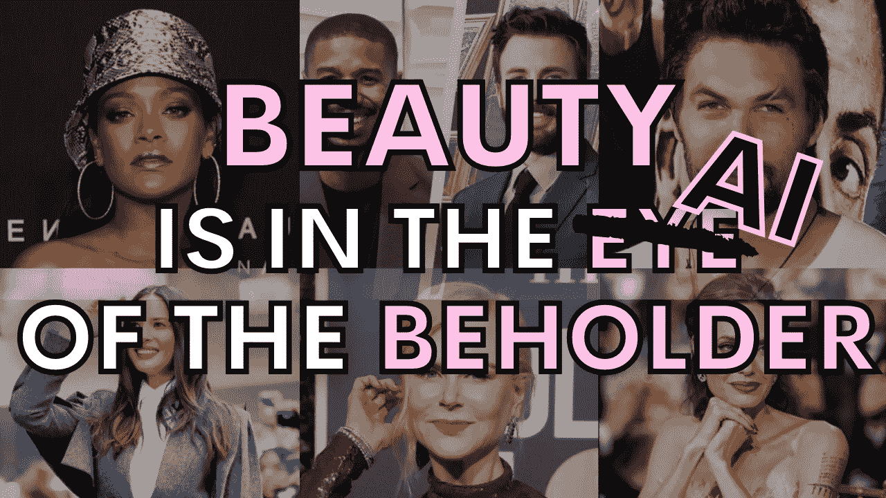
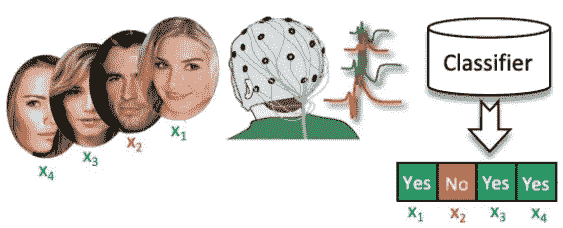
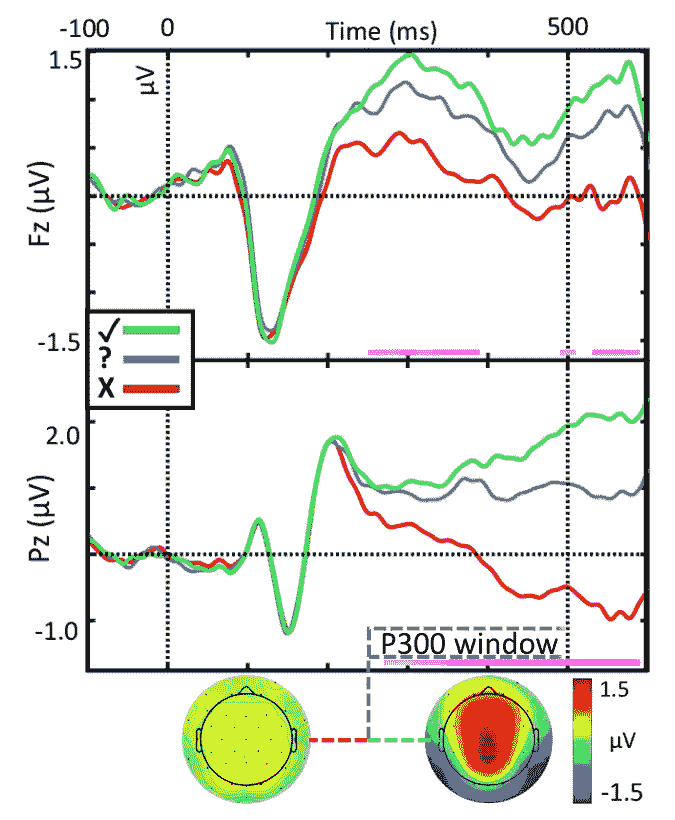
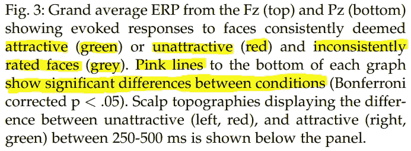
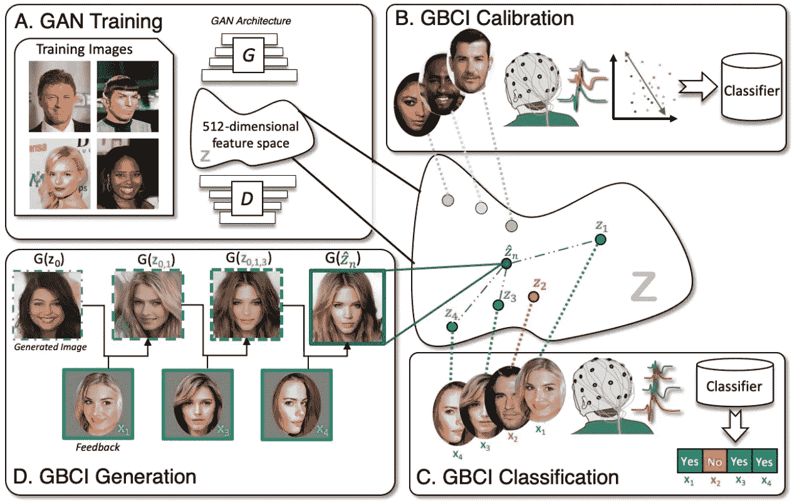

# 一个 AI 能理解美对我们来说是什么吗？

> 原文：<https://pub.towardsai.net/can-an-ai-understand-what-beauty-is-to-us-f109640fd6ea?source=collection_archive---------2----------------------->

## [人工智能](https://towardsai.net/p/category/artificial-intelligence)

## 这个可以读取你的大脑来生成有个人魅力的面孔！

作者图片

我想你们都会同意，当你看着某人，发现这个人很有魅力，你无法解释为什么。这个决定可能有很多原因。另外，其中一些原因甚至可能与人的体质没有直接关系。

尽管如此，当你看某人的照片时，你会立刻知道这个人是否有吸引力(根据你的标准)。你对此毫不怀疑。但是**怎么会这样**？我们能解释或**理解什么是美吗**？更糟糕的是，别人能理解我们觉得什么是美吗？美是普遍的还是主观的？对我来说，这绝对是主观的东西，就像艺术一样。正如我们所说的，

> 情人眼里出西施

不是吗？但是，为什么特定的人会成为演员或模特而不是其他人呢？有没有一种我们可以解释的普遍“美”？美是文化的、生物的还是两者的混合？我认为这些大多是哲学上的争论，我们可以在评论中讨论，如果你们愿意的话。我很乐意和你聊天，甚至讨论这个问题！

不管怎样，回到我们所知道的美。正如我们所知，人类通常会对有吸引力的图像做出情感反应，而不是纯粹基于理性的、视觉上突出的原因，这就是为什么美如此主观。但是，有没有一种方法可以理解我们对美的看法，并利用这些信息创作出吸引人的图片呢？我们能理解大脑发出的信号来实现这一点吗？通过这些信号我们能读懂它吗？

图片来自[【1】](https://researchportal.helsinki.fi/en/publications/brain-computer-interface-for-generating-personally-attractive-ima-2)

这就是赫尔辛基大学的 Michiel Spapé和他的团队在他们最近的论文“生成个人魅力图像的脑机接口”中试图做的事情。你在这里看到的被称为脑电图或脑电图。这是一种使用沿头皮放置的电极来记录脑电活动的监测方法。

具体来说，他们用这些电极跟踪了两个不同的通道，这些电极已知会对 1)新奇或情感唤起或 2)精神要求高并与工作记忆更新相关的刺激做出反应。这意味着刺激是不可能的，需要精神或身体的反应。但是他们在实验中采用了两种策略:

1-他们让那些被认为有吸引力的图像相对不可能出现。他们要求参与者通过在脑海中数出有吸引力的面孔出现的次数，将注意力集中在这些面孔上。

对我来说，这些策略似乎对检测实际吸引力有相当大的偏见，其中信号反应主要告诉我们两件事:
1)这个人有点惊讶，因为有吸引力的照片很少，2)这个人在精神上很活跃，试图记住并添加计数。我个人认为这种询问对方是否觉得这张脸有吸引力的方式有些矫枉过正，因为它并不能衡量所看到的图像的“美”。在这里，我甚至没有输入他们用来训练他们的模型的数据集的细节，这个数据集只由名人组成。尽管如此，这无疑是一个很好的方法来找出哪些脸是有吸引力的，或者训练他们的模型专注于漂亮的脸，这是 GANs 的一个非常酷的应用。

图片来自[【1】](https://researchportal.helsinki.fi/en/publications/brain-computer-interface-for-generating-personally-attractive-ima-2)

如你所见，这显然奏效了。稍微延迟一段时间后，反应会有显著的不同，从显示图像后大约四分之一秒开始，也就是粉色线的位置。这里显示了我刚才提到的双通道响应；顶部显示了负责新奇和情感唤起刺激的额叶反应，而底部是负责精神需求刺激的顶叶反应。这里，被认为有吸引力的脸用绿色表示，没有吸引力的用红色表示，不一致的反应用灰色表示。这些不一致的回答表明，该数据由于可信度低而未被使用。当两个电极都为漂亮的面孔唤起更多的积极性时，吸引力是有把握的。

现在让我们看看他们是如何创建这样一个模型来利用这种大脑活动生成有吸引力的面孔的。起初，他们需要生成随机图像来展示测试对象。为了做到这一点，他们在 200，00 0 张名人脸的图像上使用了 GAN 模型训练(A ),这已经引入了一种偏见，但是，让我们继续下去。然后他们有了第一个潜在空间，可以用来生成新的人造图像，如下图所示。稍后我会多谈一点这个潜在空间。

图片来自[【1】](https://researchportal.helsinki.fi/en/publications/brain-computer-interface-for-generating-personally-attractive-ima-2)

请注意，这就像任何其他 GAN 模型一样，如 deepfakes。它与我在之前的视频中已经解释过的非常相似，并且您肯定知道它是如何工作的，所以我在这里不再赘述。但如果你对 GAN 不熟悉，我肯定推荐你看下面我做的解释 GAN 架构的视频。

然后，每个参与者被要求浏览随机生成的图像。
记住，在这里，当他们在心理上看到一张迷人的脸时，他们必须数数。一旦所有的结果都被汇编，他们就根据这些包含图像主观评估的大脑输出信号训练一个分类器。理想情况下包含该脸是否有吸引力。一旦分类器被训练(B)，它被再次用于随机生成的图像上的脑电响应(C)。
注意，所有这些随机生成的图像都来自最初由在第一步中训练的 GAN 的编码器创建的潜在空间。

正如你在这里看到的，潜在空间是一个空间，其中一个点代表一个输入，生成器可以用它来创建一个独特的图像。这个空间包含了这个生成器可以生成的所有面。因此，当使用该空间中的点生成图像时，或者我们称之为特征向量时，分类器(D)可以认为该图像是否吸引人。如果是这种情况，它将鼓励网络通过选择靠近空间中该点的生成器输入来创建图像，将生成器的注意力集中在子空间上，在该子空间中，所生成的人脸的特征令参与者满意。

最后，这就是如何生成包含人脸上个人吸引特征的最佳值的新图像。我希望你喜欢这篇短文，我也邀请你阅读他们的论文。它非常有趣，写得很好。这是参考文献中的第一个链接！

## 看视频！

如果你喜欢我的工作，并想与人工智能保持同步，你绝对应该关注我的其他社交媒体账户( [LinkedIn](https://www.linkedin.com/in/whats-ai/) 、 [Twitter](https://twitter.com/Whats_AI) )，并订阅我的每周人工智能 [**简讯**](http://eepurl.com/huGLT5) ！

## 支持我:

*   支持我的最好方式是在 [**媒体**](https://medium.com/@whats-ai) 上关注我，或者如果你喜欢视频格式，在[**YouTube**](https://www.youtube.com/channel/UCUzGQrN-lyyc0BWTYoJM_Sg)**上订阅我的频道。**
*   **支持我在 [**上的工作**](https://www.patreon.com/whatsai)**
*   **加入我们的 [**Discord 社区:** **一起学习 AI**](https://discord.gg/learnaitogether)和*分享你的项目、论文、最佳课程、寻找 Kaggle 队友等等！***

## **参考**

**[1] M. Spape，K. Davis，L. Kangassalo，N. Ravaja，Z. Sovijarvi-Spape 和 T. Ruotsalo，“用于生成个人魅力图像的脑-机接口”，发表在 IEEE 情感计算汇刊上，doi:10.1109/taf fc . 101020105**

**摘要——虽然我们会立刻意识到一张脸是有吸引力的，但要解释个人吸引力的确切定义却要困难得多。这表明吸引力取决于对复杂的、文化的和个人定义的特征的内隐加工。学习模拟复杂数据分布的生成对立神经网络(GANs)可以潜在地模拟不受预定义模型参数化约束的主观偏好。在这里，我们提出了生成性脑机接口(GBCI)，将 GANs 与脑机接口耦合起来。GBCI 首先展示了一系列图片，并通过脑电图记录了人们对这些图片的个性化吸引力反应。然后，这些反应被用于控制 GAN 模型，找到与构成对个体有吸引力的图像的特征相匹配的表示。我们进行了一项实验(N=30)来验证 GBCI 使用面生成 GAN 和生产的图像被假设为个别有吸引力。在双盲评估 GBCI 产生的图像与匹配的控制，我们发现 GBCI 产生了非常准确的结果。因此，使用 EEG 响应来控制 GAN 为交互式信息生成提供了有效的工具。此外，GBCI 衍生的图像在视觉上复制了社会神经科学的已知效应，这表明 GBCI 的个体反应和生成性质为绘制个体差异和可视化认知情感过程提供了一个强大的新工具。**