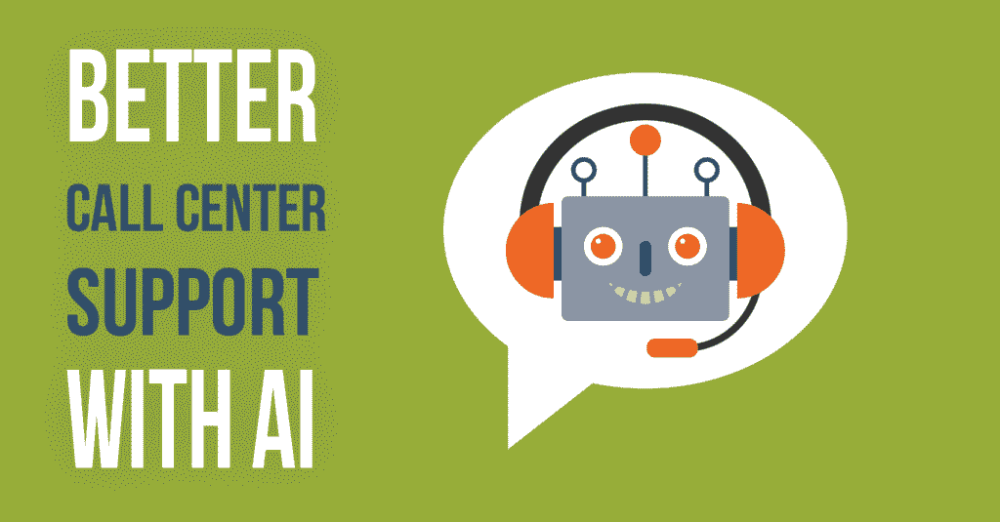
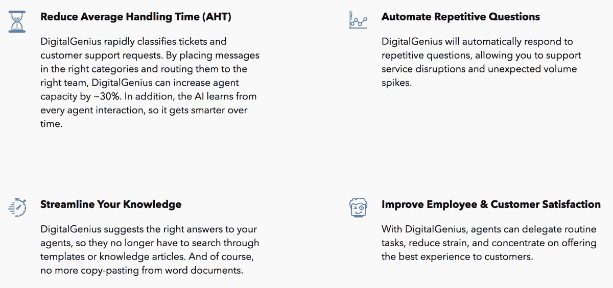

# 人工智能能增强客户支持吗？

> 原文：<https://pub.towardsai.net/can-artificial-intelligence-enhance-customer-support-e6b0c9432629?source=collection_archive---------4----------------------->

## [人工智能](https://towardsai.net/p/category/artificial-intelligence)，[观点](https://towardsai.net/p/category/opinion)

随着顾客服务成为中心舞台，企业热衷于实施新的方法来确保他们的顾客得到无可挑剔的服务。人工智能在帮助企业赢得客户支持方面正迅速获得动力。

通过转变客户服务互动，人工智能支持的数字解决方案准备改善您业务的各个方面，包括在线客户体验、忠诚度、品牌声誉、预防性援助甚至创收。

这篇博客更深入地探讨了这个主题，以传达人工智能驱动的客户服务如何可能帮助在线客户支持代理。

# 人工智能客服:什么是真实？

根据 Zendesk 最近的一项调查，多达 42%的 B2C 客户在体验到良好的客户服务后表现出了更大的购买兴趣。同一项研究还声称，他们中的 52%会因为一次令人失望的客户支持互动而停止购买。

毫无疑问，前瞻性思想家认为人工智能技术是一种解决方案，将为客户服务平台的实时自助服务打开大门。此外，这项技术确实有足够的力量改变客户服务解决方案的设计方式。然而，关于人工智能辅助反应将如何完全取代对人类代理的需求，有一个大规模的炒作。

尽管人工智能最令人兴奋的地方在于它的两大功能:

1.  机器学习和
2.  自然语言处理

[机器学习](https://marutitech.com/artificial-intelligence-and-machine-learning/)归功于一个强大的计算系统，它搅动大量数据以从中学习。脸书信使，请求建议和垃圾邮件文件夹是机器学习过程的日常例子。

自然语言处理利用人工智能软件处理和解释口头/书面信息的能力，支持您与人工智能软件的日常交互。Siri、Cortana、Alexa 是基于自然语言处理的聊天机器人进化的最好例子。

人工智能主要围绕这两种创新能力来推动客户支持代理的工作。它的认知计算能力使企业能够向客户提供高效的服务。

让我们更多地了解人工智能究竟能为今天在呼叫中心工作的客户服务代表和他们所服务的企业做多少事情。

**艾作为品牌使者**

在过去的 5 年里，我们看到社交媒体上充斥着大量使用消息应用的人。他们慷慨地依赖消息应用程序，不仅是为了与封闭的人交流，也是为了接触他们好奇或熟悉的品牌。这就是为什么人工智能驱动的定制实时消息机器人服务可以为企业提供与新老客户联系的绝佳机会，并形成独特的收入流。

Facebook Messenger 利用强大的聊天机器人，并基于这一想法集成了认知能力。其他正在向这一领域发展的领先行业包括时尚、旅游、食品连锁、航空、电子商务、酒店等。消费者很高兴欢迎新的人工智能技术为他们提供服务，他们很高兴与他们最喜欢的品牌互动，以预订航班，酒店住宿，旅行或获得时尚提示。全世界都在热切地关注着下一个顺应这一趋势的行业。

**消息灵通的艾行动**

人工智能凭借其多任务处理和自动查询快速响应的巨大能力，正在迅速颠覆客户服务领域。通过限制研究时间和提供可观的行动计划，人工智能辅助的客户服务平台自动化可以以人类无法提供的准确性和速度做出响应。

根据 Forrester [关于客户服务趋势的报告](https://www-01.ibm.com/marketing/iwm/dre/signup?source=urx-19703&S_PKG=ov61199)，我们已经步入了自动化、更智能和更具战略性的客户服务时代。个人将欣赏由人工智能驱动的智能代理提供的先发制人的行动。

[用于客户服务的人工智能](https://marutitech.com/chatbots-and-service-industry/)不仅会使自助服务界面更加直观和经济，而且它的智能将有助于从客户的背景、以前的聊天记录和偏好中了解客户的具体需求。人工智能集成系统将捕获无限在线数据，以便:

*   识别客户问题
*   处理收集的信息并从中学习
*   定义客户行为模式
*   确定他们的频繁决策和偏好
*   用解决方案和合适的产品来回应
*   使用主动警报消息进行提示
*   建议个性化的优惠和折扣
*   提供实时支持(常见问题解答、帮助博客、报告)
*   在问题到来之前解决它们
*   将客户放弃率和投诉降至最低

有了如此广泛的智能帮助和先发制人的建议，公司将留下丰富的客户体验。

**一次性投资获得永恒的价值**

节约成本是当今企业的第一要务。说到呼叫中心实践，它需要大量的金钱和时间来雇佣和培训客户服务人员，以及建立完整的实体基础设施。仅仅 10 个支持人员就可能让你损失 35000 美元，如果新员工频繁离职(呼叫中心行业的人员流失率相当高)，甚至更多——这是一场噩梦。

另一方面，通过人工智能支持的客户服务平台自动化响应可以通过减少成本和时间来最大限度地减轻这一负担。这就是作为人工智能平台的[沃森](https://www.ibm.com/watson/call-center-ai/?cm_mmc=OSocial_Blog-_-Watson+Core_Watson+Core+-+Conversation-_-WW_WW-_-10+reasons+why+Blog+2+10+2&cm_mmca1=000027BD&cm_mmca2=10004432&)所做的。它是一个预编程的智能系统，充满了特定领域的知识。它只需要被训练，就一次。引入新的流程变更后，只需重新配置软件，而无需重新培训您的所有支持人员。

这种人工智能辅助平台接管相同的例行客户请求，使呼叫中心员工能够处理手头更重要和更繁重的任务。

**使用人工智能的多种支持渠道**

人工智能技术不仅仅是为客户提供直接帮助，它还可以用于引导客户服务。当问题变得复杂时，智能支持系统将有一定的能力将客户引向并行支持渠道。例如，如果电信客户服务代理无法解决有关技术网络问题的查询，chat AI 可以将问题识别为特定于专用支持渠道的问题，并将客户转移到该渠道。

因此，人工智能为客户服务过程带来了综合平衡的支持系统。在客户获得高效解决方案的同时，代理商履行他们的服务承诺，将繁忙的支持渠道从繁忙中解放出来。

**提供额外支持的机器学习**

如果不是直接的，人工智能对客户和服务代理来说也是间接的。人类代表可以获得他们服务 B2C 客户所需的额外帮助。它可以通过代表代理及时发现和提供解决方案来加快解决过程。通过从频繁解决的重复问题中学习，机器学习能力使客户支持能够为聊天机器人有时无法解决的严峻挑战做好准备。

任何具有人工智能机器学习能力的呼叫中心都可以通过对特定问题提出准确的解决方案来表现良好。人工智能感知人类行为模式的学习潜力可以为代理商和客户做出贡献。

**精确的预测和洞察力**

你一定对亚马逊电子商务应用程序如何根据你频繁的页面访问、购物车商品选择和社交分享知道你想要什么感到惊讶。这就是机器学习算法的本质，它也可以用来预测你喜欢的地方、娱乐或商品。同样，人工智能可以预测客户想要什么，这最终有利于客户服务代理。这种有见地的预测可以转化为客户根据他们的选择、喜欢和访问的内容采取的未来行动。

AI 通过了解对客户生成的票证的最合适的响应，为代理建议下一个最佳行动。这在产品范围和行动数量都很大的企业中非常有用。刚入行的代理尤其会得到大量的帮助和指导。

不仅如此，一旦[预测分析](https://marutitech.com/machine-learning-predictive-analytics/)工具集成到客户支持中，代理就可以通过提前了解客户满意度和整体客户体验来轻松掌握他们的互动质量。

**不间断的发球势头**

谁不欣赏快速响应和不间断服务的客户支持？使用人工智能自动回复的一个令人惊讶的好处是它不受时间限制和假期的影响。这意味着，在任何给定的时刻，客户都将能够与人工智能机器人互动来解决问题。这种不间断的客户服务有助于组织保持 24/7 的响应能力，以解决客户的来电咨询。由于有了持续支持的保证，人工客户服务代表所面临的问题将被有效地消除。

结果是:

*   没有等待时间
*   快速解决
*   迅速升级
*   提高客户满意度
*   高级服务解决方案
*   提高承诺水平
*   提高品牌声誉

**人工智能提供可靠性**

随着客户需求的发展，决心提供最佳质量服务的企业必须整合独特的协助方法，以提供无可置疑的可靠性和灵活性。在一个技术丰富的时代，消费者期望企业提出服务解决方案的方式高度成熟。使用[智能聊天机器人](https://marutitech.com/make-intelligent-chatbot/)的认知知识库，基于服务的行业可以为他们与客户的日常互动提供动力。

如果操作正确，人工智能技术会产生人类难以实现的可靠性。聊天机器人的加入有助于克服人工客户支持代理遇到的所有可能的障碍和痛点。聊天机器人可以:

*   提供免受人为障碍的自由
*   消除所有偏见和障碍
*   在企业和客户之间架起一座桥梁
*   建立可靠和信任的联系
*   通过快速的单次尝试帮助提高品牌声誉
*   旨在提供顺畅、完美的沟通
*   当无法自行解决时，上报客户询问
*   超越人类的负面情绪(愤怒、烦恼、争吵、攻击和暴力)
*   带来重复的生意

**使用 AI 的电子邮件支持**

即使在亚马逊明智的 Alexa 和苹果的 Siri 之后，我们也可以说人工智能技术在经历改进和创新的过程中仍然变得越来越聪明。尽管它的角色是为客户服务的人工智能，但人工智能软件的机器学习能力仍然缺乏某些需要改进和类似人类的敏感性的地方。

当谈到处理电子邮件支持时，人工智能机器人应该在理论上提出建议，并编写适当的草案，以回答客户通过电子邮件的询问。在电子邮件支持中，直接发送给客户的自动回复不会产生太多结果，这让企业很难处理收到的查询。然而，这种情况可以是人工智能驱动的客户服务平台可以解决的问题。

随着从大型数据集学习的能力逐渐发展，人工智能电子邮件支持可以像聊天机器人一样提供某些有意义的解决方案。它可以使用自然语言处理系统来建议帮助文章。它甚至可以为在呼叫中心工作的人获取部分电子邮件草稿。

由于它需要准确的学习，人工智能可以成为服务结构的一项可想象的投资，其中每月的支持对话总量为数千。智能服务可以成为一种高效的解决方案。

**AI 机器人同等精度**

人脑的能力有限，在尽最大努力为人们服务时，经常会出现不准确和缺陷的问题。另一方面，人工智能辅助服务解决方案符合预定的标准和良好的编程效率，从而以最小的 AHT(平均处理时间)提供高质量、直观的客户体验。

由于人工智能聊天机器人具有非常强大的机器学习过程，企业可以确保他们的交付品不会受到损害，并极大地满足客户的期望。因此，我们可以得出结论，人工智能机器人的自动化响应可以最精确地实现商业目标，而不会消耗客户的大量时间和资源。

**数据挖掘转变为个性化**

在网络空间，我们一生都会留下大量的数据。但实际上只有 1/3 值得分析。如果分析和利用得当，组织可以利用它来转变业务和提高品牌参与度。收集如此庞大数据的企业可以利用大数据、人工智能及其机器学习能力的联合力量，让客户的旅程更加生动和个性化。

品牌可以为每个顾客编织引人入胜的产品理论或个性化建议，每天创造无与伦比的顾客流。根据客户的评论和反馈，围绕他们的需求和浏览模式进行导航，并根据单个客户的口味定制网页设计变得很容易。这种程度的人工智能技术对个性化的干预极大地影响了:

*   客户服务互动
*   敬业度
*   CSAT
*   客户保留
*   回头客
*   转换指标

**人工智能辅助人工智能模型的兴起**

随着成熟的企业转向对人工智能的战略投资，为其创新的前端聊天机器人服务提供人工智能增强的客户服务，这种服务正在走向成熟。人工智能以其诱人的优势在全球范围内大放异彩，如提高效率、快速解决问题、准确协助、品牌声誉和增加收入。

[甲骨文在其关于人工智能作为客户服务的研究中](https://www.oracle.com/webfolder/s/delivery_production/docs/FY16h1/doc35/CXResearchVirtualExperiences.pdf)表示，到 2020 年，近 80%的企业已经采用或计划采用人工智能作为客户服务解决方案。

许多企业宁愿投资于人工智能辅助的人工智能代理模型，而不是实施完全自动化的前端人工智能机器人，其中人工智能技术支持人工客户服务代表。

前端 AI 聊天机器人从历史门票、常见问题解答和支持文档中学习，处理常见的一级查询，并在很大程度上帮助优化 AHT(代理处理时间)。人工智能的机器学习赋予智能代理最小化升级事件、促进 FCR(首次接触解决)和降低代理培训成本的能力。

**为客服献上 AI 荣耀**

塔塔咨询服务公司最近的一项调查显示，几乎 31.7%的大公司正在客户服务领域使用人工智能。

在客户服务领域，大规模利用人工智能技术的银行是中国领先的信用卡发行商中国招商银行。该银行的前端机器人由微信信使提供支持，每天处理近 200 万个客户查询。由于大多数查询都很常见，通过人工智能聊天机器人自动回复被证明是一种具有成本效益的解决方案，无需雇用数千名员工。

当谈到人工智能辅助的人工代理模型时，作为客户服务平台提供商的 LivePerson 提供了可观的结果，效率提高了 35%。

荷兰航空公司 KLM 转向 [DigitalGenius](http://news.klm.com/klm-runs-pilot-with-artificial-intelligence-provided-by-digitalgenius) 提供人工智能驱动的客户服务解决方案，并减少查询得到答复前的等待时间。该解决方案让人工智能从实时支持交互中学习，适应回复格式并向人类代表建议回复。

大多数受欢迎的食品连锁店，如赛百味、多米诺骨牌、星巴克，最近都采用了人工智能，使顾客能够在没有任何人类参与的情况下下单。他们可以依靠 Facebook Messenger 聊天机器人，或者简单地告诉亚马逊的人工智能机器人 Alexa，来订购一口。

与其他金融机构一样，美国银行也决心推出基于人工智能技术的智能虚拟银行助理 [Erica](http://newsroom.bankofamerica.com/press-releases/consumer-banking/bank-america-drives-future-digital-banking-2017-mobile-banking-turns) ，这将使数字银行业务更上一层楼。

**结论**

用于客户支持的人工智能聊天机器人正在推进创新的极限，并彻底改变客户获得帮助的方式。AI 意味着高质量的客户体验、个性化的支持、速度&效率和成本节约。在所有业务领域中，客户服务是人工智能被广泛接受的领域，公司对聊天机器人如何有效处理一级查询并大幅降低运营成本充满信心。

[马鲁蒂技术实验室](https://marutitech.com/)提供了无与伦比的自动化客户支持体验，聊天机器人可以实时提供答案。公司可以轻松地[定制聊天机器人](https://marutitech.com/custom-chatbots/)以满足特定的业务需求，解决客户的查询，提供定制内容，同时匹配品牌的声音和语气。

马鲁蒂技术实验室与世界各地的企业合作，提供功能丰富的聊天机器人，并与现有的工具和系统无缝集成。要获得可靠的聊天机器人开发服务，请点击这里与我们联系。