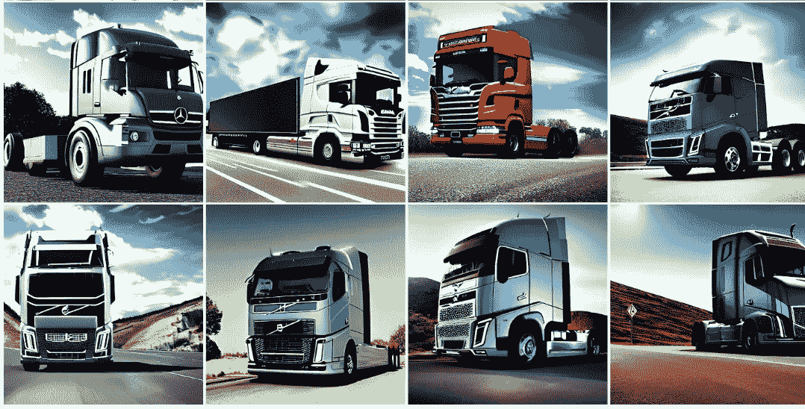
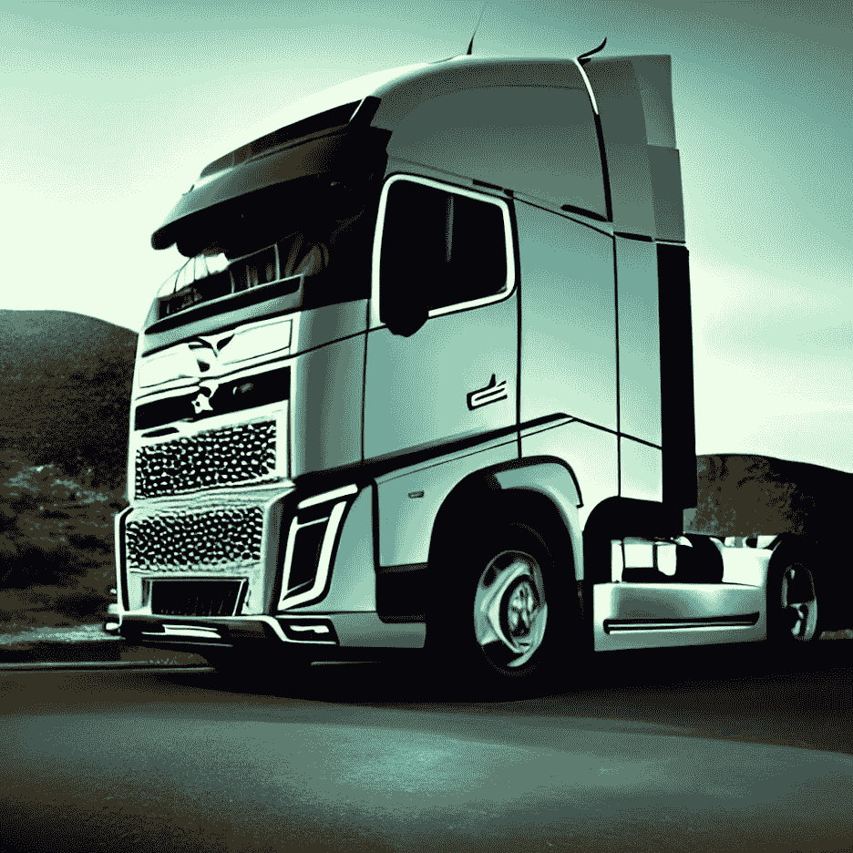
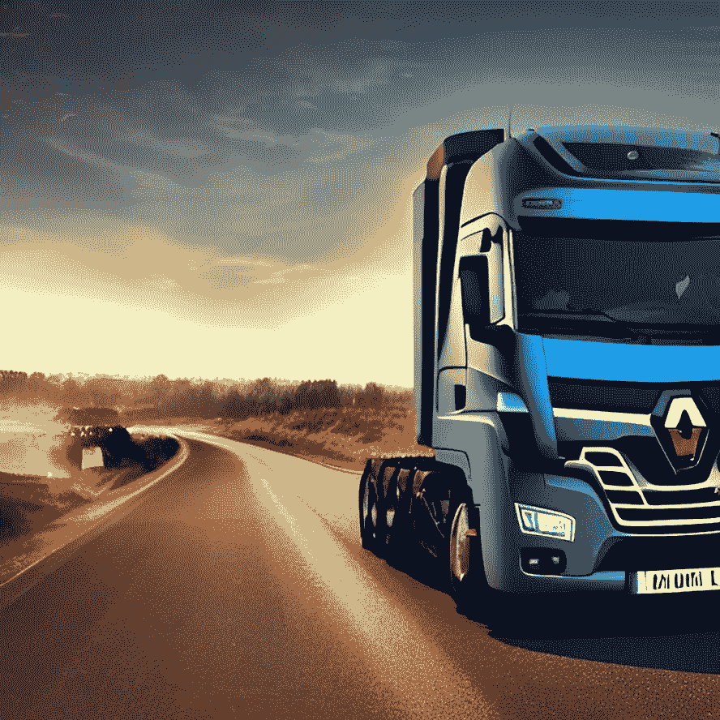

# 人工智能能帮助重型卡车制造业开发新的设计吗？

> 原文：<https://pub.towardsai.net/can-artificial-intelligence-help-to-unlock-new-designs-for-the-heavy-trucks-manufacturing-industry-635058476e43?source=collection_archive---------3----------------------->

这些概念设计是由人工智能创造的——来源:[我的稳定扩散创作](https://www.instagram.com/mystablediffusioncreations/)。

## 简而言之，答案是肯定的，人工智能可以通过分析过去的趋势和预测未来的趋势来产生新的设计。

重型卡车行业是经济中最重要的行业之一。在全球范围内，它们运输了大约 60%的货物，同时平均运载 8 吨货物。

这是一个 1400 亿美元的市场，在全球范围内雇佣了 100 多万人。

从市场角度来看，全球重型卡车份额规模预计将从 2021 年的 1898.8 亿美元增长到 2022 年*的 2062.3 亿美元*，复合年增长率(CAGR)为 8.6%。

在美国，卡车运输公司、仓库和私营部门雇佣了大约 890 万人从事与卡车运输相关的工作；近 350 万人是卡车司机。

作为一个正在经历大规模转型的行业，人们越来越需要更节能、电动和氢动力发动机的新设计，以及更长的航程和更好的安全特性。

在这场变革中，车辆的设计对行业的变化有着巨大的影响，到处都有一个问题摆在行业领导者面前:人工智能能否帮助卡车制造业解锁新的设计？

简而言之，答案是肯定的，人工智能可以通过分析过去的趋势和预测未来的趋势来产生新的设计。

人工智能可以通过分析所有可能的解决方案来帮助设计师找到最佳方案，例如，通过机器学习算法或强化学习，这些算法非常适合这种任务。

这张图片是由人工智能创作的——来源:[我的稳定扩散作品](https://www.instagram.com/mystablediffusioncreations/)

# 人工智能和新的设计机会

人工智能可以帮助设计师了解消费者对他们设计的反应。它还能洞察消费者对汽车的需求。

人工智能可以通过分析所有可能的解决方案来找到最佳方案，从而帮助应对这一新趋势。这可以通过非常适合这项任务的机器学习算法或强化学习来完成。

许多公司在他们的 R&D 团队中使用人工智能来帮助他们探索新的设计。

当然，正如任何人都可以想象的那样，设计一辆重型卡车是复杂的，并且由于需要考虑许多不同的设计因素，通常需要花费数年时间。

人工智能可以提供帮助的一种方式是对设计加以限制。这可以防止设计师偏离轨道，对什么可行，什么不可行进行无益的讨论。

设计重型卡车的人工智能允许设计师在设计时探索更多选项，这比他们在没有人工智能帮助的情况下进行设计需要更少的时间。

这张图片是由人工智能创作的——来源:[我的稳定扩散创作](https://www.instagram.com/mystablediffusioncreations/)。

# 人工智能和设计师之间的新关系

设计师总是寻求产生新想法和探索新领域的方法。然而，他们不能探索所有可能的途径。

有了人工智能，设计师现在可以开发和应用模型，自动创建潜在的无限数量的设计，然后可以共享或改进。

这是令人印象深刻的，并有明显的好处，如节省制造商的时间和人力成本。缺点是计算机不像人类那样有创造力或想象力，人类可能会提出我们甚至无法想象的设计解决方案。

随着新的生成工具的出现，探索新的设计和概念的可能性，有时从一个简单的想法开始，对行业中的每个人来说都更加具体和容易实现。

借助 DALL-E、MidJourney 和 Stable Diffusion 等工具，创意专业人士可以探索更多可能性，不受限制地分享和试验新想法。

此外，结合传统设计工具的生成式模型允许设计师尝试颜色、字体、布局等的多种组合。，培养和成熟尽可能好的设计思想。

有了人工智能，他们还可以节省时间，不必手动重复传统的设计构思。

这张图片是由人工智能创作的——来源:[我的稳定扩散创作](https://www.instagram.com/mystablediffusioncreations/)。

# 有哪些挑战？

重型卡车制造业面临的一些主要挑战是，卡车的设计通常基于特定应用的需要，并且没有通用的设计。

重型卡车的设计也受到其重量和尺寸的限制，这影响了它们的燃料或电力效率。

对于重型卡车制造业来说，也非常需要更加环保的新设计。

重型卡车行业需要这些新设计的原因有很多。例如:

*   第一个原因是我们需要找到创新的方法来确保环境不会因为二氧化碳的排放而受到更多的污染，
*   第二个原因是我们需要减少对化石燃料的依赖，使用可再生能源，
*   第三个原因是减少与全球变暖和气候变化相关的温室气体，
*   第四个原因是我们需要新的设计来将货物从城镇的一个地方运输到另一个地方。

同样在这里，人工智能被用来帮助寻找新的设计，最有效地测试和验证，并帮助 R&D 团队在重型卡车制造业的最佳选项中进行选择。

这张图片是由人工智能创作的——来源:[我的稳定扩散创作](https://www.instagram.com/mystablediffusioncreations/)。

# 最后几句话…

正如我们所见，在汽车制造业中使用人工智能已经成为过去几年的热门话题。

人工智能可以帮助解锁新车辆设计的想法对当今几乎所有制造商都非常有吸引力。

现在，我们也可以指望生成性人工智能作为一种强大的工具，让设计师专注于他们的设计优势，而不是浪费时间在他们不擅长或不喜欢的创造性任务上。

> “人工智能设计将让创意人员专注于他们的实际工作。”—苹果首席执行官蒂姆·库克

# 你可能想读的其他文章。

*   [**快速浏览稳定扩散开源架构的引擎盖下。**](https://medium.com/codex/a-quick-look-under-the-hood-of-stable-diffusion-open-source-architecture-2f07fc1e729)
*   [**我们正在见证人工智能的下一次进化吗？**](/are-we-witnessing-the-next-evolution-of-artificial-intelligence-264f251ea06d)
*   [**这 10 种算法可以改变你的生活——如果你与数据打交道**](/these-10-algorithms-can-change-your-life-if-you-work-with-data-ff544657922d)
*   [**这 9 篇研究论文正在改变我今年对人工智能的看法。**](https://medium.com/illumination/these-9-research-papers-are-changing-how-i-see-artificial-intelligence-this-year-cd8ba548f785)
*   [**5 个非常实用的方法人工智能可以帮助提高你公司的生产力**](/5-very-practical-ways-ai-can-help-to-improve-your-companys-productivity-f4d5dcd0b30c)

# 链接和参考资料，以了解更多信息…

*   模块 2 Art.pdf 的类别——艺术欣赏..
*   人工智能研究如何重塑视频会议。
*   [发展的社区利益——威尔士商业新闻](https://businessnewswales.com/community-benefits-of-development/)。
*   [人工智能将如何改变质量保证的未来](https://www.linkedin.com/pulse/how-artificial-intelligence-change-future-quality-assurance-lanje)。
*   [为什么 NFT 很重要，并将继续重要——CryptoMode](https://cryptomode.com/why-nfts-matter-and-will-continue-to-matter/)。
*   [以下是休斯顿雇主需要知道的关于使用人工的事情…](https://houston.innovationmap.com/amdrews-kurth-ai-hiring-guest-column-2653687693.html)
*   [来自黑人艺术家 2022 |战略家](https://nymag.com/strategist/article/wall-art-from-black-artists.html)的 31 件墙壁艺术作品。

# 你愿意支持我吗？

*为了获得无限的故事，你也可以考虑* [*注册*](https://medium.com/@jairribeiro/membership) *成为中等会员，只需 5 美元。另外，如果你* [*使用我的链接注册*](https://medium.com/@jairribeiro/membership) *，我会收到一小笔佣金(不需要你额外付费)。*

 [## 通过我的推荐链接加入媒体- Jair Ribeiro

### 阅读我分享的每一个故事(以及媒体上成千上万的其他作者)。你的会员费直接支持其他…

medium.com](https://medium.com/@jairribeiro/membership)