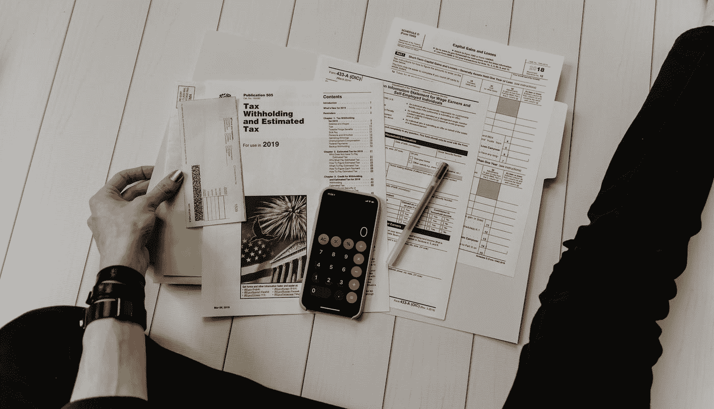

# 可审计的 AI 能提高模型的公平性吗？

> 原文：<https://pub.towardsai.net/can-auditable-ai-improve-fairness-in-models-e50a78eca24f?source=collection_archive---------2----------------------->

## [公平性](https://towardsai.net/p/category/artificial-intelligence/fairness)，[意见](https://towardsai.net/p/category/opinion)

由[凯利·西克玛](https://unsplash.com/@kellysikkema?utm_source=medium&utm_medium=referral)在 [Unsplash](https://unsplash.com?utm_source=medium&utm_medium=referral) 上拍摄的照片

# 不独特，但非常有用

我在 [Wired](https://www.wired.com/story/ai-needs-to-be-audited/) 上读到一篇关于可审计人工智能需求的文章。这将是评估人工智能系统偏差的第三方软件。虽然这听起来是个好主意。但我忍不住想这已经有人做过了。用[谷歌的 what if 工具](https://pair-code.github.io/what-if-tool/)。

作者解释说数据是可以检验的。通过改变一些变量来检查人工智能的反应。例如，如果人工智能判断某人是否应该获得贷款。然后审计会做什么。是检查比赛对贷款的影响。或者性别等等。所以如果一个收入相同但性别不同的人。拒绝贷款。那么我们知道人工智能有一些偏见。

但是作者让它听起来非常独特或者以前从未被做过。但是 Google 的 ML 工具已经有类似的东西了。所以人工智能的创建者已经可以自己审计人工智能了。

但是通过使用第三方有力量。该第三方可以公开发布报告。也不会隐藏对人工智能不利的数据。因此，第三方可以让人工智能的创造者承担更多责任。然后自己做审计。

实际上，这将如何工作？

# 具有可审计 AI 的第三方

我们知道不是所有的人工智能都需要被审计。你的猫 vs 狗不需要审计。

作者说这将是高风险的人工智能。比如医疗决策。或者正义与犯罪。招聘。等等。这是有道理的。

但要让这种方式奏效，这些公司似乎需要买进。例如，如果一家人工智能公司决定进行审计，并发现他们的人工智能存在严重缺陷。没有人因此想要他们的产品。那么企业就不太可能这么做。

也许首先科技公司应该有某种行业监管机构。为如何审计人工智能制定了标准。和一个人要实现的目标。政府的倡议会很好。但我不知道政府目前是否有这方面的知识。制定这样的法规。

审计人工智能。将需要领域知识。

贷款申请中需要改变的变量。对决定病人是否应该得到药物的人工智能来说是不同的。进行审计的人或团队。需要知道他们在测试什么。可以对贷款申请 AI 进行种族主义或性别歧视审计。药物 AI 可以针对某些症状或既往疾病进行审计。但是领域知识是非常需要的。

以医学为例。医生很有可能是审计小组的一员。

在技术方面，您可能希望要求创建者添加额外的代码以使审计更容易。就像某种类型的 API 将结果发送给可审计的人工智能。为每个独立的项目创建一个可审计的人工智能。会很快陷入困境。将需要某种类型的正式标准来使 AI 的审计员和创建者的生活更容易。

这种可审计的人工智能想法听起来有点像网络安全世界中的笔测试。当你对系统进行压力测试时。在这种背景下，我们正在对人工智能如何做出决定进行压力测试。从技术上来说，你可以用同样的想法。用于测试对人工智能的对抗性攻击。但那完全是另外一个问题。

在此基础上，有可能创建一个标准框架。如何测试人工智能。但这取决于人工智能的领域。就像我上面说的。因此，它可能无法扩展。或者可能需要限制标准。因此，它可以涵盖大多数可审计的人工智能情况。

审核一个 AI 时的常见问题:

如何识别与决策相关的重要特征？

如果一项决定是基于哪些特征做出的，那么这些特征可以被归类为歧视？

即性别、种族、年龄

如何确保人工智能不包含任何隐藏的偏见？

诸如此类。

有可能可审计的人工智能。可以由某种类型的行业委员会来完成。所以它可以作为它的监管者。因此，他们可以将自己的框架设定在如何打造可审计的人工智能上。和有领域知识的人一起。以及设计被审计的人工智能的人。记住这些想法和指标。当开发人工智能的时候。

第三方团体的可听 AI。可以作为某种形式的监督委员会。或者调节器。在重要的人工智能发布之前。

对人工智能进行定期审计是个好主意。发布后。因为新的数据会被整合到人工智能中。这可能影响人工智能的公平性。

# 可审计的人工智能是很好的一步，但不是唯一的一步

我认为大部分价值来自监督我们如何实现人工智能的新框架。在许多重要领域。可审计的人工智能只是一个工具。来解决这个问题。

在某些地方，可审计的人工智能工具可能是内部的。我无法想象军方开放他们的 AI 工具。对公众。但是人工智能可以做出好的决定，这对军队是有用的。比如找出是什么触发无人机标记物体和敌方目标。

可审计的 AI 可能只是一个调试 AI 的工具。这是一件好事，别误会。我们都需要的东西。但可能不会惊天动地。

许多人发现。与大公司或政府机构打交道。他们可能会放弃你的报告。继续他们正在做的事情。一家公司声称将开放其人工智能。对于第三方来说，审查是很重要的。公关明智。但是他们愿意做出艰难的决定吗？当可审计的人工智能告诉你。你的人工智能有重大偏见。解决这个问题将会导致收入的严重下降。

公司会行动吗？

问问马克就知道了。

可审计的人工智能是一个伟大的工具，我们应该开发和研究。但它不会用人工智能解决我们所有的伦理问题。

*如果你想了解更多关于社会和科技的交集。查看* [*我的邮件列表。*](https://www.tobiolabode.com/subscribe)