# 多元线性回归可以用实例级统计改进吗？

> 原文：<https://pub.towardsai.net/can-multiple-linear-regression-be-improved-with-instance-level-statistics-27282e6a7070?source=collection_archive---------1----------------------->


安托万·道特里在 [Unsplash](https://unsplash.com/s/photos/math?utm_source=unsplash&utm_medium=referral&utm_content=creditCopyText) 上拍摄的照片

## [数据科学](https://towardsai.net/p/category/data-science)，[统计](https://towardsai.net/p/category/statistics)

## 估计混凝土抗压强度

## 目录:

一、数据集信息
二。下载数据
III。多元线性回归操作指南
四。用实例统计改进多元线性回归模型
五、参考文献

# 一.数据集信息

实例数 1030
属性数 9
属性细分 8 个定量输入变量和 1 个定量输出变量
缺少属性值无

**属性信息:**

给出了变量名、变量类型、测量单位和简要描述。混凝土抗压强度是回归问题。该列表的顺序对应于数据库行中数字的顺序。

名称-数据类型-测量-描述

水泥(成分 1) —定量—m3 混合物中的千克数—输入变量
高炉矿渣(成分 2) —定量—m3 混合物中的千克数—输入变量
粉煤灰(成分 3) —定量—m3 混合物中的千克数—输入变量
水(成分 4) —定量—m3 混合物中的千克数—输入变量
高效减水剂(成分 5) —定量—m3 混合料中的千克数—输入变量
粗骨料(组分 6) —定量—m3 混合料中的千克数—输入变量
细骨料(组分 7) —定量—m3 混合料中的千克数—输入变量
龄期—定量—天数(1~365) —输入变量
混凝土抗压强度—定量— MPa —输出变量

## 二。下载数据

进入此链接:[https://archive . ics . UCI . edu/ml/datasets/Concrete+抗压+强度](https://archive.ics.uci.edu/ml/datasets/Concrete+Compressive+Strength)

单击数据文件夹，如图所示:

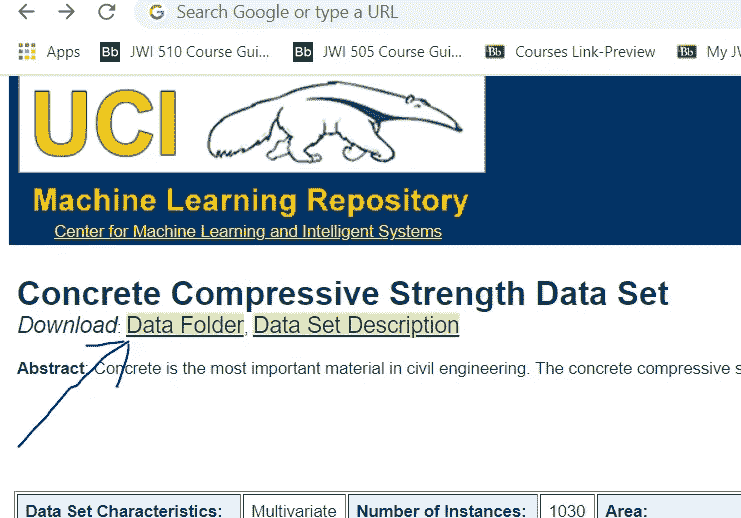

接下来，点击 Concrete_Data.xls 下载它:

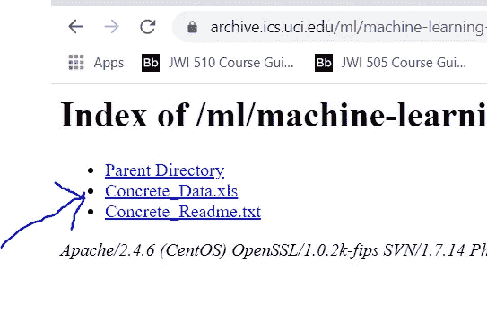

下载后打开文件。

文件整齐地排列在带有标签的列中，因此不需要做任何数据准备。这里的任务是根据其他变量估计混凝土抗压强度(MPA，兆帕)。

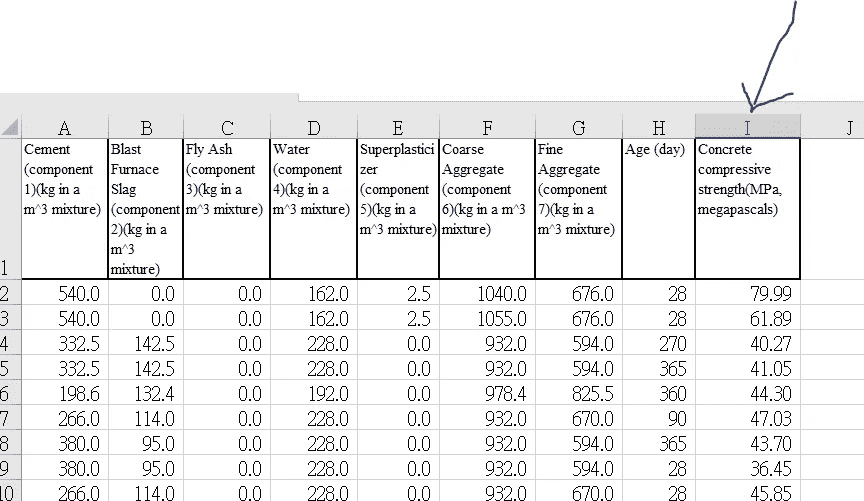

考虑到变量是连续的数值型变量，这里可以用多元线性回归。

## 三。多元线性回归操作指南

在本练习中，我们将使用 excel，但该算法将为您提供包括 python/r 在内的任何其他内容的等效结果。

步骤 1:添加分析工具库。转到文件→选项(这将在左下方)。请参见下图:


单击选项后，将显示以下窗口:

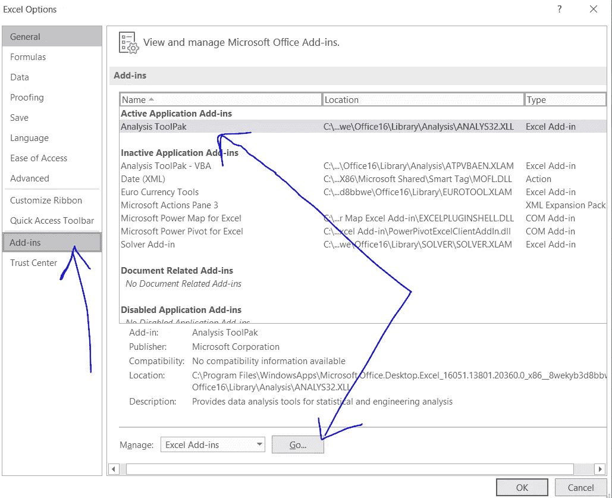

在此窗口中，单击左侧菜单上的加载项，加载项就会显示出来。此时，在您点击分析工具库之后，点击底部的“Go”按钮。

一旦你点击 go，下图将会显示。选中显示的框，然后单击确定:

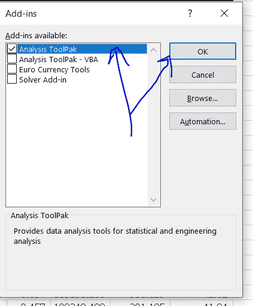

现在，让我们转到 Excel 功能区的“数据”选项卡，如下图所示，然后单击最右侧的“数据分析”:


当您点击数据分析时，将显示:

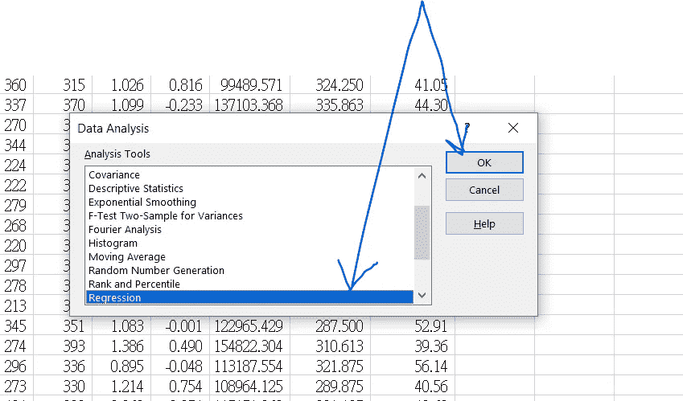

向下滚动到回归，突出显示它，然后单击确定。

您将看到如下所示的窗口。在此窗口中，执行以下操作:

```
Input Y Range --> this is the range of the target variable column which is Concrete Compressive Strength. In this case, it is $I$1:$I$1031Input X Range --> these are all the other columns which will estimate the target variable.  Since there are multiple columns, it is called a multiple linear regression.  In this case the range is $A$1:$H$1031Make sure the Labels box is checked. 
In the output options, output to a new tab and call this "Original". 
The reason to call this original is because we will be increasing the MLR(multiple linear regression later and these tabs will be called different things)
```

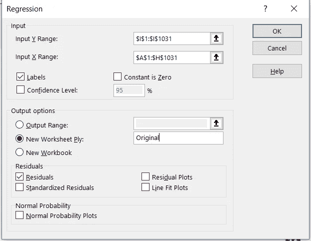

这是输出:

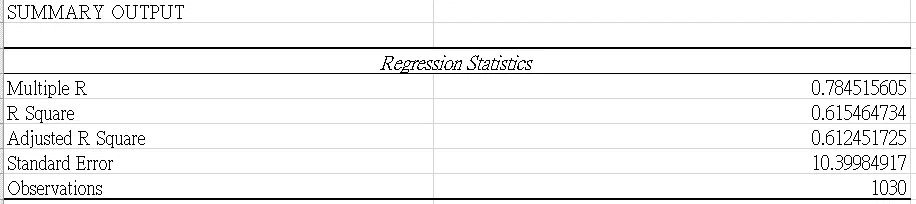

```
R square of .61 means 61% of variance in Y can be explained by the model variables. 
Adjusted R square is .61 or 61% as well and will be used for comparison when variables are added later. Multiple R is the same as R but for multiple linear regression.  There is a 78% correlation between the X variables and the Y variable which is Concrete Compressive Strength. 
```

## 四。用属性统计改进多元线性回归模型

为了提高 MLR，我们可以在模型中添加实例级统计信息来描述实例。

我们将使用的第一个实例级统计数据是几何平均值。这本质上是 n 个变量的第 n 个根。因为有些变量是 0，所以我们在做几何平均的时候要把 0 从实例中排除。

在目标变量之前插入一个新列，并输入如下所示的公式。确保将它向下拖过数据集的所有行。

```
=GEOMEAN(FILTER(A2:H2,A2:H2<>0))
```

现在，使用上面第三小节中的步骤再次运行回归，但这一次，包括 geomean 列。

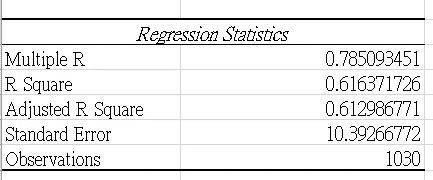

它本质上保持不变，这意味着 geomean 对于实例级统计没有用。

好了，让我们转到下一个实例级统计。在目标变量前插入一个新列，并输入此公式。将公式向下拖动到所有行。

```
=STDEV(A2:H2)
```

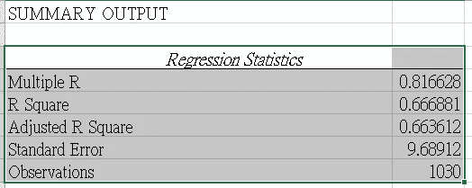

> 我们走吧！实例级别的标准差将调整后的 R 平方提高了 5 个百分点，从大约 61%提高到大约 66%。它还将相关性从 0.785 提高到 0.81。它还将标准误差降低到 9.68。

好了，让我们转到另一个实例级统计数据，偏斜。偏斜测量分布的对称性。与之前相同，在目标前插入一列，并输入以下公式:

```
=SKEW(A2:H2)
```

再次运行它，包括上面的所有变量以及我们创建的两个变量(geomean 和 std dev)和 Skew。

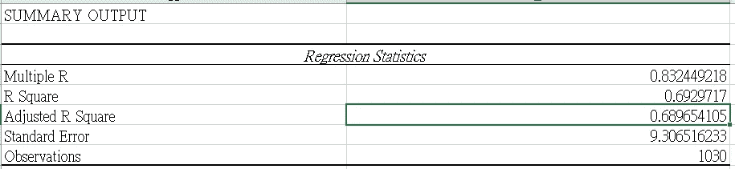

> 这里是倍数 R， ***现在是 83%相关*** 调整后的 R 平方已经过去了 ***大约 3%指向 68.9%*** ！！！标准误差也略微下降到现在的 9.3。

好，接下来，我们将添加一些实例级峰度。峰度高的数据尾部重，峰度低的数据尾部轻。在目标前插入一列，并输入公式:

```
=KURT(A2:H2)
```

当我添加实例级峰度并再次运行它时，会发生以下情况:

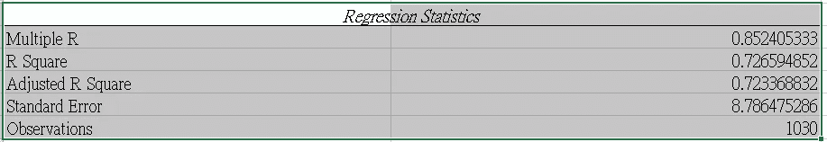

> ***调整后的 R 现在是 72.3%，比我们从原始数据开始时的~61%高了 11%左右。***

标准误差已经下降到 8.78，R 现在是 85%相关。注意 ***我们开始的时候，倍数 R 是 78.5%，比现在低 6.5%。***

## 动词 （verb 的缩写）结论:

标准偏差、偏斜和峰度的实例级统计显著改进了模型。

感谢您的阅读，祝您有美好的一天，

灰

参考资料:

1.  UCI 机器学习知识库:混凝土抗压强度数据集。(未注明)。2021 年 4 月 5 日检索，来自[https://archive . ics . UCI . edu/ml/datasets/concrete+抗压+强度](https://archive.ics.uci.edu/ml/datasets/concrete+compressive+strength)

2.Excel 中的线性回归分析。(2021 年 3 月 02 日)。2021 年 4 月 5 日检索，来自[https://www . able bits . com/office-addins-blog/2018/08/01/linear-regression-analysis-excel/](https://www.ablebits.com/office-addins-blog/2018/08/01/linear-regression-analysis-excel/)