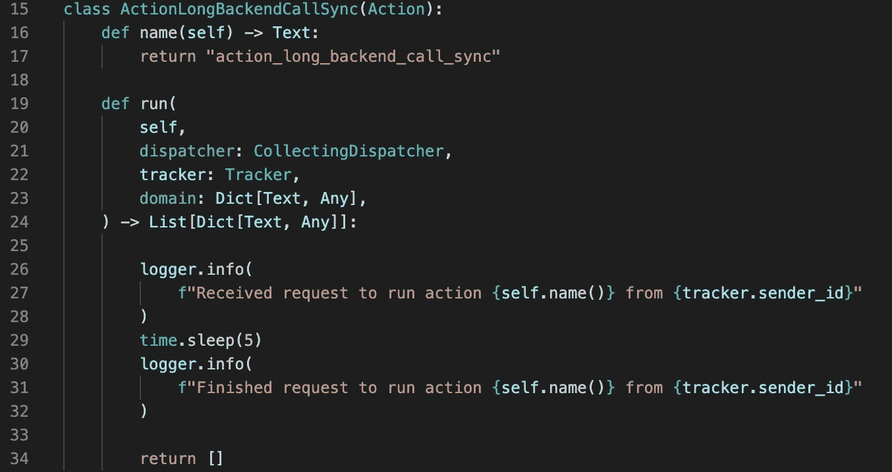
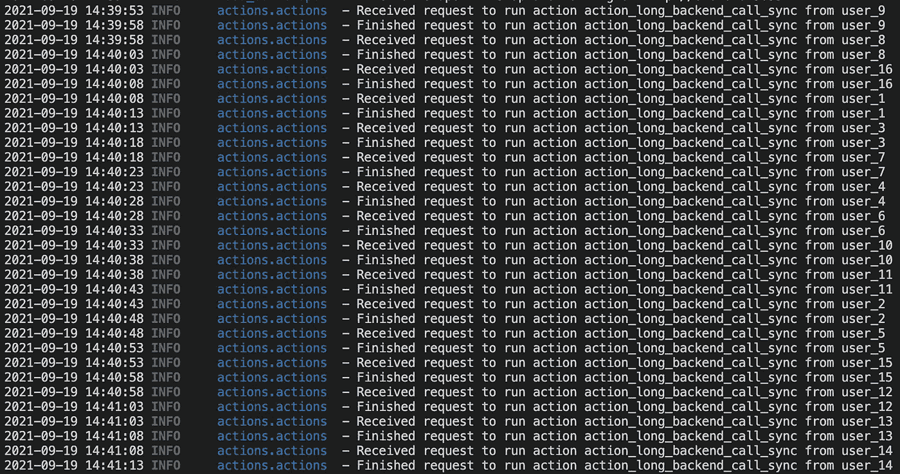
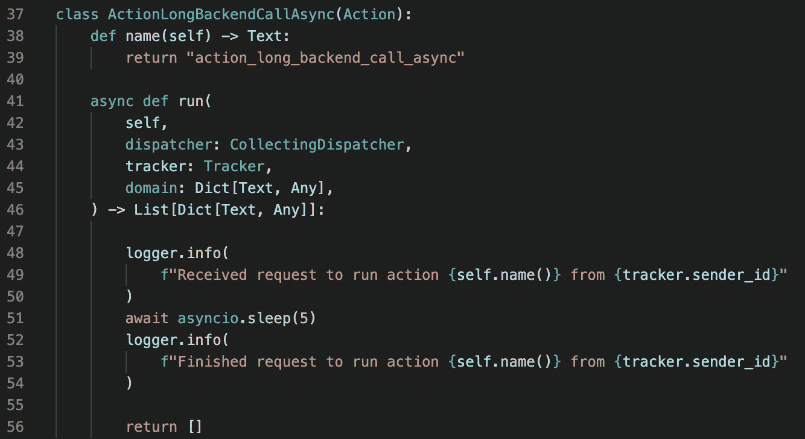
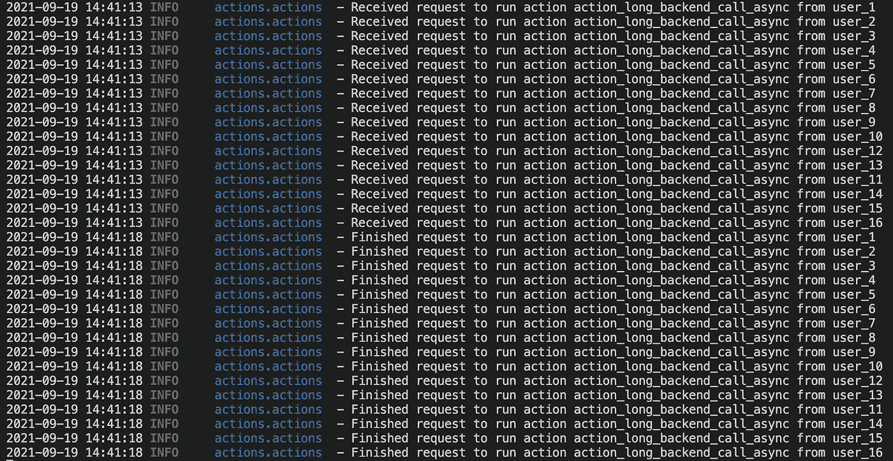

# Rasa 的动作服务器可以做异步调用吗？

> 原文：<https://pub.towardsai.net/can-rasas-action-server-do-asynchronous-calls-48c45f2dceb0?source=collection_archive---------2----------------------->

## [自然语言处理](https://towardsai.net/p/category/nlp)

# 介绍

在本文中，我们将尝试回答以下关于 Rasa 的[动作服务器](https://rasa.com/docs/action-server/)的问题:

> 假设我们有一个自定义操作，它将调用后端服务，这可能需要一段时间才能完成，例如检索客户过去的购买记录，检查预约的可用时间段，调用机器学习模型进行预测，等等。
> 
> 在处理长时间运行的自定义操作时，操作服务器会被阻止为其他请求提供服务吗？

我假设读者熟悉 Python 中[异步函数调用的基础知识。](https://docs.python.org/3/library/asyncio.html)

重现本文中描述的结果的代码可以在[这里](https://github.com/hsm207/rasa_async_sdk)找到。

# 试图回答

对上一节提出的问题的一个常见回答是:

> 动作服务器基于 [Sanic](https://sanic.readthedocs.io/en/stable/) 。
> 
> 由于 Sanic 可以[同时处理许多请求](https://sanicframework.org/en/guide/basics/handlers.html#a-word-about-async)，这意味着动作服务器也可以同时服务许多请求。

因此，人们希望这个定制动作不会阻塞动作服务器:

图 1:一个不希望阻塞动作服务器的自定义动作

让我们做一些测试来验证这个答案的有效性。

# 实验

## 实验装置

我们将在 16 核机器上运行我们的实验。动作服务器将仅使用 **1 个工作线程**启动。

在实验开始时，我们将对动作服务器进行 16 次并行调用，以运行相同的自定义动作。我们将计算所有呼叫完成后经过的时间。

## 定时动作 _ 长时间 _ 后端 _ 调用 _ 同步

由于`action_long_backend_call_sync`自定义操作需要 5 秒钟才能完成，我们预计所有 16 个呼叫将在 5 秒钟左右完成。

结果如下:

图 2:16 次并行调用 action_long_backend_call_sync 的结果

16 次调用，每次 5 秒，总计 80 秒，因此图 2 中的结果表明动作服务器正在串行执行请求，即只有在前一个请求完成后才执行下一个请求。

来自操作服务器的日志证实了这一点:

图 3:服务 action_long_backend_call_sync 请求时的日志

图 3 示出了例如来自`user_8`的新请求仅在例如来自`user_9`的先前请求完成之后才被处理。接收到请求和完成请求之间的时间正好是 5 秒。

## 编写异步自定义操作的正确方法

下面是我们如何重写图 1 中的自定义动作，以便它不会阻塞动作服务器:

图 4:图 1 中自定义动作的异步版本

注意，我们已经调用了`sleep()` async(第 51 行),并将定制动作的`run()`方法定义为异步(第 41 行)。

以下是此自定义操作的计时结果:

图 5:对 action_long_backend_call_async 的 16 次并行调用的结果

不出所料，所有通话都在 5 秒左右完成。

日志还确认没有调用阻塞操作服务器:

图 6:服务 action_long_backend_call_async 请求时的日志

图 6 示出了动作服务器能够接受例如来自`user_2`的其他请求，而例如来自`user_1`的当前请求处于休眠状态。

# 正确答案

上一节中的实验表明，为了让自定义操作不阻止操作服务器为其他请求提供服务，我们需要:

1.  将自定义动作的`run()`方法声明为`async`，并且
2.  确保`run()`方法的主体不调用任何阻塞函数

第二点需要更多的解释。

即使我们将它的`run()`方法声明为`async`，对`action_long_backend_call_sync`的 16 个并行调用仍然需要大约 80 秒才能完成。这是因为该方法调用了`sleep()`，不幸的是这是一个阻塞调用。在这种情况下，解决方案很简单，因为在`asyncio`库中有一个`sleep()`的非阻塞版本。

# 实用技巧

实际上，您的定制操作可能会使用[请求](https://docs.python-requests.org/en/latest/)库调用外部后端服务。如果您切换到 [aiohttp](https://docs.aiohttp.org/en/stable/) 库来发出这些请求，您将从您的动作服务器获得更好的吞吐量。

当然，如果您的自定义动作实际上是在动作服务器的工作线程上受 CPU 限制的，那么这不会有什么不同。

# 结论

本文解释了如何编写一个 I/O 绑定的自定义操作，以便它不会阻止操作服务器为其他请求提供服务。

我希望你发现这很有见地。