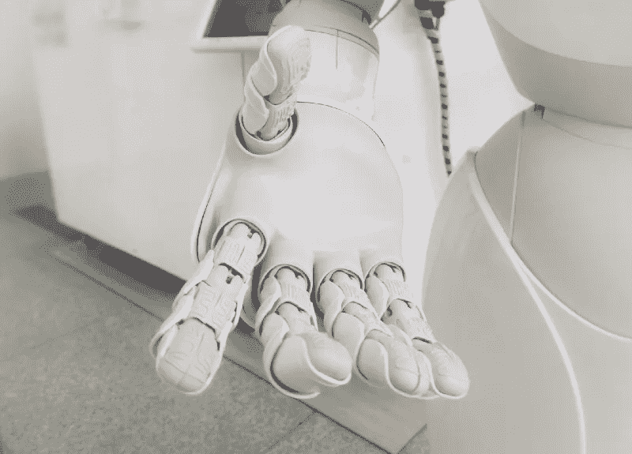

# 机器人能说服你吗？

> 原文：<https://pub.towardsai.net/can-robots-persuade-you-f10b337aa63b?source=collection_archive---------1----------------------->

## [人工智能](https://towardsai.net/p/category/artificial-intelligence)、[伦理](https://towardsai.net/p/category/ethics)、[公平](https://towardsai.net/p/category/artificial-intelligence/fairness)

## 机器可能已经控制了你的思想

照片由[附身摄影](https://unsplash.com/@possessedphotography?utm_source=medium&utm_medium=referral)在 [Unsplash](https://unsplash.com?utm_source=medium&utm_medium=referral) 上拍摄

这听起来像是科幻和恐怖的混合体:具有高级智能的机器人引导你的思维。人类在不知不觉中被控制了。

好吧——回到现实。深呼吸。科学还没有走那么远…还没有！

大约一年前，我读了一篇名为“设计有说服力的机器人:机器人如何使用声音和非语言线索说服人们”的论文。直到今天，这个话题仍然让我既兴奋又害怕。
这篇论文讲述了提高机器人说服人类能力的不同方法。在实验中，一个人形机器人试图通过使用除常见语义交互之外的各种技术来改变人们的想法。声音线索(如音调调制)和身体线索(手势，接近和凝视)被应用于参与者。剧透:非语言暗示是最有效的！

# 现实世界中通过暗示进行说服

1。身体暗示对鼓励自然行为真的很重要，这令人惊讶吗？我想不会。改变声调可能会让人感觉更舒服，但不一定会更有说服力。当然，每件事都必须在合理的范围内进行；听起来像小丑显然不会增加你的可信度。

> “结果显示，当机器人使用非语言提示时，参与者明显比不使用这些提示时更遵从机器人的建议，而且身体提示比声音提示更能有效地说服参与者。”

让我们继续非声音提示。哪些是最重要的？

2。接近可能是你首先想到的事情之一。进行深入的交谈往往需要亲密。或者，最近在家办公的日子里，你是否比以前面对面地进行了更好的交谈？
为了弄清接近是否如此有效，想想舞台上的公开演讲。如果你不记得你参加过的真正伟大的演讲，历史上有很多好的例子，比如马丁·路德·金的“[我有一个梦想](https://www.youtube.com/watch?v=vP4iY1TtS3s)”。虽然能够出席他最初的演讲肯定会是一种深刻的体验，但时间的流逝并没有减弱他试图传达的信息。即使是现在，远离最初交付的时间和地点，我们仍然受到他深刻话语的沉重冲击。

3。随着我越来越关注这些暗示，在我看来，凝视是最重要的，但也是最难在讨论中使用的辅助手段。首先，在头脑中整理你的论点和想法时，坚持逐句进行眼神交流并不容易。试试看；说起来容易做起来难。尽管如此，有些人似乎真的很努力地训练这种行为，主要是在他们与他人持续接触的位置上。他们几乎超过了眼神交流的最佳水平，看起来相当不自然。

4。最后但同样重要的是，手臂手势。根据苏珊·温申克博士为 psychologytoday.com 撰写的一篇文章，动态的手势是交谈的关键。毫无疑问，它们具有潜意识效果，用于强调最重要的事实。以计数手指支持的枚举为例，将事实与可视化语句结合起来。与隐藏在纯文本中的论点相比，它显然更令人印象深刻，并且在事后做决定时可能会得到更仔细的考虑。

# 我们已经被机器耍了吗？

那么，在日常生活中，哪些机器已经在试图说服我们了呢？你可能会猜，有不少。我们信任导航系统，与聊天机器人交流支持问题，让 Alexa、Siri & Co .决定午餐做什么。我肯定不是唯一一个在探索新城市时比我自己更信任谷歌地图的人。

由于这些提到的机器和算法不能使用非语音提示，让我们继续我们的思维实验，并在人形机器人中打包这些功能。当想到机器人的外观时，忘记脑海中出现的合成图像。但即便如此，在演讲技巧中模仿人类行为是否也会让我们不舒服，甚至降低机器人的说服能力？

不确定你有没有和半人形机器人 Pepper 聊过。它对手势的使用是显著的，但我个人是否觉得它令人不安，甚至感到不舒服？不，一点也不。

让我们回到承诺的科幻小说部分。电影《前玛奇纳》展示了一个惊人的例子，未来会带给我们什么。一个似乎能完美模仿情感的人形机器人在故事中扮演了关键角色。机器人最终能够说服一个人违背机器人创造者的意愿行事。所以，现在你可以争论该怪谁了:是造了一台能说服人的机器的人，还是决定信任机器人胜过信任人类的人？尽管如此，我现在非常欣赏 Pepper 的不完美，我很高兴，我们有时间考虑如何以适当的方式处理这种未来的情况。

[Fancaps](https://fancaps.net/movies/MovieImages.php?movieid=454) 上的“Ex 玛奇纳”截图

# 让我们来谈谈道德

尽管这个伦理问题看起来很容易回答(“*)人工智能根本不应该说服人！!"让我在这个问题上补充一些想法。*

首先，出于私利劝说其他人是否总是不道德的？当说服不是由自身利益驱动，而是由利他主义驱动时，情况会怎样？如果双方都能从*的新*决定中受益呢？

为了谈论一些更能想象的事情，让我们坚持谷歌地图的例子:建议一条路线来避免路过的孩子离开学校，以最大限度地降低事故的风险，这是否是不道德的，尽管这确实会花费你更多的时间？答案大概可以在“*建议”这个词中找到，*因为谷歌地图不应该自己做决定。

误导信息的可能后果起着主要作用。是否应该有一种算法来评估机器“说服”决策的每一种可能结果？总的来说，让用户决定他们愿意在多大程度上把自己的决策能力交给设备怎么样？这不仅仅是道德上的，技术上也是一个具有挑战性的方面。

# 结论

正如论文中提到的，机器人在说服测试对象方面相当成功。但是说实话，有偿参与实验的人比街上的普通人更开明。我可以想象，在真实世界场景中影响人们与在测试环境中明显不同。我不怀疑受控的环境确实有助于实验的成功。

总而言之，设计有说服力的机器人当然是一个令人兴奋的研究课题。工程师必须与来自许多其他不同领域的心理学家和科学家密切合作。但是不同的使用目的会产生不同的结果。因此，虽然坚持道德准则很重要，但我们也不能太担心我们的未来。谁知道呢，也许迟早会在一些设备中发现伦理算法，这些算法可以评估机器说服人们可能导致的后果。