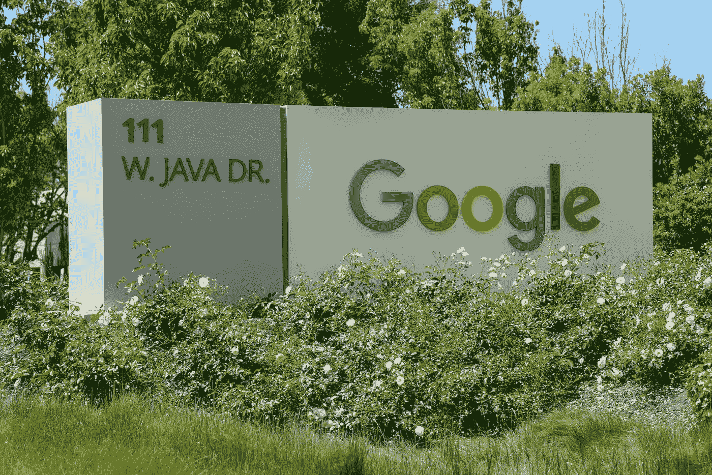
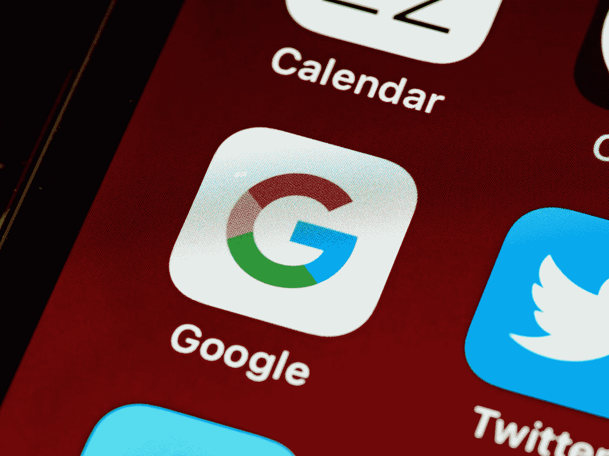

# 没有谷歌我们能活吗？

> 原文：<https://pub.towardsai.net/can-we-live-without-google-c2f3ed0be151?source=collection_archive---------2----------------------->

克里斯蒂安·威迪格在 [Unsplash](https://unsplash.com?utm_source=medium&utm_medium=referral) 上拍摄的照片

## [意见](https://towardsai.net/p/category/opinion)，[技术](https://towardsai.net/p/category/technology)

## 谷歌已经成为我们多种用途的外部存储器的主要形式，但我们今天能没有它吗？

今天早上，谷歌停止服务，因为它似乎是由一个 [**黑客的攻击**](https://www.express.co.uk/news/uk/1372308/Google-down-latest-update-Gmail-crash-YouTube-error-alphabet-hack-is-google-working) 造成的，在世界上最大的搜索引擎崩溃后，数百万人无法访问他们的谷歌账户，包括 Gmail 和 YouTube。

就在几天前，俄罗斯黑客严重入侵了美国政府机构。停电持续了一个多小时。

嗯，我可能会说，到目前为止，2020 年已经是足够艰难的一年了，但最重要的云服务平台退出服务可以在[有史以来最糟糕的一年](https://www.kiro7.com/news/trending/time-magazine-declares-2020-worst-year-ever/IVWTADFVZJCGRCMABDIOYMLIYE/)指数方面设立标杆。

虽然看起来各种服务又开始回来了，但我把今天早上当作一个绝佳的机会，向自己提出一个问题:如果谷歌服务突然永远停止工作，我们的生活会是什么样子？

照片由 [Greg Bulla](https://unsplash.com/@gregbulla?utm_source=medium&utm_medium=referral) 在 [Unsplash](https://unsplash.com?utm_source=medium&utm_medium=referral) 拍摄

# 大 G 有多大？

你有没有注意到我们是如何依赖谷歌搜索、Gmail、谷歌文档、Youtube、谷歌日历等服务的？

谷歌是世界上访问量最大的网站。举个数字来说，谷歌今年被访问了**621.9 亿次，每天处理超过[**35 亿次搜索**](https://www.internetlivestats.com/google-search-statistics/) 。谷歌镜头识别高达 [**一个亿**](https://www.theverge.com/2018/12/19/18149120/google-lens-ai-camera-recognize-detect-1-billion-items) **不同项**；谷歌基于设备的搜索，63%的谷歌美国有机搜索流量来自移动设备。谷歌也是几乎一半产品搜索的起点。46%的产品搜索是从谷歌开始的**

**甚至不用看这个统计数据，我们就知道我们依赖于谷歌。**

**每天，我们都会多次求助于谷歌来解决我们的问题。准确地说，84%的人经常每天使用谷歌 3 次以上。**

**我确信我们中的许多人变得一贫如洗，无法与这个世界交流；我们中的一些人失去了联系，仍然与朋友和生意隔绝。**

**我确信我们中的许多人变得一贫如洗，无法与这个世界交流；我们中的一些人失去了联系，仍然与朋友和生意隔绝。**

**嗯，随着全球疫情的出现，更严重的问题仍在继续，新冠肺炎每天在世界各地造成成千上万人死亡，我知道 2020 年已经足够世界末日了。甚至我们今天早上面对的场景也向我们展示了对大 G 服务的严重依赖，对许多人来说，这似乎是一个自然的"终结"？**

**我们必须认识到，我们的整个日常生活都依赖于公司的服务；除此之外，谷歌没有提供独特的东西；它只提供比竞争对手更高的质量。这就是谷歌变得如此重要的原因。**

**我不认为这里的问题是对云服务等更灵活的服务有特别的依赖，我认为我们应该与其他能够满足我们需求的公司分享我们的依赖。垄断我们的需求才是真正的威胁。**

**今天早上是一个善意的提醒，如果没有谷歌，现代世界的很大一部分将被切断，我们的文件将无法访问，我们无法访问世界上的任何网站，只是因为我们中的许多人不记得网址或我们不能有我们的电子邮件。**

**我很确定，如果有一天谷歌不在了，其他公司会出现，我们会海誓山盟…但直到现在..这些打嗝让我感到焦虑。**

****

**布雷特·乔丹在 [Unsplash](https://unsplash.com?utm_source=medium&utm_medium=referral) 上的照片**

# **但是我们有多依赖呢？**

**根据周四发表在《科学》杂志上的一项研究，谷歌和互联网数据库等搜索引擎已经成为我们大脑的一种“外部记忆”，这项研究表明，我们失去了对数据的记忆，但我们获得了搜索技能。**

**教育家和科学家已经警告说，人类正变得越来越依赖在线信息，但迄今为止，几乎没有研究证实这一点。**

**研究“ [**谷歌对记忆的影响:让信息触手可及的认知后果**](https://pubmed.ncbi.nlm.nih.gov/21764755/) ”显示，就像我们的“个人数据库”，被称为“谷歌效应”，电脑和在线搜索引擎已经成为类似“外部记忆”系统的东西。**

**这项研究表明，当面临难题时，人们愿意考虑计算机。当人们期望在未来访问信息时，他们对数据本身的回忆率较低，而不是在哪里访问它。这正是今天如此依赖谷歌的原因。**

****

**照片由[米切尔罗](https://unsplash.com/@mitchel3uo?utm_source=medium&utm_medium=referral)在 [Unsplash](https://unsplash.com?utm_source=medium&utm_medium=referral) 拍摄**

# **没有谷歌有可能活下去吗？**

**也许我们应该考虑一些少受谷歌限制的个人策略，如果不是今天，…很快。**

**即使我们在地平线上看不到替代方案或看不到紧迫性，我仍然认为这是一项有效的工作。**

**我们把你太多的时间都给了一家强大的大公司，这家公司通过根据你在网站、应用和免费服务上的行为定向投放广告来获利。**

**但与此同时，我认识到，尽管这是可能的，但这不是一条容易的道路。它需要适应和摆脱一些商品。但这并不像许多人认为的那样是一个巨大的牺牲。竞争是存在的，在许多领域，有和谷歌一样好的替代品。它们各有不同，各有利弊，但至少是可行的。也许我们需要更多的探索，不是吗？**

**离开大 G 的一个原因可能是，如果你认为你得到的回报不值得牺牲你的隐私。如果你不介意浪费 10 秒钟在地址栏输入完整的 URL 地址，而不是跑进谷歌搜索猜测的位置，你就不需要谷歌。**

**这是一个非常疯狂的深思案例: [***Google 可以知道你去过的所有网站和物理场所***](https://medium.com/predict/does-google-know-more-about-you-than-your-wife-819d4415d704) 。这个星球上没有人知道这一点，但谷歌知道。您通常会与少数人分享这种级别的信息。**

**我没有看到其他公司走这条路，但如果发生这种情况，耐心，我正在寻找其他解决方案。**

****

**照片由 [Rajeshwar Bachu](https://unsplash.com/@rajeshwerbatchu7?utm_source=medium&utm_medium=referral) 在 [Unsplash](https://unsplash.com?utm_source=medium&utm_medium=referral) 拍摄**

# **结论**

**谷歌已经成为许多用途的外部或交互记忆的主要形式。信息(文档、电子邮件、演示文稿、约会、视频、图像等。)都是集体存储在它的云服务里，我们也不用花大力气去找自己想要的东西。我们可以简单地“谷歌”一下。**

**我们不应该惊讶地发现，越来越多的人没有记住相关信息，因为他们相信他们可以通过自己的搜索技巧获得这些信息。**

**这里真正的问题是:以这种摇摆不定的方式使用谷歌服务给我们带来的好处值得牺牲我们的隐私，最终牺牲我们的自由吗？**

# **还有一件事…**

**如果你想更多地了解谷歌，以及它是如何收集大量关于你的数据的，我写了一篇关于它的文章:**

** [## 谷歌比你老婆更了解你吗？

### 你可能会惊讶于谷歌对你的了解程度。但这是一种威胁，还是游戏的一部分？

medium.com](https://medium.com/predict/does-google-know-more-about-you-than-your-wife-819d4415d704) 

# 参考

1.  搜索引擎如何成为外部搜索的主要形式？[https://historyofinformation.com/detail.php?id=3036](https://historyofinformation.com/detail.php?id=3036)
2.  2020 年你需要知道的 10 个谷歌搜索统计。[https://www.oberlo.com/blog/google-search-statistics](https://www.oberlo.com/blog/google-search-statistics)
3.  谷歌效应:我们大脑的变化。[https://www . ibtimes . com/Google-effect-changes-our-brains-299451](https://www.ibtimes.com/google-effect-changes-our-brains-299451)**