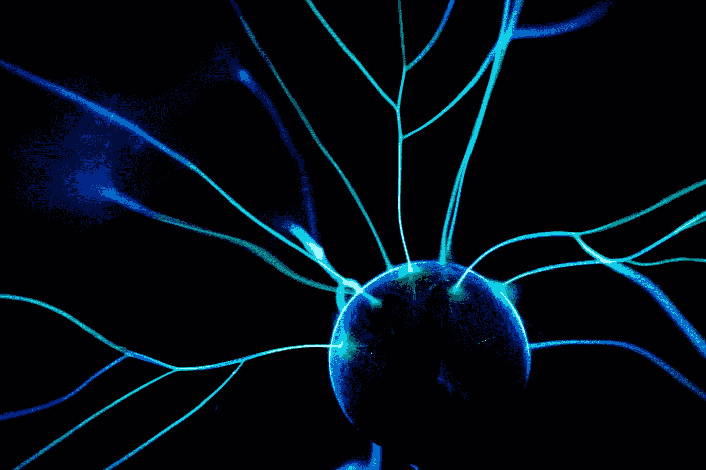

# 你能掌握一切吗？

> 原文：<https://pub.towardsai.net/can-you-master-everything-a6e5721c1178?source=collection_archive---------4----------------------->

## [机器学习](https://towardsai.net/p/category/machine-learning)

[Clem Onojeghuo](https://unsplash.com/@clemono?utm_source=unsplash&utm_medium=referral&utm_content=creditCopyText) 在 [Unsplash](https://unsplash.com/s/photos/thinking?utm_source=unsplash&utm_medium=referral&utm_content=creditCopyText) 上的照片

一种 **随机剂量的知识**

> 越学越想学；你获得的智慧越多，你就越聪明；你越活跃，就越需要午睡。对吗？

**不，等等。**

我们生活在科技时代，新事物、新研究、新模式每天都在涌现，所以你真的认为你可以掌控一切吗？

答案是**否**。你不能掌握一切，但你可以(也应该)成为更好的自己。

> 让我来解释如何？

所以让我们从**机器学习算法**开始

照片由[亚历山大·奈特](https://unsplash.com/@agk42?utm_source=unsplash&utm_medium=referral&utm_content=creditCopyText)在 [Unsplash](https://unsplash.com/s/photos/technology?utm_source=unsplash&utm_medium=referral&utm_content=creditCopyText) 上拍摄

我只说最流行的机器学习算法。

现在，什么是算法？

在数学和计算机科学中，算法是定义明确的计算机可执行指令的有限序列，通常用于解决一类问题或执行计算。算法总是明确的，并被用作执行、计算、数据处理、自动推理和其他任务的规范，(来源: **Wiki**

在机器学习中，我们有三种不同类型的学习算法

> **监督学习**

在监督学习中，我们有称为训练数据的输入数据，并且有与训练数据相关联的已知标签，例如猫/狗、垃圾邮件/非垃圾邮件

其中我们在训练数据中训练模型，并用测试数据对其进行测试。

> **无监督学习**

在无监督学习中，我们只有输入数据，但我们不知道与输入数据相关的标签，如聚类

> **半监督学习**

在半监督学习中，我们将输入数据作为标记和未标记示例的混合。

**机器学习算法**

> **回归算法**

回归算法根据系统中输入数据的输入特征预测输出值。该算法基于训练数据的特征建立模型，并使用该模型来预测新数据的值。

*   普通最小二乘回归(OLSR)
*   线性回归
*   逻辑回归
*   逐步回归
*   局部估计的散点图平滑(MARS)
*   多元自适应回归样条(黄土)

> **基于记忆(基于实例)的学习算法**

这种模型通常建立一个数据库，并使用相似性度量将新数据与数据库进行比较，以找到最佳匹配并做出预测，而不是执行显式概括，将新问题实例与训练中看到的实例进行比较。

*   KNN (K 近邻)
*   SVM(支持向量机)
*   自组织映射
*   LWL(局部加权学习)

> **决策树算法**

它们属于监督学习算法家族。使用决策树的目的是创建一个训练模型，通过学习从以前的数据推断出的简单决策规则，该模型可用于预测目标变量的类或值

*   分类和回归树
*   ID3(迭代二分法 3)
*   CHAID(卡方自动交互检测)
*   C4.5 和 c 5.0(ID3 的继任者)

> **聚类算法**

聚类分析或聚类的任务是对一组对象进行分组，使同一组中的对象彼此之间比其他组中的对象更相似。

*   k 均值聚类
*   分层聚类
*   k-中间值
*   高斯混合模型(GMM)
*   基于密度的噪声应用空间聚类
*   谱聚类

> **贝叶斯算法**

在贝叶斯算法中，每一对被分类的特征都是相互独立的。这是一个统计模型，其中我们使用概率来表示模型中的所有不确定性，既包括关于输出的不确定性，也包括关于模型输入的不确定性。

*   朴素贝叶斯
*   高斯朴素贝叶斯
*   贝叶斯网络
*   BBN(贝叶斯信念网络)
*   多项式朴素贝叶斯

> **集成算法**

集成方法使用多个学习算法来获得比单独从任何组成学习算法获得的性能更好的预测性能。

*   随机森林
*   Bagging 算法(自举聚合)
*   adaboost 算法
*   助推
*   梯度推进机
*   (GBRT)梯度推进回归树

> **降维算法**

在机器学习中，通常有太多的参数，我们基于这些参数来预测输出。这些因素基本上是称为特征的变量。参数越高，对训练集进行处理和可视化就越困难，有时大多数特征都是多余的。所以降维有助于我们减少冗余参数的数量。

*   线性判别分析
*   主成分分析
*   广义判别分析
*   过滤器、包装器、嵌入式方法
*   多维标度(MDS)

> **关联规则算法或挖掘算法**

关联算法是在大型数据库中发现变量间有趣关系的规则库算法。

*   Apriori 算法
*   Eclat 算法

> **正则化算法**

这些算法用于回归，以降低模型的复杂性和独立特征的系数。

*   L1 正则化(拉索回归)
*   L2 正则化(岭回归)
*   弹性网
*   最小角度回归

**现在我们来谈谈深度学习**

照片由[莫里茨·金德勒](https://unsplash.com/@moritz_photography?utm_source=unsplash&utm_medium=referral&utm_content=creditCopyText)在 [Unsplash](https://unsplash.com/s/photos/network?utm_source=unsplash&utm_medium=referral&utm_content=creditCopyText) 上拍摄

深度学习是机器学习的子集，它拥有能够从非结构化或无标签的数据中进行无监督学习的网络。

> **人工神经网络算法**

ANN 或人工神经网络算法通常被称为简单的神经网络，ANN 是被称为人工神经元的连接单元或节点的集合，它们松散地像我们的生物大脑模型一样工作。

*   神经网络
*   浅层神经网络
*   多层感知器(MLP)
*   反向传播
*   梯度下降
*   随机梯度下降
*   径向基函数网络(RBFN)

> **深度学习算法**

*   卷积网络
*   递归神经网络
*   长短期记忆
*   编码器-解码器
*   注意力模型
*   堆叠式自动编码器
*   DBM(深玻尔兹曼机)
*   DBN(深度信念网络)

> **图像/视频深度学习**

[USGS](https://unsplash.com/@usgs?utm_source=unsplash&utm_medium=referral&utm_content=creditCopyText) 在 [Unsplash](https://unsplash.com/s/photos/image-processing?utm_source=unsplash&utm_medium=referral&utm_content=creditCopyText) 上拍摄的照片

这项技术允许机器识别和提取图像的特征。以便我们的模型可以从图像的特征和分析中学习。

您可以对图像/视频做的事情

*   图像分类
*   视频分类
*   面部应用
*   检测人脸
*   检测地标
*   光学字符识别(OCR)
*   目标检测
*   目标跟踪
*   图象分割法
*   医学图像分类
*   物联网

> **文本深度学习**

照片由 [Unsplash](https://unsplash.com/s/photos/text?utm_source=unsplash&utm_medium=referral&utm_content=creditCopyText) 上的[苏伦兰议员](https://unsplash.com/@sure_mp?utm_source=unsplash&utm_medium=referral&utm_content=creditCopyText)拍摄

*   文本分类
*   向量空间模型
*   机器翻译和文档搜索
*   自动更正
*   词性标注(词性)
*   隐马尔可夫模型
*   自动完成和单词嵌入
*   NER(命名实体识别)
*   神经机器翻译
*   文本摘要
*   问题回答
*   聊天机器人

> **时间序列预测**

照片由[尼克冲](https://unsplash.com/@nick604?utm_source=unsplash&utm_medium=referral&utm_content=creditCopyText)在 [Unsplash](https://unsplash.com/s/photos/stock-market?utm_source=unsplash&utm_medium=referral&utm_content=creditCopyText) 上拍摄

在数学中，时间序列是一系列按时间顺序排列的数据点。最常见的是，时间序列是在连续的等间隔时间点取得的序列。因此，它是一个离散时间数据序列(源 WiKi)

简单地说，“我们有历史数据，我们希望根据历史数据预测新的产量”

**时间序列算法**

> “你需要非常擅长**统计**”

*   自回归
*   移动平均线
*   自回归移动平均
*   ARIMA(自回归综合移动平均)
*   季节性自回归综合移动平均数
*   指数平滑法

**这还没有结束，**

像**声音处理**、**遗传算法**、**图形**、**强化学习**、 **AR、深度学习中的 VR、**这么多领域我们还没接触过

还有更多……..

所以你真的认为你可以成为每个领域的大师吗？与其学习每一个话题，不如试着在一两个领域精通它

有帮助的事情

机器学习:-[https://www.coursera.org/learn/machine-learning](https://www.coursera.org/learn/machine-learning)

深度学习:-[https://www.coursera.org/specializations/deep-learning](https://www.coursera.org/specializations/deep-learning)

自然语言处理:-[https://www . coursera . org/specializations/自然语言处理](https://www.coursera.org/specializations/natural-language-processing)

艾医疗:-[https://www.coursera.org/learn/ai-for-medical-diagnosis](https://www.coursera.org/learn/ai-for-medical-diagnosis)

图像/视频处理:-【https://www.pyimagesearch.com/ 

机器学习博客:-【https://machinelearningmastery.com/ 

我的 Youtube 频道:-[https://youtube.com/himanshutripathi](https://youtube.com/himanshutripathi)

暂时就这样了👏👏。下一篇文章再见。

如果你觉得这篇文章有趣，有帮助，如果你从这篇文章中学到了什么，请鼓掌👏👏)**并留下反馈。**

**还有，让我们在**[**Linkedin**](https://www.linkedin.com/in/iamhimanshu0/)**[**Twitter**](https://twitter.com/iam_himanshu0)**[**insta gram**](https://instagram.com/iamhimanshu0/)**[**Github**](https://github.com/iamhimanshu0)**，以及** [**脸书**](https://www.facebook.com/iamhimanshu0) **上成为朋友吧。********

******在我的 YouTube 上查看更多有趣的机器学习、深度学习、数据科学项目👉:-**[**YouTube**](https://www.youtube.com/c/himanshutripathi)**(👍)******

********感谢阅读！********