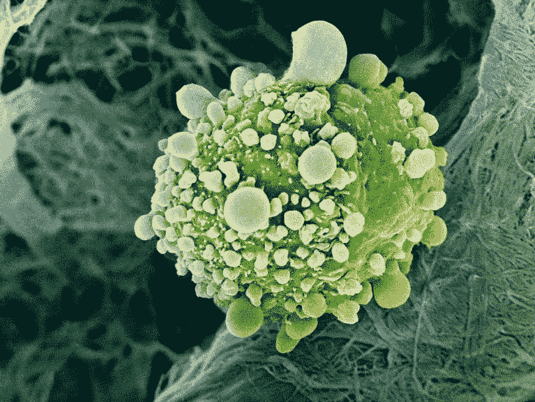
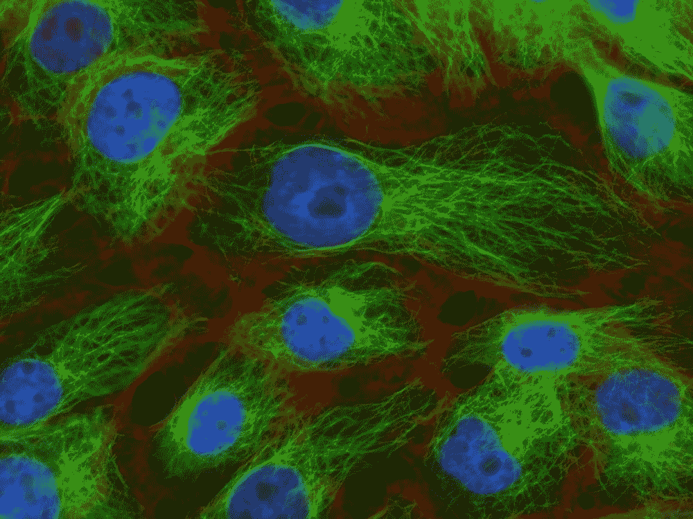

# 癌症研究需要更好的数据

> 原文：<https://pub.towardsai.net/cancer-research-needs-better-data-eee2bb3488a5?source=collection_archive---------0----------------------->

## 我们有许多开放性的问题，我们需要数据来回答它们

图片来源:[此处](https://www.nature.com/articles/d41586-021-00182-0)

多发性硬化症是一种导致中枢神经系统脱髓鞘的慢性疾病。尽管数百万人受到影响，即使在今天，原因仍不明。今年，一项为期 20 年的纵向研究分析了美国军队中 1000 万年轻人的数据。美国军人接受艾滋病毒筛查，并在两年后接受再次筛查。研究人员分析了 6200 万份血清样本中的残留血清，以寻找关于多发性硬化症发病原因的假设。研究人员发现，那些感染了爱泼斯坦-巴尔病毒(EBV)的人患多发性硬化症的可能性是其他人的 32 倍。

这样的数据库也可以用来确定癌症的原因。问题是癌症诊断的登记已经过时，许多个人没有被包括在内，数据也往往不完整。

# 我们为什么需要它，有什么问题？

科学中无组织的数据。图片由 unsplash.com 的[希尔·格雷森](https://unsplash.com/@seargreyson)拍摄

我们还有[许多未解之谜](https://www.ncbi.nlm.nih.gov/pmc/articles/PMC8446763/):

*   许多癌症没有明确的病因；我们不知道什么样的遗传和环境因素会导致癌症的发生。
*   第二，癌症的发生是否有普遍性的必要因素？一些研究人员谈到了这种可能性，即它的发展有一套必要的条件。
*   此外，还不清楚为什么患有相同癌症的一些患者对治疗有反应，而其他人没有。
*   另一个问题是饮食在多大程度上影响对治疗的反应:有许多相互矛盾的研究(低脂肪对高脂肪，肥胖的作用)。
*   虽然我们知道癌症死亡的主要原因是转移，但它是如何形成的以及转移背后的机制仍然不清楚。此外，我们不知道为什么一些癌症比其他癌症更喜欢转移到一些组织(最被接受的假设称为“种子和土壤”)。
*   许多在研究中看起来有希望的治疗方法在临床试验中失败了(尽管经过多年的研究，85%的临床试验失败了)。
*   更不用说许多研究人员想知道如何治疗一种不断演变的疾病。
*   [肿瘤微环境促进了肿瘤](https://www.cell.com/trends/cancer/fulltext/S2405-8033(15)00020-5)，是否有可能针对肿瘤对其进行重新编程？
*   今天的许多疗法都是针对特定类型的肿瘤，但研究人员想知道是否有可能针对所有肿瘤的药物(例如，是否所有肿瘤都容易受到同一类型途径的影响)。
*   最后，有些研究人员怀疑我们对癌症的了解是否足以找到治疗方法。

乳腺癌细胞。图片由 unsplash.com 国家癌症研究所拍摄

更不用说最近在 [Nature](https://www.nature.com/articles/d41586-022-03390-4) 上发表的一篇文章指出，这是一个具有重大社会意义的问题:

> 例如，现在很难确定少数民族人群对治疗的反应，或者他们的癌症有哪些独特的风险因素。在美国，黑人患前列腺癌的可能性比白人高 50%，死于前列腺癌的可能性是白人的两倍。如果没有大量多样的数据集，我们就无法识别独特的、有针对性的遗传或分子特征或生活方式因素，这些因素是这个群体和其他群体癌症风险增加的基础。

正如我在以前的文章中所讨论的，**数据质量严重影响机器学习模型的结果**。即使是最复杂的人工智能模型，在存在坏数据集(垃圾输入，垃圾输出)的情况下也不会产生好的结果

 [## 对数据集的批判性分析

### 停止微调你的模型:你的模型已经很好了，但不是你的数据

towardsdatascience.com](https://towardsdatascience.com/a-critical-analysis-of-your-dataset-2b388e7ca01e) 

第一个问题是，癌症是一种复杂的疾病，癌细胞在对治疗的反应中进化。为此，我们需要高质量的数据来排除潜在的混杂因素，并建立可靠的模型。

有癌症登记处(甚至第一个是在 20 世纪初建立的)，它们通常收集人口统计、诊断、肿瘤组织学、治疗和结果的信息。既有普通登记处，也有专注于特殊类型癌症的登记处，医院一级和国家一级的举措。然而，这些注册表通常并不标准化。此外，多年来收集了越来越多的信息，但错误和遗漏的条目也越来越多。

> "如果没有一个系统的方法来启动和保持数据干净，坏数据就会发生."—多纳托·迪奥里奥

第二个问题是必须获得同意。收集数据和信息需要复杂的官僚机构和各种实体的许可。收集样本和数据是一项昂贵而费力的工作。不是所有的医生和研究人员都愿意承担这个负担，也不是所有的资金都有。

此外，患者将会看几个专家或者可能会去几个医院(可能是为了在某个特定的医院得到第二种意见或治疗)。分散的医疗保健是数据收集的另一个障碍。即使收集了这些数据，也必须对它们进行汇总并使其同质。

# 我们如何解决它？

在 unsplash.com，路易斯·维拉斯米尔拍摄的图片

> “受到喜爱的数据往往会保留下来。”—库尔特·博拉克

TGCA 是一个试图描述成千上万患者特征的项目的例子。结果是[2.5 Pb 的数据](https://www.nature.com/articles/d41586-021-00182-0)覆盖了一万多名患者和 33 种肿瘤类型。这个数据集已经被用于一千多项研究中(包括生物信息学和人工智能)。此外，它有助于理解新疗法的好处。还有其他项目，如癌症依赖图，为新疗法带来新的见解，其他项目正在研究中。

> 理想的癌症登记处将汇集数百万同意的参与者的信息；包括不同血统和社会经济地位的人口；从癌症诊断开始收集信息，包括成像、组织样本和基因数据；并通过自动链接到参与者的完整医疗记录来获取他们的历史记录。有了这些详细的资料，我们可以追踪癌症诊断、健康影响和死亡风险，追溯到潜在的风险因素。— [来源](https://www.nature.com/articles/d41586-022-03390-4)

多模态学习现在是一个快速发展的领域；越来越多的人工智能模型能够从异构数据(图像、医疗记录、基因组数据、表格数据等)中学习。).所以我们需要相似的数据集来训练这样的模型。英国(英国生物银行)和美国(算我一个)正在研究一些倡议，但仍然很少。

此外，在隐私方面，有新的更严格的法规，但也有匿名化患者的新技术(区块链，匿名化的新人工智能模型)。英格兰和丹麦等国家也一直在研究如何将医疗系统和病人数据集中起来。

另一方面，机构和大学都意识到必须维护数据库和已开发的代码的重要性(通过向研究人员提供课程或雇用专业人员)。

疫情本身也加强了各机构之间的合作。例如，超过 75 个机构在国家 covid 群组协作中合作，旨在收集美国超过 650 万 COVID 患者的临床数据。

# 离别的思绪

在 unsplash.com，张秀坤·镰刀

> “我们被数据包围，但却渴望洞察。”—杰伊·贝尔

研究需要高质量的数据。经过数年的研究和数十亿美元的投资，大多数临床试验都以失败告终。原因之一是我们对癌症发病和耐药机制的不完全了解。这就是为什么数据收集是必不可少的，但这是不够的，我们需要它被策划，集中，并提供给社区。

像 TGCA 这样的大型研究已经显示出对科学家群体的价值。它们被用来测试假说，开发越来越精确的模型和新疗法。医学和生物学越来越多地与数据科学纠缠在一起，数据科学的基本原则之一是源数据的质量。

# 如果你觉得有趣:

你可以寻找我的其他文章，你也可以 [**订阅**](https://salvatore-raieli.medium.com/subscribe) 在我发表文章时得到通知，你也可以在**[**LinkedIn**](https://www.linkedin.com/in/salvatore-raieli/)**上连接或联系我。**感谢您的支持！**

**这是我的 GitHub 知识库的链接，我计划在这里收集代码和许多与机器学习、人工智能等相关的资源。**

** [## GitHub - SalvatoreRa/tutorial:关于机器学习、人工智能、数据科学的教程…

### 关于机器学习、人工智能、数据科学的教程，包括数学解释和可重复使用的代码(python…

github.com](https://github.com/SalvatoreRa/tutorial) 

或者随意查看我在 Medium 上的其他文章:

 [## 科学和人工智能中的代码再现性危机

### 萨维艾和科学研究要求我们分享更多

pub.towardsai.net](/code-reproducibility-crisis-in-science-and-ai-fa2f2ec955b4)  [## 艾重新想象世界上最美丽的 20 个词

### 无法翻译的单词怎么翻译？

medium.com](https://medium.com/mlearning-ai/ai-reimagines-the-worlds-20-most-beautiful-words-cd07090ea59b)  [## 诺贝尔奖赛博朋克

### 科学发现中人工智能最重要奖项的计算视角

medium.com](https://medium.com/mlearning-ai/nobel-prize-cyberpunk-e1803aa0e087)  [## 人工智能如何帮助保存艺术品

### 艺术杰作随时都是风险；人工智能和新技术可以助一臂之力

towardsdatascience.com](https://towardsdatascience.com/how-ai-could-help-preserve-art-f40c8376781d)**