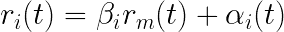
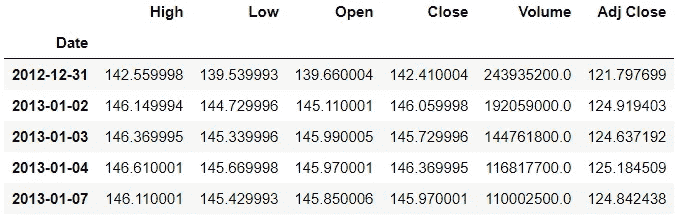
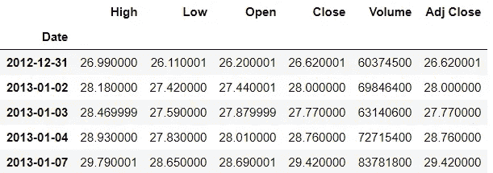
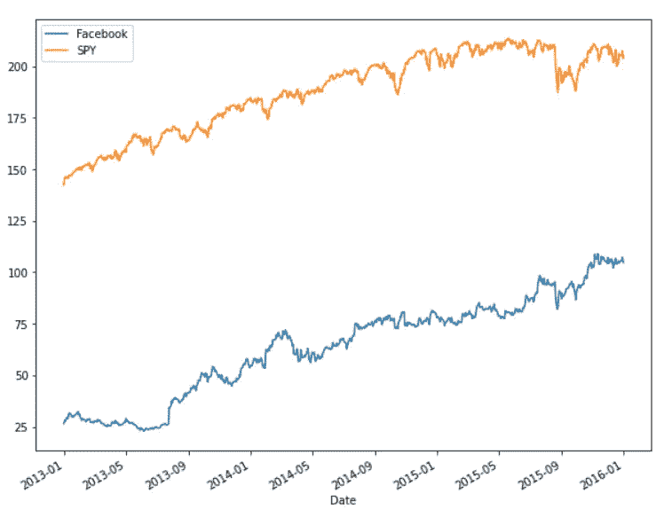
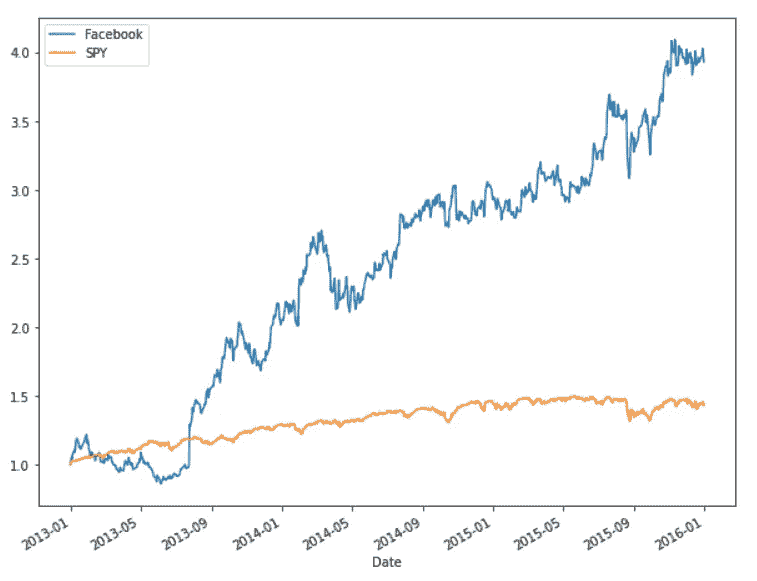
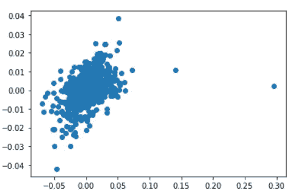

# 资本资产定价模型(CAPM)-使用 Python

> 原文：<https://pub.towardsai.net/capital-assets-pricing-model-capm-using-python-285a95f40d4d?source=collection_archive---------0----------------------->

## [数据可视化](https://towardsai.net/p/category/data-visualization)，[编程](https://towardsai.net/p/category/programming)

## 了解 CAPM 并在 Python 中实现它的指南。


照片由马克西姆·霍普曼( [Unsplash](https://unsplash.com/photos/fiXLQXAhCfk) )拍摄

# 什么是 CAPM？

资本资产定价模型(CAPM)应用非常广泛，被认为是投资中非常基本的概念。它决定了资产(尤其是股票)的风险和预期收益之间的联系。

# 什么是 CAPM 方程？

资本资产定价模型由以下公式定义:



其中“I”是单个股票

r(i)(t) =股票“I”在时间“t”的收益

β(I)= I 的β

r(m)(t) =市场“m”在时间“t”的收益

α(i)(t) =在时间‘t’时‘I’的α

股票“I”的β告诉我们，与市场相比，股票将增加投资组合的风险。β=1 表示股票符合市场行情。

根据 CAPM，α的值预计为零，并且它是非常随机的，无法预测。

上面看到的等式是 y = mx+b 的形式，因此它可以被视为线性回归的形式。

# 如何用 Python 实现？

**→安装包**

将使用 scipy 包。它有计算线性回归的功能。与它一起，pandas 被导入来处理数据，数据是使用 pandas datareader 获得的。可视化是通过 matplotlib 完成的。

```
**>>> from** scipy **import** stats
**>>> import** pandas **as** pd
**>>> import** pandas_datareader **as** web
**>>> import** datetime
**>>> import** matplotlib.pyplot **as** plt
**>>> %**matplotlib inline
```

**→数据**

定义开始和结束日期，并在此时间间隔内完成分析。

```
>>> start **=** datetime.datetime(2013,1,1)
>>> end **=** datetime.datetime(2016,1,1)
```

获取市场数据，如“间谍”(SPDR·标准普尔 500)。

```
>>> df_spy **=** web.DataReader('SPY','yahoo',start,end)
>>> df_spy.head()
```



接下来，获取股票的数据。这里使用的股票是脸书。

```
>>> df_fb **=** web.DataReader('FB','yahoo',start,end)
>>> df_fb.head()
```



**→可视化**

根据资本资产定价模型，股票表现和市场表现之间应该有某种联系，这一点将在后面研究。

```
>>> df_fb['Close'].plot(label **=** 'Facebook', figsize**=**(10,8))
>>> df_spy['Close'].plot(label **=** 'SPY')
>>> plt.legend()
```



**→统计**

从图中可以看出，股票表现似乎是在模仿市场表现。所以在统计学上它们是可以比较的。找到累积回报。

```
>>> df_fb['Cumu'] **=** df_fb['Close']**/**df_fb['Close'].iloc[0]
>>> df_spy['Cumu'] **=** df_spy['Close']**/**df_spy['Close'].iloc[0]>>> df_fb['Cumu'].plot(label **=** 'Facebook', figsize**=**(10,8))
>>> df_spy['Cumu'].plot(label **=** 'SPY')
>>> plt.legend()
```



每天的回报也是确定的。

```
>>> df_fb['daily_ret'] **=** df_fb['Close'].pct_change(1)
>>> df_spy['daily_ret'] **=** df_spy['Close'].pct_change(1)>>> plt.scatter(df_fb['daily_ret'],df_spy['daily_ret'])
```



散点图表明，股票和市场的每日收益之间存在某种联系。

**→寻找α和β值**

alpha 和 beta 值是通过使用 scipy 的 stats 包并调用它的线性回归函数得到的。在寻找每日回报时，第一行具有 NaN 值，因此在传递用于线性回归的列时，考虑第一行中的所有内容。

```
>>> LR **=** stats.linregress(df_fb['daily_ret'].iloc[1:],df_spy['daily_ret'].iloc[1:])>>> LR
LinregressResult(slope=0.14508921572501682, intercept=0.0002066678439426573, rvalue=0.41761756846081083, pvalue=2.8903149350900316e-33, stderr=0.011496201726453189)
```

建立了线性回归模型。它有 5 个值，可以通过元组解包获得。这五个值是β、α、右值、p 值和标准误差。

```
>>> beta,alpha,r_val,p_val,std_err **=** LR>>> beta
0.14508921572501682>>> alpha
0.0002066678439426573
```

注意，CAPM 说α接近于零，这里也可以看到。如果股票的表现和市场一样，贝塔值就高。因此，这里的β值很低，因为它们之间没有太大的关系。

> *这里指笔记本*[](https://github.com/jayashree8/Finance_Trading_In_Python/blob/main/CAPM/CAPM.ipynb)**。**

> **联系我:* [*LinkedIn*](https://www.linkedin.com/in/jayashree-domala8/)*
> 
> **查看我的其他作品:* [*GitHub*](https://github.com/jayashree8)*