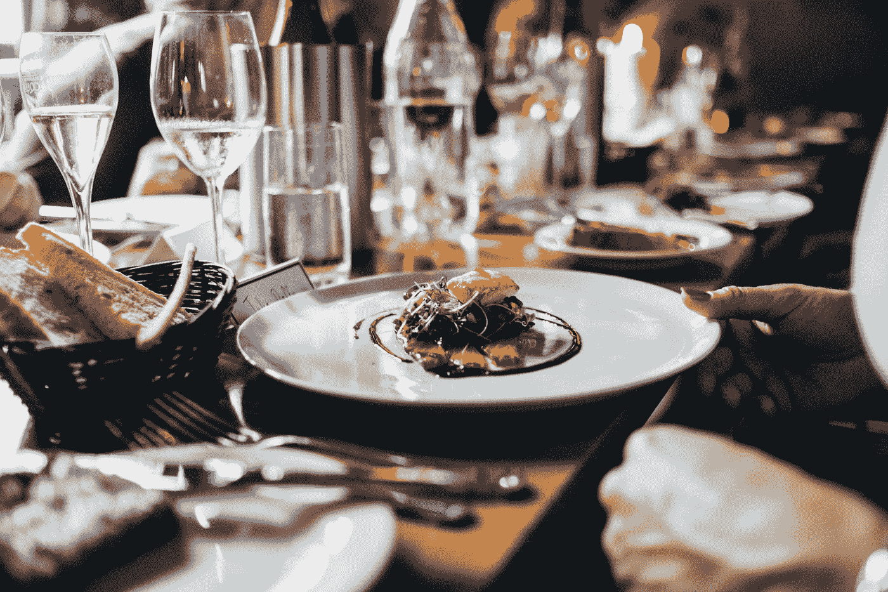
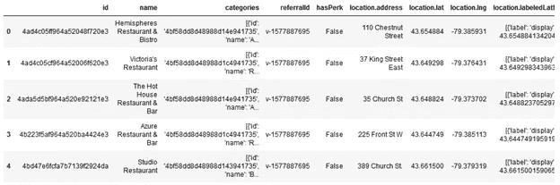
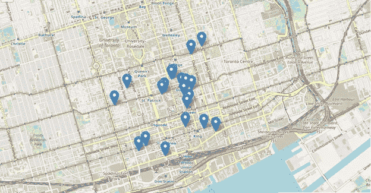
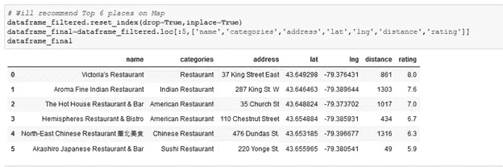
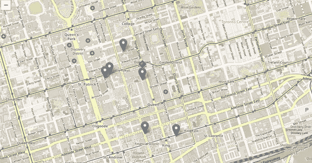

# 附近的顶级餐厅搜索器

> 原文：<https://pub.towardsai.net/capstone-applied-data-science-with-python-bdd30edf6449?source=collection_archive---------1----------------------->

杰伊·温宁顿在 [Unsplash](https://unsplash.com?utm_source=medium&utm_medium=referral) 上的照片

# **简介**

在这个项目中，我创建了一个基本的数据科学项目，即顶级餐厅查找器，它将提供您地址附近的顶级餐厅。我确实根据场馆的等级和距离去探索了。每当一个人想在他的当前地址或任何地址附近找到一家特定的餐馆时，该模型将在地图上推荐附近最好的餐馆及其评级。因此，我的目标是找到附近有人可以去的餐馆。

根据从 Foursquare API 收集的数据和从 Data Science 应用程序检索的信息，我找到了适合指定地点的场地。

# **使用的数据**

数据是从 Foursquare API 收集的。第一步是搜索具有给定查询、位置和在用户从其给定位置指定的半径内的地点。在使用 Foursquare API 提取场地之后，纬度和经度值用于使用 Foursquare API 获取场地细节。

在获取场馆细节后，再次使用 Foursquare API 获取所有场馆的细节，然后在添加相关信息并处理数据后，推荐附近最好的和前 6 名的餐厅。

总结使用的数据:

1.来自地理定位器的纬度和经度。

2.搜索查询数据，如餐馆名称、地址、纬度、经度等。来自 Foursquare

3.附近每个地点的数据，如餐厅类别、评级、评论、提示等。来自 Foursquare

4.数据争论和获取所需数据

# **方法论**

我们的目标是推荐附近的顶级餐厅，所以首先我们需要数据。

1.用户将输入他的当前地址/位置、他想要搜索的餐馆附近的半径和菜肴的类型。

2.地理定位器将获取地址的纬度和经度坐标

3.我们将使用 Foursquare API 搜索所有提供特定菜肴的餐馆，并将结果转换为 Dataframe，以便我们可以对其进行分析。

4.我们将绘制所有位置的标记，描述它们的名称，距离用户和餐馆的类别。

5.现在，我们将使用 Foursquare API 获取每个场馆的详细信息，并获得对我们有用的相关数据。

6.最后，我们将使用这些数据绘制位置地图，并将其提供给用户。

# **结果**

上面的地图是我们项目的成果。

首先，我们向用户展示了地图上所有附近的餐馆，这是我们的第一个结果。

然后我们转换这些数据，过滤到附近的顶级餐厅

最后标出了地图上所有名列前茅的餐馆

因此，用户在地图上找到了他当前位置附近最好的餐馆。

# **讨论**

因此，我们观察到，数据可以根据标准向用户推荐。

根据上面的结果，我们可以推荐最终地图上的标记作为附近的顶级餐馆

# **结论**

因此，我可以说它是一个基本的推荐器，可以用来根据距离和附近餐馆的评级向用户推荐餐馆。

你可以在 [GitHub](https://github.com/chittalpatel/Coursera_Capstone/blob/master/Final_Capstone(1).ipynb) 上找到我完成的项目。