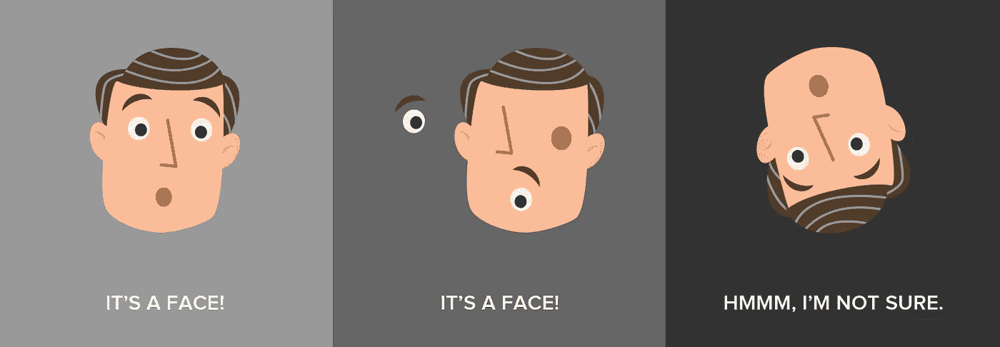
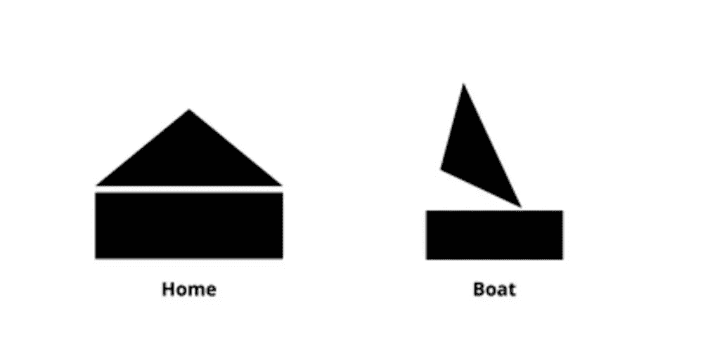
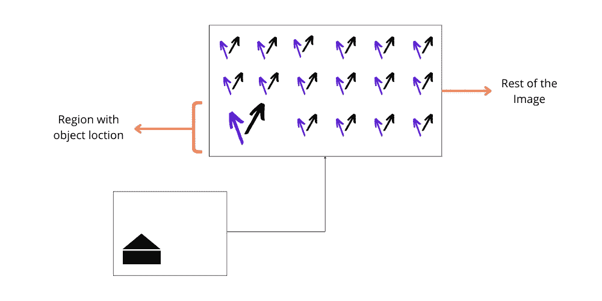
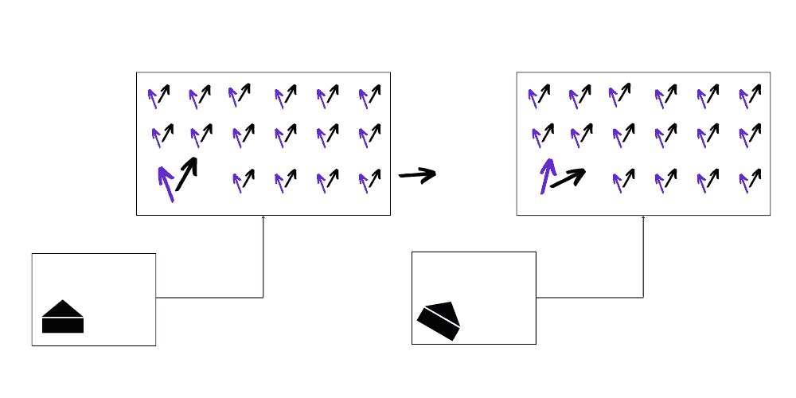
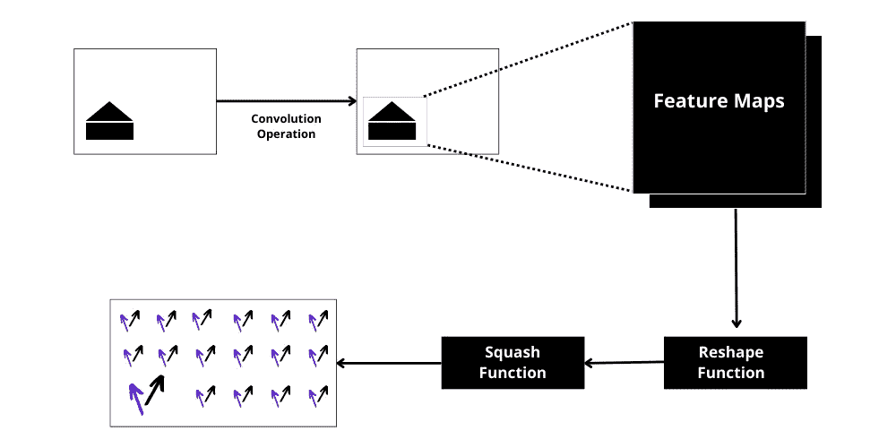

# 胶囊网络:你看到的一切都不是真的

> 原文：<https://pub.towardsai.net/capsule-networks-everything-you-see-is-not-true-ae9bdba902a5?source=collection_archive---------3----------------------->

## 卷积神经网络(CNN)的昂贵替代品

今天，当我们谈论数据时，我们不再局限于传统的柱状或 CSV 类型的数据源。由于检索和存储不同种类数据的数据结构和方法的可用性提高，从声音到图像数据，从截面到时间序列格式的所有格式和类型的数据都有所增加。

亚历山大·辛恩在 [Unsplash](https://unsplash.com?utm_source=medium&utm_medium=referral) 上的照片

本文更侧重于这样一种类型的数据，准确地说是视觉数据，以及它与机器学习的关系。早期处理图像数据的最重要的方法是将数据展平为向量，然后将它们传递给神经网络或其他一些用于不同目的的机器学习算法。随着深度学习的发展，事情发生了剧变，世界在 80 年代末由 Yann le Cun 引入了**卷积神经网络(CNN)。CNN 已被证明是当前最先进的(SOTA)方法，用于处理从图像到视频剪辑等连续数据的各种视觉数据。**

在 CNN 的情况下，我们只是加载数据并训练网络来识别 2D 空间中在展平时变得纠结的特征。随着连续层构建网络，后面层的视野不断增加，使得学习更复杂的特征成为可能。Yann LeCun 通过在 MNIST 数据集上训练一个五层模型并以 98.49%的准确率对数字进行分类来证明这一概念。

尽管 CNN 是深度学习领域的游戏规则改变者，但它有着大多数人都没有意识到的固有缺点。我们现在就来探索它们，这将有助于我们为这篇博客的主题:胶囊网络建立一个基础。

## **缺点 1**

这是由于它们为诸如分类、分割、对象定位等高级任务捕捉特征信息的性质。他们不知道这些特征的位置和/或方向。当我们希望他们了解数据集的分布时，他们更关注提供给他们的训练图像。

## 缺点 2

鉴于上述限制，CNN 也不知道这些特征的相对位置。在图层中向上移动时，他们只捕捉图像中存在的要素来执行任务。这种限制是由于任何 CNN 架构中的结构问题而产生的。

在 CNN 中，我们经常使用合并图层来减小图像大小或减少计算负担，但我们不认为平均或取最高值的像素会丢失许多关于该特征的位置信息。此外，通过选择具有最高值的一个，我们基本上是对图像中的特征进行子采样。

请关注下图，以便更好地理解这两个缺点:

来源: [Spiria](https://www.spiria.com/en/blog/artificial-intelligence/deep-learning-capsule-network-revolution/)

以最左边的图像作为参考图像，我们已经在它上面训练了当前的 ConvNet。现在，根据第一个缺点，当我们旋转图像时，提取眼睛、鼻子和嘴巴等重要信息的过滤器可能不会与它们在最右侧图像中的位置对齐。由于网络在其训练中没有见过任何这样的图像，它没有很好地概括，所以它做出了错误的预测。

对于第二个缺点，考虑中间的图像。脸部的整体方向是相似的，但是我们交换了一些特征的位置。这里，网络能够通过放置在其空间中的相应过滤器来识别一些特征，如果不是全部的话，因此它将其分类为人脸。

## 缺点 3

第三个也是最后一个缺陷也是由于这些 ConvNets 的设计。它们将信息路由到更高层的方式为这些更高层创造了更广阔的感受域。不是通过所有层路由所有信息，而是可以使网络具有选择性，以便将所需的信息传递到相应的层。

我们的大脑以类似的方式运作，我们有不同的脑叶，它们有自己擅长的特定功能。类似地，只将眼睛的特征发送到检测面部的部分比将其发送到检测动物、椅子等的过滤器更直观。

胶囊受这一现象的启发，就像我们的大脑一样，它使用 ***【逆图形】*** 的概念工作。让我们用一个例子来理解一下封装的工作原理。整体架构分为三个子部分:

1.  初级胶囊
2.  较高层胶囊
3.  损失计算

我们将在示例中看到每个子部分的用法。

在我们开始之前，我们将了解胶囊的基本组成部分，即胶囊，以及它与神经元的不同之处。对于所有其他网络，我们有一个神经元的概念，类似于在我们大脑中发现的神经元。它接受一组输入，使用学习到的权重对它们进行加权，然后在其上应用一个激活函数，以在模型中构建复杂性。

Capsule 做类似的事情，但是主要区别在于两个块的输出。Capsule 输出一个矢量，而不是像神经元那样输出一个标量。这个向量携带了图像中物体的方位信息。如果你旋转物体和/或图像，这个矢量表示会同时受到影响。

## **初级胶囊**

来源:图片由作者提供。

考虑上面的图像。我们可以说上面的图像是由两个基本部分组成的，一个三角形和一个矩形。现在假设我们用 200 个胶囊初始化主胶囊层，100 个代表矩形，另外 100 个代表三角形。

它们被分布成覆盖整个图像。下图中用箭头表示了每个胶囊的输出；黑色箭头表示矩形的输出，蓝色箭头表示三角形的输出。为了决定一个特定的对象是否存在，我们关注这些箭头的长度，而它们的姿态给我们提供了关于该特定对象的方向的信息(位置、比例、旋转等等)。

初级胶囊层胶囊矢量输出的可视化。来源:图片由作者提供。

这些胶囊也遵循等方差的性质，即，对于对象的位置/方向的微小变化，我们将看到表示这些对象的箭头的相应变化。这有助于 CapsuleNet 在图像中定位对象，并获得关于姿势参数的精确信息。

改变图像中对象方向的效果。来源:图片由作者提供。

为此，初级胶囊层经历三个不同的阶段:

I)卷积

ii)重塑

iii)挤压功能

我们获取图像，并通过卷积层对其进行处理，以获得输出特征图。然后我们重塑这些特征地图。

在我们的例子中，假设我们得到了 50 个特征地图作为输出，我们将它们整形为图像中每个位置的 25 维(50 = 25*2)的两个向量。每个矢量代表两种基本形状中的一种。这些值现在可以被推断为每个基本形状在图像中的特定位置存在或不存在的概率，但是要这样做，它们的长度必须在 0 到 1 之间。为此，我们应用了 ***挤压函数*** 。它基本上采用向量，应用范数，然后一个非线性函数来保持其长度在 0 和 1 之间。

初级胶囊层的整个过程。来源:图片由作者提供。

所以，到目前为止，我们已经有了图像中基本形状的信息。我们现在需要利用这些信息来推断它是一艘船还是一所房子。为此，我们转到了 CapsuleNet 的下一层——更高层。

# 更高层

下一步是更高层的功能。但是在我们开始之前，初级层还有一个功能要做。挤压输出后，主要层还会尝试预测每个较高层的输出。我们有 100 个矩形的胶囊和 100 个三角形的胶囊，这将给出一些预测，假设较高层有两个胶囊，一个是房子，一个是船，这些预测是根据找到的形状的方向进行的。

由于姿态上的额外信息，胶囊将能够达成共识，即呈现的对象可以是船。这就是所谓的 ***协议路由*** 。由于这个原因，信号现在只发送到代表船的更高级别的胶囊，而不是另一个。

现在，更高层的工作开始了，即使主要层为更高层预测了一些输出，它仍然需要预测自己的输出并验证它。最初，较高层设置由较低层用来路由图像信号的*路由权重*。它通过计算自己的输出来做到这一点，然后由较低层验证输出。基于两个预测的相似性，权重被更新。

此外，在我们从更高层获得输出后，我们可以在更高层的顶部添加第三层，这将是一层神经元，用于根据接收到的矢量输出对图像进行分类。

## 总结一下！

在这篇文章中，我们看到了一个胶囊的工作原理以及产生这个概念的直觉。从 CNN 的缺点出发，我们构建了他们的解决方案，以及如何让 CapsuleNets 成为他们可行的替代方案。

虽然直觉和算法似乎做得很好，但当涉及到现实时，它们也有自己的缺点。

*   由于动态路由和大量的封装，计算变得繁重并且需要更高的计算资源。
*   当两个相同类型的物体彼此靠近放置时，它也遭受拥挤的问题。

尽管如此，对于社区来说，封装是一种有前途的方法，因此可以进一步改进。

希望这篇文章能够清楚地阐明总体概念，并帮助您更深入地理解胶囊。请继续关注未来更多这样的作品。再见！