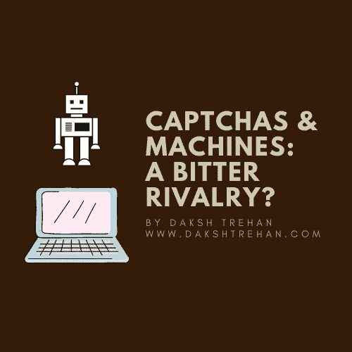
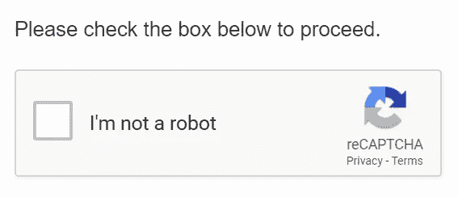
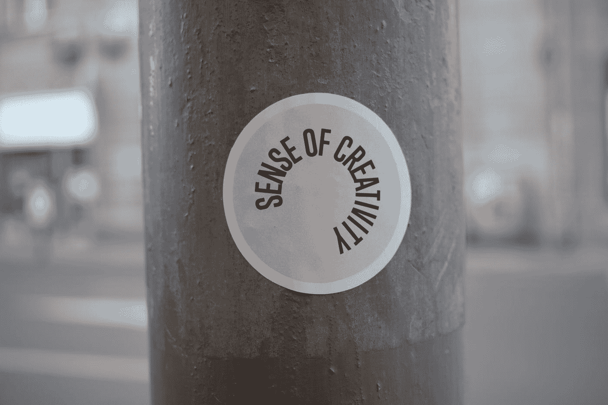
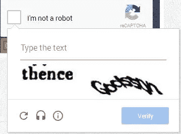
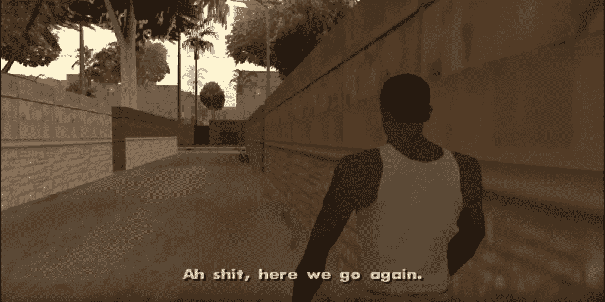
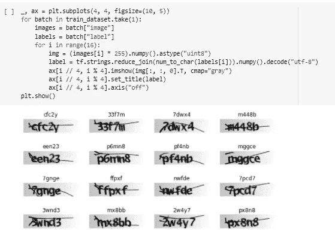
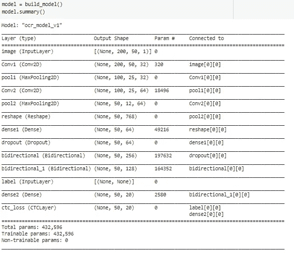
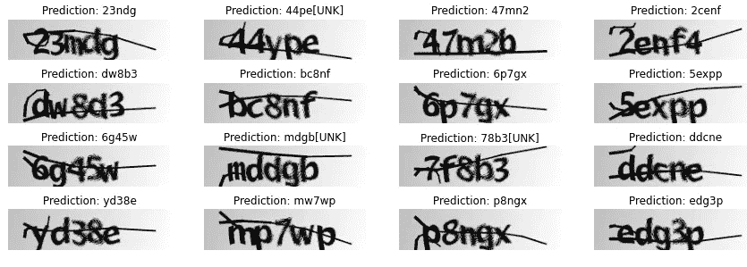

# 验证码 v/s 机器:激烈的竞争？

> 原文：<https://pub.towardsai.net/captchas-vs-machines-a-bitter-rivalry-4faf86e993b7?source=collection_archive---------2----------------------->

## [机器学习](https://towardsai.net/p/category/machine-learning)，[网络安全](https://towardsai.net/p/category/cybersecurity)

## 以及如何用机器学习破解验证码！

我对这项技术感到有点惊讶，有时，[它让我看古怪却有趣的短视频](https://towardsdatascience.com/the-inescapable-ai-algorithm-tiktok-ad4c6fd981b8)，有时，它让我证明，**“我是一个人！”**

你订机票，面对验证码。你创建帐户，你面对验证码。你为你的文章检查抄袭，再次验证码！

有时候，我想大喊，**对！我是一个机器人。显然我是一个人🙄)**

其他时候，我想知道谁在第一次通过时得到所有的山/自行车/消防栓/自行车？

# 什么是验证码？我们为什么要使用它？他们越来越难了吗？

CAPTCHA 代表 **C** 完全 **A** 自动 **P** 公共 **T** 在测试期间告诉 **C** 计算机&H 人类 **A** 零件。

21 世纪初，当雅虎正盛的时候，他们害怕会有一天用户会编写代码来创建数以百万计的虚假帐户来发送垃圾邮件。为了阻止垃圾邮件发送者，需要一种机制来区分人类用户和自动脚本。

所需的机制应该是我们的计算机无法破解的东西，但是他们必须能够对测试进行评分。我告诉过你科技很奇怪但很有趣。

当时由于机器的配置较弱，接触机器学习和 Python 较少，计算机在识别文本方面较弱。但另一方面，我们人类在文本识别方面有专长，因为我们所做的就是整天阅读文本。

Luis Von Ahn 开发了 CAPTCHA，给计算机一个随机的文本图像和它的答案，文本会被扭曲，从而使计算机难以理解。

照片由 [Marija Zaric](https://unsplash.com/@simplicity?utm_source=medium&utm_medium=referral) 在 [Unsplash](https://unsplash.com?utm_source=medium&utm_medium=referral) 上拍摄

这项测试有助于区分人类和使用者。但这并不是长久之计，很快计算机就开始学习这种扭曲的文本，并且越来越擅长。

同样的问题出现了，计算机太聪明了，无法绕过测试，现在随着流量的增加，需要一个更健壮的机制。

## 重新验证码

它与验证码非常相似，但现在，验证码中有两个单词，而不是一段文本。

对于第一个单词，计算机知道答案，但第二个单词是从任何文章/书籍中随机抽取的。据推测，如果人类正确回答了第一个单词，那么很有可能另一个单词也是正确的！

对于第二个词，通常，计算机被用来向许多用户发送相同的验证码，并检查大多数用户。但很快，这种方法被用尽，计算机仍然能够破解重新验证码。

他们把这种方法做得非常好，根据谷歌进行的一项测试，只有 33%的人能攻克重新验证码，但人工智能做到了 99.8%的准确率

## 重新验证码(v2)

这一次，方法是不同的，这一次，人类被期望教机器关于真实世界的实体。

由[迪迪·库尔尼亚万](https://unsplash.com/@derededed?utm_source=medium&utm_medium=referral)在 [Unsplash](https://unsplash.com?utm_source=medium&utm_medium=referral) 上拍摄的照片

我们都记得消防栓，公共汽车，自行车，自行车测试，对不对？

当我们试图选择正确的图像时，我们试图教会机器真实世界的实体是什么样子的。我们给出的输入被记录下来，用于自学习汽车更好地理解这些实体。

但是，你猜怎么着？AI 在这方面也越来越好了！

## 重新验证码(第三版)

到这个时候，人类已经失去了创造一个强大的测试的所有希望和脾气。

现在，我们开始根据用户的行为来验证她的身份。这是一种无形的测试，用户并不知道。它在你的网页后面秘密运行，以确定你是人还是机器人。

> 毫无疑问，隐私是一个神话！🙂

该测试可以跟踪你的点击、打字速度和工作流程。并以此为基础来判断。如果你表现出一些不寻常的行为，那就是一秒钟写 100 个单词的文本，非常频繁地点击。它会提示重新验证码(v2)并要求您验证。

# 机器学习如何破解验证码？

到目前为止，你一定已经明白用机器学习破解验证码不是什么大事。您需要做的只是用所需的数据构建一个简单的 OCR 模型。

训练数据可以在 [Github](https://github.com/AakashKumarNain/CaptchaCracker/) 找到

该数据集由 1040 幅图像组成。

## 可视化数据

## 模型

## 训练我们的模型

## 预测产量

代码可以在:[使用 ML 解决验证码](https://github.com/dakshtrehan/Solving-CAPTCHA-using-ML)找到

**如果你喜欢这篇文章，请考虑订阅我的简讯:** [**达克什·特雷汉每周简讯**](https://mailchi.mp/b535943b5fff/daksh-trehan-weekly-newsletter) **。**

# 结论

希望这篇文章能让你对验证码有所了解。

这项工作是作为一个学术/有趣的项目，并不打算用于有害/恶意的目的。

# 参考资料:

[1] [用于读取验证码的 OCR 模型。](https://keras.io/examples/vision/captcha_ocr/)

在网上找我:**[**www.dakshtrehan.com**](http://www.dakshtrehan.com)**

**在领英关注我:[**www.linkedin.com/in/dakshtrehan**](http://www.linkedin.com/in/dakshtrehan)**

**阅读我的科技博客:[【www.dakshtrehan.medium.com】T21](http://www.dakshtrehan.medium.com)**

**在 Instagram 跟我连线:[**www.instagram.com/_daksh_trehan_**](http://www.instagram.com/_daksh_trehan_)**

# **想了解更多？**

**[YouTube 是如何利用 AI 推荐视频的？](/how-is-youtube-using-ai-to-recommend-videos-38a142c2d06d)
[利用深度学习检测新冠肺炎](https://towardsdatascience.com/detecting-covid-19-using-deep-learning-262956b6f981)
[逃不掉的 AI 算法:抖音](https://towardsdatascience.com/the-inescapable-ai-algorithm-tiktok-ad4c6fd981b8)
[GPT-3 向一个 5 岁的孩子解释。](/gpt-3-explained-to-a-5-year-old-1f3cb9fa030b)
[Tinder+AI:一场完美的牵线搭桥？](https://medium.com/towards-artificial-intelligence/tinder-ai-a-perfect-matchmaking-b0a7b916e271)
[一个内部人士的使用机器学习卡通化指南](https://medium.com/towards-artificial-intelligence/an-insiders-guide-to-cartoonization-using-machine-learning-ce3648adfe8)
[谷歌是如何做出“哼哼来搜索？”](/how-google-made-hum-to-search-865f224b70d0)
[一行神奇的代码执行 EDA！](/one-line-magical-code-to-perform-eda-f83a731fbc35)
[给我 5 分钟，我给你深度假！](/give-me-5-minutes-ill-give-you-a-deepfake-ce83a645b0f9)**

> ***欢呼***