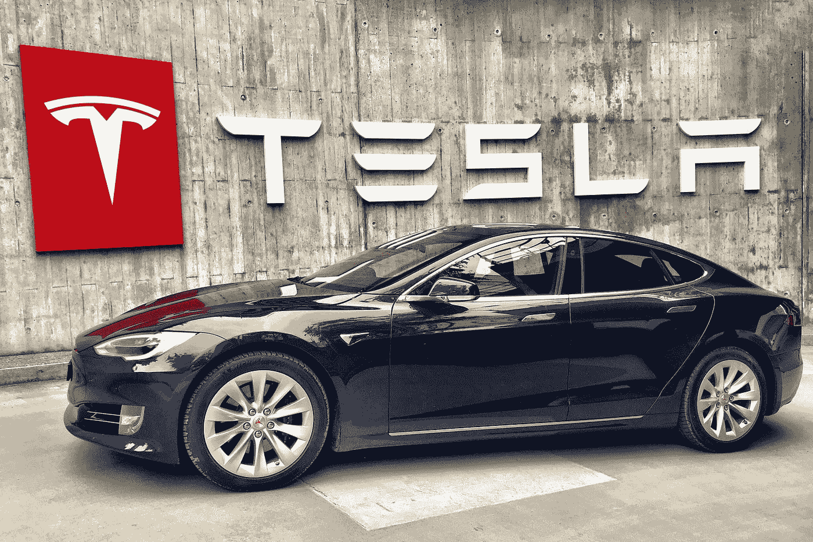
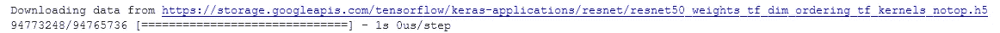
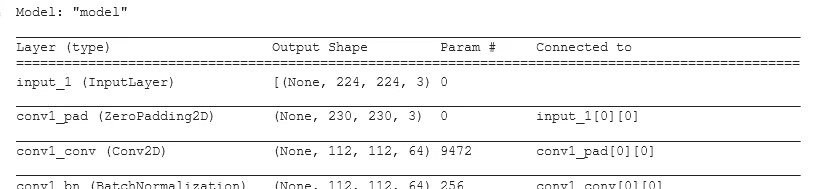
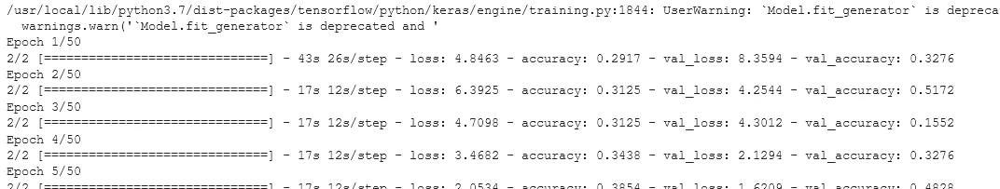
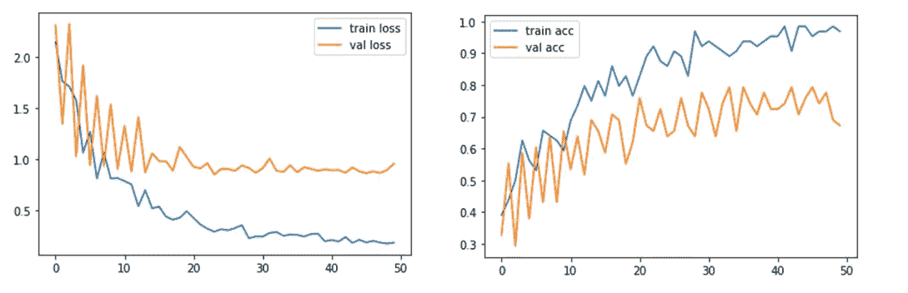
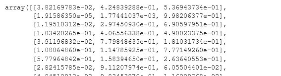
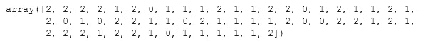
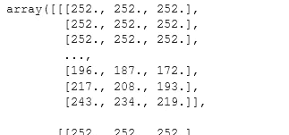

# 基于 Python 深度学习的汽车品牌分类

> 原文：<https://pub.towardsai.net/car-brand-classification-in-deep-learning-with-python-d08c54add941?source=collection_archive---------1----------------------->

## [深度学习](https://towardsai.net/p/category/machine-learning/deep-learning)

## 使用 Keras 迁移学习 VGG16 和 Resnet 50



照片由[在](https://unsplash.com/@teslafans?utm_source=medium&utm_medium=referral) [Unsplash](https://unsplash.com?utm_source=medium&utm_medium=referral) 上击败 Jau

## 介绍

在本文中，我们将使用三个品牌的汽车图像实现汽车品牌分类:梅赛德斯、奥迪和兰博基尼。

VGG-16 是一个 16 层深度卷积神经网络，可以将图像分为 1000 个对象类别。

该数据集包括用于品牌分类的汽车图像。这里，我们有两个文件夹，即 train 和 test，每个文件夹都有三个名为兰博基尼、奥迪和奔驰的文件夹。

我在这里使用迁移学习是因为它非常有用，因为大多数现实世界的问题通常没有数百万个标记的数据点来训练如此复杂的模型。

现在让我们导入所有需要的库

在这里，我们使用 Keras，因为它支持深度神经网络的快速实验。我们将在 Resnet 50 的帮助下建立我们的模型，因为它可以训练具有许多层的深度神经网络。

我们需要从现有的训练样本中创建新的训练样本，这个过程称为图像增强。这可以使用图像数据生成器来执行。

使用的数据集可以从这里下载:[汽车品牌图片数据集| Kaggle](https://www.kaggle.com/ritesh2000/car-brand-images-dataset)

```
**# import the required libraries**from tensorflow.keras.layers import Input, Lambda, Dense, Flatten
from tensorflow.keras.models import Model
from tensorflow.keras.applications.resnet50 import ResNet50*#import VGG16* from tensorflow.keras.applications.resnet50 
import preprocess_input
from tensorflow.keras.preprocessing import image
from tensorflow.keras.preprocessing.image import
                                ImageDataGenerator,load_imgfrom tensorflow.keras.models import Sequentialimport numpy as np
import matplotlib.pyplot as pltfrom glob import glob
```

将所有图像的大小调整为[224，224]并创建一个包含两个独立文件夹的目录，分别命名为 train 和 test。这些文件夹将包含分类所需的汽车图像。

```
*# re-size all the images to this*IMAGE_SIZE = [224, 224]train_path = 'Datasets/train'
valid_path = 'Datasets/test'
```

我们使用 imagenet 权重，因为不需要从头开始训练神经网络。

```
*# Use imagenet weights*resnet = ResNet50(input_shape=IMAGE_SIZE + [3], weights='imagenet',
                  include_top=**False**)
```



作者的照片

这里我们使用 Resnet 是因为 Resnet*的根本突破是，它允许我们成功地训练具有 150+层的极深度神经网络。*

```
**# don't train existing weights***for** layer **in** resnet.layers:
    layer.trainable = **False***# This helps to get number of output classes* folders = glob('Datasets/train/*')*# Our Layers* x = Flatten()(resnet.output)prediction = Dense(len(folders), activation='softmax')(x)*# creating object model*model = Model(inputs=resnet.input, outputs=prediction)
model.summary()*
```

**

*模型总结。作者的照片*

*这里我们使用的是*分类交叉熵*是一个损失函数，用于多类分类任务。*

```
**# compile the model*model.compile(loss='categorical_crossentropy', optimizer='adam',
              metrics=['accuracy'])*# Using the Image Data Generator***from** **tensorflow.keras.preprocessing.image** **import** ImageDataGeneratortrain_datagen = ImageDataGenerator(rescale = 1./255, shear_range =
                      0.2, zoom_range = 0.2, horizontal_flip = **True**)test_datagen = ImageDataGenerator(rescale = 1./255)training_set = train_datagen.flow_from_directory('Datasets/train',
                                         target_size = (224, 224),
                                         batch_size = 32,
                                         class_mode = 'categorical')#output:
Found 64 images belonging to 3 classes. test_set = test_datagen.flow_from_directory(‘Datasets/test’,
                                        target_size = (224, 224),
                                        batch_size = 32,
                                        class_mode = ‘categorical’)#output:
Found 58 images belonging to 3 classes.*# fit the model*r = model.fit_generator(training_set, validation_data=test_set,
                       epochs=50, steps_per_epoch=len(training_set),
                       validation_steps=len(test_set))*
```

**

*模型的训练。作者的照片*

*[](/bitcoin-price-prediction-with-rnn-and-lstm-in-python-f912d57c483e) [## 用 Python 实现 RNN 和 LSTM 的比特币价格预测

### 使用深度学习预测比特币价格

pub.towardsai.net](/bitcoin-price-prediction-with-rnn-and-lstm-in-python-f912d57c483e) 

现在，绘制损失图

```
*# ploting the loss*plt.plot(r.history['loss'], label='train loss')
plt.plot(r.history['val_loss'], label='val loss')
plt.legend()
plt.show()
plt.savefig('LossVal_loss')*# ploting the accuracy*plt.plot(r.history['accuracy'], label='train acc')
plt.plot(r.history['val_accuracy'], label='val acc')
plt.legend()
plt.show()
plt.savefig('AccVal_acc')
```



损失和准确度图。作者的照片

从上面的图中，我们可以推断验证损失高于训练损失，训练精度高于验证精度。

现在我们需要以 h5 文件格式保存我们的模型，以便进一步测试模型。

```
*#* save it as a h5 file**from** **tensorflow.keras.models** **import** load_model
model.save('model_resnet50.h5')
```

加载模型后，让我们对测试集进行预测。

```
y_pred = model.predict(test_set)
y_pred
```



预测值。作者的照片

这里使用 Np.argmax()从数组中获取最大元素的索引。

```
y_pred = np.argmax(y_pred, axis=1)
y_pred
```



作者的照片

```
**from** **tensorflow.keras.models** **import** load_model#Load the h5 file in the model
model=load_model('model_resnet50.h5')
```

现在，我们将在来自测试数据的任意随机图像上测试该模型。

```
img=image.load_img('Datasets/Test/lamborghini/11.jpg',target_size=
                    (224,224))x=image.img_to_array(img)
x
```



作者的照片

```
#Shape of the image
x.shape#output:
(224, 224, 3)#Normalizing the image pixels values
x=x/255#Expand the Dimensions of the imagex=np.expand_dims(x,axis=0)
img_data=preprocess_input(x)
img_data.shape#output:
(1, 224, 224, 3)
```

现在，让我们对 img_data 执行预测

```
model.predict(img_data)#output:
array([[0.01513638, 0.01566849, 0.9691952 ]], dtype=float32)a=np.argmax(model.predict(img_data), axis=1)
a==1#output:
array([ True])
```

这就是我们如何对数据集进行图像分类。

## 结论:

本文给出了一种实用的汽车品牌图像分类方法。该模型可以通过使用“***【H5】***文件来预测汽车品牌。

我希望你喜欢这篇文章。通过我的 [LinkedIn](https://www.linkedin.com/in/data-scientist-95040a1ab/) 和 [twitter](https://twitter.com/amitprius) 联系我。

# 推荐文章

[1。NLP —零到英雄与 Python](https://medium.com/towards-artificial-intelligence/nlp-zero-to-hero-with-python-2df6fcebff6e?sk=2231d868766e96b13d1e9d7db6064df1)
2。 [Python 数据结构数据类型和对象](https://medium.com/towards-artificial-intelligence/python-data-structures-data-types-and-objects-244d0a86c3cf?sk=42f4b462499f3fc3a160b21e2c94dba6)3 .[Python 中的异常处理概念](/exception-handling-concepts-in-python-4d5116decac3?source=friends_link&sk=a0ed49d9fdeaa67925eac34ecb55ea30)
4。[为什么 LSTM 在深度学习方面比 RNN 更有用？](/deep-learning-88e218b74a14?source=friends_link&sk=540bf9088d31859d50dbddab7524ba35)
5。[神经网络:递归神经网络的兴起](/neural-networks-the-rise-of-recurrent-neural-networks-df740252da88?source=friends_link&sk=6844935e3de14e478ce00f0b22e419eb)
6。[用 Python](https://medium.com/towards-artificial-intelligence/fully-explained-linear-regression-with-python-fe2b313f32f3?source=friends_link&sk=53c91a2a51347ec2d93f8222c0e06402)
7 全面讲解了线性回归。[用 Python](https://medium.com/towards-artificial-intelligence/fully-explained-logistic-regression-with-python-f4a16413ddcd?source=friends_link&sk=528181f15a44e48ea38fdd9579241a78)
充分解释了 Logistic 回归 8。[concat()、merge()和 join()与 Python](/differences-between-concat-merge-and-join-with-python-1a6541abc08d?source=friends_link&sk=3b37b694fb90db16275059ea752fc16a)
的区别 9。[与 Python 的数据角力—第一部分](/data-wrangling-with-python-part-1-969e3cc81d69?source=friends_link&sk=9c3649cf20f31a5c9ead51c50c89ba0b)
10。[机器学习中的混淆矩阵](https://medium.com/analytics-vidhya/confusion-matrix-in-machine-learning-91b6e2b3f9af?source=friends_link&sk=11c6531da0bab7b504d518d02746d4cc)*