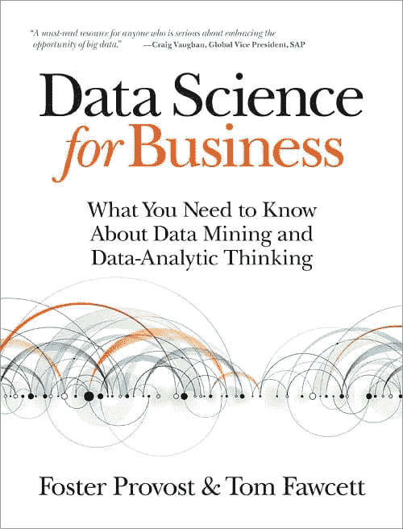
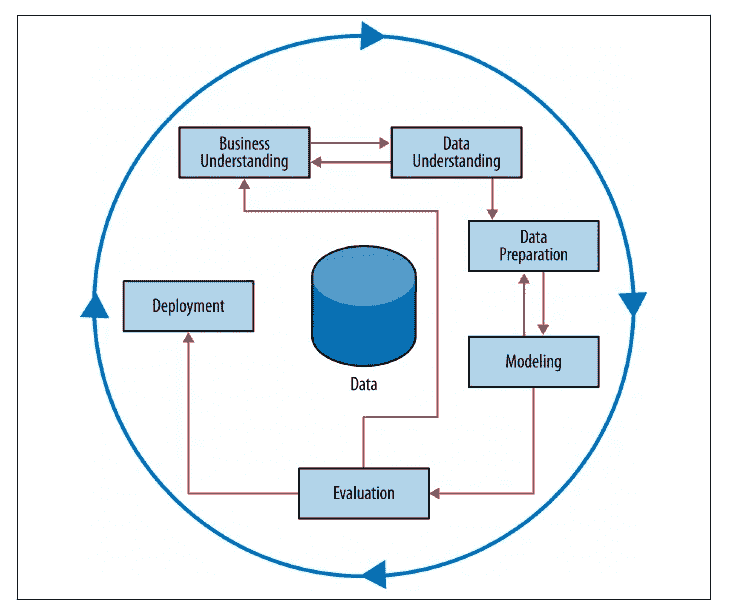

# 书评:Provost 和 Fawcett 的《商业数据科学》

> 原文：<https://pub.towardsai.net/careers-fbe957958d59?source=collection_archive---------3----------------------->

## [职业生涯](https://towardsai.net/p/category/careers)

## 为什么 2013 年发布的一本书仍然是数据科学领域的绝佳入门

# 1.图书概述

数据科学是在过去十年中通过结合统计学和数学、计算机科学和商业智能的概念来帮助公司做出更好的决策而普及的领域。你可能会发现类似的定义，但其背后的本质是使用数据来帮助公司解决复杂的业务问题。

随着我们看到大量关于数据科学的入门课程和书籍、工具和库变得越来越容易获得，越来越多的人开始对该领域表现出兴趣。

那是一件了不起的事情！

但让我担心的是，这些课程甚至是数据科学和分析方面的书籍现在大多只关注如何使用图书馆，而不是你为什么应该使用它们，甚至是你是否需要使用它们。因此，结果是数据科学领域的大部分专业人士缺乏解决正确问题所需的分析思维。

> “这不是一本算法书。它提出了从数据中提取有用知识的基本原则。”—商业数据科学网页

当我开始寻找一本书来填补这一空白时，我最终找到了 T2 和汤姆·福塞特的《商业数据科学》。起初，我不确定 2013 年发行的一本书在过去几年的创新大获全胜后是否仍然有意义，但我错了。它确实给了你一个很好的视角，让你了解什么是数据工作，以及如何进行分析性思考，在我看来，这是最难教人的事情。

作者在书中提到的另一个关键方面是，一个成功的公司应该如何处理一般数据，以及为什么数据科学团队需要与利益相关者密切合作。

> "数据(和数据科学能力)应该被视为资产，应该是投资的候选对象."第十四章

在本文中，我将告诉你我对这本书的看法，以及为什么《商业数据科学》应该放在你的书架上。

# 2.利弊

为了总结这篇评论中涉及的主题，我在下面列出了与这本书相关的主要优点和缺点:

## 赞成的意见👍

*   数据科学概念得到了很好的解释和语境化。
*   这本书于 2013 年出版，至今仍有现实意义。
*   古典和现代文章的参考资料大集合。
*   作者展示的真实案例让您对作为数据科学家可能会发现的问题有了很好的理解。

## 骗局👎

*   一些数据科学的表述感觉过时了。
*   书中没有代码或 GitHub 知识库，也没有案例分析。

# 3.图书主要受众

正如作者在介绍章节中提到的，**这本书适合三种专业人士**:

1.  **有商业背景的专业人士**有兴趣了解数据科学能给涉及数据的项目带来什么；
2.  **与数据系统一起工作的开发人员**；
3.  **有抱负的数据科学家。**

我确实认为第一组(让我们称他们为业务分析师)和第三组(数据科学家和分析师)可以从这本书中获得最多，因为它专注于呈现该领域背后的概念，而不仅仅是算法和代码。因此，如果你是一名开发人员，想要了解数据科学和机器学习的框架和工具，这可能不适合你。

# 4.这本书的结构

自本书开始以来，您注意到的一件事是，它没有解释与数据科学相关的方法和算法，而是关注不同类型的业务问题，以及如何用数据科学解决这些问题。这并不意味着像探索性数据分析、监督和非监督方法这样的传统内容在书中没有呈现。实际上，作者已经浏览了你在《数据科学导论》课程中找到的大部分主题，所以你不会发现它在内容上不完整。

**前两章**介绍了**分析思维的概念，以及数据科学项目工作流程**的内容(描述了 CRISP-DM 流程)。

> “有许多涵盖数据挖掘算法和技术的好书，从实用指南到数学和统计处理。相反，这本书侧重于基本概念，以及它们如何帮助我们思考数据挖掘可能带来的问题。”—第一章

从数据科学的角度来看，它可以很好地理解处理问题时需要完成的工作。

**CRISP-DM 数据挖掘过程** (Shearer，C. (2000)。CRISP-DM 模型:数据挖掘的新蓝图。数据仓库杂志，5(4)，13–22。)

**第 3 章**通过解释决策树是如何构建的，向读者介绍了**预测建模**。每次作者想展示一项新技术时，总是用一个商业问题来说明，这样更容易理解。虽然数学和算法不是书中的重点，但当作者需要使用和解释时，他们做得很好。

**第 4 章和第 5 章**扩展了建模的主题，引入了**回归的概念，将其与分类**相比较。提出了逻辑回归，以及拟合和过拟合模型的思想。

**第 6 章**解释了使用最近邻的**聚类**你的数据的想法和**无监督方法的应用。**

**第 7 章**介绍**分析思维**的理念，大概是本书的关键部分。它描述了不同的场景和模型，以及评估哪种解决方案最适合当前问题的方式。**期望值框架**是应用于该问题的方法之一。

第 8 章扩展了如何使用 **ROC-AUC** 、**累积响应、**和**提升曲线测量模型性能的概念。**

在**第 9 章**中，你会遇到**贝叶斯法则介绍**，以及**第 10 章**自然语言处理(NLP)介绍**。**

****分析思维**的概念在**第 11 章**中用更复杂的商业案例的例子展开。**

****第 12 章**描述了**集成方法**，并通过解释影响每个模型错误率的 3 个因素(固有随机性、偏差和方差)说明了为什么它们能比传统方法表现得更好。**

****第 13 章**介绍了**数据科学作为一种商业战略的理念**，并举例说明了如何开展数据项目，以及如何组建公司以充分利用数据科学团队。**

**第 14 章回顾了贯穿全书的关键概念。**

# **5.主要要点**

**如前所述，这是我强烈推荐给任何想在数据科学领域开始职业生涯或管理与数据科学家互动的项目的人的书。因为焦点不在工具或代码上，所以在它第一次发布近十年后，它仍然是相关的。**

**尽管如此，只要这本书保持其最初的本质，看到一个包含该领域进展的新版本还是很有趣的。**

# **非常感谢你阅读我的文章！**

*   **你可以在我的[个人资料页面](https://medium.com/@gabrielsgoncalves) **找到我的其他文章🔬****
*   **如果你喜欢它并且**想成为中等会员**请使用我的 [**推荐链接**](https://medium.com/@gabrielsgoncalves/membership) 也支持我👍**