# 中心趋势:揭开“平均”术语的神秘面纱

> 原文：<https://pub.towardsai.net/central-tendency-demystifying-average-term-6288ad03a35b?source=collection_archive---------3----------------------->

## [统计数据](https://towardsai.net/p/category/statistics)

人们如何使用“平均”一词来欺骗他人

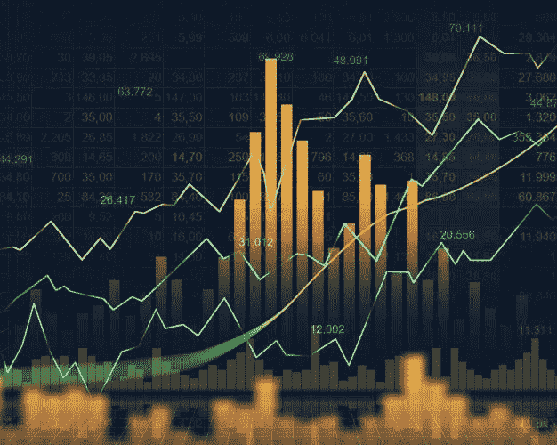

图片作者:[Pinterest](https://id.pinterest.com/freepik/_created/)上的 Freepik

# **什么是中心倾向？**

集中趋势是描述数据的中间值或典型值的数字。它帮助你从数据中获取有价值的信息。

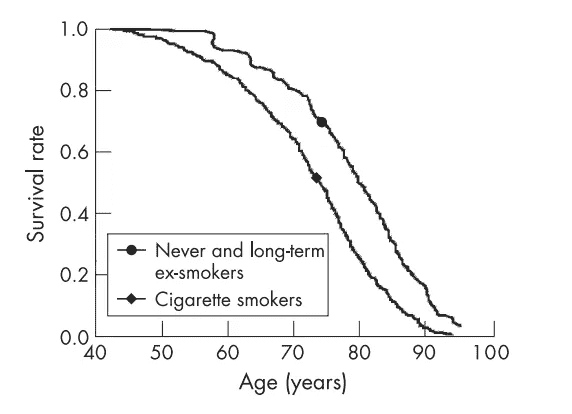

吸烟者和非吸烟者的存活率，照片由 Martinette T Streppel 等人拍摄。关于与长期吸烟、雪茄和烟斗有关的死亡率和预期寿命:Zutphen 研究

你可能会戒烟，因为平均来说，不吸烟的人比吸烟的人存活率高。

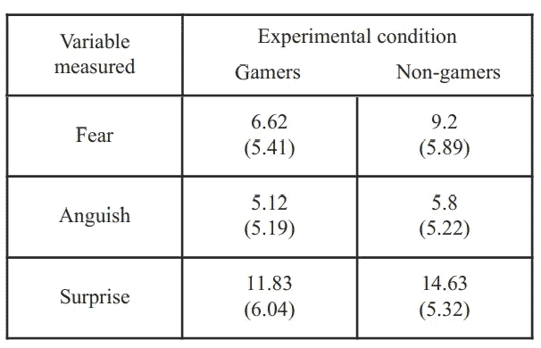

游戏玩家和非游戏玩家沉浸后的情绪测量，照片由 Erik Geslin 等人拍摄。关于虚拟现实中游戏玩家和非游戏玩家的情绪反应

你可能想玩一些电子游戏，因为一般来说，游戏玩家比非游戏玩家有更好的情绪反应。

那么，这个平均的东西是什么呢？平均值是一个数据集中的数字。平均值通常被称为集中趋势的量度。3 种最常见的集中趋势测量方法是均值、中值和众数。

## **的意思是**

均值是最流行和最著名的集中趋势度量。将所有项目相加，然后除以项目数，即可得出平均值。

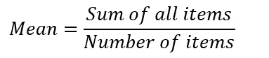

照片作者:我

假设我们有关于餐馆饮料价格的数据，如下所示:

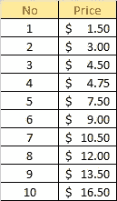

照片作者:我

平均值将为

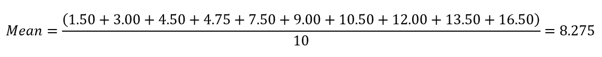

照片作者:我

所以餐厅里饮料的平均价格是 8.275 美元。平均值有一个主要缺点，就是特别容易受到异常值的影响。异常值是指与数据集的其余部分相比，数值特别小或特别大的异常值。回到上面的例子，假设餐馆推出了价格为$99.00 的新饮料。价目表更新如下:

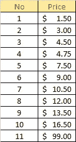

照片作者:我

平均值将为

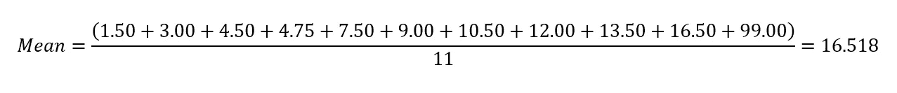

照片作者:我

所以餐馆里饮料的平均价格是 16.518 美元。问题是，当他们把价格为 99 美元的新饮料列入价目表时，这个数字是平均值的两倍。如果我们说他们卖 16.518 美元左右的饮料，是不是有失偏颇？我们应该从这个例子中吸取的要点是，平均值不足以得出结论。

## **中位数**

另一方面，Median 是有序数据集中的中间值。为了计算中位数，我们必须按升序对数据进行排序，中位数是有序数据中位置(n+1)/2 处的值，其中 n 是数据的数量。如果 n 是偶数，则中位数是两个中间数的平均值。使用新的更新价格，我们可以如下计算中值:

按升序排列数据

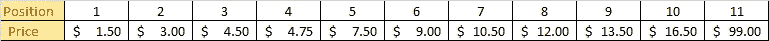

照片作者:我

计算中间位置

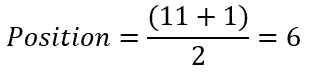

照片作者:我

在获得的位置取数据值

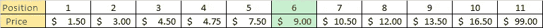

照片作者:我

我们得到的中间值是 9.00 美元。现在我们可以说，餐馆出售的饮料大约是 9.00 美元，不是真的有偏见，不是吗？

中位数的问题是我们必须对数据进行排序。在大数据的情况下，计算中位数变得很耗时。

## 方式

模式是数据中最常见的项目。模式可用于定性和定量数据。例如，查找数学分数为 10 的学生的模式

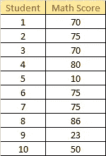

照片作者:我

模式是 75，因为它是列表中最常见的分数。我们也可以在定性数据中使用模式，例如，在学生是否通过测试时寻找模式

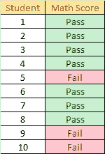

照片作者:我

模式为“通过”,因为它是列表中最常见的分数。

现在如果我们回到餐馆价目表

照片作者:我

我们说不存在模式，因为每一项都出现一次，但是如果我们找到 11 种模式呢？我们可以这么说，但在 11 个项目中找出 11 个模式是没有意义的。

# 歪斜

偏斜度表示数据是否集中在一侧。如果直方图向左或向右移动，则分布是偏斜的，否则就不是偏斜的。有两种类型的偏斜，即右(正)偏斜和左(负)偏斜。

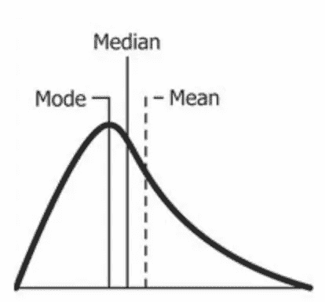

右歪斜，照片由[维基百科](https://en.wikipedia.org/wiki/Skewness)

在右侧偏斜的情况下，3 个测量值将是:众数

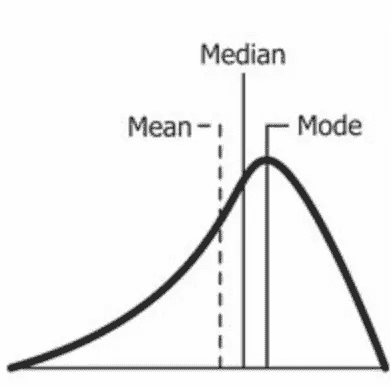

左侧倾斜，照片由维基百科提供

在左侧偏斜的情况下，3 个测量值将是:平均值

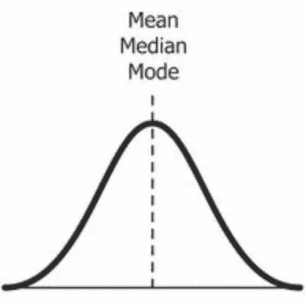

没有歪斜，图片来自维基百科

在分布不偏斜的情况下，平均值、中值和众数被认为是相同的值。这是我们可以使用一个测量值的唯一条件。

# 结论

哪一个是最好的测量？答案是没有最好的衡量标准。如果分布是偏斜的，无论是右偏斜还是左偏斜，仅使用一个测量值不足以判断数据的中间值，否则，如果分布不是偏斜的，我们可以使用我们想要的任何值，因为所有 3 个测量值都是相同的。

这是很容易计算的中心倾向，它经常被滥用，人们经常使用它来欺骗他人。例如，有人会说“的平均值”，我们最后会想他是在说平均值、中间值还是众数。

# 参考

[1]Martinette T . Streppel 等人，[死亡率和预期寿命与长期吸烟、雪茄和烟斗有关:Zutphen 研究](https://www.researchgate.net/publication/51382671_Mortality_and_life_expectancy_in_relation_to_long-term_cigarette_cigar_and_pipe_smoking_The_Zutphen_Study)(2007)
【2】Erik Geslin 等人，[游戏玩家与非游戏玩家在虚拟现实中的情绪反应](https://www.researchgate.net/publication/291095383_Gamers'_versus_non-gamers'_emotional_response_in_virtual_reality)(2011)
【3】Robert s . Witte 和 John S. Witte，[统计第十一版](https://www.amazon.com/Statistics-11th-Robert-S-Witte-ebook/dp/B01NBNDBE2/ref=sr_1_1?dchild=1&keywords=statistics+eleventh+edition&qid=1604246379&s=digital-text&sr=1-1) (2016)