# 质心神经网络:一种高效稳定的聚类算法

> 原文：<https://pub.towardsai.net/centroid-neural-network-an-efficient-and-stable-clustering-algorithm-b2fa8cbb2a27?source=collection_archive---------0----------------------->

## [深度学习](https://towardsai.net/p/category/machine-learning/deep-learning)

## 让我们提升那些没有被重视的潜力

通常，聚类是将多维数据集分组到紧密相关的组中。聚类算法的经典代表是 K-means 聚类和自组织映射(SOM)。您可以很容易地找到大量关于这些算法解释的资源。这一次，让我向大家介绍另一种高效的聚类算法，但似乎没有多少研究者关注:*无监督竞争学习的质心神经网络*。请点击[此处](https://ieeexplore.ieee.org/document/839021)仔细查看原文。

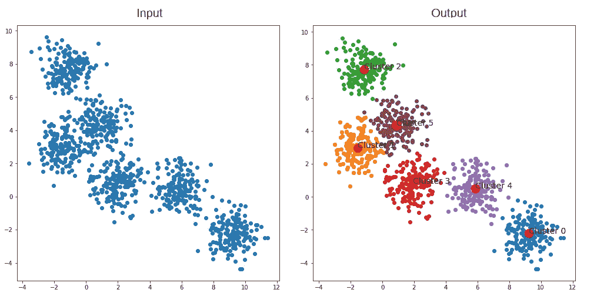

质心神经网络结果—作者图片([来源](https://github.com/tranleanh/centroid-neural-networks))

现在，让我们开始吧！

# 质心神经网络

为了避免与卷积神经网络混淆，我想在这篇文章中使用术语“CentNN”。

CentNN 是一种基于经典 k-means 聚类算法的无监督竞争学习算法，它在训练数据中估计相关聚类组的质心。CentNN 既不需要学习系数的预定时间表，也不需要聚类的总迭代次数。在本文中，对聚类问题和图像压缩问题的仿真结果表明，与传统算法相比，CentNN 收敛速度更快，但聚类质量不变，而其他算法的结果可能不稳定，这取决于学习系数的初始值和总迭代次数。

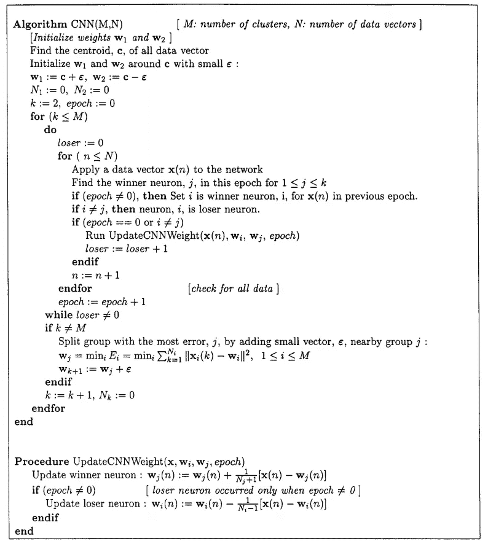

质心神经网络算法。(图来自[纸](https://ieeexplore.ieee.org/document/839021))

上图是 CentNN 算法。如果你在看这些数学方程时感到厌烦，不要担心，我会用一个中学数学的例子让它更容易理解。

# 重量更新

算法的核心是权重更新过程:当单个数据点移入或移出时，如何高效地计算一组数据点的质心？

例如，我们有 100 个整数，计算平均值非常简单。如果我们多了一个整数会怎么样？我们需要再对所有 101 个进行平均吗？答案是否定的！

假设我们有 N 和 N+1 个数据点，平均值 w 计算如下:

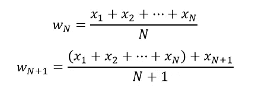

根据上述两个等式:

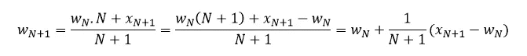

现在，我们可以计算 101 个整数的平均值，而无需再次对它们进行平均。当我们移出一个整数得到 99 个整数时，情况类似。

上面的例子解释了论文中的这些方程:

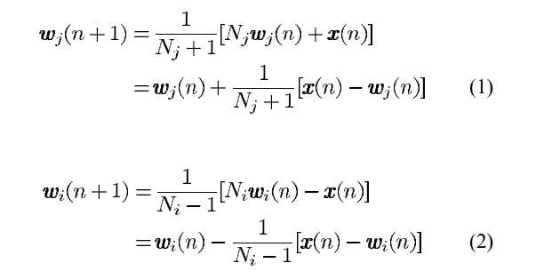

权重更新方程

# 视觉解释示例

给定一个包含 30 个数据点的数据集，如下图所示，我们的目标是将它们分成 3 个簇。

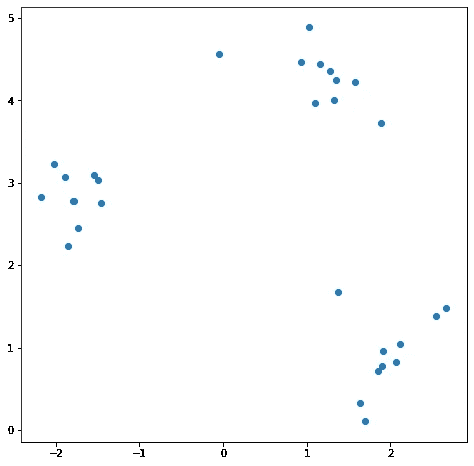

作者图片

**纪元 0:初始化**

找到所有数据的 1 个质心 ***c*** ，然后将 ***c*** 拆分成 2 个权重 ***w1*** 、 ***w2*** 和一个小的***ɛ.***

***w1 = c+ɛ***，***w2 = c—ɛ***(如***【ɛ= 0.05***)

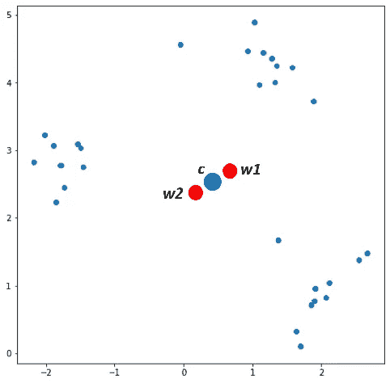

作者图片

在继续之前，我们先来谈谈“赢家神经元”和“输家神经元”这两个术语。

*   赢家神经元:输入一个数据 x，赢家神经元是所有权重中最接近 x 的权重(w)。
*   失败者神经元:在时段 n 输入一个数据 x，如果在时段(n-1)中，w 是最接近 x 的权重，但是在时段 n 中，存在另一个比 w 更接近 x 的权重 w ’,则 w 是失败者神经元，而 w’是在时段 n 的数据 x 的胜利者神经元

在*中为每个 ***x*** 找到胜出的神经元*

*   ****x1*** 到来， ***w1*** 胜→更新 ***w1****
*   ****x2*** 到来， ***w2*** 胜→更新 ***w2****
*   ****x3*** 来了， ***w1*** 胜了→更新 ***w1****
*   *…*
*   ****x30*** 降临， ***w1*** 胜→更新 ***w1****

*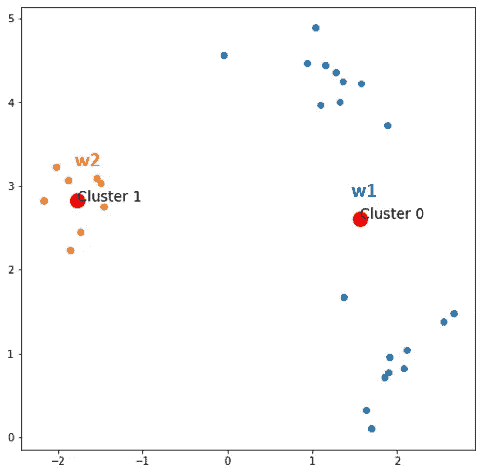*

*作者图片*

*在时间 0 之后，我们总是有 2 个质心和聚类数据点的信息。现在，把它放在这里:*

*   ****x1*** 胜， ***w1*** 胜*
*   ****x2*来了，**w2胜了*****
*   ****x3*** 来了， ***w1*** 胜了*
*   *…*
*   ****x30*** 来了， ***w1*** 胜了*

***纪元 1:***

*为每个 ***x*** 在 ***X.*** 中找到胜出的神经元*

*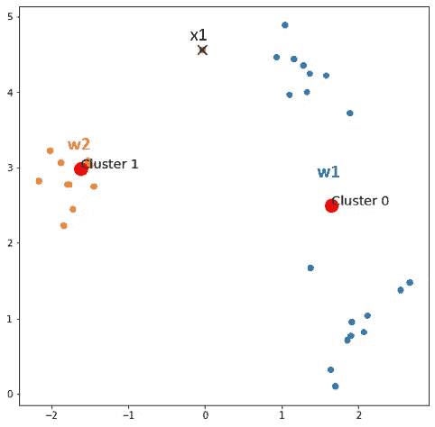*

*作者图片*

*   ****x1*** 来了， ***w2*** 赢了→ ***w1*** 输了， ***输了*** += 1， ***更新权重。****
*   ****x2*** 降临， ***w2*** 获胜*
*   ****x3*** 来了， ***w1*** 胜了*
*   *…*
*   ****x30*** 来了， ***w1*** 胜了*

*在时段 1 之后，我们有 1 个数据，其聚类被更新，并且失败神经元的数量增加 1。通过观察，我们仍然可以意识到 x1 更接近 w2 而不是 w1，但是在时期 0，x1 被聚类到 w1，现在它被正确地更新。同样，请将信息保存在这里:*

*   ****x1*** 来了， ***w2*** 胜了*
*   ****x2*** 来了， ***w2*** 胜了*
*   ****x3*** 降临， ***w1*** 获胜*
*   *…*
*   ****x30*** 来了， ***w1*** 胜了*

***纪元 2:***

*为每个*中的 ***x*** 继续寻找获胜神经元**

**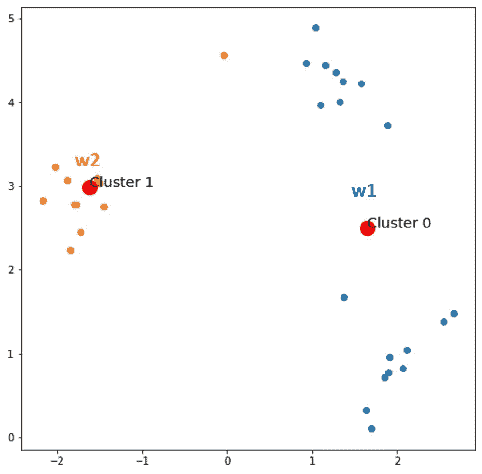**

**作者图片**

*   *****x1*** 来了，**w2胜了****
*   *****x2*** 降临， ***w2*** 胜**
*   *****x3*** 到来， ***w1*** 获胜**
*   **…**
*   *****x30*** 来了， ***w1*** 胜了**

**现在，一切都没有改变。让我们检查集群的数量现在是否达到了期望的数量。答案是还没有。然后我们开始用一个小的*分割误差最大的质心。***

***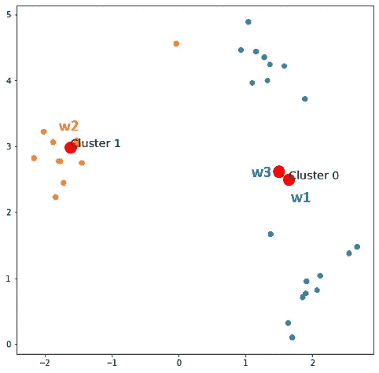***

***作者图片***

***现在从时段 1 开始执行相同的过程。***

*****纪元 3:*****

******

***作者提供的图片***

***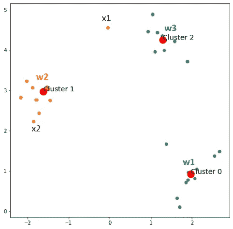***

***作者提供的图片***

*****纪元 4:*****

***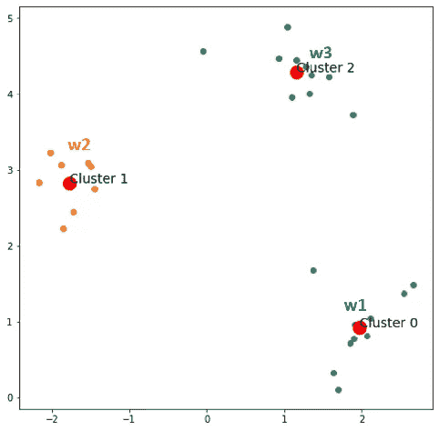***

***作者图片***

*****纪元 5:*****

******

***作者图片***

***现在，什么都没有改变，我们也达到了期望的集群数量。现在，派对时间到了！***

******

***GIF via Tenor[[image-source](https://tenor.com/view/walk-away-walk-away-gif-8390072)***

***下面是 K-Means 聚类和 CentNN 在图像压缩中的结果比较。我们可以看到，在 PSNR(峰值信噪比)方面，CentNN 优于 K 均值聚类，PSNR 和 PSNR 分别为 47.53 和 46.35。在本例中，图像大小为 128x128，聚类数为 48。***

***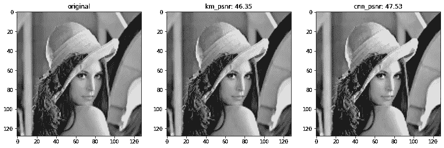***

***图像压缩结果-按作者分类的图像***

# ***CentNN 实现***

***你们可以在这里找到我用 Python 实现的 CentNN。如果你觉得它有帮助，请毫不犹豫地给它一颗星。***

***顺便说一下，欢迎你访问我的脸书页面，这是关于机器学习的分享:[投入机器学习](https://www.facebook.com/diveintomachinelearning)。***

***在这篇文章中，我向大家介绍了质心神经网络(CentNN)，一种有效的聚类算法。CentNN 的主要特点是它在每次新数据到来时更新权重，而 K-means 聚类在每次迭代后更新质心。***

***为了避免算法陷入不期望的局部最小解，CentNN 从设置组数为 2 开始，并逐个增加组数，直到达到预定的组数。CentNN 算法不像其他无监督算法那样提供收敛到全局最小解的任何保证，但是提供收敛到局部最小值的保证。***