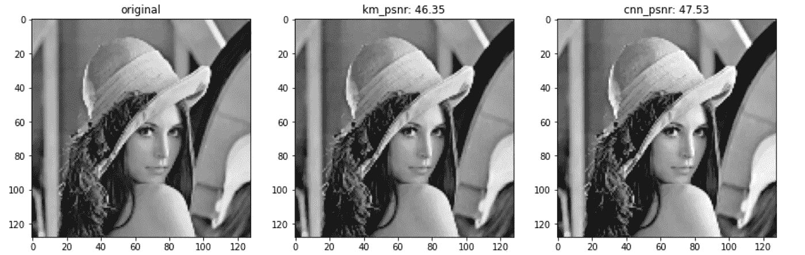
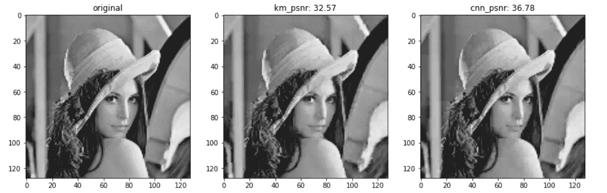

# 质心神经网络和矢量量化用于图像压缩

> 原文：<https://pub.towardsai.net/centroid-neural-network-and-vector-quantization-for-image-compression-a7d30aa63167?source=collection_archive---------4----------------------->

## [深度学习](https://towardsai.net/p/category/machine-learning/deep-learning)

## 让我们提升那些没有被重视的潜力


照片由[凡尔纳何](https://unsplash.com/@verneho?utm_source=medium&utm_medium=referral)在 [Unsplash](https://unsplash.com?utm_source=medium&utm_medium=referral) 上拍摄

质心神经网络已被证明是一种高效稳定的聚类算法，并已成功应用于各种问题。与 K-Means 和自组织映射(SOM)相比，CentNN 在大多数情况下产生更准确的聚类结果。CentNN 的主要限制是它需要更多的时间来收敛，因为 CentNN 从 2 个聚类开始，并逐渐增长，直到达到所需的聚类数。回到人工神经网络(ANNs)理论在 1943 年被引入的那一天，但它只是在 60 年代早期**反向传播**被导出并在 1970 年左右被实现在计算机上运行时才变得流行，或者辛顿的胶囊网络(CapsNet)的想法已经被琢磨了将近 **40 年**，直到 2017 年**动态路由**被发布。从我的角度来看，CentNN 面临着同样的问题，当它只需要一个更快的方式来更好地运作时，因为其理论的鲁棒性已经形成。你可以在这里找到我对 CentNN [的解释，在这里](/centroid-neural-network-an-efficient-and-stable-clustering-algorithm-b2fa8cbb2a27)找到我实现这个算法的教程[。](/centroid-neural-network-for-clustering-with-numpy-fb5812149fed)


使用质心神经网络进行聚类(GIF 由作者提供)

在这篇文章中，我将实现 CentNN 算法来解决图像压缩问题，并展示它与 K-Means 相比有多好。

# 图像压缩

图像压缩是数据压缩的一种类型，其中数据的类型是数字图像，目的是最小化传输和存储的成本。为此，聚类和矢量量化是广泛使用的两种方法。

矢量量化是一种用于数据压缩的有损压缩技术。它指的是将一大组数据点划分成预定数量的聚类，其中每个聚类的质心与其聚类的数据点相比具有最近的距离。在这个意义上，聚类方法被部署来执行量化。你可以在 Mahnoor Javed 的文章[这里](https://medium.com/analytics-vidhya/vector-quantization-using-k-means-algorithm-6382f3888326#:~:text=Vector%20Quantization%20is%20a%20lossy%20data%20compression%20technique.&text=Vector%20Quantization%20works%20by%20dividing,and%20some%20other%20clustering%20algorithms.)中找到使用 K-Means 算法进行图像压缩的矢量量化的更直接的解释。

至此，我想你已经理解了 CentNN 和 K-Means 算法，以及使用聚类和矢量量化的图像压缩。同样，你可以在这里找到我对 CentNN [的解释，在这里](/centroid-neural-network-an-efficient-and-stable-clustering-algorithm-b2fa8cbb2a27)找到我实现这个算法的教程[。现在，让我们来看看今天的主要新闻。](/centroid-neural-network-for-clustering-with-numpy-fb5812149fed)

# 图像压缩的质心神经网络

在这篇文章中，我想以经典的 Lena 图像为样本，使用 CentNN 进行图像压缩的实验，并使用 K-Means 进行比较。我想比较一下 CentNN 和 K-Means 的两种量化方式:*标量量化*和*块(矢量)量化*。现在让我们加载我们的图像样本，并做几个预处理步骤:

```
image = cv2.imread(“images/lena.jpg”, 0)
image = cv2.resize(image, (128,128))
plt.imshow(image, cmap = “gray”)
plt.show()
```


莉娜图像(128x128)

## 1.CentNN +标量量化

在这个实验中，簇的数量被设置为 48。首先，从 *sklearn* 调用 K-Means 函数，并实现一个用于量化的子程序:

这个结果留待以后比较。

现在让我们实现 CentNN 算法来量化我们的样本图像，下面是我的完整实现和解释注释，你可以在我的 GitHub repo [这里](https://github.com/tranleanh/centroid-neural-networks)找到一个带有调用函数的易用版本。如果对这一堆代码行不感兴趣，就直接忽略它，直接跳过去看结果，没有硬邦邦的感觉。

现在我们可以解码量化数据，计算 PSNR 值并显示结果:



使用 K-Means(中间)和 CentNN(右侧)标量量化的重建图像。(图片由作者提供)

具有所述设置的这个实验表明，CentNN 算法(PSNR 47.53)的重建图像具有比 K 均值(PSNR 46.35)更好的质量。

## 2.CentNN +块量化

在第二个实验中，块(矢量)量化、聚类数和块大小分别设置为 512 和 4x4。与之前的实验类似，首先，从 *sklearn* 库中调用 K-Means 函数，并实现一个用于块量化的子程序:

同样，K-Means 的结果很快用于与 CentNN 进行比较。

现在做块量化的 CentNN 算法的代码。还有，如果你对编码不感兴趣，可以忽略下面的部分，跳转看结果。

解码并显示结果:



使用 K-Means(中)和 CentNN(右)的块量化重建图像。(图片由作者提供)

正如我们在这个结果中看到的，CentNN 以显著的差距优于 K-Means，PSNR 分别为 36.78 和 32.57。

# 结论

在这篇文章中，我向大家介绍了用于图像压缩的质心神经网络(CentNN)的实现，以及 CentNN 和 K-Means 在图像压缩任务中的比较。通过对标量量化和块(矢量)量化的两个实验，得出了 CentNN 在给定任务中优于 K-Means 的结论。对我来说，CentNN 是一个很酷的算法，但不知何故，它并没有得到太多的关注。通过分享我的写作，我希望把这些奇妙的东西带给所有爱上机器学习的人。

欢迎你访问我的脸书粉丝页，这是一个分享关于机器学习的东西的页面:[投入机器学习](https://www.facebook.com/diveintomachinelearning)。

今天够了。感谢您抽出时间！

## 参考

[1] [质心神经网络:一种高效稳定的聚类算法](/centroid-neural-network-an-efficient-and-stable-clustering-algorithm-b2fa8cbb2a27)

[2] [用 Numpy 进行聚类的质心神经网络](/centroid-neural-network-for-clustering-with-numpy-fb5812149fed)