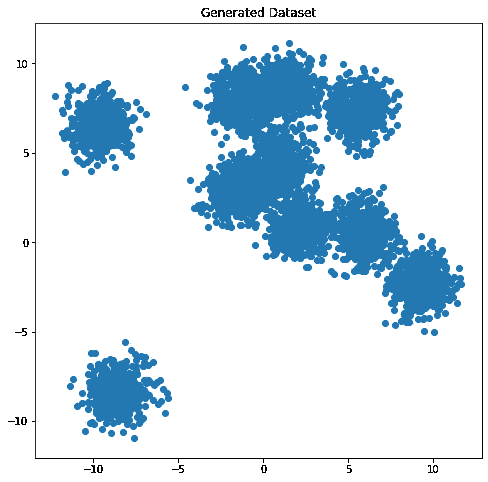
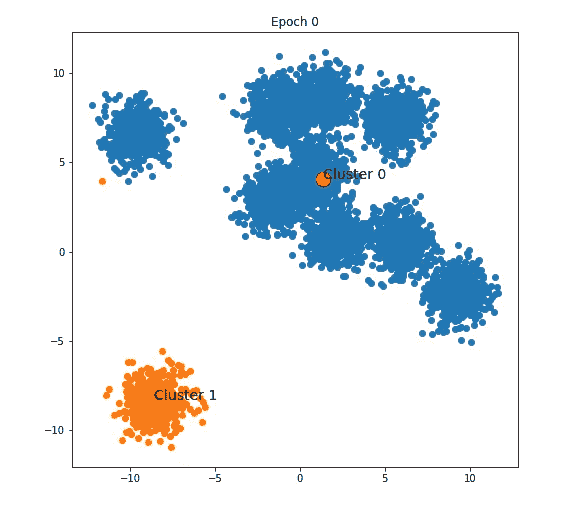
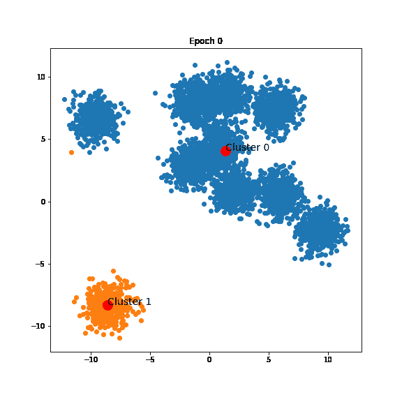
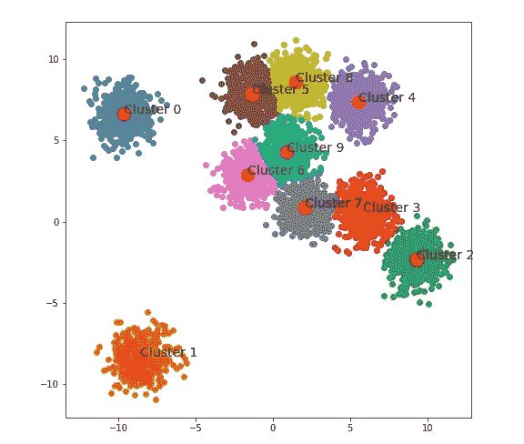

# 用于 Numpy 聚类的质心神经网络

> 原文：<https://pub.towardsai.net/centroid-neural-network-for-clustering-with-numpy-fb5812149fed?source=collection_archive---------2----------------------->

## [深度学习](https://towardsai.net/p/category/machine-learning/deep-learning)

## 让我们提升那些没有被重视的潜力


由 [Alex Padurariu](https://unsplash.com/@alexpadurariu?utm_source=medium&utm_medium=referral) 在 [Unsplash](https://unsplash.com?utm_source=medium&utm_medium=referral) 上拍摄的照片

质心神经网络是一种高效稳定的聚类算法，已成功应用于许多问题。与 K-均值聚类或自组织映射(SOM)相比，CentNN 不需要预先确定的学习系数，但仍能产生有竞争力的聚类结果，K-均值聚类或自组织映射的结果严重依赖于初始参数。对于那些既不知道也不理解这个伟大算法的人，欢迎你在这里用可视化的例子[阅读我的解释。而现在，让我们用几行代码把 CentNN 说清楚。](/centroid-neural-network-an-efficient-and-stable-clustering-algorithm-b2fa8cbb2a27)

我想选择二维数据聚类问题作为本文的解释例子，因为它很容易理解和观察，也是解释聚类算法的有效工具。

首先，让我们导入几个必要的库并生成一个包含 10 个中心的数据集。



作者图片

为实现而准备的一些必要的子程序，一切都可以在我的 [github](https://github.com/tranleanh/centroid-neural-networks) 中找到:

同样，我假设你们都已经理解了这个算法。否则，我强烈建议您在继续之前阅读该理论。你可以在这里查看我对这个算法[的解释。](/centroid-neural-network-an-efficient-and-stable-clustering-algorithm-b2fa8cbb2a27)

现在，让我们开始训练算法:

## 第一步:

找到所有数据的质心 ***c*** ，然后将 ***c*** 拆分成 2 个权重 ***w1*** 、 ***w2*** 和一个小的***ɛ.***

这是两个砝码:

```
[0.43965411 2.88785116]
[0.33965411 2.78785116]
```

## 第二步:

在*中为每个 ***x*** 找到获胜的神经元*

*时段 0 之后的结果:*

**

*作者图片*

## *第三步:*

*从时段 1 到结束，保持为每个单个数据寻找赢家神经元，并更新赢家神经元和输家神经元，直到达到期望的聚类数目。*

*对于示例数据集，该算法在 81 个时期后停止:*

**

*作者 GIF*

*最终聚类结果:*

**

*作者图片*

*最终质心:*

```
*[-9.66726188  6.62956078]
[-8.57296482 -8.31582399]
[ 9.30888233 -2.32652503]
[5.82090263 0.57715316]
[5.55404696 7.36294438]
[-1.32316256  7.86651609]
[-1.63557118  2.87845278]
[2.08983389 0.85729017]
[1.47692106 8.56662456]
[0.90838486 4.30719839]*
```

*在这篇文章中，我向大家介绍了一个使用 Numpy 实现质心神经网络(CentNN)算法的教程。你们可以在这里找到我对 CentNN [的实现。如果你觉得它有帮助，请毫不犹豫地给它一颗星。欢迎您访问我的脸书页面，这是关于机器学习的分享:](https://github.com/tranleanh/centroid-neural-networks)[投入机器学习](https://www.facebook.com/diveintomachinelearning)。*

*我的 CentNN 系列的下一篇文章将是矢量量化(块量化)和 CentNN 在图像压缩应用中的结合。*

*今天到此为止。感谢您抽出时间！*

## *参考*

**【1】*[*质心神经网络:一种高效稳定的聚类算法*](/centroid-neural-network-an-efficient-and-stable-clustering-algorithm-b2fa8cbb2a27)*

**【2】*[*我用 Numpy 实现的 CentNN*](https://github.com/tranleanh/centroid-neural-networks)*