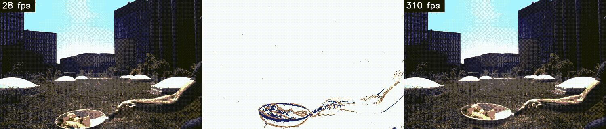
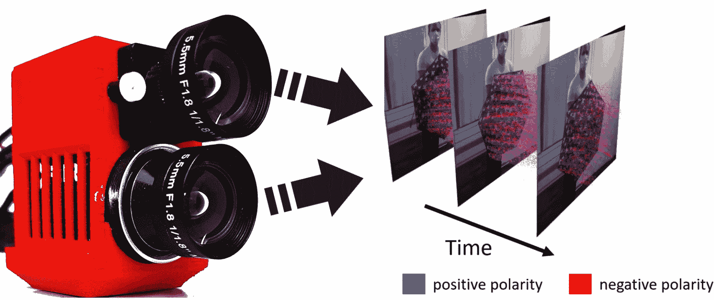
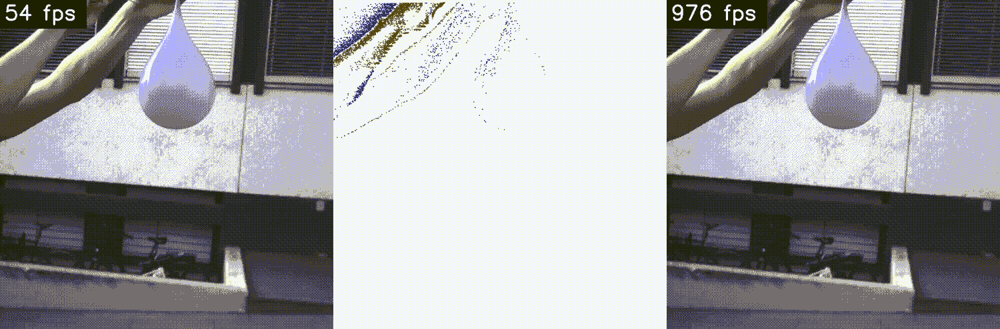
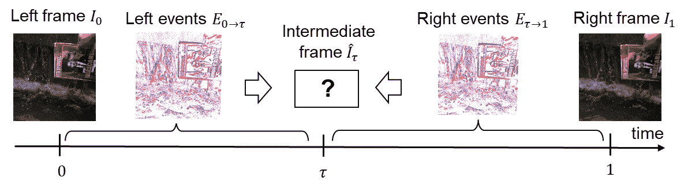
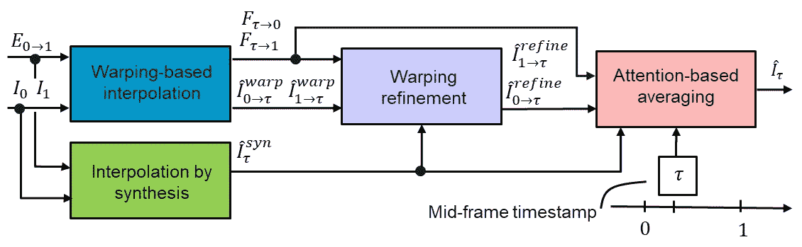
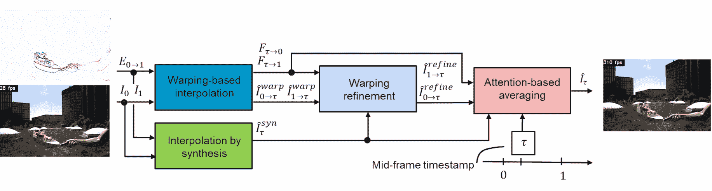

# 用 AI 把视频换成慢动作！TimeLens 解释道

> 原文：<https://pub.towardsai.net/change-video-into-slow-motion-with-ai-timelens-explained-4281d97c9b9d?source=collection_archive---------2----------------------->

## [人工智能](https://towardsai.net/p/category/artificial-intelligence)

## Time Lens 可以理解视频帧之间的粒子运动，以我们肉眼无法看到的速度重建真实发生的事情。

> 原载于 [louisbouchard.ai](https://www.louisbouchard.ai/timelens/) ，前两天在[我的博客](https://www.louisbouchard.ai/timelens/)上看到的！

我敢肯定，你们都点击过 slow-mo guys 的视频缩略图，看看在弹出水球或任何其他用极其昂贵的相机制作的超级酷的“slow-mos”时，水漂浮在空中。现在，我们足够幸运，能够用我们的手机做一些没有真正可比性但仍然很酷的事情。如果不用如此昂贵的设备也能达到同样的质量会怎么样？

嗯，这正是 Tulyakov 等人发表的新模型 Time Lens 可以做到的极端精确。看看那个！它从只有 50 FPS 的视频中生成了这些超过 900 帧/秒的慢动作视频！通过猜测真实帧之间的帧可能是什么样子，这是可能的，这是一个非常具有挑战性的任务。他们没有用经典的利用视频的光流来猜测视频中粒子的运动的想法来攻击它，而是使用了一个简单的设置，有两个摄像头，其中一个非常特别。

慢动作例子。[图片来自 Tulyakov 等人，TimeLens，(2021)](http://rpg.ifi.uzh.ch/TimeLens.html)

第一个摄像机是基本的摄像机，记录你所知道的 RGB 帧。另一方面，第二个是事件摄像机。这种相机使用新颖的传感器，只报告像素强度的变化，而不是当前的像素强度，这是常规相机所做的，它看起来就像这样。与常规图像相比，这种相机在常规帧之间提供信息，因为它们报告的信息是压缩的。这是因为相机仅报告关于发生变化的像素的信息，并且分辨率较低，从而更容易以较高的速率进行记录，这使其成为高时间分辨率但低清晰度的相机。你可以把这看作是牺牲它捕捉的图像质量来换取“更多的图像”幸运的是，这种图像质量的缺乏通过使用另一种基于帧的相机来解决，我们将在几秒钟内看到。

显示的框架和事件。[图片来自 Tulyakov 等人，TimeLens，(2021)](http://rpg.ifi.uzh.ch/TimeLens.html)

Time Lens 利用这两种类型的相机，即帧相机和事件相机，使用机器学习来最大化这两种相机的信息类型，并更好地重建这些帧之间实际发生的事情。一些我们肉眼看不到的东西。事实上，它实现了我们的智能手机和其他型号之前无法达到的效果。

慢动作例子 2。[图片来自 Tulyakov 等人，TimeLens，(2021)](http://rpg.ifi.uzh.ch/TimeLens.html)

这是他们是如何实现的…如你所知，我们从每秒 20 到 60 帧的普通相机的典型帧开始。这做不了什么，因为你需要每秒多得多的帧来实现像这样的慢动作效果。更准确地说，要看起来有趣，你需要每秒至少 300 帧，这意味着我们只有一秒钟的视频片段有 300 幅图像。但是我们怎样才能从 20 帧左右达到 300 帧呢？我们无法创建丢失的帧。这些信息太少了，无法从中推断。嗯，我们使用基于事件的摄像机，它包含比帧更多的时间信息。

缺失的帧来制造慢动作效果。[图片来自 Tulyakov 等人，TimeLens，(2021)](http://rpg.ifi.uzh.ch/TimeLens.html)

正如你在这里看到的，它基本上包含了真实帧之间的不完整帧，但它们足以帮助我们理解粒子的运动，并利用它们周围的真实帧来把握整体图像。

事件和帧信息都被发送到两个模块来训练和内插中间帧:基于扭曲的内插和通过合成模块的内插。

整体架构。[图片来自 Tulyakov 等人，TimeLens，(2021)](http://rpg.ifi.uzh.ch/TimeLens.html)

这个第一变形模块是从事件而不是像合成模块那样从帧中估计运动的主要工具。它获取帧和事件，并使用经典的 U 形网络将它们转换为光流表示。这个网络只是将图像作为输入，对它们进行编码，然后解码成新的表示。这是可能的，因为模型被训练成在巨大的数据集上完成这项任务。您可能知道，我已经在我的频道中多次介绍过类似的架构，您可以在各种应用中找到更多细节。

简而言之，您可以将它视为一个图像到图像的转换工具，它只是改变图像的样式，在这种情况下，它接受事件和帧，并为其找到最佳光流表示，以便为每个事件创建新的帧。它基本上是通过光流来理解图像中发生的事情，从而将事件图像转换成真实的帧。

如果你不熟悉光流，我强烈推荐你看我的视频，里面有一篇关于光流的很棒的论文，发表在一年前的同一个会议上。

合成模块的插值非常简单。使用它是因为它可以处理帧之间出现的新对象和光照的变化，如这里显示的水反射。这是因为它使用一个类似 U 形网的网络来理解带有事件的帧，以生成一个新的虚拟帧。在这种情况下，U-net 获取两个帧之间的事件，并直接为每个事件生成新的可能帧，而不是通过光流。

这里的主要缺点是，由于缺少关于图像中运动的信息，可能会出现噪声，而这正是其他模块可以帮助的地方。然后，第一个模块使用我刚刚提到的插值合成中的更多信息进行改进。它基本上提取关于同一事件的这两个生成帧的最有价值的信息，以改进扭曲表示，并再次使用 U-net 网络生成每个事件的第三版本。

最后，这三个候选帧被发送到基于注意力的平均模块。最后一个模块简单地获取这三个新生成的帧，并将它们组合成最终帧，该最终帧将仅获取所有三个可能表示的最佳部分，这也是通过训练网络来实现的。如果你不熟悉注意力的概念，我强烈推荐你看我制作的视频，它讲述了注意力是如何作用于图像的。

带输入/输出的整体架构。[图片来自 Tulyakov 等人，TimeLens，(2021)](http://rpg.ifi.uzh.ch/TimeLens.html)

现在，您已经为帧之间的第一个事件创建了一个高清帧，只需对事件摄像机给出的所有事件重复这一过程。瞧！这就是你如何使用人工智能来创建令人惊叹的、逼真的慢动作视频。

和往常一样，如果你对这个模型感兴趣，代码和论文的链接在下面的描述中。

感谢您的阅读！

如果你喜欢我的工作，并想与人工智能保持同步，你绝对应该关注我的其他社交媒体账户( [LinkedIn](https://www.linkedin.com/in/whats-ai/) 、 [Twitter](https://twitter.com/Whats_AI) )，并订阅我的每周人工智能 [**简讯**](http://eepurl.com/huGLT5) ！

## 支持我:

*   支持我的最好方式是成为这个网站的成员，或者如果你喜欢视频格式，在 [**YouTube**](https://www.youtube.com/channel/UCUzGQrN-lyyc0BWTYoJM_Sg) 上订阅我的频道。
*   在经济上支持我在 [**地区**](https://www.patreon.com/whatsai) 的工作
*   在 [**中**](https://whats-ai.medium.com/) 跟我来

## 参考资料:

阅读全文:[https://www.louisbouchard.ai/timelens](https://www.louisbouchard.ai/timelens)
官方代号:[https://github.com/uzh-rpg/rpg_timelens](https://github.com/uzh-rpg/rpg_timelens)
参考:斯捷潘·图利亚科夫*、丹尼尔·格赫里希*、斯塔马蒂亚斯·乔戈里斯、朱利叶斯·埃尔巴希、马蒂亚斯·格赫里希、元佑·李、大卫·斯卡拉穆扎、TimeLens:基于事件的视频帧插值，IEEE 计算机视觉和模式识别大会(CVPR)，纳什维尔，2021 年，

[http://rpg.ifi.uzh.ch/docs/CVPR21_Gehrig.pdf](http://rpg.ifi.uzh.ch/docs/CVPR21_Gehrig.pdf)