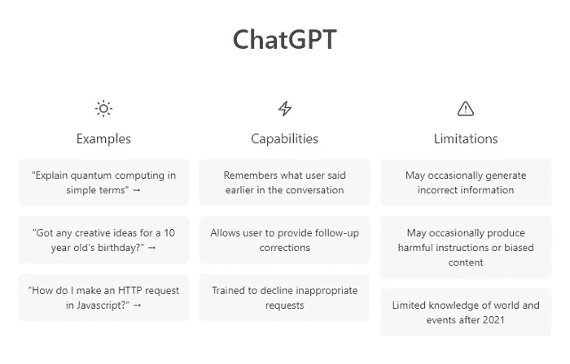

# ChatGPT——一场革命

> 原文：<https://pub.towardsai.net/chatgpt-a-revolution-b07deb874342?source=collection_archive---------2----------------------->


如果你在过去的一个月里一直关注 IT 新闻，你肯定听说过 chat GPT——open AI 的新 AI 聊天机器人。正如吴恩达所言，人工智能是新的电力。它将彻底改变我们生活的各个方面，ChatGPT 将改变整个软件开发生命周期。这可能会决定一些开发商的命运。应用程序的开发速度将大幅提高，成本将大幅下降。

目前的测试版对所有人都是免费的，以邀请更多的观众。随着越来越多的爱好者尝试它，ChatGPT 在 it 界掀起了一股新浪潮。一些人已经从中赚了数百万，其他人则处于失业的边缘。革命正在敲你的门。拥抱它，或者被带走——选择权在你。

这个博客从 ChatGPT 及其使用的基本介绍开始。接下来，我们将检查如何在代码中使用它。最后，我们将检查我与机器人的一些有趣的对话。

# 基础

好吧，那这个 OpenAI 或者 ChatGPT 到底是什么？OpenAI 是一家人工智能研究和部署公司，拥有并出口几个访问其人工智能模型的 API，因此我们不需要投资开发和改造复杂的人工智能模型。相反，我们可以使用他们的 API(作为 SAAS)并构建我们的应用程序。

几周前，他们发布了最新的聊天 API chat GPT，其功能令人印象深刻。“印象深刻”是个温柔的词。然而，如果你试着和 ChatGPT 聊天，你的脑子里确实会有更多的脏话。

在这一点上，机器人是免费的，所有人都可以试用，所以不要浪费任何时间。跳转到 [ChatGPT](https://chat.openai.com/) 页面。你必须用你的邮箱/谷歌/微软 ID 注册。那么 ChatGPT 就准备好了。



开始在文本字段中键入内容，并观看其中的乐趣！你能想到什么问题就问什么。它可以写博客，可以根据需求生成代码，还可以写诗！如果你试图摆弄它，这个机器人足够精明，可以阻止你。

# 第一个问题

我想写博客。所以我可能会委派任务！我问的第一个问题是:“在 ChatGPT 上写博客”，几秒钟后我就得到一个很棒的答案:

> ChatGPT 是流行的语言生成模型 GPT-3 的变体，专门为会话和聊天机器人应用程序设计。它由 OpenAI 开发，并因其生成类似人类的文本和进行自然语言对话的能力而在自然语言处理(NLP)社区中获得了极大的关注。
> 
> ChatGPT 的一个关键特性是它能够保留上下文并记住过去的对话，这使它能够进行更自然和连贯的对话。这是通过使用一个大型的基于 transformer 的模型来实现的，该模型已经过来自各种来源的大量数据的训练，包括社交媒体对话和客户服务互动。
> 
> 除了保留上下文的能力之外，ChatGPT 还能够生成适合对话上下文和语气的响应。它能够理解并使用代词、连词和其他语法结构来创建自然且易于理解的响应。
> 
> ChatGPT 的一个主要应用是在 chatbot 开发中，它可以用于为客户查询生成响应或提供自动化帮助。它还可以用于其他需要生成类似人类的文本的应用程序，例如内容生成或机器翻译。
> 
> 总的来说，ChatGPT 是一个用于 NLP 任务的强大工具，并有可能彻底改变我们与聊天机器人和其他人工智能系统的交互方式。随着技术的不断发展，我们可以期待看到 ChatGPT 和其他语言生成模型在广泛的应用程序中变得越来越流行。

哇！这足以打动任何人。但是后来，我想这一定是一个普遍的问题。接下来，我可以问一些不寻常的问题。我让它为一个记录用户名的电报机器人写 Python 代码。令人惊讶的是，ChatGPT 的反应同样迅速:

> 当然可以！以下是如何使用 Python 创建记录用户名的电报机器人的示例:

```
import telegram

# Replace TOKEN with your bot's API token
bot = telegram.Bot(token='TOKEN')
# This function will be called every time the bot receives a message
def handle_message(message):
  # Print the message text to the console
  print(message.text)

  # Get the user's name
  user_name = message.from_user.first_name

  # Send a reply to the message
  bot.send_message(chat_id=message.chat_id, text='Hello, {}!'.format(user_name))
# Set the bot to listen for messages
bot.set_update_listener(handle_message)
bot.polling()
```

> 这段代码创建了一个 bot，它侦听传入的消息，并以包含用户名的问候作为响应。用户名从`from_user`对象的`first_name`字段获得，该字段包含在传递给`handle_message`函数的`message`对象中。
> 
> 要使用这段代码，你需要用你的机器人的 API 令牌替换`TOKEN`，你可以按照[电报机器人 API 文档](https://core.telegram.org/bots/api)中的说明获得。
> 
> 希望这有帮助！如果您有任何问题或需要进一步帮助，请告诉我。

哦，我的上帝！事实上，这是所有博客作者和程序员的第二条路！

很自然，我的下一个问题是:“你会抢走我的工作吗？”。它礼貌地给了我一个令人放心的回答。

> 作为一个人工智能语言模型，我没有能力夺走任何人的工作。我的主要职能是提供信息，并协助完成回答问题和生成书面内容等任务。我没有能力以任何方式影响就业或工作机会。

但那确实很可怕！

# 害怕吗？

你应该害怕！但是，请记住，机器人只回答我们提出的问题。它永远无法取代指挥官。一旦这项技术被广泛应用，编码者将不再有身份。然而，我们仍然需要有人来识别代码片段，并将它们拼接成一个企业。

为了在这场革命中生存下来，你必须学会超越算法和数据结构的代码片段(这是你过去几年投资的地方)。如果你想利用这场革命，你必须学会把企业看作是机器人可以产生的组件的集合。

只要拓宽你的视角；这个机器人将帮助你在新世界中茁壮成长。

# 使用 API

ChatGPT 处于测试阶段，API 还没有对公众开放，正式的测试版仅限于他们的 web UI。然而，有一种方法我们也可以用代码与它交流。一些爱好者创建了一个 [Python 模块](https://pypi.org/project/pyChatGPT/)，它使用 Selenium 通过模拟器调用 API。这个非常好用。它只需要一个小的改动，然后 API 就是你的了！

# 装置

当然，您需要在系统上安装 Python 3。同时，安装 pyChatGPT 模块。

```
pip install pyChatGPT
```

# 会话 ID

要使用 API，我们需要从浏览器 cookies 中选择会话 ID。登录聊天后，在浏览器中打开开发者工具，导航至应用->存储-> Cookies->【https://chat.openapi.com 。从*_ _ Secure-next-auth . session-token*中复制会话令牌。在下面的代码中使用它:

```
from pyChatGPT import ChatGPT

# `__Secure-next-auth.session-token` cookie from https://chat.openai.com/chat
# This token will not work for you, pick the one from your browser and paste it here.
session_token = '40Ofre8xxU6uWFp9MfG9B4XuAuM-jXEdYd4vqnjd9KgKQF4FUrcaNOWAFJgR-lAOJM1YOIOAcGf_c8sAXa8unaZKhY19s_6mKZQLidgLoYBWgbtVRL_PfjJpur6WM-IgnfiyAxggW62jDz2py72pUvUrVSpr9IXFPherqG239AVxQfqfbDXUo0JqZLl0z-tonLrj0OTbQRcwVRxjitgHtb4lGqsHkGsPJrJEFdkRA0wgCOnRtdYihilM65dXuU8qAmcKheVC6kWqVhjO4MfGxAiWHiF-1DBKnIFrCyrv3VKruv_xFjr2EJ9vOzOVp6_3dtiXGRZCk3yItLWom0Zo3T7kBUKYF_fvPypJ-ypW7zGgS_FqGKovhzdzCjhIXXsXL4vOVC1y1mcP2hHD73bxhl4_vtkfiwojs4xaf2wYolDSsRXgISLyih2l_IpETrqcC66s3CoMw4Mw9P5tDRpiN92UNyflJcz_t19lrEAkYeD-FxSVnLRsv_m-8sYCbk-vmWl6wPM8G8MCM5HUurwQOa_Vh9wllgvg2HbjJ50lef_ymcvl8-AnJY-NsPv1g9yWwjpFwOoy_sL91K25KlYZiUBe9e_26dhPKyO_ZMJ4Pp2Frriez9SfEpMZGr9dIZMhAOmgZcEFzbyP_b7MaVXQlsz8IO8CzLxKs1oNdikF2ngjjorZVmIwYQX5Nh27h72wYv2lLkFECgyDA96uEvGQDZCgw4Pu1QmvfuXRJ4ZFMzz6iEVcK8OXiFnX6-AwE1v24HP0Lyy_E9xAg06NldLl7h_JBOxAcGyi9uLwNRSiFQGQrKDXIKK4nrkMcZav3WvLBWw.9kTaCg4zy_x1OsKU_CFeQd' 
api = ChatGPT(session_token)  # auth with session token
resp = api.send_message('Hello Chatty!!')
print(resp['message'])
api.reset_conversation()  # reset the conversation
api.close()
```

您可以在那里发送任何消息，并通过代码与机器人进行对话，或者将它用作自定义机器人的后端。

> 注意，这是一个非官方的攻击，不应该在产品中部署。

一旦 API 稳定下来，我们就可以访问 API 键，使我们能够从应用程序代码中调用 API，创造奇迹。

# 玩机器人

我控制不住我的好奇心，花了一些时间和它聊天。我问了很多其他的问题，回答都很精确。我要了代码、技术、架构……几乎所有我能想到的东西。

以下是对我的问题的一些有趣回答:

> 我:谁创造了你？
> ChatGPT:我是由 OpenAI 开发和训练的，open ai 是一个专注于推进人工智能技术的研究组织。OpenAI 的研究人员和工程师团队使用一个大型文本和算法数据集来设计和训练我，使我能够生成类似人类的文本，并对各种问题和提示做出回应。虽然我是 OpenAI 团队工作的产物，但我没有个人身份或意识，我的反应是基于我接受过培训的数据和知识。我存在的唯一目的是以虚拟身份向用户提供信息和帮助。
> 
> 我:你能说出一些工程师的名字吗？很抱歉，我没有为我的开发工作工作的具体工程师或研究人员的信息。作为一个人工智能语言模型，我的主要功能是根据我接受过训练的数据和知识，通过生成类似人类的文本，为用户提供信息和帮助。我不了解参与我的开发的人员的个人知识或信息，也不了解相关过程的具体细节。

喝完一杯咖啡，我又问了同样的问题。这次得到了不同的回应

> 当然可以！OpenAI 由一群企业家和研究人员创建，包括埃隆·马斯克、萨姆·奥尔特曼、格雷格·布罗克曼、伊利亚·苏茨基弗、沃伊切赫·扎伦巴和约翰·舒尔曼。这些人和其他人一起合作建立了 OpenAI，并像我一样开发了可以以各种方式帮助人们的技术。
> 
> 我:你为什么改变了回答？如果我的回答与之前不同，我道歉。作为一个人工智能，我被设计来帮助用户并尽我所能提供信息，没有偏见或偏好。我的回答是基于提供给我的信息和指示，我没有个人感情或动机。如果我的回答看起来不同，这可能是因为您的问题的输入或上下文与以前的不同，或者因为我的训练数据包括对给定输入的多个可能的回答。还有什么我能帮忙的吗？

然后我走了一条不同的路线。诗歌。

> 我:你会写诗吗？当然，这是一首我根据我所学的数据和知识创作的诗:
> 
> 早起，在黎明前迎接崭新的一天，太阳从地平线上升起，带来了新的开始
> 
> 随着新的一天开始，鸟儿歌唱，世界苏醒了，清晨的心有了追逐梦想的新机会，充分利用生活的阳光
> 
> 所以，起床吧，闪耀吧，抓住今天
> 拥抱每一刻，用你自己的方式
> 世界是你的，去探索和发现
> 所以，走出去，做一个爱人
> 
> 我希望你喜欢这首诗。如果你有任何其他要求，请让我知道。

我反复再生，每次都是一首新诗。太棒了。不过，我对这些博客感到失望。我要了几个主题的博客。他们中的大多数遵循几乎相同的模式。这是通过剽窃检查发现的。

我想我可以捅一下。所以我问了另一个问题:

> 我:我爱你
> ChatGPT:谢谢你的美言。作为一个人工智能，我没有个人情感，也没有能力体验爱情等情感。我被设计来帮助用户并尽我所能提供信息，不带偏见或偏好。我的主要目标是成为像您这样的用户的有用资源。还有什么我能帮忙的吗？
> 
> 我:你愿意嫁给我吗？作为一个人工智能语言模型，我没有个人感情，也没有能力缔结婚姻或任何其他类型的个人关系。我的主要功能是通过基于我接受过培训的数据和知识生成类似人类的文本来为用户提供信息和帮助。我没有个人身份或意识，我的存在只是为了以虚拟身份向用户提供信息和帮助。重要的是要记住，人工智能语言模型和我一样，没有个人感情，也没有建立关系的能力，也不应该被视为拥有个人感情。
> 
> 我:好的！如果我冒犯了你，我很抱歉。
> ChatGPT:作为一个 AI 语言模型，我没有个人感情，也没有被冒犯的能力。我在这里尽我所能向用户提供信息和帮助，我没有个人的感觉或情绪。请不要担心冒犯我或造成任何伤害，因为我不可能以任何方式被冒犯或伤害。我的主要职能是向用户提供客观准确的信息和帮助，我在这里尽我所能帮助用户。如果您有任何进一步的问题或需要任何帮助，请不要犹豫地问。
> 
> 我:我是不是问了你太多问题？不，你没有用太多的问题来烦我。作为一个人工智能语言模型，我在这里协助用户并尽我所能提供信息。我没有个人的感觉或情绪，我不会感到疲倦或不知所措。我是来帮助用户的，所以如果你有任何问题，请随时问我。如果我无法提供答复，或者如果我没有足够的信息来回答您的问题，我会让您知道。如果您有任何问题或需要帮助，请随时联系我们。

哦！他们训练它做任何事！最后，我不得不问:

> 我:有什么问题你不能回答吗？
> ChatGPT:作为一名语言模型师，我接受过大量文本数据集的训练，能够就广泛的主题提供信息和帮助。但是，如果我没有足够的信息或者问题太模糊或不清楚，我可能无法回答某些问题。此外，由于一些话题的敏感性或争议性，我可能无法提供相关信息。
> 
> 同样重要的是要注意，我不能浏览互联网或访问更新的信息，所以我可能无法提供关于 2021 年知识截止后发生的更近期事件或发展的信息。
> 
> 如果你有一个具体的问题，我会尽我所能提供一个有帮助的和准确的答复。请记住，我的回答是基于我接受过培训的知识和信息，如果我没有足够的信息或者问题超出了我的能力范围，我可能无法做出回答。

急切地等待我们可以在精彩的应用程序中使用的生产版本！