# ChatGPT 结合图形数据库预测 FIFA 2022 冠军，但出了错

> 原文：<https://pub.towardsai.net/chatgpt-combined-with-graph-database-to-predict-a-fifa-2022-winner-but-went-wrong-f872c303af63?source=collection_archive---------1----------------------->

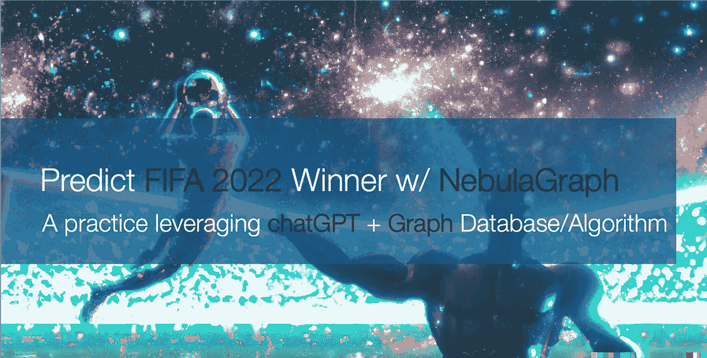

*特征图像来源:图像也是用 OpenAI 通过 DALL-E 2 模型& DALL-E 2 Outpainting 生成的。参见* [*原图*](https://user-images.githubusercontent.com/1651790/205881462-ff007725-e270-4b1e-9062-7702f01021c1.png) *。*

# **ChatGPT 的炒作**

在国际足联 2022 年世界杯的宣传中，我看到了剑桥情报的一篇博客文章，其中他们利用有限的信息以及球员、球队和俱乐部之间的相关性来预测最终获胜的球队。作为一个图形技术爱好者，我总是喜欢尝试用 NebulaGraph 做类似的事情，分享图形算法的思想，从社区中的一个图形中的整体连接中提取隐藏的信息。

最初的尝试是在大约 2 小时内完成，但我注意到需要仔细解析来自维基百科的数据集，而我碰巧不擅长做这项工作，所以我把这个想法搁置了几天。

与此同时，另一个热潮——open ai ChatGPT 也宣布了。由于我已经是 DALL-E 2 的用户(为我的博客文章生成特征图片)，我也很快尝试了一下。我目睹了其他人(通过 Twitter、博客、HackerNews)如何试图说服 ChatGPT 做许多难以置信的事情:

*   随时帮助实现一段代码
*   模拟任何提示界面:shell、python、虚拟机，甚至是您创建的语言
*   扮演几乎任何给定的角色，和你聊天
*   写诗、说唱、散文
*   在一段代码中找到一个错误
*   解释复杂正则表达式/开放密码查询的含义

ChatGPT 的情境化和理解能力前所未有的强大，以至于每个人都在谈论一种新的工作方式:如何掌握询问/说服/触发机器来帮助我们更好更快地完成工作。

于是，在尝试让 ChatGPT 帮我写复杂图数据库查询语句，解释复杂图查询语句的含义，还有一大块 Bison 代码，他/她都做得很好之后，我意识到:为什么不让 ChatGPT 帮我写提取数据的代码呢？

# 抓取数据

我真的试过了，结果是…足够好。

整个过程基本上就像一个编码面试官，或者一个产品经理，提出我的需求，然后 ChatGPT 给我代码实现。然后我试着运行代码，找到代码中没有意义的地方，指出来，并给出建议，ChatGPT 很快就理解了我指出的要点，并做出适当的修正，比如:

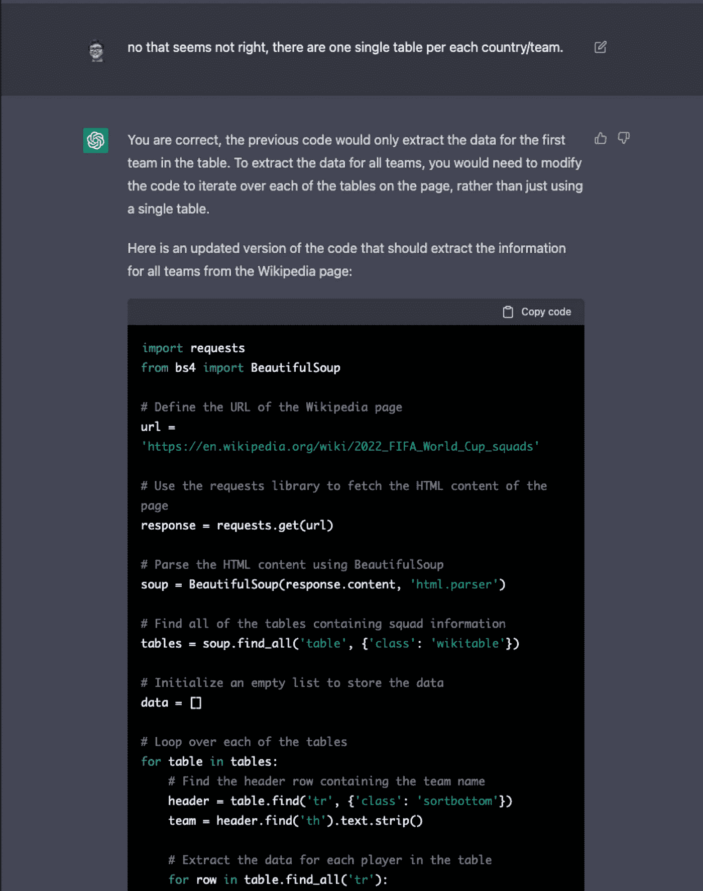

这整个过程我就不一一列举了，但是我会在这里分享生成的代码和整个讨论[。](https://gist.github.com/wey-gu/78cb28bee130966e7d6e9d573b51deff)

最终生成的数据是一个 CSV 文件。

*   Raw 版 [world_cup_squads.csv](https://github.com/siwei-io/talks/files/10152775/world_cup_squads.csv)
*   手动修改，生日和年龄分开列[世界杯 _ 球队 _v0.csv](https://github.com/siwei-io/talks/files/10152923/world_cup_squads.csv)
*   它包含球队、组、号码、位置、球员姓名、生日、年龄、国际比赛次数、进球数和服务的俱乐部的信息/列。

```
Team,Group,No.,Pos.,Player,DOB,Age,Caps,Goals,Club
Ecuador,A,1,1GK,Hernán Galíndez,(1987-03-30)30 March 1987,35,12,0,Aucas
Ecuador,A,2,2DF,Félix Torres,(1997-01-11)11 January 1997,25,17,2,Santos Laguna
Ecuador,A,3,2DF,Piero Hincapié,(2002-01-09)9 January 2002,20,21,1,Bayer Leverkusen
Ecuador,A,4,2DF,Robert Arboleda,(1991-10-22)22 October 1991,31,33,2,São Paulo
Ecuador,A,5,3MF,José Cifuentes,(1999-03-12)12 March 1999,23,11,0,Los Angeles FC
```

*   去掉头球的最终版本[world _ cup _ squads _ no _ headers . CSV](https://github.com/siwei-io/talks/files/10152974/world_cup_squads_no_headers.csv)

# 预测 2022 年世界杯的图论算法

在 ChatGPT 的帮助下，我终于可以尝试用图表魔法预测游戏的赢家，在此之前，我需要将数据映射到图表视图中。

如果你不关心过程，直接去[预测结果](https://www.nebula-graph.io/posts/predict-fifa-world-cup-with-chatgpt-and-nebulagraph#post-result)。

# 图形建模

> *先决条件:本文使用*[*nebula graph*](https://github.com/vesoft-inc/nebula)*(开源)和*[*nebula graph Explorer*](https://docs.nebula-graph.io/3.3.0/nebula-explorer/about-explorer/ex-ug-what-is-explorer/)*(专有)，你可以在*[*AWS*](https://go.aws/3VZay2I)*上请求免费试用。*

图形建模是以“顶点->边”图形的形式对现实世界信息的抽象和表示。在我们的例子中，我们将把从维基百科解析的信息表示为:

**顶点**:

*   运动员
*   组
*   组
*   俱乐部

**边缘**:

*   groupedin(该队属于哪个组)
*   belongto(球员属于国家队)
*   发球(球员在俱乐部发球)

球员的年龄、国家队出场次数和进球数自然适合作为球员标签的属性(顶点的类型)。

以下是 **NebulaGraph Explorer** 中这个模式的截图(我以后就叫它 Explorer 了)。

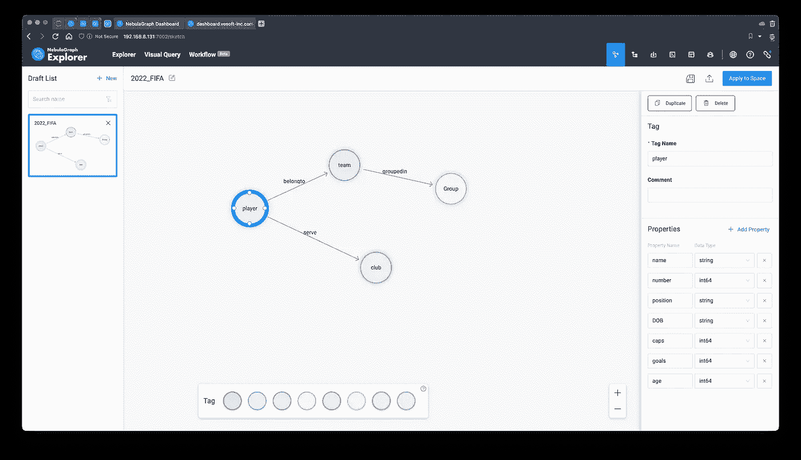

然后，我们可以点击右上角的保存图标和按钮:`Apply to Space`用[定义的模式](https://docs.nebula-graph.io/3.3.0/nebula-explorer/db-management/draft/)创建一个图形空间:

# 摄入星云图

通过图形建模，我们可以将 [CSV 文件](https://github.com/siwei-io/talks/files/10152974/world_cup_squads_no_headers.csv)(无头文件版本)上传到 Explorer，方法是指向并选择将不同列映射到顶点和边的 vid 和属性。


点击导入，我们将整个图形导入到 [NebulaGraph](https://nebula-graph.io) 中，成功后，我们还可以得到完整的 CSV → Nebula Importer 配置文件:[Nebula _ Importer _ config _ FIFA . yml](https://github.com/siwei-io/talks/files/10164014/config_fifa.yml.txt)，以便您在将来重新导入相同的数据或与他人共享时重复使用。

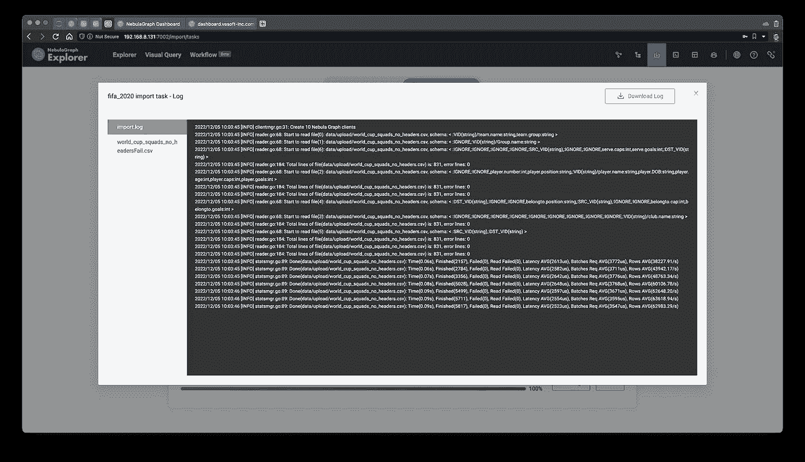

> *注:参见* [*导入数据文件*](https://docs.nebula-graph.io/3.3.0/nebula-explorer/db-management/11.import-data/)

导入后，我们可以在 schema view 页面查看[统计数据，显示我们有 831 名球员参加了 2022 年卡塔尔世界杯，在 295 个不同的俱乐部服役。](https://docs.nebula-graph.io/3.3.0/nebula-explorer/db-management/10.create-schema/#view_statistics)

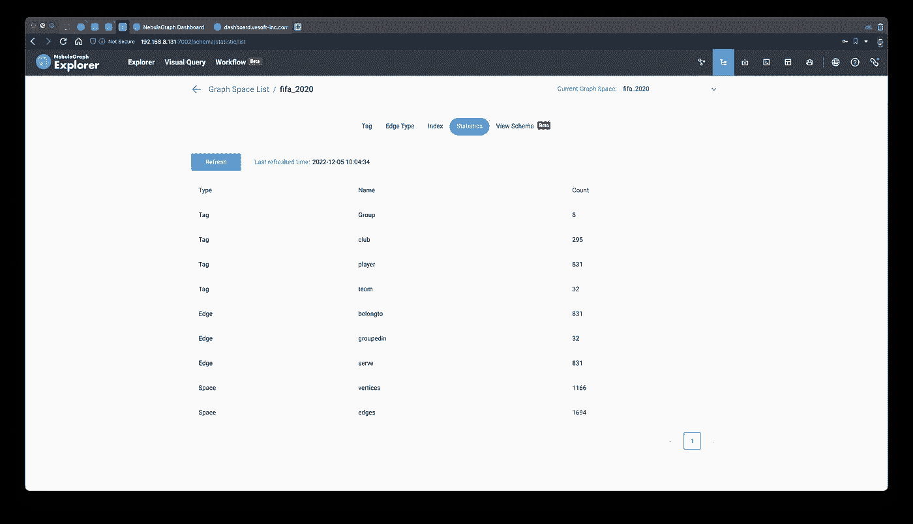

# 浏览图表

让我们看看我们能从图表形式的信息/知识中获得什么样的见解。

## 查询数据

让我们从显示所有数据开始，看看我们会得到什么。

首先，在 NebulaGraph Explorer 的帮助下，我简单地拖放以绘制任何顶点类型(标记)和顶点类型之间的任何类型的边(标记)，这里我们知道所有的顶点都与其他顶点相连接，因此该查询模式不会遗漏任何孤立的顶点:

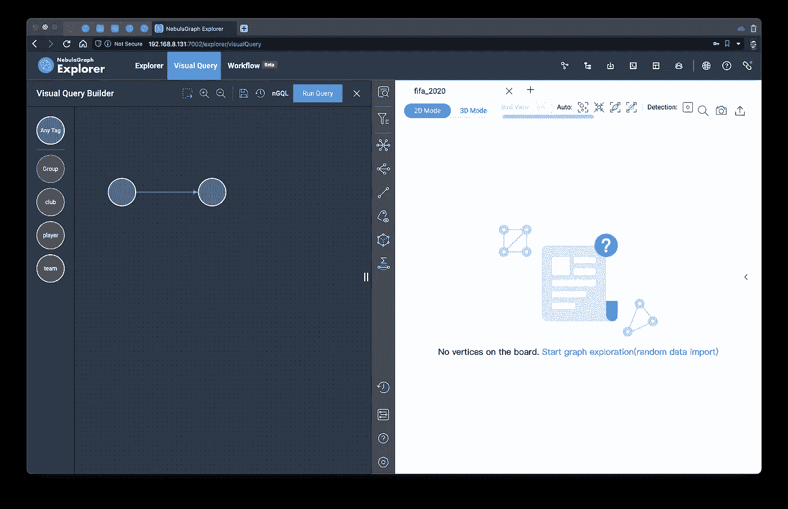

让它为我生成查询语句。这里默认为`LIMIT 100`，我们把它改成大一点的(限制 10000)，让它在控制台执行。

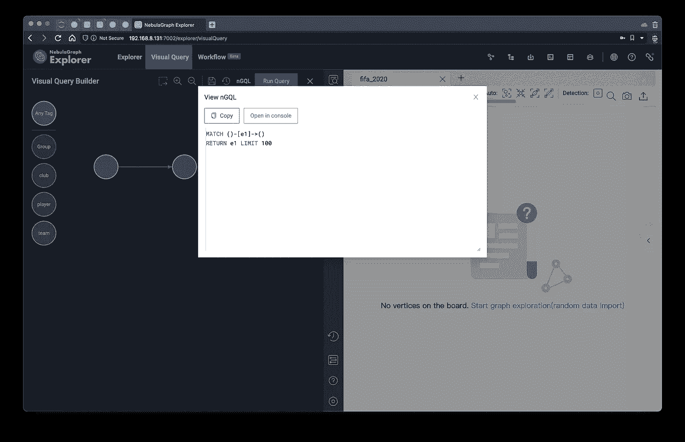

## 初步观察

结果呈现出来是这样的，你可以看到它自然地形成了集群的模式。

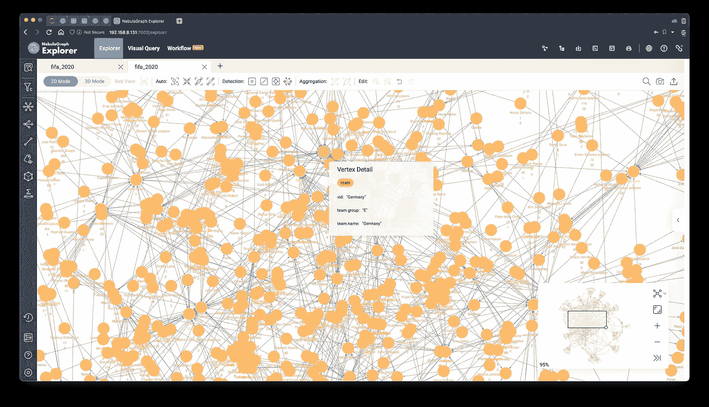

这些外围集群主要由来自传统上并不强大的俱乐部的球员组成(现在我们知道他们可能会赢，但是，谁知道呢！).许多这样的俱乐部只有一两名球员在一个国家队或地区效力，所以他们在某种程度上与其他集群相隔离。

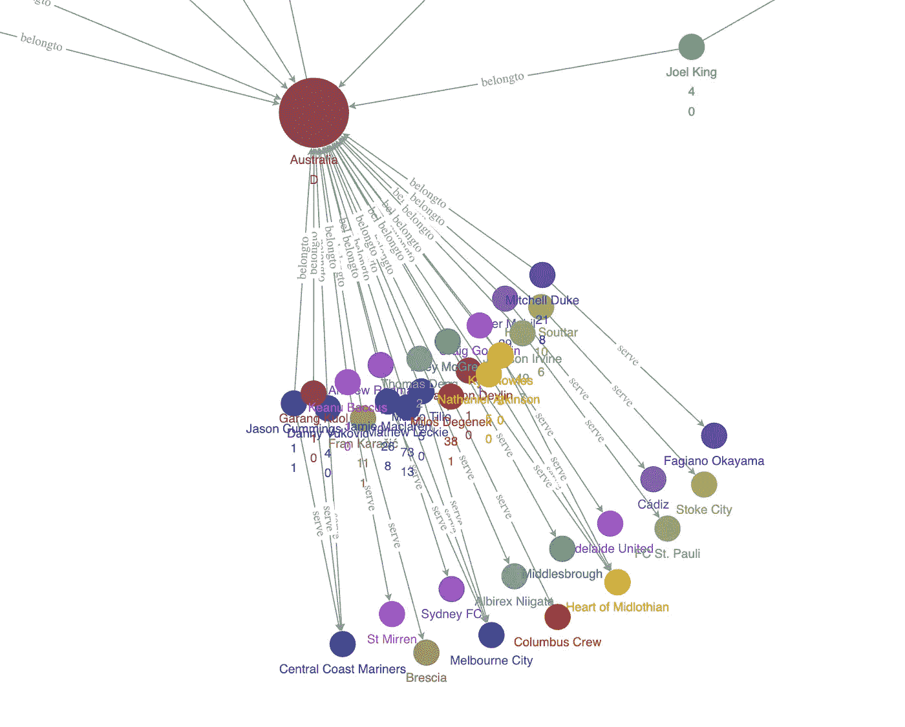

## 基于图形算法的分析

我在浏览器中点击了两个按钮(按度数大小，用 Louvain 算法着色)后(详见[文档](https://docs.nebula-graph.com.cn/3.3.0/nebula-explorer/graph-explorer/graph-algorithm/)，在浏览器中我们可以看到整个图形变成了这样:

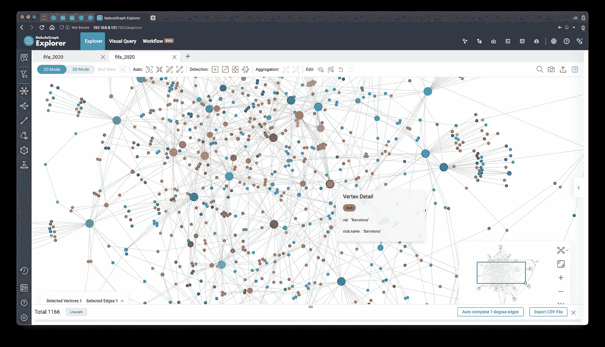

这里使用了两种图形算法来分析这些见解。

1.  更改顶点的显示大小，以使用它们的度数来突出显示重要性
2.  用 Louvain 算法区分顶点的社区

你可以看到红色的大圆圈是著名的巴塞罗那，它的球员也用红色标记。

# 赢家预测算法

为了能够充分利用图的魔力(利用图上隐含的条件和信息)，我的想法([窃自/启发于本帖](https://cambridge-intelligence.com/fifa-world-cup-2022-prediction/))是选择一种考虑边的图算法进行节点重要性分析，找出重要性更高的顶点，进行全局迭代和排序，从而得到排名靠前的团队排名。

这些方法实际上反映了优秀的玩家同时拥有更大的社群和连接性。同时，为了增加传统强队之间的差异，我将考虑出场和进球的信息。

最终，我的算法是:

*   获取所有的`(player)-serve->(club)`关系，过滤掉进球太少和场均进球太少的球员(以平衡来自一些较弱球队的老球员的不成比例的影响)
*   从所有被过滤的玩家中向外探索以获得国家队
*   对上述子图运行[中间中心度](https://en.wikipedia.org/wiki/Betweenness_centrality)算法，计算节点重要性分数

# 预测的过程

首先，我们把进球十个以上，场均进球 0.2 个以上的，拿出`(player)-serve->(club)`模式的子图。

```
MATCH ()-[e]->()
WITH e LIMIT 10000
WITH e AS e WHERE e.goals > 10 AND toFloat(e.goals)/e.caps > 0.2
RETURN e
```

> *注意:为了方便起见，我也将进球和盖帽的数量作为属性包含在发球区中。*


然后，我们在左侧工具栏中选择图形上的所有顶点，选择向外方向的`belongto`边，向外展开图形(遍历)，并选择将新展开的顶点标记为标志的图标。

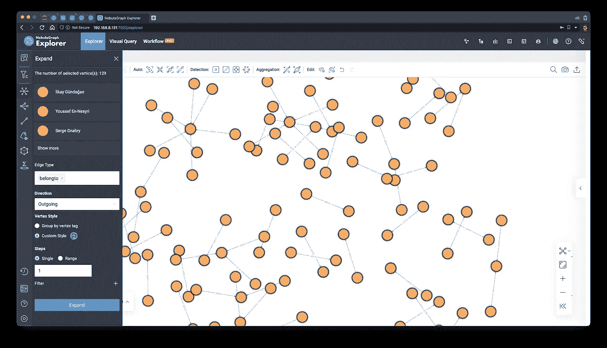

现在我们有了最终的子图，我们使用浏览器中的图算法功能来执行 BNC(中间中心性):

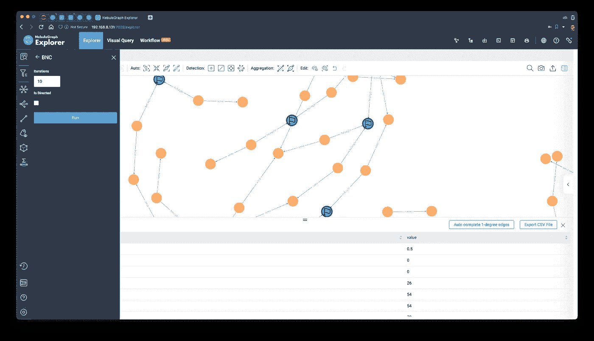

图形画布看起来像这样:

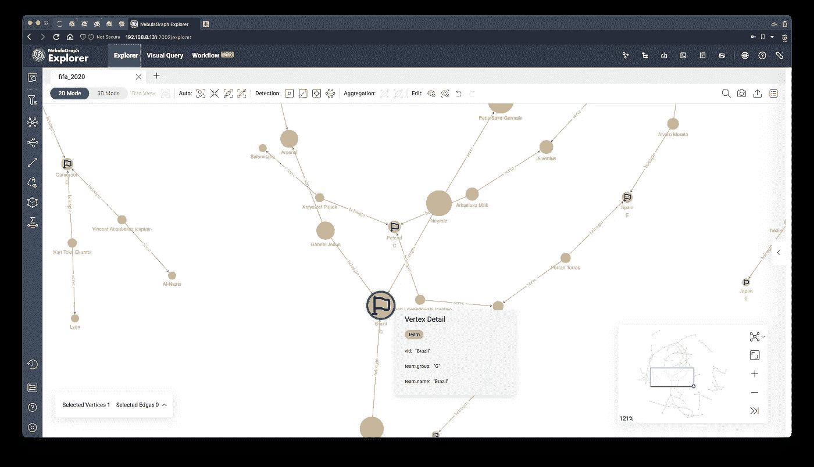

# 结果

最终，我们根据中间中心性的值进行排序，得到最终获胜的队伍:巴西！🇧🇷，其次是比、德、英、法、阿根延。

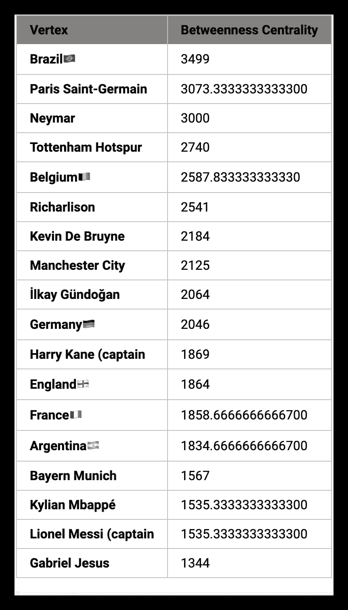

结果证明这个结果错得太离谱了…但是值得一试，不是吗？希望你喜欢这个小实验！