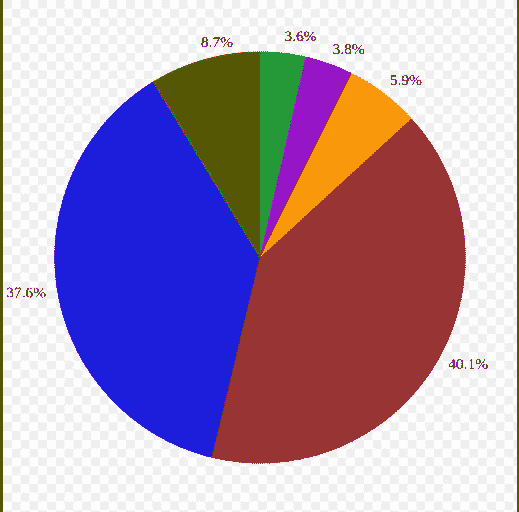
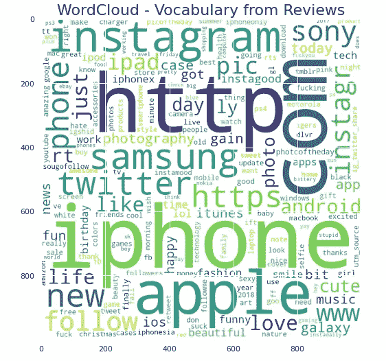
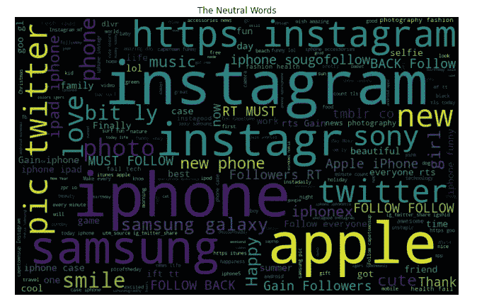
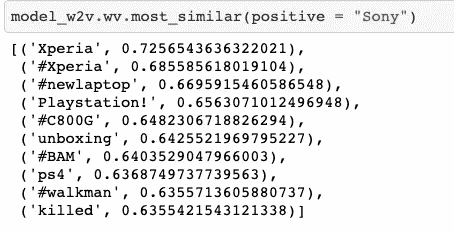
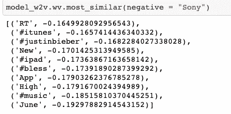
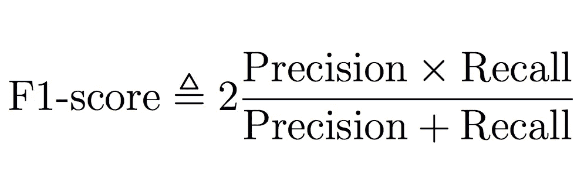

# 使用机器学习检查推文的情感

> 原文：<https://pub.towardsai.net/checking-the-sentiment-of-a-tweet-using-machine-learning-9492b7e4aa67?source=collection_archive---------4----------------------->


图片来源:Unsplash

## 让我们看看一些推文，并将它们归类为积极或消极情绪

当我们听到 Twitter 这个词时，我们会想到什么？对一些人来说，它是一个信息来源，人们可以在那里即时获得新闻；对一些人来说，它是一个发表意见的地方；对一些人来说，它只是他们手机上的一个应用程序。

随着过去十年智能手机的出现，Twitter 逐渐从最初作为短信替代品推出的微博网站转变为现在作为内置应用程序安装在我们的手机上。现在，我们所有人都有了这个触手可及的应用程序，我们可以用它来查看新闻，跟踪出版物，跟踪名人和名人，他们已经将它作为他们公关的一部分，与 Instagram 和脸书一起在 Twitter 上更新。

> 简而言之，如果你是个名人，Twitter 上的更新就意味着新闻。

现在，由于所有大小公司、信托机构、机构、电影首映式、艺术或精品公司、电影制作公司、餐馆都有自己的 Twitter 账号，他们经常让他们的追随者发布他们认为有必要通过他们的账号知道的任何事情。

一旦他们这样做了，人们往往会倾向于在平台上表达他们的观点、感受、咆哮、厌恶和他们想发泄的一切。


各种情绪意味着各种心情

第二家公司知道这一点，所以他们使用 Twitter 来衡量公众的情绪，以了解他们的产品发布，以及他们如何进一步改进他们的产品，以使其到达更广泛的社会阶层，这反过来会影响他们的业务创收。

> 从下面的图表中我们可以看到，Twitter 世界上所有的推文内容都被分成了不同的类别。



来源:谷歌。根据 Pear Analytics News 的推文内容(3.6%)垃圾邮件(3.8%)自我推销(5.9%)无意义的胡言乱语(40.1%)对话(37.6%)传递价值(8.7%)

***在我之前的*** [***文章***](https://medium.com/towards-artificial-intelligence/lets-see-the-sales-in-a-big-mart-store-250fb7e1f704?source=---------2------------------) ***中，我们看到了我们如何使用机器学习来检查某个特定商店中某个商品的销售情况。***

> 在这一篇中，我们将看到如何使用机器学习来检测特定推文的情绪。

> 情感分析是自然语言处理广泛应用的关键问题之一。我们收到客户发来的关于制造和销售手机、电脑、笔记本电脑等各种技术公司的推文，任务是识别推文是否对这些公司或产品有负面情绪。我们将解决这个问题，然后将推文分类为积极或消极的情绪。

为此，我们将通过在 [AV 平台](https://datahack.analyticsvidhya.com/contest/linguipedia-codefest-natural-language-processing-1/)上可用的黑客马拉松，看看我们如何将推文分类成各种情绪。

**这个的完整代码可以在我的**[**GitHub repo**](https://github.com/SaiBiswas/Sentiment-Analysis/blob/master/Sentiment_Analysis.ipynb)**上找到。**

所以，我们走吧。

**我们将代码分为 3 类。**

1.  **EDA(探索性数据分析)**:将训练和测试数据结合起来，作为一个整体进行一些探索性分析。
2.  **特征工程**:利用特征更好的预测情感。
3.  **建模**:机器学习脱颖而出，我们看到预测结果的部分。

> 说够了。给我看看代码..！！

```
*# importing the libraries for data processing and analysis*
**import** **pandas** **as** **pd**
**import** **numpy** **as** **np**
**import** **matplotlib.pyplot** **as** **plt**
**import** **seaborn** **as** **sns**
**import** **warnings**
%matplotlib inline
plt.style.use('fivethirtyeight')
warnings.filterwarnings('ignore')
```

一旦完成，我们将继续装载列车和测试数据。

```
train = pd.read_csv('train_sentiment.csv')
test = pd.read_csv('test_sentiment.csv')
```

1.  **EDA(探索性数据分析)**

我们可以检查 tweet 计数在训练和测试数据中的分布。

```
**# checking the distribution of label of tweets in the dataset** train[train['label'] == 0].head(10)
train[train['label'] == 1].head(10)
```

接下来，我们继续对 tweet 数据进行计数矢量化。计数矢量化是计算每个单词在文档中出现的次数的过程(例如，不同的文本，如一篇文章、一本书，甚至一个段落！).

```
***# count vectorization for the text*
from** **sklearn.feature_extraction.text** **import** CountVectorizer

cv = CountVectorizer(stop_words = 'english')
words = cv.fit_transform(train.tweet)

sum_words = words.sum(axis=0)

words_freq = [(word, sum_words[0, i]) **for** word, i **in** cv.vocabulary_.items()]
words_freq = sorted(words_freq, key = **lambda** x: x[1], reverse = **True**)

frequency = pd.DataFrame(words_freq, columns=['word', 'freq'])

frequency.head(30).plot(x='word', y='freq', kind='bar', figsize=(15, 7), color = 'brown')
plt.title("Most Frequently Occuring Words - Top 30")
```

另一个重要的 EDA 步骤是检查数据中最重要的单词。因此，为训练数据中出现最多的单词生成单词云。

```
***# generating word cloud for the most common occuring words in the train data***
**from** **wordcloud** **import** WordCloud

wordcloud = WordCloud(background_color = 'white', width = 1000, height = 1000).generate_from_frequencies(dict(words_freq))

plt.figure(figsize=(10,8))
plt.imshow(wordcloud)
plt.title("WordCloud - Vocabulary from Reviews", fontsize = 22)
```



tweet 数据的 Wordcloud

让我们也检查一下 tweet 数据中出现的中性词。

```
***# wordcloud for words that are neutral*** normal_words =' '.join([text **for** text **in** train['tweet'][train['label'] == 0]])

wordcloud = WordCloud(width=800, height=500, random_state = 0, max_font_size = 110).generate(normal_words)
plt.figure(figsize=(10, 7))
plt.imshow(wordcloud, interpolation="bilinear")
plt.axis('off')
plt.title('The Neutral Words')
plt.show()
```



当前中性词的词云

为了检查数据中存在的标签，我创建了一个函数来检查和收集数据中存在的标签，并将它们存储在一个列表中。

1.  我们还可以看到 tweet 数据中最重要的标签。
2.  我们还可以检查 tweets 类型，并将它们存储在一个列表中。

```
***# defining a function to collect the hashtags from the train data*
def** hashtags_extract(x):
    hashtags = []
    **for** i **in** x:
        ht = re.findall(r"#(\w+)", i)
        hashtags.append(ht)

    **return** hashtags
```

```
***#extracting hashtags from racist/sexist tweet*** ht_normal = hashtags_extract(train['tweet'][train['label'] == 0])

*#extracting hashtags from normal tweet*
ht_negetive = hashtags_extract(train['tweet'][train['label'] == 1])

*#unnesting list*

ht_normal = sum(ht_normal , [])
ht_negetive = sum(ht_negetive , [])
```

一旦解决了这个问题，我们就继续对数据中出现的单词进行标记。标记化是自然语言处理中的一个重要步骤，因为它有助于将单词分解为其词根形式。

在标记化之后，我们使用流行的 Gensim 库创建一个单词到向量的模型，对于 skip-gram 模型，保持上下文窗口大小为 5，窗口大小为 1。

```
*#tokenizing the words present in the training set*
tokenized_tweet = train['tweet'].apply(**lambda** x: x.split()) 

*# importing gensim*
**import** **gensim**

***# creating a word to vector model*** model_w2v = gensim.models.Word2Vec(
            tokenized_tweet,
            size=200, *# desired no. of features/independent variables* 
            window=5, *# context window size*
            min_count=2,
            sg = 1, *# 1 for skip-gram model*
            hs = 0,
            negative = 10, *# for negative sampling*
            workers= 2, *# no.of cores*
            seed = 34)

model_w2v.train(tokenized_tweet, total_examples= len(train['tweet']), epochs=20)
```

一旦做到这一点，我们就可以看到自己的话；具有与数据集中出现的单词相似的含义。例如:- " [索尼](https://datahack.analyticsvidhya.com/contest/linguipedia-codefest-natural-language-processing-1/)"



Gensim word to vec 模型，用于检查与单词 Sony 最相似的单词。

```
**from** **tqdm** **import** tqdm
tqdm.pandas(desc="progress-bar")
**from** **gensim.models.doc2vec** **import** LabeledSentence# Adding a label to the tweets**def** add_label(twt):
    output = []
    **for** i, s **in** zip(twt.index, twt):
        output.append(LabeledSentence(s, ["tweet_" + str(i)]))
    **return** output

*# label all the tweets*
labeled_tweets = add_label(tokenized_tweet)

labeled_tweets[:6]
```

我们也应该从数据中删除不需要的模式，因为保留它们会给我们的数据集增加噪声，我们应该尽可能保持我们的模型没有噪声，以便更好地预测。

```
*# removing unwanted patterns from the data*

**import** **re**
**import** **nltk**

nltk.download('stopwords')
**from** **nltk.corpus** **import** stopwords
**from** **nltk.stem.porter** **import** PorterStemmer# collecting the train data and forming a corpus
train_corpus = []

**for** i **in** range(0, 7920):
  review = re.sub('[^a-zA-Z]', ' ', train['tweet'][i])
  review = review.lower()
  review = review.split()

  ps = PorterStemmer()
   *# stemming*
  review = [ps.stem(word) **for** word **in** review **if** **not** word **in** set(stopwords.words('english'))]

  *# joining them back with space*
  review = ' '.join(review)
  train_corpus.append(review) **from** **sklearn.feature_extraction.text** **import** CountVectorizer

cv = CountVectorizer(max_features = 1500)
x = cv.fit_transform(train_corpus).toarray()
y = train.iloc[:, 1]

print(x.shape)
print(y.shape)*# creating bag of words for test*

**from** **sklearn.feature_extraction.text** **import** CountVectorizer

cv = CountVectorizer(max_features = 1500)
x_test = cv.fit_transform(test_corpus).toarray()
y = train.iloc[:, 1]

print(x_test.shape)
```

现在，对测试数据做同样的事情。

```
test_corpus = []

**for** i **in** range(0, 1953):
  review = re.sub('[^a-zA-Z]', ' ', test['tweet'][i])
  review = review.lower()
  review = review.split()

  ps = PorterStemmer()

  *# stemming*
  review = [ps.stem(word) **for** word **in** review **if** **not** word **in** set(stopwords.words('english'))]

  *# joining them back with space*
  review = ' '.join(review)
  test_corpus.append(review) 
```

去除停用词&词汇化( ***)词汇化与词干化不同，它适当地减少了词形变化，确保词根属于该语言。在引理化中，词根称为引理。一个引理(复数引理或引理数据)是一组词*** *的规范形式、词典形式或引用形式。*)也是自然语言处理的重要一步。

```
*# removing unwanted patterns from the data*

**import** **re**
**import** **nltk**

nltk.download('stopwords')
**from** **nltk.corpus** **import** stopwords
**from** **nltk.stem.porter** **import** PorterStemmer# for train data
train_corpus = []

**for** i **in** range(0, 7920):
  review = re.sub('[^a-zA-Z]', ' ', train['tweet'][i])
  review = review.lower()
  review = review.split()

  ps = PorterStemmer()
   *# stemming*
  review = [ps.stem(word) **for** word **in** review **if** **not** word **in** set(stopwords.words('english'))]

  *# joining them back with space*
  review = ' '.join(review)
  train_corpus.append(review)# for test data
test_corpus = []

**for** i **in** range(0, 1953):
  review = re.sub('[^a-zA-Z]', ' ', test['tweet'][i])
  review = review.lower()
  review = review.split()

  ps = PorterStemmer()

  *# stemming*
  review = [ps.stem(word) **for** word **in** review **if** **not** word **in** set(stopwords.words('english'))]

  *# joining them back with space*
  review = ' '.join(review)
  test_corpus.append(review)
```

现在，我们几乎完成了数据的清理，然后我们将通过将语料库中的单词转换为数组来创建一个单词包，以便机器理解和处理数据。

```
*# creating bag of words for train*
*# creating bag of words*

**from** **sklearn.feature_extraction.text** **import** CountVectorizer

cv = CountVectorizer(max_features = 1500)
x = cv.fit_transform(train_corpus).toarray()
y = train.iloc[:, 1]

print(x.shape)
print(y.shape)-------
(7920, 1500)
(7920,)*# creating bag of words for test*

**from** **sklearn.feature_extraction.text** **import** CountVectorizer

cv = CountVectorizer(max_features = 1500)
x_test = cv.fit_transform(test_corpus).toarray()
y = train.iloc[:, 1]

print(x_test.shape)-------
(1953, 1500)
```

```
*# standardization*

**from** **sklearn.preprocessing** **import** StandardScaler

sc = StandardScaler()

x_train = sc.fit_transform(x_train)
x_valid = sc.transform(x_valid)
```

标准化也是我们进行建模过程之前的一个重要步骤。

标准化之后，我们为了训练和测试的目的将数据分开。

```
**from** **sklearn.model_selection** **import** train_test_split

x_train, x_valid, y_train, y_valid = train_test_split(x, y, test_size = 0.25, random_state = 42)

print(x_train.shape)
print(x_valid.shape)
print(y_train.shape)
print(y_valid.shape)---------------
(5940, 1500)
(1980, 1500)
(5940,)
(1980,)
```

本次比赛使用的评估标准是 F1 分数，公式为 2*(精度*召回率)/(精度+召回率)。



F1 分数的公式

一旦我们完成了这个，我们将继续机器学习建模。

让我们在数据上尝试一些建模技术，然后自己看看结果。

1.  **随机森林**

```
**from** **sklearn.ensemble** **import** RandomForestClassifier
**from** **sklearn.metrics** **import** confusion_matrix
**from** **sklearn.metrics** **import** f1_score

model = RandomForestClassifier()
model.fit(x_train, y_train)

y_pred = model.predict(x_valid)

print("Training Accuracy :", model.score(x_train, y_train))
print("Validation Accuracy :", model.score(x_valid, y_valid))

*# calculating the f1 score for the validation set*
print("F1 score :", f1_score(y_valid, y_pred))---------------
Training Accuracy : 0.9994949494949495
Validation Accuracy : 0.8853535353535353
F1 score : 0.7926940639269406---------------
 *# confusion matrix* 
cm = confusion_matrix(y_valid, y_pred) 
print(cm)---------------
[[1319  120]
 [ 107  434]]
```

2.**决策树分类器**

```
**from** **sklearn.tree** **import** DecisionTreeClassifier

model = DecisionTreeClassifier()
model.fit(x_train, y_train)

y_pred = model.predict(x_valid)

print("Training Accuracy :", model.score(x_train, y_train))
print("Validation Accuracy :", model.score(x_valid, y_valid))

*# calculating the f1 score for the validation set*
print("f1 score :", f1_score(y_valid, y_pred))

*# confusion matrix*
cm = confusion_matrix(y_valid, y_pred)
print(cm)
----------------Training Accuracy : 0.9994949494949495
Validation Accuracy : 0.8378787878787879
f1 score : 0.700280112044818[[1284  155]
 [ 166  375]]
```

3. **SVM 造型**

```
*# trying SVC algorithm on the data*
**from** **sklearn.svm** **import** SVC

model = SVC()
model.fit(x_train, y_train)

y_pred = model.predict(x_valid)

print("Training Accuracy :", model.score(x_train, y_train))
print("Validation Accuracy :", model.score(x_valid, y_valid))

*# calculating the f1 score for the validation set*
print("f1 score :", f1_score(y_valid, y_pred))

*# confusion matrix*
cm = confusion_matrix(y_valid, y_pred)
print(cm)----------------Training Accuracy : 0.9644781144781145
Validation Accuracy : 0.8621212121212121
f1 score : 0.7222787385554426
[[1352   87]
 [ 186  355]]
```

4. **XG 增强分类器**

```
*# trying xgboost classifier on the data*
**from** **xgboost** **import** XGBClassifier

model = XGBClassifier()
model.fit(x_train, y_train)

y_pred = model.predict(x_valid)

print("Training Accuracy :", model.score(x_train, y_train))
print("Validation Accuracy :", model.score(x_valid, y_valid))

*# calculating the f1 score for the validation set*
print("f1 score :", f1_score(y_valid, y_pred))

*# confusion matrix*
cm = confusion_matrix(y_valid, y_pred)
print(cm)-------------------Training Accuracy : 0.8882154882154882
Validation Accuracy : 0.8792929292929293
f1 score : 0.7912663755458514
[[1288  151]
 [  88  453]]
```

5.**逻辑回归**

```
**from** **sklearn.linear_model** **import** LogisticRegression

model = LogisticRegression()
model.fit(x_train, y_train)

y_pred = model.predict(x_valid)

print("Training Accuracy :", model.score(x_train, y_train))
print("Validation Accuracy :", model.score(x_valid, y_valid))

*# calculating the f1 score for the validation set*
print("f1 score :", f1_score(y_valid, y_pred))

*# confusion matrix*
cm = confusion_matrix(y_valid, y_pred)
print(cm)----------------Training Accuracy : 0.9757575757575757
Validation Accuracy : 0.8323232323232324
f1 score : 0.6897196261682242
[[1279  160]
 [ 172  369]]
```

因此，在对训练数据使用 5 种算法并对测试数据进行测试后，我们可以得出一个结论，即随机森林算法在所有剩余算法中具有最高的准确性，它成功地将推文分类为正面和负面，准确率为 79.2%。


图片来源:谷歌

## **结论**

Twitter 现在已经成为我们大多数人生活中不可或缺的一部分。一条推文有能力影响一家公司产品的销售，或者在 twitter 社区造成严重破坏，如果这条推文像病毒一样传播，我的意思是，人们每次都发布各种各样充满各种情绪的推文。因此，作为数据科学家，我们应该能够将推文中的负面情绪解读为积极情绪，这反过来被公司用来衡量产品发布或营销广告的有效性。

> 未来，随着越来越多的人变得精通技术，这种对情感进行分类的需求将会成倍增长。

对于公司来说，这是一个在竞争中领先的机会，通过评估产品评论的反应，在竞争日益激烈的市场中获得更多收入。

> 这就是全部。下次见。再见..！！！