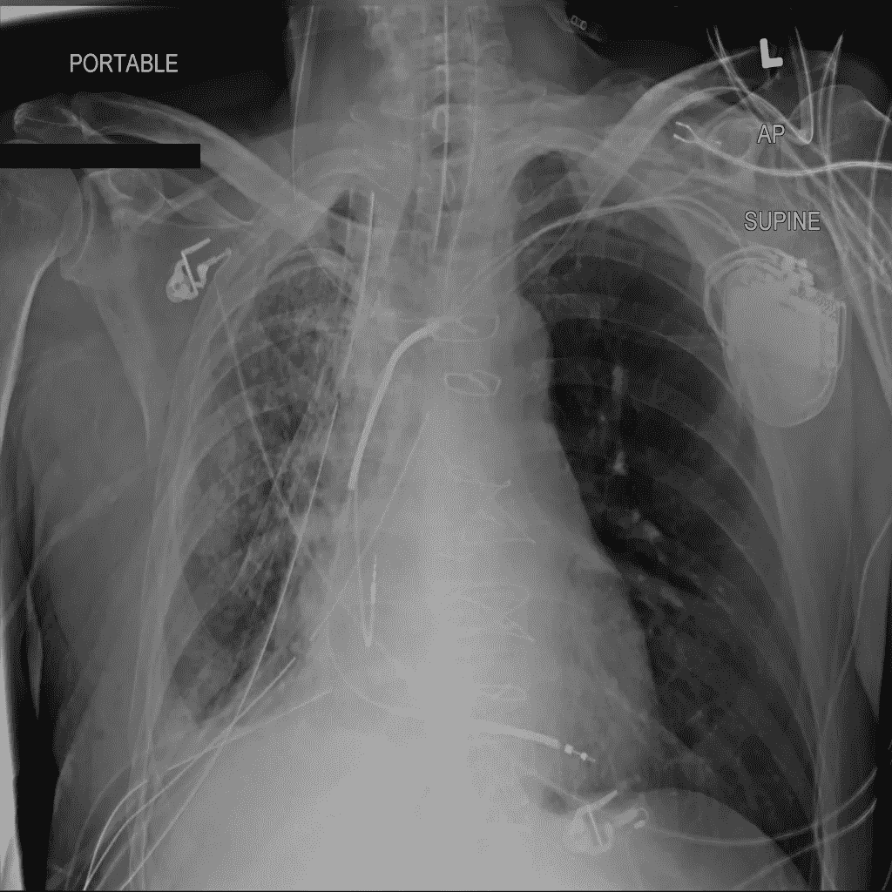
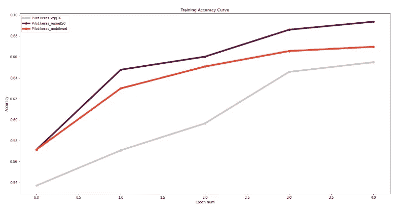
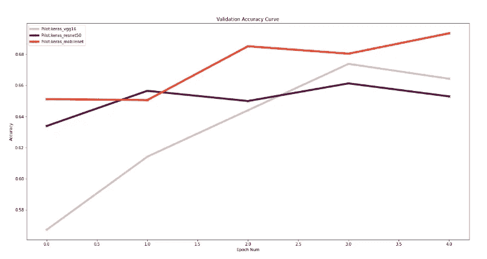
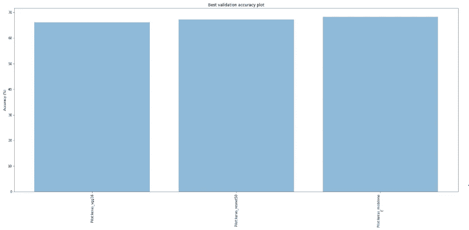
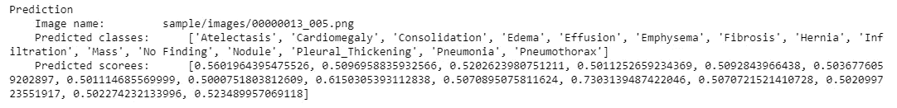

# 基于 Monk AI 的胸部 X 线异常分类

> 原文：<https://pub.towardsai.net/chest-x-ray-abnormality-classification-using-monk-ai-df4b5db7f4a4?source=collection_archive---------2----------------------->

## [人工智能](https://towardsai.net/p/category/artificial-intelligence)，[计算机视觉](https://towardsai.net/p/category/computer-vision)

## 使用 Monk，低代码深度学习工具和计算机视觉的统一包装器，使计算机视觉变得简单。

# 关键任务

在这篇博文中，我们将执行三项主要任务

*   以创建二元分类器来将胸部 x 射线图像分类为正常/异常。
*   比较三种深度神经网络架构。
*   以创建多标签分类器来生成 14 个疾病标签和相应的置信度得分。

我使用的三种深度神经网络架构是 Vgg16、Resnet50 和 MobileNet。

# 目录

## 1.安装 Monk

## 2.下载数据集

## 3.导入框架和库

## 4.可视化和探索数据集提供的样本

## 5.可视化和探索数据集提供的样本

## 6.比较

## 7.暗示

# 安装 Monk

我们将从设置 Monk AI toolkit 及其对您正在使用的平台的依赖开始，我使用 Google Colab 作为我的环境。

```
!git clone [https://github.com/Tessellate-Imaging/monk_v1.git](https://github.com/Tessellate-Imaging/monk_v1.git)
!cd monk_v1/installation/Misc && pip install -r requirements_colab.txt
```

# 下载数据集

设置好 Monk toolkit 后，下一步是安装 Kaggle，并从 Kaggle 下载 NIH 胸部 X 射线数据集到我们的 Colab 笔记本上。

```
! pip install -q kaggle
```

要从 Kaggle 下载任何数据集，我们需要首先通过前往 kaggle 上的 **MyAccount** 下载 kaggle.json 文件，并下载一个新的 API。然后我们将 JSON 文件上传到我们的 Colab 笔记本上。

```
**from** **google.colab** **import** filesfiles.upload()
```

现在我们可以从 Kaggle 下载数据集的 zip 文件并解压缩。

```
! mkdir ~/.kaggle
! cp kaggle.json ~/.kaggle/
! chmod 600 ~/.kaggle/kaggle.json
! kaggle datasets download -d 'nih-chest-xrays/sample'
! unzip -qq sample.zip
```

数据集共有 15 个类别(14 个疾病类别和 1 个“无发现”类别)。



来自 Kaggle 的 NIH 胸部 X 线数据集的胸部 X 线图像

# 导入框架和库

Monk 为我们提供了三个主要的工作框架，即 Keras、Pytorch 和 Mxnet。我们在这个项目中使用 Keras 框架，Pandas 库用于可视化和探索数据集。为了建立一个项目的工作目录，我们为正在使用的框架初始化一个原型。

```
**from** **keras_prototype** **import** prototype
**import** **pandas** **as** **pd**
```

# 可视化和探索数据集提供的样本

制作了两个数据帧，一个具有由 14 个疾病类别和 1 个“未发现”类别组成的多标记目标值，对于图像的二进制分类，通过分别用**异常**和**正常**替换疾病类别和“未发现”类别来形成另一个数据帧

```
$ df=pd.read_csv('sample/sample_labels.csv')$ for i in range(len(df)):
          df["Finding Labels"][i] = df["Finding Labels"][i].replace("|", ",");$ df.to_csv("sample/kush1.csv", index=False)$ for i in range(len(df)):if df["Finding Labels"][i] == "No Finding":df["Finding Labels"][i] = "Normal";else:
               df["Finding Labels"][i] = "Abnormal";$ df.to_csv("sample/kush2.csv",index=False)
```

# 设置模型、选择参数和训练

我们已经导入了 Keras 框架，现在我们将通过选择三个模型来创建一个新项目和这个项目中的三个新实验。

## Vgg16

```
gtf = prototype(verbose=1);
gtf.Prototype("Pilot", "keras_vgg16");
```

为了获得原型中可用的模型，我们使用 List_Models 函数

```
gtf.List_Models();
```

VGG16 是本项目中使用的第一个 CNN 架构，在创建实验文件后，我们设置了数据集和标签路径。然后建立 Vgg16 模型，并给出历元数。我们将 freeze_base_network 初始化为 false，以使模型中的所有层都成为可训练层。

```
gtf.Default(dataset_path="sample/images", 
            path_to_csv = "sample/kush2.csv",
            model_name="vgg16", 
            freeze_base_network=**False**,
            delimiter = ",",
            num_epochs=5);
```

建立好模型之后，接下来就是训练了。

```
gtf.Train();
```

类似于 Vgg16，我们使用 Resnet50 和 MobileNet 作为 CNN 架构创建了另外两个实验。模型的设置类似于 Vgg16，只有模型名称被相应地改变，并且一旦模型被设置，它就在训练数据集上被训练。

**Resnet50**

实验文件保存在项目文件夹中。

```
gtf=prototype(verbose=1);
gtf.Prototype("Pilot", "keras_resnet50");
```

然后建立模型并进行训练。

```
gtf.Default(dataset_path="sample/images", 
            path_to_csv = "sample/kush2.csv",
            model_name="resnet50", 
            freeze_base_network=**False**,
            delimiter = ",",
            num_epochs=5);gtf.Train();
```

**MobileNet**

创建实验文件

```
gtf=prototype(verbose=1);
gtf.Prototype("Pilot", "keras_mobilenet");
```

建立和训练模型

```
gtf.Default(dataset_path="sample/images", 
            path_to_csv = "sample/kush2.csv",
            model_name="mobilenet", 
            freeze_base_network=**False**,
            delimiter = ",",
            num_epochs=5);gtf.Train();
```

# 比较

训练完所有三个模型后，我们继续下一个任务，比较这三个模型。

我们可以使用比较原型来比较这三个模型。

```
**from** **compare_prototype** **import** compare
gtf = compare(verbose=1);
gtf.Comparison("Comparison")
```

添加要比较的实验。

```
gtf.Add_Experiment("Pilot", "keras_vgg16");
gtf.Add_Experiment("Pilot", "keras_resnet50");
gtf.Add_Experiment("Pilot", "keras_mobilenet");
```

生成统计数据

```
gtf.Generate_Statistics();
```

这将生成一个 CSV 文件和各种图形。



训练准确度曲线



验证准确度曲线



最佳验证准确度图

## 比较得出的结论

从上面的图表中，我们可以得出结论，Mobilenet 给了我们最好的验证精度，而 Resnet50 在训练 5 个时期时给了我们最好的训练精度。

从训练精度曲线可以清楚地看出，Vgg16 的性能过早饱和，其原因是 Resnet50 在执行身份映射时克服了消失梯度问题。

# 暗示

为了进行多标签分类并预测所有 14 种疾病的置信分数，我们以评估模式加载实验。

```
gpf = prototype(verbose=1)gpf.Prototype("Pilot-1", "keras_resnet50", eval_infer=True);prediction=gpf.Infer(img_name="sample/images/00000013_005.png",return_raw=True)
```


来自 Kaggle 的 x 射线图像用作推断输入



推理的结果

Monk 使我们的工作不那么单调乏味，而且更加高效，我们用比选择传统方法更少的代码行完成了所有三项任务。我们甚至可以针对同一个分类示例使用其他模型，并尝试获得理想的结果。