# 基于胸部 X 线的肺炎分类

> 原文：<https://pub.towardsai.net/chest-x-ray-based-pneumonia-classification-921a7c94fd5e?source=collection_archive---------0----------------------->

## 使用 Monk，低代码深度学习工具和计算机视觉的统一包装器，使计算机视觉变得简单。

## **僧库**

📌Monk 是一个用于计算机视觉和深度学习的开源低代码工具。

## **和尚特征**

📌低代码。

📌主要深度学习框架的统一包装器。

📌语法不变包装。

# 使能够

📌用户创建、管理和版本控制深度学习实验。

📌用户跨训练指标比较实验。

📌用户快速找到最佳超参数。

# 目录

☑ **安装**

☑ **下载数据集**

☑ **数据集的详细信息**

☑ **快速原型制作——训练、验证和推理**

☑ **使用 Resnet50** 训练一个分类器

☑ **使用 Densenet121** 训练分类器

☑ **对比实验**

# 装置

```
$ !git clone [https://github.com/Tessellate-Imaging/monk_v1.git](https://github.com/Tessellate-Imaging/monk_v1.git)*# If using Colab install using the commands below*
$ !cd monk_v1/installation/Misc && pip install -r requirements_colab.txt
```

# 下载数据集

**数据集—胸部 x 光图像(肺炎)**

*   [卡格尔](https://www.kaggle.com/paultimothymooney/chest-xray-pneumonia)
*   [门德利](https://data.mendeley.com/datasets/rscbjbr9sj/2)

```
$ ! wget --load-cookies /tmp/cookies.txt "https://docs.google.com/uc?export=download&confirm=$(wget --save-cookies /tmp/cookies.txt --keep-session-cookies --no-check-certificate 'https://docs.google.com/uc?export=download&id=1li6ctqAvGFgIGMSt-mYrLoM_tbYkzqdO' -O- | sed -rn 's/.*confirm=([0-9A-Za-z_]+).*/**\1\n**/p')&id=1li6ctqAvGFgIGMSt-mYrLoM_tbYkzqdO" -O chest_xray.zip && rm -rf /tmp/cookies.txt
```

解压缩数据

```
$ ! unzip -qq chest_xray.zip
```

# 数据集的详细信息

## **什么是肺炎？**

*   它是一个或两个肺部的感染。
*   它是由细菌、病毒和真菌引起的。
*   肺炎是一种感染，它会导致肺部气囊(称为肺泡)发炎。

## **一般症状**

*   发热
*   发冷
*   咳嗽
*   气促
*   乏力

## **细菌性肺炎有哪些不同类型？**

*   细菌导致大多数成人社区获得性肺炎病例。
*   当被感染的人咳嗽或打喷嚏时，一个人可能会感染肺炎。
*   充满细菌的水滴进入空气，你可以把它们吸入你的鼻子或嘴巴。
*   典型表现为局灶性肺叶实变。

## **在胸部 x 光片上看到的细菌性肺炎。**

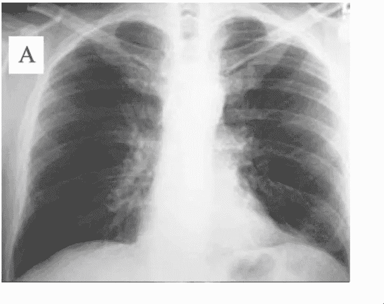

正常胸透

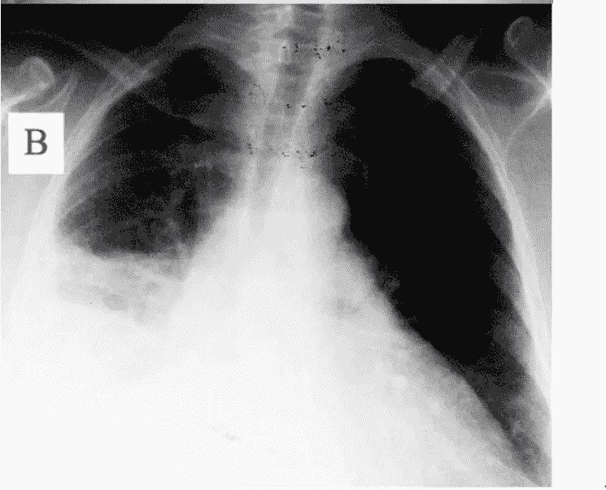

异常胸部 X 线片，右肺、中叶或下叶肺炎所致实变(白色区域，图像左侧)

## **病毒性肺炎有哪些不同类型**

*   病毒是肺炎的第二大常见原因。
*   许多不同的病毒导致这种疾病，包括一些引起感冒和流感的相同病毒。
*   发烧，发冷，干咳，这可能会恶化，使粘液，鼻塞。
*   病毒性肺炎(右)表现为双肺弥漫性间质性肺炎。

## **胸部 x 光片上看到的病毒性肺炎**

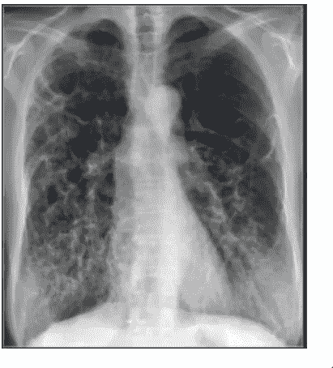

**病毒性肺炎**

## **行走性肺炎有哪些不同类型**

*   一种不太严重的细菌性肺炎。有时医生称之为“非典型”肺炎。
*   症状可能非常轻微，以至于你不知道自己已经患病。你可能感觉很好，能够进行日常活动，这就是名字中“散步”的来源。

## **真菌性肺炎有哪些不同类型**

*   真菌是肺炎的一个不太常见的原因。如果你身体健康，就不太可能得真菌性肺炎。
*   但是，如果你的免疫系统因大手术、器官移植、艾滋病毒而变弱，你就有更大的机会感染它。
*   你会因为吸入叫做真菌孢子的微小颗粒而患上真菌性肺炎。

## **对此类应用的需求**

*   细菌性肺炎需要紧急转诊，以便立即进行抗生素治疗。
*   病毒性肺炎采用支持性治疗。因此，准确及时的诊断是必要的。
*   影像的快速放射学解释并不总是可用的，特别是在资源匮乏的环境中，那里儿童肺炎的发病率和死亡率最高。
*   从而使用迁移学习对儿科胸部 x 光片进行分类。

## **数据集**

*   标记了总共 5232 张儿童胸部 x 光照片。
*   训练集包括来自总共 5，856 名患者的 3，883 名描述为肺炎(2，538 名细菌性和 1，345 名病毒性)和 1，349 名正常人。
*   测试集包括来自 624 名患者的 234 幅正常图像和 390 幅肺炎图像(242 幅细菌性和 148 幅病毒性)。

> 标签

*   普通 x 射线
*   肺炎 x 光片

# 快速原型制作——培训、验证和推理

## **迁移学习**

> ***基础网络***

*   卷积神经网络首先在 coco 或 Imagenet 等大型数据集上进行训练。
*   这些数据集有许多类，大约有 1000、1500 个类。
*   因此，神经网络的最后一层具有相似数量的神经元。

> ***对自定义数据集进行微调***

*   自定义数据集通常有不同数量的类。
*   你拿着网络，在网络上加载预先训练好的权重。
*   然后移除具有额外(或更少)数量神经元的最后一层。
*   您添加了一个新图层，其神经元数量=自定义数据集中的类数量。
*   您可以选择在新添加的最后一层和旧网络之间添加更多层。

## **什么是快速原型制作？**

*   每个图像分类项目都是从尝试迁移学习的基本步骤开始的。

> *在迁移学习中，你采用在非常大的数据集上训练的深度学习模型*

*   然后在您的自定义数据集上进一步训练它。

> *这样做时，你需要选择许多超参数*

*   首先是模型本身，像 ResNet 或 DenseNet，你永远不能确定用什么。
*   然后是数据集参数，如批量大小、输入形状等。
*   然后是诸如冻结层、不使用预训练模型等模型参数。
*   然后设置选择哪个优化器、损失函数、学习率调度器等。
*   最后，训练的时期数。

> 注意:不是所有的事情都可以在第一步完成，因此快速原型模式。

> *这允许您*

*   树立榜样。
*   是使用预先训练好的网络还是从头开始训练。
*   纪元的数量。

> *所有其他参数根据其原始研究论文设置为默认值。*

*   然后可以在僧侣的中级和专家模式下改变。

## 创建和管理实验

*   提供项目名称。
*   提供一个实验名称。
*   对于特定数据，创建单个项目。
*   在每个项目中，可以创建多个实验。
*   每个实验都有不同的超参数。

```
$ gtf = prototype(verbose=1);
$ gtf.Prototype("Pneumonia_Classification", "Quick_Prototype");
```

输出

```
Mxnet Version: 1.5.0

Experiment Details
    Project: Pneumonia_Classification
    Experiment: Quick_Prototype
    Dir: /home/abhi/Downloads/webinar_2/workspace/Pneumonia_Classification/Quick_Prototype/
```

## 这将按照以下结构创建文件和目录

```
workspace
    |
    |----Pneumonia_Classification
                    |
                    |
                    |---Quick_Prototype
                              |
                              |--experiment-state.json
                              |
                              |--output
                                   |
                                   |------logs 
                                   |
                                   |------models
```

## 快速模式训练

```
- Using Default Function
    - dataset_path
    - model_name
    - num_epochs
```

## 数据集文件夹结构

```
parent_directory
    |
    |
    |
    |----training
            |------Infected
                    |
                    |------img1.jpg
                    |------img2.jpg
                    |------.... (and so on)
            |------Normal
                    |
                    |------img1.jpg
                    |------img2.jpg
                    |------.... (and so on)   
    |
    |
    |----validation
            |------Infected
                    |
                    |------img1.jpg
                    |------img2.jpg
                    |------.... (and so on)
            |------Normal
                    |
                    |------img1.jpg
                    |------img2.jpg
                    |------.... (and so on)
```

## 可修改参数

*   dataset_path:数据的路径
*   model_name:使用哪个预训练模型
*   freeze_base_network:是否重新训练已经训练好的网络
*   num_epochs:训练的时期数

```
$ gtf.Default(dataset_path="chest_xray/train",
            model_name="resnet18_v1",
            num_epochs=5)*#Start Training*
$ gtf.Train();
```

## 训练对比 Val 对比测试数据集

> *列车*

*   模型看到这些数据并从中学习。
*   我们案例中 80%的原始训练数据。

> *验证*

*   调整模型超参数时，用于对模型拟合定型数据集提供无偏评估的数据样本。
*   在我们的例子中是原始训练数据的 20%。

> *测试*

*   测试数据集是用于提供对训练数据集的最终模型拟合的无偏评估的数据集。
*   外部设置。

## 在测试图像上运行推理

> *在推理模式下加载实验*

*   将标志 eval_infer 设置为 True。

```
$ gtf = prototype(verbose=1);
$ gtf.Prototype("Pneumonia_Classification", "Quick_Prototype", eval_infer=**True**);
```

输出

```
Mxnet Version: 1.5.0

Model Details
    Loading model - workspace/Pneumonia_Classification/Quick_Prototype/output/models/final-symbol.json
    Model loaded!

Experiment Details
    Project: Pneumonia_Classification
    Experiment: Quick_Prototype
    Dir: /home/abhi/Downloads/webinar_2/workspace/Pneumonia_Classification/Quick_Prototype/
```

**选择图像并运行推断**

```
$ img_name = "chest_xray/infer/normal-1.jpeg";
$ predictions = gtf.Infer(img_name=img_name);

*#Display* 
**$ from** **IPython.display** **import** Image
$ Image(filename=img_name)
```

输出

```
Prediction
     Image name:     chest_xray/infer/normal-1.jpeg
     Predicted class:      NORMAL
     Predicted score:      7.098179340362549
```

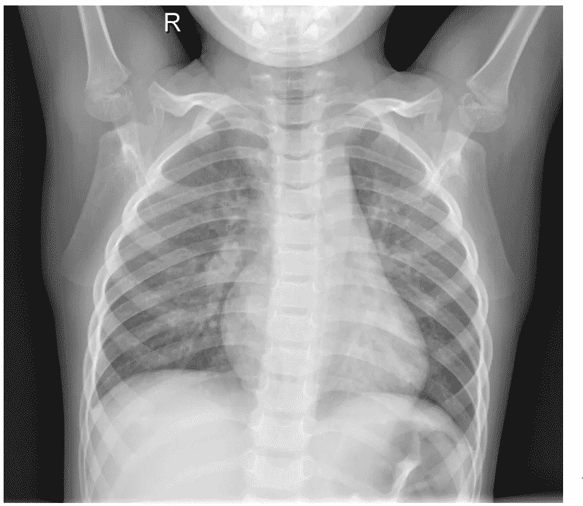

常态

```
$ img_name = "chest_xray/infer/pneumonia-1.jpeg";
$ predictions = gtf.Infer(img_name=img_name);

*#Display * 
**$ from** **IPython.display** **import** Image
$ Image(filename=img_name)
```

输出

```
Prediction
     Image name:         chest_xray/infer/pneumonia-1.jpeg     Predicted class:      PNEUMONIA
Predicted score:      3.6506881713867188
```

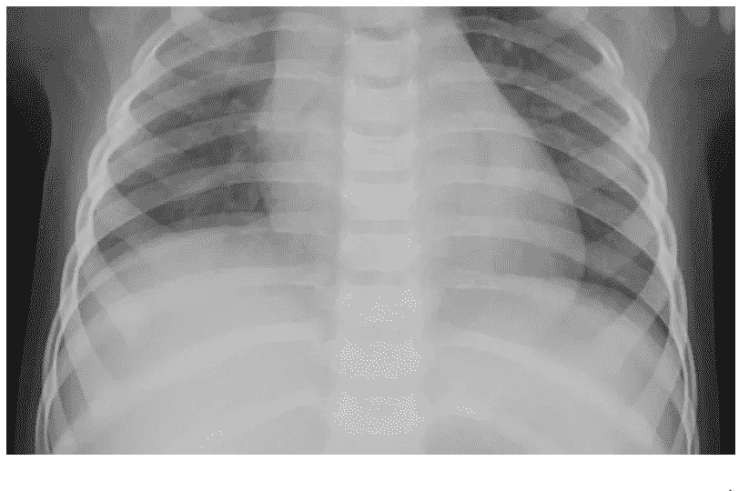

肺炎

# 使用 Resnet50 训练分类器

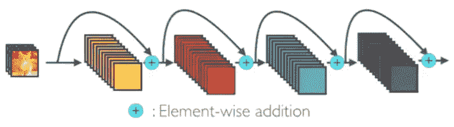

ResNet 块

## **ResNet 上的读数**

> *分从* [*走向数据科学*](https://towardsdatascience.com/an-overview-of-resnet-and-its-variants-5281e2f56035)

*   ResNet 的核心思想是引入所谓的“身份快捷连接”，跳过一层或多层。
*   较深的模型不应该比其较浅的对应模型产生更高的训练误差。
*   解决了网络深度增加时渐变消失的问题。

> *分从* [*中等*](https://medium.com/@14prakash/understanding-and-implementing-architectures-of-resnet-and-resnext-for-state-of-the-art-image-cf51669e1624)

*   在 ILSVRC 2015 分类大赛中以 3.57%的前 5 名错误率(系综模型)获得第一名。
*   高效训练的网络也有 100 层和 1000 层。
*   用 ResNet-101 替换更快 R-CNN 中的 VGG-16 层。他们观察到 28%的相对改善。

> *在这里阅读更多内容*

*   [https://arxiv.org/abs/1512.03385](https://arxiv.org/abs/1512.03385)
*   【https://d2l.ai/chapter_convolutional-modern/resnet.html 号
*   【https://cv-tricks.com/keras/understand-implement-resnets/ 
*   [https://mc.ai/resnet-architecture-explained/](https://mc.ai/resnet-architecture-explained/)

# ResNet 块— 1

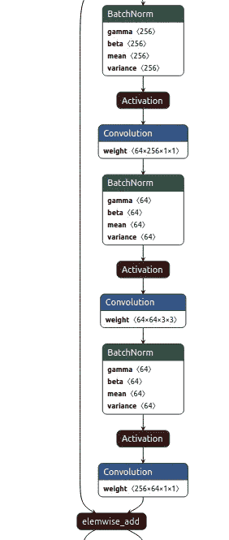

## **属性**

> *该块有 2 个分支*

*   第一个分支是身份分支，它接受输入并将其作为输出，即残差。
*   第二个分支有这些层
*   batch norm-> relu-> conv _ 1x1-> batch norm-> relu-> conv _ 3x 3-> batch norm-> relu-> conv _ 1x1。

分支是按元素添加的，因此两个分支需要具有相同大小的输出。

这个块的最后一层是 Relu。

> *瓶颈*

*   第一和中间卷积中的 num 个特征是 input_features/4
*   最终卷积具有要素=输入 _ 要素。

## **ResNet 块— 2**

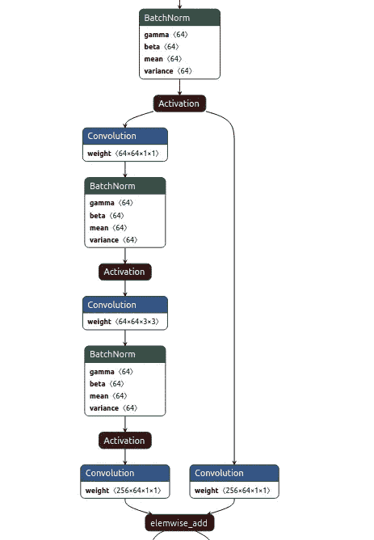

## **属性**

该块有两个起始元素

*   batchnorm -> Relu

发布起始元素该块有 2 个分支

> *第一个分支有这些层*

*   conv_1x1

> *第二个分支有这些层*

*   conv _ 1x1-> batch norm-> Relu-> conv _ 3x 3-> batch norm-> Relu-> conv _ 1x1。

分支是按元素添加的，因此两个分支需要具有相同大小的输出。

```
*#Set project and experiment* $ gtf = prototype(verbose=1)
$ gtf.Prototype("Pneumonia_Classification", "Experiment_1")*#Load data and model* $ gtf.Default(dataset_path="chest_xray/train",             model_name="resnet50_v2",freeze_base_network=**False**,             num_epochs=5)*# Train*
$ gtf.Train()
```

# 使用 Densenet121 训练分类器

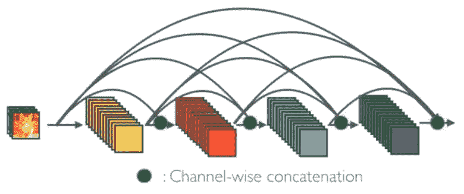

**密集块**

## **dense net 上的读数**

> *分从* [*中等*](https://medium.com/the-advantages-of-densenet/the-advantages-of-densenet-98de3019cdac)

*   “这种体系结构源于改进正在开发的更高层体系结构的愿望。特别是改善高层网络中许多层在某种意义上是冗余的问题。”

> *指向数据科学*

*   每一层都从所有前面的层接收“集体知识”。(见上图)。

```
*#Set project and experiment* $ gtf = prototype(verbose=1)
$ gtf.Prototype("Pneumonia_Classification", "Experiment_2")*#Load data and model* $ gtf.Default(dataset_path="chest_xray/train",             model_name="densenet121",freeze_base_network=**False**,             num_epochs=5)*# Train*
$ gtf.Train()
```

# 对比实验

```
*# Invoke the comparison class* $ **from** **compare_prototype** **import** compare
```

## **创建和管理比较实验**

*   提供项目名称

```
*# Create a project* 
$ gtf = compare(verbose=1);
$ gtf.Comparison("Exp_1_vs_2")
```

输出

```
Comparison: - Exp_1_vs_2
```

## 添加实验

*   第一个参数—项目名称
*   第二个参数—实验名称

```
$ gtf.Add_Experiment("Pneumonia_Classification", "Experiment_1")
$ gtf.Add_Experiment("Pneumonia_Classification", "Experiment_2")
```

输出

```
Project - Pneumonia_Classification, Experiment - Experiment_1 added Project - Pneumonia_Classification, Experiment - Experiment_2 added
```

## 运行分析

```
$ gtf.Generate_Statistics()
```

**这将按照以下结构创建文件和目录**

```
workspace
    |
    |--------comparison
                    |
                    |
                    |-----Exp_1_vs_2
                                |
                                |------stats_best_val_acc.png
                                |------stats_max_gpu_usage.png
                                |------stats_training_time.png
                                |------train_accuracy.png
                                |------train_loss.png
                                |------val_accuracy.png
                                |------val_loss.png |
                    |-----comparison.csv (Contains necessary details of all experiments)
```

## 训练准确度曲线

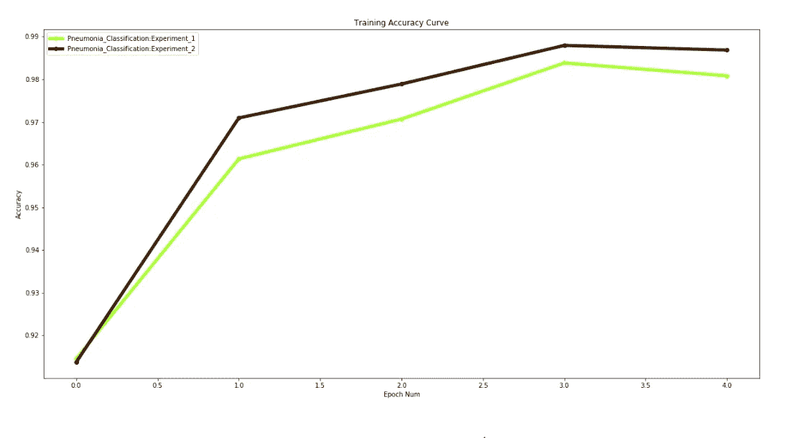

训练准确度曲线

## 训练损失曲线

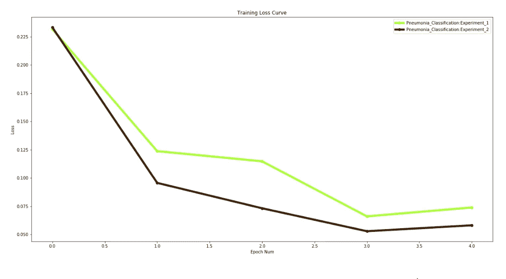

训练损失曲线

## 验证准确度曲线

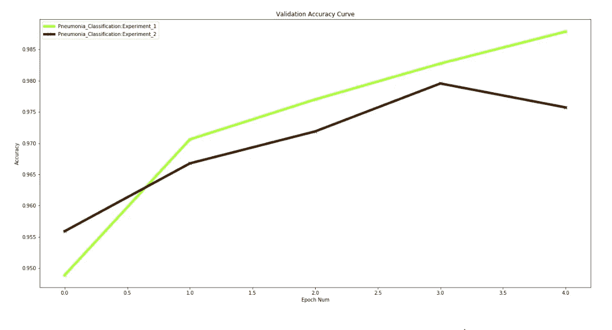

验证准确度曲线

## 验证损失曲线

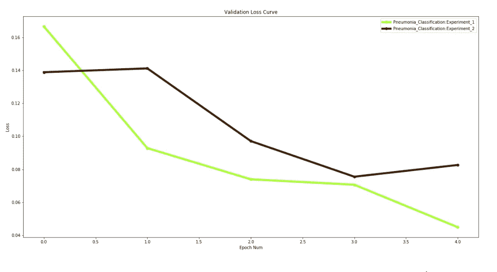

验证损失曲线

## 训练时间曲线


训练时间曲线

## 最大 GPU 使用量

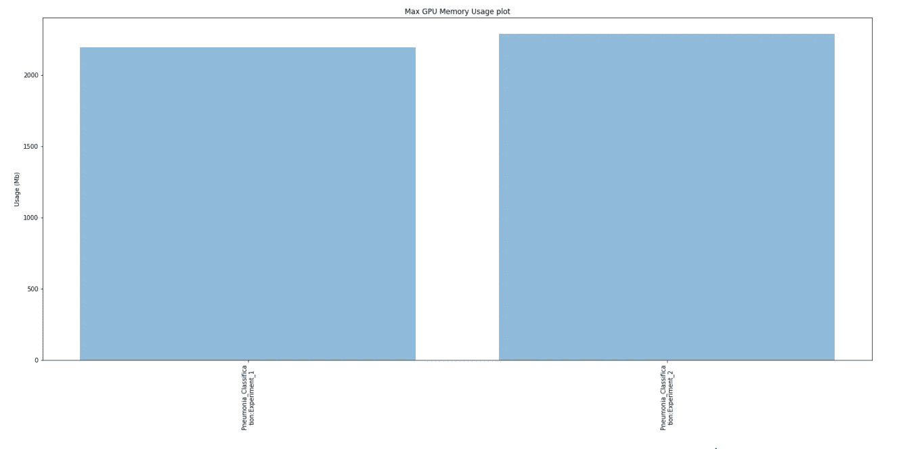

最大 GPU 使用量

## 最佳验证准确度

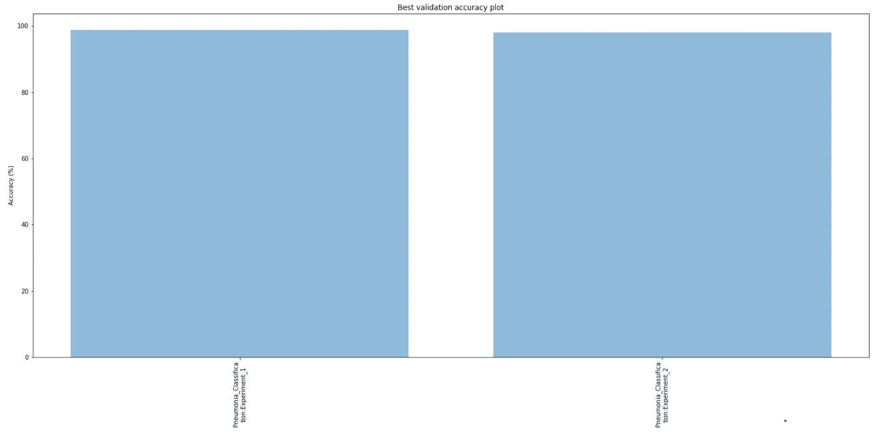

最佳验证准确度

> 两者在验证数据上工作得一样好

## 让我们检查一下测试设备的性能

**ResNet**

```
gtf = prototype(verbose=1);
gtf.Prototype("Pneumonia_Classification", "Experiment_1", eval_infer=**True**);

*# Load test data*
gtf.Dataset_Params(dataset_path="chest_xray/test");
gtf.Dataset();

*# Test for accuracy*
accuracy, class_based_accuracy = gtf.Evaluate();
```

输出

```
Mxnet Version: 1.5.0

Model Details
    Loading model - workspace/Pneumonia_Classification/Experiment_1/output/models/final-symbol.json
    Model loaded!

Experiment Details
    Project: Pneumonia_Classification
    Experiment: Experiment_1
    Dir: /home/abhi/Downloads/webinar_2/workspace/Pneumonia_Classification/Experiment_1/

Dataset Details
    Test path:      chest_xray/test
    CSV test path:  None

Dataset Params
    Input Size:  224
    Processors:   4

Pre-Composed Test Transforms
[{'Normalize': {'mean': [0.485, 0.456, 0.406], 'std': [0.229, 0.224, 0.225]}}]

Dataset Numbers
    Num test images: 624
    Num classes:      2

TestingHBox(children=(IntProgress(value=0, max=624), HTML(value='')))Result
        class based accuracies
            0\. NORMAL - 55.55555555555556 %
            1\. PNEUMONIA - 98.2051282051282 %
        total images:            624
        num correct predictions: 513
        Average accuracy (%):    82.21153846153845
```

**DenseNet**

```
$ gtf = prototype(verbose=1);
$ gtf.Prototype("Pneumonia_Classification", "Experiment_2", eval_infer=**True**);

*# Load test data*
$ gtf.Dataset_Params(dataset_path="chest_xray/test");
$ gtf.Dataset();

*# Test for accuracy*
$ accuracy, class_based_accuracy = gtf.Evaluate()
```

输出

```
Mxnet Version: 1.5.0

Model Details
    Loading model - workspace/Pneumonia_Classification/Experiment_2/output/models/final-symbol.json
    Model loaded!

Experiment Details
    Project: Pneumonia_Classification
    Experiment: Experiment_2
    Dir: /home/abhi/Downloads/webinar_2/workspace/Pneumonia_Classification/Experiment_2/

Dataset Details
    Test path:      chest_xray/test
    CSV test path:  None

Dataset Params
    Input Size:  224
    Processors:   4

Pre-Composed Test Transforms
[{'Normalize': {'mean': [0.485, 0.456, 0.406], 'std': [0.229, 0.224, 0.225]}}]

Dataset Numbers
    Num test images: 624
    Num classes:      2

TestingHBox(children=(IntProgress(value=0, max=624), HTML(value='')))Result
        class based accuracies
            0\. NORMAL - 62.39316239316239 %
            1\. PNEUMONIA - 98.71794871794873 %
        total images:            624
        num correct predictions: 531
        Average accuracy (%):    85.09615384615384
```

> 在这种情况下，Densenet 在测试集上表现更好

你可以在 [Github](https://github.com/Tessellate-Imaging/monk_v1/blob/master/study_roadmaps/4_image_classification_zoo/Chest%20X-Ray%20based%20Pneumonia%20Classification%20-%20Infected%20Vs%20Normal%20X-rays.ipynb) 上找到完整的 jupyter 笔记本。如果你喜欢蒙克，给我们 GitHub 回购⭐️。

有问题可以联系 [Abhishek](https://www.linkedin.com/in/abhishek-kumar-annamraju/) 和 [Akash](https://www.linkedin.com/in/akashdeepsingh01/) 。请随意联系他们。

我对计算机视觉和深度学习充满热情。我是 [Monk](https://github.com/Tessellate-Imaging/Monk_Object_Detection) 库的开源贡献者。

你也可以在以下网址看到我的其他作品:

[](https://medium.com/@akulahemanth) [## 阿库拉·赫曼思·库马尔培养基

### 阅读阿库拉·赫曼思·库马尔在媒介上的作品。计算机视觉爱好者|Linkedin…

medium.com](https://medium.com/@akulahemanth) 

安妮·斯普拉特在 [Unsplash](https://unsplash.com/s/photos/cough?utm_source=unsplash&utm_medium=referral&utm_content=creditCopyText) 上拍摄的照片