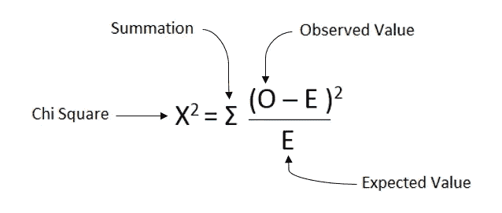
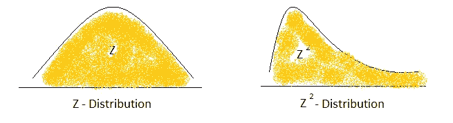
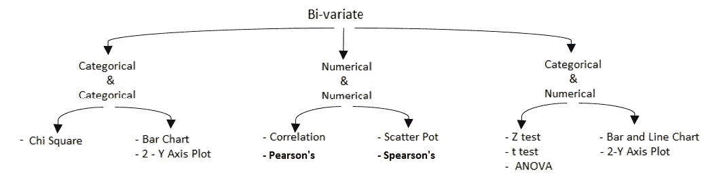
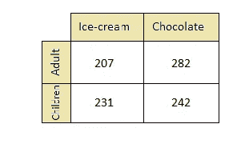
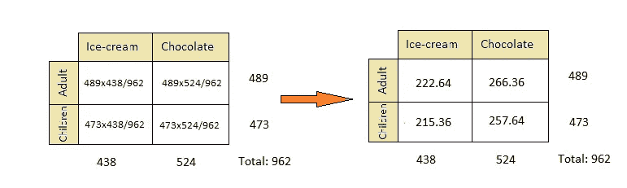
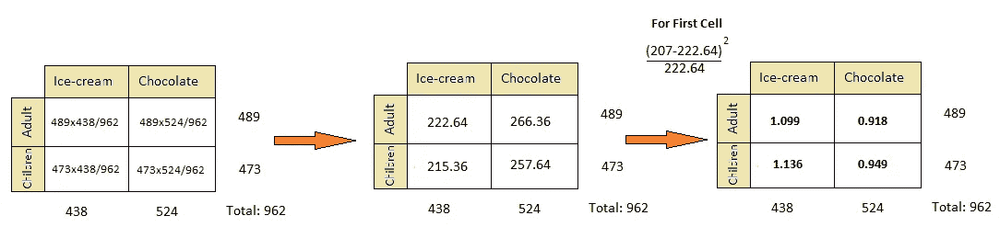
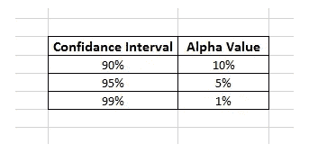
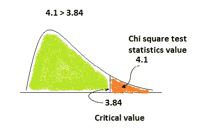

# 统计学中的卡方假设检验

> 原文：<https://pub.towardsai.net/chi-square-hypothesis-testing-in-statistics-87884bc73d99?source=collection_archive---------3----------------------->

## [统计数据](https://towardsai.net/p/category/statistics)

## 分类特征之间的关系关联

由[威廉·艾文](https://unsplash.com/@firmbee?utm_source=medium&utm_medium=referral)在 [Unsplash](https://unsplash.com?utm_source=medium&utm_medium=referral) 上拍摄

卡方检验是假设检验中的一种非参数检验，用于了解双变量数据或记录中两个分类特征的关联。非参数检验是无分布检验，因为它基于非常少的假设，这就是为什么它不是正态分布的。当目标变量不呈正态分布时，可以看出目标是处于序数还是处于标称值以及存在离群值。卡方检验还表明样本的方差在某种程度上等于样本所来自的总体。这就是为什么称之为人口方差假设。

为了测试一个分类变量是否与另一个分类值相关或对其有影响，我们检查了以下两种情况下的假设:

**H0:** 两个分类变量相互独立。

**H1:** 两个范畴变量不是相互独立的。

H0 和 H1 分别是零假设和替代假设。

测试后，如果我们知道我们必须拒绝零假设，那么我们必须接受另一个假设，即两个分类数据有某种程度的关联。该测试对 ***p 值*** 执行，确定 ***p 值是否小于 0.05，*** 则两个分类值具有很强的关联性，如果 ***p 值大于 0.05，*** 则它们是独立的。

卡方的公式如下所示:

卡方公式。作者图片

卡方分布称为 Z 平方分布，卡方图如下:

卡方分布。作者图片

该测试仅基于分类数据，如性别(男性、女性)、颜色(红色、绿色、橙色等)。)，以及其他二元范畴。

许多学习者仍然不知道他们学习道路上的许多事情，我们总是试图以简单、有意义的方式获取知识。下面的树会给你一些提示，告诉你如何选择二元数据的测试。

提示为双变量数据选择测试和绘图。作者图片

我们将以成人和儿童对冰淇淋和巧克力的偏好为例。下面给出了两个假设:

*   年龄和对冰淇淋和巧克力的偏好是独立的。
*   年龄和对冰淇淋和巧克力的偏好不是独立的。

考虑用于分析的表格，如下所示:

类别和类别数据。作者图片

下一步是将行和列相加，然后除以总数。

获取期望值

现在我们既有观察值，也有期望值。我们将通过应用上面看到的公式来计算每个单元格的卡方值。

每个像元的计算卡方值。作者图片

将所有值相加后，总体卡方值现在为 **4.102** 。这个卡方值类似于 z 检验。现在要得到一个自由度的临界卡方值。DOF 比所有行和列的总数少 1。

在一行中，我们有两行和两列。因此，自由度将如下所示:

自由度=(第 1 行)*(第 1 列)=(2–1)*(2–1)= 1

知道自由度后，我们可以借助α值计算临界卡方值。alpha 值是选择区间的置信度后得到的值。

置信区间和阿尔法值。作者图片

阿尔法值可以从这个表中选择，如照片所示。

当我们看到α值为 5%的卡方表时，临界值为 **3.84** 。我们可以通过卡方分布图观察这些值。

两种价值观的观点。作者图片

我们可以看到卡方值大于临界值。所以，我们必须拒绝零假设。此外，如果我们看到，如果我们选择阿尔法值为 1%，临界值来 **6.64** 。p 值在 5%和 1%之间意味着如果我们有一个 5%的显著性区域，那么我们仍然要拒绝零假设。但是，如果 1%的α值，卡方值小于临界值，那么我们必须接受零假设。

## 卡方检验的类型

*   独立性检验(双向卡方检验):适用于分类值关联。
*   检验拟合优度(单向卡方检验):检验观察值与理论值的差异。

**结论:**

当数据集中有类别特征时，卡方检验非常好。

我希望你喜欢这篇文章。通过我的 [LinkedIn](https://www.linkedin.com/in/data-scientist-95040a1ab/) 和 [twitter](https://twitter.com/amitprius) 联系我。

# 推荐文章

1.  [NLP —用 Python 从零到英雄](https://medium.com/towards-artificial-intelligence/nlp-zero-to-hero-with-python-2df6fcebff6e?sk=2231d868766e96b13d1e9d7db6064df1)

2. [Python 数据结构数据类型和对象](https://medium.com/towards-artificial-intelligence/python-data-structures-data-types-and-objects-244d0a86c3cf?sk=42f4b462499f3fc3a160b21e2c94dba6)

3. [MySQL:零到英雄](https://medium.com/towards-artificial-intelligence/mysql-zero-to-hero-with-syntax-of-all-topics-92e700762c7b?source=friends_link&sk=35a3f8dc1cf1ebd1c4d5008a5d12d6a3)