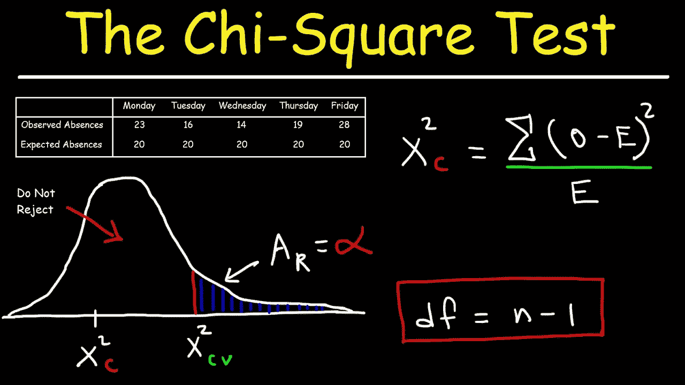
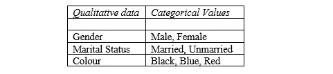
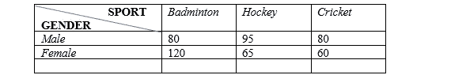
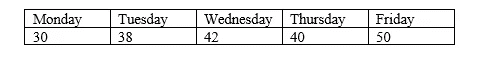

# 带 R 的卡方检验示例

> 原文：<https://pub.towardsai.net/chi-square-test-examples-with-r-da05dc90b76e?source=collection_archive---------3----------------------->

## [统计数据](https://towardsai.net/p/category/statistics)

## 变量关联与分布分析



图片[来源](https://www.youtube.com/watch?v=HKDqlYSLt68)

> **简介 **

当我们谈到卡方检验时，基本上我们研究两种类型:

*   独立卡方
*   适合度的卡方检验

这两种都是非参数测试(没有连续的测量范围，没有假设)

第一个帮助确定定性变量之间的任何关联，第二个告诉样本是否遵循与样本相同的分布。

> ***卡方为独立***

该检验有助于确定定性数据的两个分类值之间的任何关联。它只适用于分类数据。



作者的照片

主要任务是检查它们是否不是独立的，或者它们如何相互影响。为检验两者之间的联系而进行的假设检验被称为独立性检验。它将检查所做的假设是否恰当。

在应用这个测试时，我们还需要检查某些假设。考虑下面的例子来反映细节。

**示例:**

假设我们想知道性别如何与他们的运动偏好相关联。我们考虑随机抽样调查 500 人。获得的结果为；

*这里的两个变量是性别和运动。*



该表格以矩阵形式表示两个变量的观测频率，称为*列联表。*

现在以下面的方式找出性别是否与他们的运动选择有某种联系。

## ***实用与 R***

输入表格中给出的数据

```
#Enter the values of the available data
freq<-c(80,95,80,120,65,60)
```

以矩阵形式呈现数据以使其有意义

```
rownames(data)<-c("Male","Female")
colnames(data)<-c("Basketball","Hockey","Cricket")data#output:
            Basketball   Hockey    CricketMale          80         95          80
Female       120         65          60#output:
      [,1] [,2] [,3]
[1,]   80   95   80
[2,]  120   65   60
```

## **提零假设*提备假设*提备假设**

*   H0:两个变量都是独立的

这意味着运动的选择不受性别的影响

*   H1:两个变量都不是独立的

这意味着性别类型会影响所选择的运动类型

## **检查条件**

在进行这项测试时，我们需要确保这些条件成立。

1.  变量必须有分类值

在这个例子中，这是成立的。

```
Gender can take only two values → Male, FemaleSport variable can take only three values → Badminton,Hockey,Cricket
```

*2。我们数据集中的观察值必须是独立的*

```
It implies that all surveyed participants have counted only once.i.e., there is no over-lapping in a dataset
```

*3。*每个小区的期望频率≥ *5*

找到每个小区的期望频率(E)

```
E = (row total x column total) / overall total
```

列联表中没有一个单元格必须有预期频率< 1 and≥5 in at least 80% of the cells. The condition is checked once we apply the chi-square test.

## **应用卡方检验**

```
#chisq.test function, already inbuilt in R
t<-chisq.test(data)
t#output:
       Pearson's Chi-squared test
data: data
X-squared = 16.289,
df        = 2,
p-value   = 0.0002904
```

## ***获取期望频率表***

```
*#find expected frequency table to get assumption proof
t$expected*#output:          Basketball  Hockey   CricketMale        102       81.6      71.4
Female      98        78.4      68.6
```

***状态显著性水平(α)***

让我们取α= 0.05(5%)

在这里，这意味着正确或获得有效答案的概率(机会)是(1-α),即 95%,而错误的机会是 5%。

```
#Storing the value of alpha(level of significance)alpha<-0.05
```

**默认**，5%的水平大部分时间被认为是标准值。

## ***查找检验统计量和 p 值***

检验统计量是假设检验的一个组成部分，用来决定是否接受/拒绝我们的零假设。

从进行的调查中获取数据，并将结果与原假设的预期结果进行比较。

p 值给出了证据支持零假设的程度。当< 0.05, then we reject the null hypothesis because it implies there is much less evidence to support our H0.

```
t$statistic#output:X-squared
16.28866------------------------------------------t$p.value#output:0.0002903774
```

**是*结论*是**

检查 p 值是否是< Level of significance (alpha).

```
# *Storing the p-value in a variable name and comparing it with alpha*p<-t$p.valueif(p<alpha){
  print("Reject the null hypothesis")}else{
  print("Do not not reject Null hypothesis")
}#*Output:* "Reject the null hypothesis"
```

The p-value here is 0.029% which is much < 5%

## ***解释***

不接受零假设假设。这意味着，我们选择两个变量是独立的是无效的。

有足够的证据表明，性别和他们对任何运动的选择有关。因此，运动的选择受到性别类型的影响。

> ***为拟合优度检验***

一个卖水果的人声称，每天都有相同数量的顾客来到他的摊位。为了验证这一说法，记录了任意一周内来到他摊位的顾客人数，即:



我们的动机是找出数据是否与一个水果销售商的说法一致。

## **实用带 R**

***输入数据作为观察(实际)频率***

```
#Enter the values of the available datapeople<-c(30,38,42,40,50)
```

***店铺预计来店人数比例***

因为我们必须指定比例，它必须和 1 相加，就像我们在指定概率和 1 的情况下一样。

```
prob<-c(rep(1/5,5))
```

## ***提零假设和备择假设***

*   H0:顾客的实际分配和水果商声称的一样
*   H1:顾客的实际分配并不像水果商声称的那样

## ***执行拟合优度测试***

因为我们正在处理比例/概率案例，所以我们将使用#chisq。以如下所示的不同模式测试()。

这里，

people:表示实际频率的数字向量(即，这个向量以数字格式存储所有频率)

代表预期比例的数值向量(*不等于*预期频率)。

```
chisq.test(people,p=prob)#*Output:* Chi-squared test for given probabilitiesdata:  peopleX-squared = 5.2, 
df = 4, 
p-value = 0.2674
```

> ***结论***

将 p 的值与α (0.05)进行比较。我们得到 p 值>α。不要拒绝零假设。

> ***释义***

零假设没有被拒绝，这意味着客户遵循相同的分布。

没有足够的证据表明到达的人的实际分布与一个水果商声称的分布不同。

我希望你喜欢这篇文章。通过我的 [LinkedIn](https://www.linkedin.com/in/data-scientist-95040a1ab/) 和 [twitter](https://twitter.com/amitprius) 联系我。

# 推荐文章

1.[8 Python 的主动学习见解收集模块](/8-active-learning-insights-of-python-collection-module-6c9e0cc16f6b?source=friends_link&sk=4a5c9f9ad552005636ae720a658281b1)
2。 [NumPy:图像上的线性代数](/numpy-linear-algebra-on-images-ed3180978cdb?source=friends_link&sk=d9afa4a1206971f9b1f64862f6291ac0)3。[Python 中的异常处理概念](/exception-handling-concepts-in-python-4d5116decac3?source=friends_link&sk=a0ed49d9fdeaa67925eac34ecb55ea30)
4。[熊猫:处理分类数据](/pandas-dealing-with-categorical-data-7547305582ff?source=friends_link&sk=11c6809f6623dd4f6dd74d43727297cf)
5。[超参数:机器学习中的 RandomSeachCV 和 GridSearchCV](/hyper-parameters-randomseachcv-and-gridsearchcv-in-machine-learning-b7d091cf56f4?source=friends_link&sk=cab337083fb09601114a6e466ec59689)
6。[用 Python](https://medium.com/towards-artificial-intelligence/fully-explained-linear-regression-with-python-fe2b313f32f3?source=friends_link&sk=53c91a2a51347ec2d93f8222c0e06402)
7 全面讲解了线性回归。[用 Python](https://medium.com/towards-artificial-intelligence/fully-explained-logistic-regression-with-python-f4a16413ddcd?source=friends_link&sk=528181f15a44e48ea38fdd9579241a78)
充分解释了 Logistic 回归 8。[数据分发使用 Numpy 与 Python](/data-distribution-using-numpy-with-python-3b64aae6f9d6?source=friends_link&sk=809e75802cbd25ddceb5f0f6496c9803)
9。[机器学习中的决策树 vs 随机森林](/decision-trees-vs-random-forests-in-machine-learning-be56c093b0f?source=friends_link&sk=91377248a43b62fe7aeb89a69e590860)
10。[用 Python 实现数据预处理的标准化](/standardization-in-data-preprocessing-with-python-96ae89d2f658?source=friends_link&sk=f348435582e8fbb47407e9b359787e41)