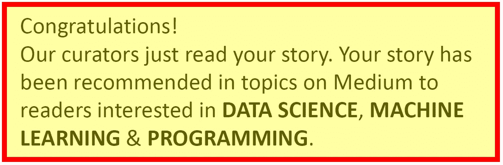
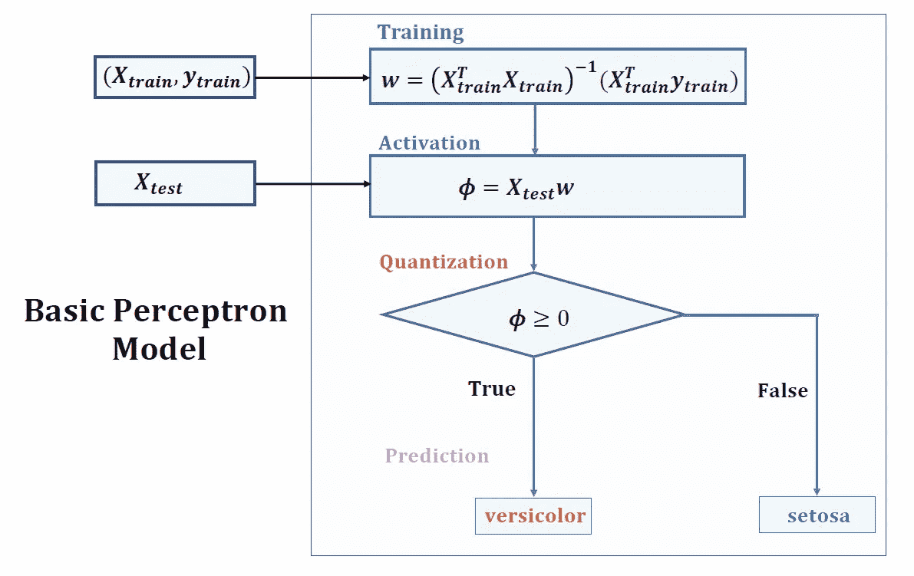
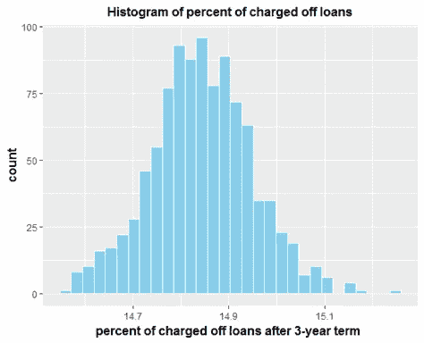

# 为您的数据科学文章选择合适的特色图片

> 原文：<https://pub.towardsai.net/choose-the-right-featured-image-for-your-data-science-article-e101719600cf?source=collection_archive---------0----------------------->

## 精选图像与策划故事| [走向人工智能](https://towardsai.net)有什么关系

**选择合适的特色图片对你的文章能否被媒体的策展人选择和推荐至关重要。**

T 他的文章将讨论如何为你的数据科学文章选择特色图片的一些建议。虽然我将专注于数据科学，但这里讨论的技巧适用于 Medium 网站上发表的任何文章。

在花费了大量的时间和精力来发展你的文章内容之后，现在是时候选择一个特色图片了。选择合适的特色图片是你必须做出的最重要的决定之一。

**一个合适的特色形象有以下优点:**

a)它强调并总结了你的文章或故事的全部内容。

b)它抓住了读者的思想，促使他们点击你的故事，这反过来增加了你的文章被阅读的机会。

c)它增加了你的文章被媒体策展人分发给不同主题的机会。策划的故事获得更多的观点，因为你的文章通过媒体传播，可以被列为特色文章。这将吸引更多的观众和读者，以及更多的粉丝。有关这方面的更多信息，请参见 [**Medium 的策展指南**](https://help.medium.com/hc/en-us/articles/360006362473?source=post_stats_page---------------------------) 。

# 如何为你的故事选择合适的特色图片

你的特色形象应该精心挑选。它应该是一个高质量的图像，能够立即抓住观众的注意力，并激励他们点击你的故事并通读它。

***选择合适的特色图片对你的文章能否被媒体的策展人选择和推荐至关重要。***

如果您使用来自网站的图像，建议您遵守关于该图像的版权规则。确保您有权重复使用该图像。为了避免违反版权规则，你可以创建自己的特色图片。

# 创建特色图像的工具

创建特色图像的一些资源:

a) Microsoft Word 和 Microsoft PowerPoint 演示绘图工具。

b)使用您的数据科学项目中的特色图片，例如作为代码输出的图表和其他数据可视化。

c)用你的手机拍一张迷人的特写照片。

d)使用网站上的特色图片(确保您有权重复使用该图片，以免违反版权规定)。

我的大部分被 [**策划**](https://help.medium.com/hc/en-us/articles/360006362473-Medium-s-Curation-Guidelines-everything-writers-need-to-know) 的文章都是我创建自己特色形象的文章。

我现在将讨论一些我在 medium 的策展人策划的文章中使用的特色图像的例子，以及因为特色图像违反版权规则而没有策划的文章的例子。

# A.策展人分发的故事(我创建了自己的特色图像)

1.  [**从事数据科学职业前需要考虑的 10 个问题**](https://medium.com/towards-artificial-intelligence/10-questions-to-consider-before-pursuing-a-career-in-data-science-9fc6a1c92ba3)

由**数据科学**的策展人分发

2. [**使用最小二乘法的基本感知器模型**](https://medium.com/towards-artificial-intelligence/basic-perceptron-model-using-least-squares-method-17900e0d1eff)

由**人工智能**、**数据科学**和**机器学习**的策展人分发

3. [**使用 Python 和 R 从 PDF 文件中提取数据**](https://medium.com/towards-artificial-intelligence/extracting-data-from-pdf-file-using-python-and-r-4ed8826bc5a1)

由**数据科学**的策展人分发

4. [**数据角力教程:大学城数据集**](https://medium.com/towards-artificial-intelligence/tutorial-on-data-wrangling-college-towns-dataset-a0e8f8dfb6ae)

由**数据科学**的策展人分发

5. [**随机过程的机器学习模型**](https://medium.com/towards-artificial-intelligence/machine-learning-model-for-stochastic-processes-c65a96f0b8c5)

由**机器学习**和**数据科学**的策展人分发

6. [**数据可视化教程:天气数据**](https://medium.com/towards-artificial-intelligence/tutorial-on-data-visualization-weather-data-52efa1bef183)

由**数据科学**和**编程**中的管理员分发

# B.不是由策展人发布的故事(我使用了来自网络的特色图片，没有寻求重用权)

1.  [**数据科学家面试流程—亲身经历**](https://medium.com/towards-artificial-intelligence/data-scientist-interview-process-a-personal-experience-33295495b4a0)

**未分发**策展人的专题

**图片来源:** [**福布斯**](https://www.forbes.com/sites/alizalicht/2017/10/15/the-ten-commandments-of-the-job-interview/)

2. [**反馈的力量**](https://medium.com/@benjaminobi/the-power-of-feedback-f95a84435504)

**未由策展人按主题分发**

**图片来源:**[【http://www.minnesotamtb.org/feedback-and-suggestions】T21](http://www.minnesotamtb.org/feedback-and-suggestions)**。**

3. [**抵押计算器 Python 代码**](https://medium.com/towards-artificial-intelligence/mortgage-calculator-python-code-94d976d25a27)

**未由策展人在主题中分发**

**图片来源:** [**福布斯**](https://www.forbes.com/sites/taramastroeni/2018/08/15/these-are-the-4-biggest-mistakes-to-avoid-when-applying-for-a-mortgage/#1cb4006b7dee)

总的来说，我们已经讨论了在为任何发表在 medium 上的文章选择特色图片时需要考虑的一些技巧。选择正确的特色图片是吸引观众和读者的关键，也决定了你的故事是否会策划。

为了避免违反版权规则，最好创建自己的特色图像。Microsoft Word 和 Microsoft PowerPoint Presentation 是优秀的工具，可用于绘图，或者您可以简单地使用手机拍摄美丽迷人的图像。如果您要使用网站上的特色图片，请确保您有权限重复使用该图片，这样您就不会违反版权规则。

**其他有用链接:**

[在媒体上撰写数据科学博客的初学者指南](https://medium.com/towards-artificial-intelligence/beginners-guide-to-writing-data-science-blogs-on-medium-a74774cf8f66)

[数据科学 101 —包含 R 和 Python 代码的中型平台短期课程](https://medium.com/towards-artificial-intelligence/data-science-101-a-short-course-on-medium-platform-with-r-and-python-code-included-3cdc9d489c6d)

[在从事数据科学职业之前需要考虑的 10 个问题](https://medium.com/towards-artificial-intelligence/10-questions-to-consider-before-pursuing-a-career-in-data-science-9fc6a1c92ba3)