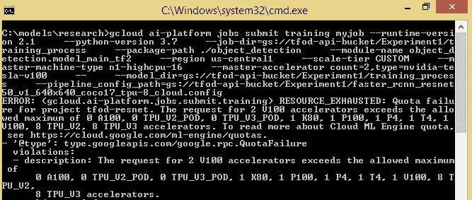
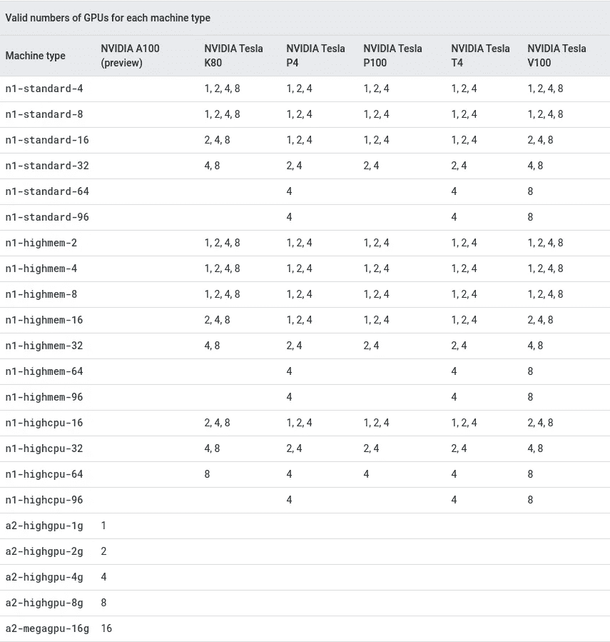

# 在 Google AI 平台上选择用于训练对象检测模型的机器类型

> 原文：<https://pub.towardsai.net/choosing-a-machine-type-on-google-ai-platform-for-training-object-detection-models-68a88c45574c?source=collection_archive---------8----------------------->

## [云计算](https://towardsai.net/p/category/cloud-computing)


当我的学生开始抱怨无法在谷歌 AI 平台上训练他们的深度学习模型时，我想他们可能在某个地方出现了小错误。也许，他们没有正确使用我给他们的命令。也许，他们忘了在 AI 平台上设置一些东西。或者只是他们在某个地方打错了。

我的学生参加的课程是关于如何使用 tensor flow 2[训练和评估用于对象检测的深度学习模型](https://www.udemy.com/course/deep-learning-for-object-detection-using-tensorflow-2/?couponCode=OBJECTDET13)(更快的 RCNN，SSD 和 YOLOv3)。在谷歌人工智能平台上运行训练的最后一个步骤是运行[原始 github 库中提到的 Tensorflow 对象检测 API](https://github.com/tensorflow/models/blob/master/research/object_detection/g3doc/tf2_training_and_evaluation.md#training-with-multiple-gpus) 的命令。虽然这个确切的命令实际上并不工作，但我已经做了必要的修改使它工作。

但是只有在我花了一些时间和我的两个学生一起试着解决这个问题之后，我才意识到一些重要的事情。有一些因素会影响你在 google AI 平台上对机器类型的选择。您选择用来训练深度学习模型进行对象检测的机器类型。

事实上，在某些情况下，您将无法使用他们拥有的任何机器！

我的一个学生和我分享了这张截图:



要使用的机器数量有限

当你看到上面的错误时，你会注意到屏幕截图的末尾写着:

> 描述:对 2 个 V100 加速器的请求超过了允许的最大数量，即 0 个 TPU V2 POD、0 个 TPU V3 POD、1 个 K80、1 个 P100、1 个 P4、1 个 T4、1 个 V100、8 个 TPU V2、8 个 TPU V3 加速器

这意味着你只能使用特定型号的机器。例如，***0 TPU _ V2 _ POD****表示不能使用任何 ***类型的机器(零)【TPU_V2_POD*** *。*另一方面， ***1 K80*** 意味着你可以使用一台*型号的 ***K80。*****

**我上面提到的在 google AI 平台上运行培训的部分命令如下:**

```
**--master-accelerator count=8,type=nvidia-tesla-v100**
```

**这只是完整命令的一小部分。它负责选择要使用的 GPU 类型以及数量。所以 ***count=8*** 意味着你要用 8 个 GPU。另一部分， ***type=nvidia-tesla-v100，*** 表示你想用 ***类型的 GPU(或 TPU)【NVIDIA-Tesla-v100】***。**

**问题是，不是所有的学生都面临这个问题！我意识到，在选择机器数量和机器类型时，生活在世界不同地区的学生有不同的选择。事实上，有一个学生没有选择！这意味着他不能在任何装有 GPU 的机器上运行培训！**

**事情是这样的，在谷歌人工智能平台上，你有不同的机器类型。对于每种机器类型，您都有特定数量和类型的 GPU 可以使用！这些选项的完整列表可在[表格](https://cloud.google.com/ai-platform/training/docs/using-gpus#compute-engine-machine-types-with-gpu)中找到。下面是该表的屏幕截图:**

****

**在上面一点，我向你展示了我们用来选择 GPU 的数量和类型的命令。命令又来了:**

```
**--master-accelerator count=8,type=nvidia-tesla-v100**
```

**但是这个命令不能让您选择机器类型！在上表中，您可以看到最左边的一列是机器类型。其他列用于 GPU 类型。在表格中，您可以看到每种机器类型和 GPU 类型的允许 GPU 数量。那么，我们该如何选择机器类型呢？这实际上是在 [github repo](https://github.com/tensorflow/models/blob/master/research/object_detection/g3doc/tf2_training_and_evaluation.md#training-with-multiple-gpus) 中描述的完整命令的另一部分。这部分是:**

```
**--master-machine-type n1-highcpu-16**
```

**如果你回到上表，你可以看到如果你选择机器类型***n1-high CPU-16***你可以使用类型 ***nvidia-tesla-v100 的 2、4 或 8 个 GPU。*****

**如果您选择其他数量的 GPU，比如 10 或 16 个，您将无法运行该命令，因为您被限制只能使用 2、4 或 8 个。**

**现在，您应该对如何选择机器类型及其对应的 GPU 数量和类型有了更清晰的认识！**

**回到我的学生身上，他不会使用任何类型的 GPU。他能做什么？**

**别急，有可能解决他(还有你！).**

**Google Cloud 实际上给了你请求增加配额的可能性！这意味着你可以要求谷歌给你一些 GPU 的访问权限。为此，您需要填写一份表格，并将其发送给 google cloud 团队。这个过程就是这里提到的[](https://cloud.google.com/ai-platform/training/docs/quotas#requesting_a_quota_increase)**。****

****本文到此为止！****

********

****作者制作的图像****

****我是一名机器学习工程师，致力于解决具有挑战性的计算机视觉问题。我想帮助你学习应用于计算机视觉问题的机器学习。以下是方法。****

1.  ****通过帮助您了解该领域的最新动态。我几乎每天都在[**【LinkedIn】**](https://www.linkedin.com/in/nour-islam-mokhtari-07b521a5/)和[**Twitter**](https://twitter.com/NourIslamMo)****上分享小型博客帖子。**那就跟我去吧！******
2.  ******每周给你一份我的 [**时事通讯**](https://nourislam.ck.page/dc3e8b7e12) 上那些琐碎帖子的摘要。所以订阅吧！******
3.  ******通过在 Medium 上写关于机器学习不同主题的文章。所以跟我来吧！******
4.  ******给你一份免费的机器学习工作清单，帮助你检查你需要学习的所有要点，如果你计划在 ML，特别是在计算机视觉方面的职业生涯。你可以在这里 得到清单 [**。**](https://www.aifee.co/free-resources)******

******5.最后但同样重要的是，通过与你分享我的 [**免费入门张量流课程**](https://aifee.teachable.com/p/introduction-to-tensorflow-2-for-computer-vision) ，它有超过 ***4 小时*的视频内容**，你可以在那里问我任何问题。******

******此外，如果您有任何问题或者您只是想聊聊 ML，请随时在 LinkedIn 或 Twitter 上联系我！******