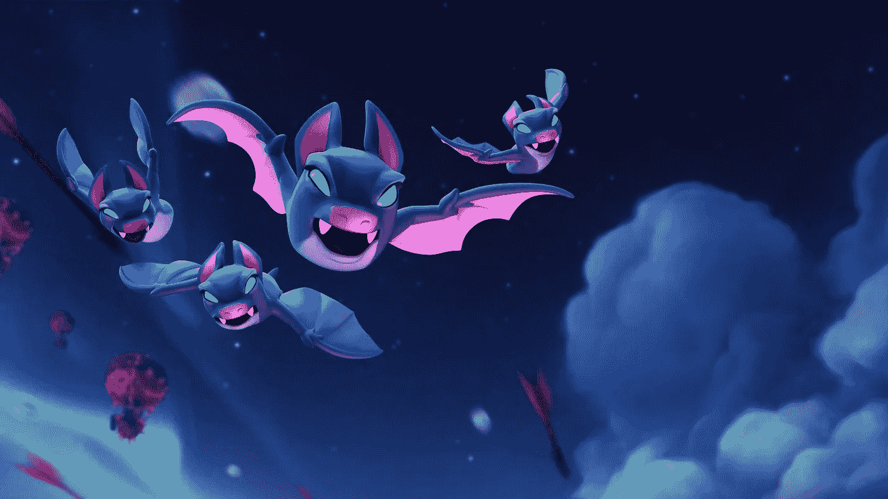

# Clash Royale 挑战算法:有多少玩家可以获得 12 胜？

> 原文：<https://pub.towardsai.net/clash-royale-challenge-algorithm-how-many-players-can-get-12-wins-fb37add82d8f?source=collection_archive---------1----------------------->

## [数学](https://towardsai.net/p/category/mathematics)

## 用蒙特卡罗模拟解数学谜语。完整的代码[可在我的回购](https://github.com/arditoibryan/Projects/tree/master/20210113_CRL_challenge)。

我今年遇到的最有趣的数学问题之一是在 Clash Royale 的游戏动力学中，这是一个隐藏了许多挑战性但创造性的数学谜语的游戏(其中一些我已经解决了，如果你有兴趣，请阅读我如何为 Clash Royale 甲板应用聚类技术)。



皇家冲突壁纸

# 数学谜语

游戏允许玩家参与挑战。每次玩家进入一场比赛，都必须和另一个玩家一起玩，可以赢也可以输(新的游戏动态不允许平局)。玩家进入挑战时有 3 条命，并能赢得多达 12 场比赛。\

> 自从开始玩《皇家冲突》以来，每个玩家都在问自己一个问题:有多少玩家能够赢得这场考验？

鉴于其难度，只有少数(与数百万活跃玩家相比的相对数字)熟练玩家能够获得 12 胜。

本文的目的将是试图通过使用代码找到这个谜语的答案。更具体地说，当问题太复杂而无法用数学概率公式解决时，我们可以使用蒙特卡罗模拟。经过一百万次随机行走后，概率曲线应该是近似的(随着模拟次数达到无穷大，越来越精确),代表真实的概率分布。

## 导入库

对于这个模拟，我将使用 NumPy 来促进玩家的随机选择，random 将随机结果分配给玩家，最后，pandas 以适当的形式表示输出。

```
import numpy as np
import random
import pandas as pd
```

# 创建模拟

我将把我所有的代码嵌入到一个函数中，我称之为 simulation。通过调用这个函数，我将通过指定一些参数来执行所有我想要的蒙特卡罗。

```
def simulation(n_players, max_wins, n_lives):
```

## 玩家等级

我将生成一个非常简单的玩家类，它可以保存两个变量:生命数(默认为 3)和连续获胜数，从 0 开始，最多可以达到 12。

```
 class player:
    lives = n_lives
    consecutive_wins = 0 def __init__(self):
      pass
```

我的想法是从所有寿命大于 0 的玩家开始，称为 **pool_alive** ，以及所有已经结束生命并且无法重新进入挑战的玩家或通过完成 12 场胜利来完成挑战的玩家: **pool_done** 。我将在设置函数后声明这两个列表，作为组织代码的标准 python 过程。

其余的功能都在这里。我将使用 **fight(max_wins)** 函数来模拟由 **pick_alive()** 从直播池中随机抽取的两名玩家之间的战斗。对于每场战斗，两名玩家将被暂时从直播池中抽出，以随机结果(50%赢，50%输)进行战斗，然后如果他们还活着，则重新进入 **pool_alive** ，但如果他们完成了所有生命或达到 12 场胜利的限制，他们将进入 **pool_done** 。

```
 def pick_alive():
    return pool_alive.pop(random.randint(0, len(pool_alive)-1)) def fight(max_wins):
    try:
      a = pick_alive()
      b = pick_alive()#result
      result = random.randint(0, 1)

      if result == 0:
        a.lives -= 1
        b.consecutive_wins += 1
      else:
        b.lives -= 1
        a.consecutive_wins += 1

      #print(result, 'a:', a.lives, 'b:', b.lives)
      #die or live
      if a.consecutive_wins == max_wins:
        pool_done.append(a)
      else:
        if a.lives == 0:
          pool_done.append(a)
        else:
          pool_alive.append(a) if b.consecutive_wins == max_wins:
        pool_done.append(b)
      else:
        if b.lives == 0:
          pool_done.append(b)
        else:
          pool_alive.append(b)#print('tried', pool_alive, a.lives, b.lives, pool_done)
    except:
      #print(pool_alive, 'k')
      #last player remaining
      pool_done.append(a)
      return 0#print(len(pool_alive))pool_alive = [player() for x in range(n_players)]
pool_done = list()
```

在设置了主要函数之后，我可以创建一个 while 条件，在给定初始玩家数量的情况下，战斗将一直进行，直到剩下一个玩家(最后一个人站着！)谁也将加入 **pool_done** 名单。

```
#fight until there is no one left
  #last player gets moved into the other bracket
  while len(pool_alive) > 0:
    if fight(max_wins) == 0:
      breakplayers_done = list()
  for d in pool_done:
    players_done.append([d.lives, d.consecutive_wins])players_alive = list()
  for k in pool_alive:
    players_alive.append([k.lives, k.consecutive_wins])total = pd.DataFrame(players_done+players_alive)
  total
```

所有模拟结束后，我会统计 pool_done 列表中所有玩家中达到 12 胜的玩家总数。

```
return total, total[1][total[1]==12].count()/n_players_, winners = simulation(1000000, 12, 3)
winners
```

最终输出:

```
0.006397
```

经过 100 万次模拟后，只有 0.63%的玩家，或 1 万人中的 63 人成功赢得了挑战。通过再次进行同样的实验，你会发现结果是一致的。