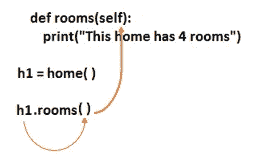
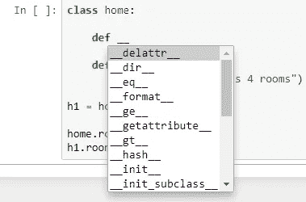

# Python 中的类和对象及其示例

> 原文：<https://pub.towardsai.net/class-and-objects-in-python-with-examples-591c6ca95ee6?source=collection_archive---------0----------------------->

## [编程](https://towardsai.net/p/category/programming)

## 软件开发程序的便捷概念


由 [Pakata Goh](https://unsplash.com/@pakata?utm_source=medium&utm_medium=referral) 在 [Unsplash](https://unsplash.com?utm_source=medium&utm_medium=referral) 上拍摄的照片

Python 也有面向对象的编程方法。在此之前，我们在函数的帮助下编写程序，但现在面向对象编程是基于类、方法和对象的。

简单来说，如果我们想设计一些东西，我们需要一个设计蓝图，这意味着我们需要创建一个设计类来创建一个对象。

## 涵盖的主题:

```
1\. Class and objects
2\. Special methods ( __init__ )
3\. Heap memory, Constructor, Self
```

> ***类和对象***

在面向对象编程中，在类内部，我们处理两件主要的事情，第一件是 ***属性*** 也称为变量，第二件是 ***行为*** 也称为函数或方法。

该类的语法如下所示:

```
class home:     # home is a class name
    .....
    variables
    functions 
    .....h1 = home()     # h1 is an object or instance of the class home
```

正如我们常说的，编程语言中的一切都是对象。

例如:

```
#for integer         #for string            #for class
                                             class home:                                              
a = 5                 a = '5'                    pass 
print(type(a))        print(type(a))         h1 = home()
                                             print(type(h1))**#output:              #output:               #output:**
<class 'int'>         <class 'str'>          <class '__main__.home'>
```

我们在上面的例子中看到，在编程中一切都属于类。在这里，我们注意到在“home”类的输出中有特殊的变量如`__name__`或特殊的方法如`__init__`。同样，`__name__`属于 python 的主文件，类就是从这个主文件开始的，在我们的例子中，home 类就是从这个 python 文件开始的。有时，我们会看到一个 if 语句，比如(if __name__ = '__main__ ')这意味着程序是由用户执行的。

让我们看一个 python 中的类的例子:

```
class home:

    #method inside a class
    def rooms():
        print("This home has 4 rooms")#To access the methods and variable in the class home
h1 = home()
```

现在，我们可以将类内部的方法分为两种类型。

```
**# 1\. By using the method name '*rooms*'**#just calling the method as we do in function but it will give the  #errorrooms()**#output:
NameError**: name 'rooms' is not defined#we are in a class now so, everything belongs to the classhome.rooms(self)#output:
This home has 4 rooms**# 2\. By using the object of the class**h1.rooms()**#output:**
**TypeError**: rooms() takes 0 positional arguments but 1 was given
```

当我们在对象的帮助下调用该方法时，它会给出一个位置参数错误。我们没有传递任何参数，在 rooms 的方法中也没有实际的参数。所以，本质上，在这个叫做自我的方法中有一个实际的论点。

```
class home:

    def rooms(self):
        print("This home has 4 rooms")h1 = home()h1.rooms()**#output:**
This home has 4 rooms
```

我们仍然没有在使用类对象的方法调用中传递形式参数。这里幕后的技巧是对象本身作为参数被传递。



作者图片

[](/python-zero-to-hero-with-examples-c7a5dedb968b) [## Python:从零到英雄(带示例)

### python 初学者手册指南

pub.towardsai.net](/python-zero-to-hero-with-examples-c7a5dedb968b) 

> ***特殊方法(__init__ )***

当我们必须声明变量时，这个特殊的方法非常有用。



作者图片

正如我们看到的，当我们在两个下划线后按 tab 时，它显示了各种特殊的方法，(__init__)就是其中之一。

```
class home:

    def __init__(self):
        print("I am in the INIT method")

    def rooms(self):
        print("This home has 4 rooms")h1 = home()**#output:**
I am in the INIT method
```

我们在上面的例子中看到，我没有调用 rooms 方法或 init 方法，而是自动调用了 init 方法。这取决于一个类中对象的数量。

```
class home:

    def __init__(self, parking, kitchen):
        self.parking = parking
        self.kitchen = kitchen

    def information(self):
        print("Home information")
        print("Number of parking:", self.parking)
        print("Number of Kitchen:", self.kitchen)#here h1 is passed automatically, so technically passing three #parameters (h1,2,1)h1 = home(2,1)h1.information()#output:
Home information
Number of parking: 2
Number of Kitchen: 1
```

> ***堆内存，构造函数，自我***

## 堆内存

当我们创建一个类和它的对象时，在我们的系统中有堆内存，在创建对象后，它会占用堆内存中的一些空间。当任何物体占据空间时，它也有地址。

```
class home:
    passh1 = home()#To know the address of the object
print(id(h1))**#output:**
91975920
```

[](/inheritance-and-its-type-with-python-f35b993d712e) [## Python 中的继承及其类型

### 单一、多级和多重继承方法的概念

pub.towardsai.net](/inheritance-and-its-type-with-python-f35b993d712e) 

## 构造器

它用于分配每个变量的大小。在上面的例子中，home()是一个自动调用(__init__)方法的构造函数。对象的大小取决于我们在类中使用的变量的数量。

我们可以在 init 方法中定义变量，我们将创建对象，然后打印变量名。

```
class home:

    def __init__(self):
        self.parking = 2
        self.kitchen = 3

h1 = home() 
print(h1.parking)**#output:**
2
```

如果我们制作另一个对象并打印相同的变量。它将打印相同的结果，因为两个对象的构造函数调用相同的 init 方法。

```
class home:

    def __init__(self):
        self.parking = 2
        self.kitchen = 3

h1 = home() 
h2 = home()print(h1.parking)
print(h2.parking)**#output:**
2
2
```

我们也可以自己改变变量的值。

```
class home:

    def __init__(self):
        self.parking = 2
        self.kitchen = 3

h1 = home() 
h2 = home()h1.parking = 4print(h1.parking)
print(h2.parking)**#output:**
4
2
```

## 自己

如果我们想用两个不同的对象来比较两个变量。

```
class home:

    def __init__(self):
        self.parking = 2
        self.kitchen = 3

    def compare(self, other):
        if self.parking == other.parking:
            return True
        else:
            return False

h1 = home() 
h2 = home()if h1.compare(h2):
    print("They are same")

print(h1.parking)
print(h2.parking)#output:
They are same
2
2
```

所以，在比较方法中，h1 对象在' ***self*** '中传递自身，h2 对象在' ***other*** '参数中传递自身。这就是 self 关键字在 python 类中派上用场的地方。

> ***结论***

类和对象的概念在软件开发程序中非常重要。

我希望你喜欢这篇文章。通过我的 [LinkedIn](https://www.linkedin.com/in/data-scientist-95040a1ab/) 和 [twitter](https://twitter.com/amitprius) 联系我。

# 推荐文章

[1。NLP —零到英雄与 Python](https://medium.com/towards-artificial-intelligence/nlp-zero-to-hero-with-python-2df6fcebff6e?sk=2231d868766e96b13d1e9d7db6064df1)
2。 [Python 数据结构数据类型和对象](https://medium.com/towards-artificial-intelligence/python-data-structures-data-types-and-objects-244d0a86c3cf?sk=42f4b462499f3fc3a160b21e2c94dba6)3 .[Python 中的异常处理概念](/exception-handling-concepts-in-python-4d5116decac3?source=friends_link&sk=a0ed49d9fdeaa67925eac34ecb55ea30)
4。[为什么 LSTM 在深度学习方面比 RNN 更有用？](/deep-learning-88e218b74a14?source=friends_link&sk=540bf9088d31859d50dbddab7524ba35)
5。[神经网络:递归神经网络的兴起](/neural-networks-the-rise-of-recurrent-neural-networks-df740252da88?source=friends_link&sk=6844935e3de14e478ce00f0b22e419eb)
6。[用 Python](https://medium.com/towards-artificial-intelligence/fully-explained-linear-regression-with-python-fe2b313f32f3?source=friends_link&sk=53c91a2a51347ec2d93f8222c0e06402)
7 全面讲解了线性回归。[用 Python](https://medium.com/towards-artificial-intelligence/fully-explained-logistic-regression-with-python-f4a16413ddcd?source=friends_link&sk=528181f15a44e48ea38fdd9579241a78)
充分解释了 Logistic 回归 8。[concat()、merge()和 join()与 Python](/differences-between-concat-merge-and-join-with-python-1a6541abc08d?source=friends_link&sk=3b37b694fb90db16275059ea752fc16a)
的区别 9。[与 Python 的数据角力—第一部分](/data-wrangling-with-python-part-1-969e3cc81d69?source=friends_link&sk=9c3649cf20f31a5c9ead51c50c89ba0b)
10。[机器学习中的混淆矩阵](https://medium.com/analytics-vidhya/confusion-matrix-in-machine-learning-91b6e2b3f9af?source=friends_link&sk=11c6531da0bab7b504d518d02746d4cc)