# 一阶加纯滞后(FOPDT)系统的经典辨识方法

> 原文：<https://pub.towardsai.net/classic-methods-for-identification-of-first-order-plus-dead-time-fopdt-systems-d81b0484aa4e?source=collection_archive---------1----------------------->

## [工程](https://towardsai.net/p/category/engineering)

[剧组](https://unsplash.com/@crew?utm_source=medium&utm_medium=referral)在 [Unsplash](https://unsplash.com?utm_source=medium&utm_medium=referral) 上拍照

一阶系统是输入输出关系为一阶微分方程的系统。这些类型的系统非常重要，例如，咖啡机作为一个大规模加热系统。

因此，这里的事情是，有时我们需要有系统模型在手，才可能控制它们。但是…

有时很难用解析方法获得系统的传递函数。在许多情况下，系统是封闭的，人们无法识别其组成部分。

有没有一种方法可以解决问题，那就是通过将系统提交给一个阶跃输入，我们可以从系统对这个输入的响应中获得重要的信息，否则很难获得这些信息。换句话说，阶跃响应可以引导我们找到一些属性，使得获得系统的传递函数成为可能。

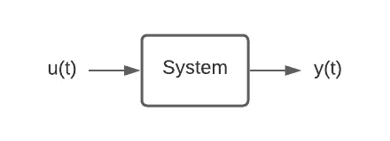

图 1:系统表示为一个盒子。

这里我们有一个案例要研究:想象一下，对于一个温度控制系统，假设电阻线 R 的长度相对于它与温度计之间的距离 L 可以忽略不计，并且管道直径足够小。我们正在讨论图 2 所示的问题。

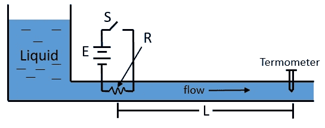

图 2:系统图。

如果开关 *S* 闭合，液体温度将立即上升。然而，在作为输出信号的温度计检测到这一点之前，被加热的液体必须到达温度计主体，这将在取决于液体流量的一定时间之后发生。这个时间就是所谓的死时间。因此，我们面对的是一阶加死区(FOPDT)系统，对于这些系统，我们有一个与其动态响应相关的方程，下面是它的方程。

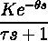

其中:

*   **K** =过程增益
*   **τ** =过程时间常数
*   **θ** =过程停滞时间

因此，通过包含时间(t)、步长输入 u(t)和输出 y(t)变量的" [data.mat](https://github.com/rwguerra/classic_identification_FOPDT/blob/master/dados.mat?raw=true) "文件可以获得本例中的数据。文章的目的是，利用数据实现经典的系统辨识方法(使用 MatLab ),获得系统的一阶模型为:

*   **齐格勒-尼科尔斯法；**
*   **史密斯的方法；**
*   **Sundaresan 的方法；**
*   **西川法**

所有方法都将使用平均绝对百分比误差(MAPE)进行评估，该误差通过以下等式获得。

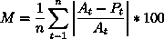

其中处的*是当前值， *Pt* 是预测值， *n* 是样本数。*

好，那我们开始吧！

# 齐格勒-尼科尔斯方法

Ziegler，Nichols 等人(1942)[1]提出的方法是在曲线拐点处画一条切线，以确定系统的增益、时间和延迟常数，如图 3 所示。

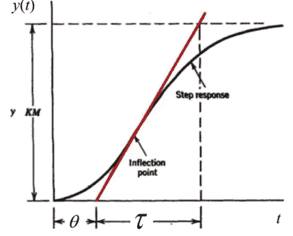

图 3:齐格勒-尼科尔斯的例子。

对于 FOPDT，响应在瞬时= θ + τ时达到 63%,在 t = θ时响应的最大正切在直线= θ + τ处截距 y / KM，因此阶跃响应在 t = 5τ(平衡时间)时处于永久状态。

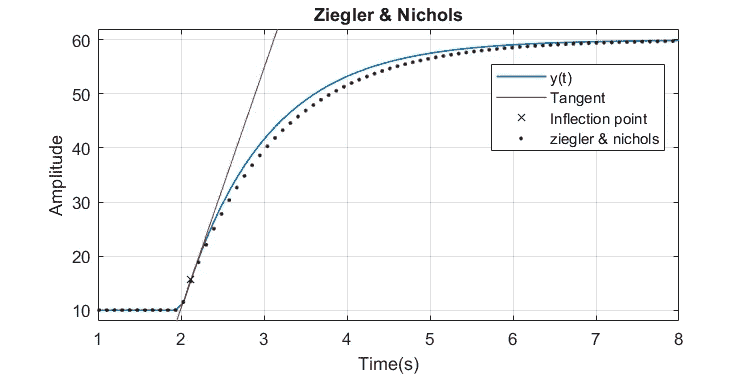

图 4:齐格勒-尼科尔斯结果图。

应用所讨论的方法，获得了图 4 所示的虚线曲线。可能会注意到曲线与原始曲线非常接近，差别很小。这个问题的 MAPE 是 0.65%。

应用这种方法的困难在于首先需要找到曲线的拐点。拐点定义在曲线改变方向并且导数等于零的地方。在这种情况下，这一点是通过计算梯度来寻找曲线的二阶导数而获得的。

然后，有必要创建一条以拐点为中心的曲线切线。之后，一切都变得容易了，因为你只要应用这个方法。

# 史密斯方法

Smith (1972 年)[2]建议选择θ和τ的值，使模型和真实响应在呈现高变化率的两点上重合。从图中确定的中间值是输入中应用的值的幅度和输出中变化状态的幅度，采用两次，其中第一次是当输出达到输出最终值的 28%时，第二次是 63%，如图 5 所示。

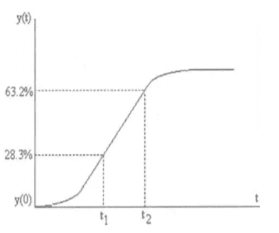

图 5:史密斯的例子。

因此，我们可以很容易地计算 t1 和 t2，然后找到:

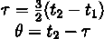

将该方法应用于问题数据，我们得到了图 6 所示的虚线曲线。

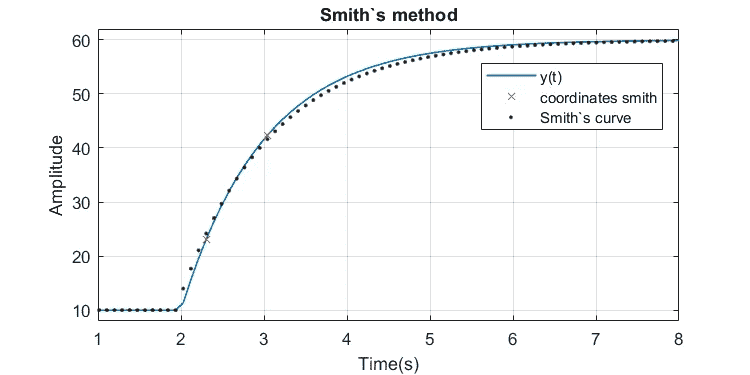

图 6:史密斯的结果图。

可能会注意到曲线与原始曲线非常接近，差别很小。该问题的 MAPE 为 0.513%，略好于齐格勒-尼科尔斯方法。

# 孙达雷桑和克里希纳瓦米方法

该方法还避免了使用拐点来估计时间常数τ和传输延迟θ。他们建议从单步响应曲线估计两个时间 t1 和 t2，分别对应于响应的 35.3%和 85.3%。

史密斯方法的唯一区别是选择点的方式和寻找τ和θ的方式，在这种情况下是通过:

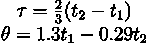

从图 7 中可以看出，预测曲线几乎与原始曲线相同，反映出 0.2607%的 MAPE。除了很好的结果之外，这种方法非常简单，并且计算成本非常低。

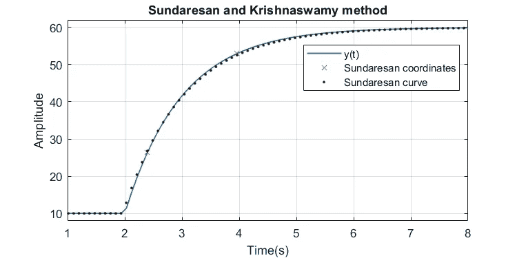

图 7: Sundaresan 和 Krishnaswamy 结果图。

# 西川方法

Nishikawa (2007)[3]创建了一种方法，该方法包括使用图 8 所示的曲线面积计算来确定常数值。

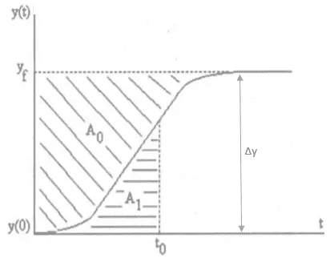

图 5:西川的例子。

其中:

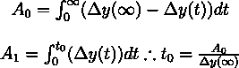

然后获得模型参数，使得:

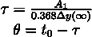

这样，就有可能获得图 9 所示的曲线。

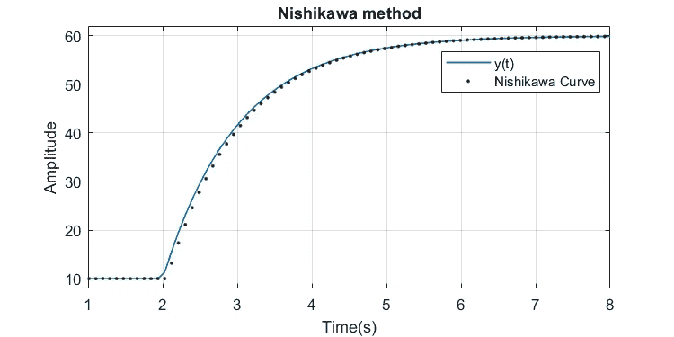

图 9:西川结果图。

再一次，通过 0.4195%的图反映了优异的结果，但是与其他方法相比，这种方法的代价是具有更大的数学复杂性和相当大的计算成本，因为需要计算积分来找到系统的参数。

# 结论

可以研究和应用齐格勒/尼科尔斯、史密斯、孙达雷桑和西川的方法，得出的结论是，在所有情况下计算低于 1%的 MAPE 时，都获得了相当好的结果。

一些方法被证明是更复杂的，例如 Ziegler 和 Nishikama，在第一种方法中，需要找到一个拐点，在最后一种方法中，执行面积计算，在这种情况下，对于这个问题，他们最终没有带来证明复杂性增加的结果。另一方面，Smith 和 Sundaresan 等方法除了简单之外，还取得了令人满意的结果，其中 Sundaresan 的 MAPE 最低。

这些方法的一个重要观察结果是，通过测量对真实阶跃的响应，参数 K、τ和θ可以根据过程的操作条件(即，进入阶跃的幅度和变化的方向)而显著变化。这些变化可归因于过程的非线性。附录 A 包含用于生成结果的 MATLAB 代码。如果需要，代码也可以在我的 [Github](https://github.com/rwguerra/classic_identification_FOPDT/) 中找到。

[1]齐格勒，J. GNICHOLS，N. B .等人[自动控制器的最佳设置](http://robotics.itee.uq.edu.au/~elec3004/2015/assignments/PS4-Z_N_Original.pdf)。译 *ASME* ，第 64 卷，第 11 号，1942 年。

[2]史密斯，C. L. *数字计算机过程控制*。[S.l.]:英特尔教育出版社，1972 年。

[3] NISHIKAWA，H. [扩散方程的一阶系统方法。I:二阶剩余分配方案](https://doi.org/10.1016/j.jcp.2007.07.029)。《计算物理学杂志》，爱思唯尔，第 227 卷，第 1 期，第 315–352 页，2007 年。